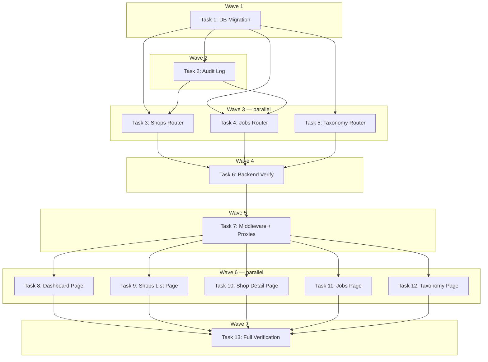

# Admin Dashboard Implementation Plan

> **For Claude:** REQUIRED SUB-SKILL: Use executing-plans to implement this plan task-by-task.

**Design Doc:** [docs/designs/2026-03-02-admin-dashboard-design.md](../designs/2026-03-02-admin-dashboard-design.md)

**Spec References:** §2 System Modules (Admin/ops), §9 Business Rules (Provider abstraction)

**PRD References:** —

**Goal:** Build an internal admin dashboard with pipeline ops, shop CRUD, enrichment viewer, pipeline replay, and taxonomy coverage stats — completing the Phase 1 gate "Admin can add and edit shop data."

**Architecture:** 5-page Next.js admin UI in `app/(admin)/` route group, backed by new Python admin API endpoints. Admin auth via user ID allowlist (server-side middleware check + backend `_require_admin` dependency). All admin endpoints use service role Supabase client (bypasses RLS). Audit logging via `admin_audit_logs` table with FastAPI middleware.

**Tech Stack:** Next.js 16 (App Router), FastAPI, Supabase (Postgres), Tailwind CSS, shadcn/ui, pytest, vitest

---

## Task 1: DB Migration — `manually_edited_at` + `admin_audit_logs`

**Files:**

- Create: `supabase/migrations/20260302000001_admin_dashboard.sql`

**Step 1: Write migration**

No test needed — SQL migration.

```sql
-- Add manually_edited_at to shops for pipeline replay protection
ALTER TABLE shops ADD COLUMN manually_edited_at TIMESTAMPTZ;

-- Audit log for admin actions
CREATE TABLE admin_audit_logs (
  id             UUID PRIMARY KEY DEFAULT gen_random_uuid(),
  admin_user_id  UUID NOT NULL,
  action         TEXT NOT NULL,
  target_type    TEXT NOT NULL,
  target_id      TEXT,
  payload        JSONB,
  created_at     TIMESTAMPTZ NOT NULL DEFAULT now()
);

CREATE INDEX idx_admin_audit_logs_admin ON admin_audit_logs (admin_user_id, created_at DESC);
CREATE INDEX idx_admin_audit_logs_target ON admin_audit_logs (target_type, target_id);
```

**Step 2: Apply migration**

Run: `supabase db push`
Expected: Migration applies cleanly.

**Step 3: Commit**

```bash
git add supabase/migrations/20260302000001_admin_dashboard.sql
git commit -m "feat(db): add manually_edited_at + admin_audit_logs table"
```

---

## Task 2: Backend — Admin Audit Logging Middleware

**Files:**

- Create: `backend/middleware/admin_audit.py`
- Create: `backend/tests/middleware/test_admin_audit.py`
- Modify: `backend/main.py` (mount middleware)

**Step 1: Write the failing test**

```python
# backend/tests/middleware/test_admin_audit.py
from unittest.mock import MagicMock, patch

from fastapi import FastAPI
from fastapi.testclient import TestClient

from middleware.admin_audit import AdminAuditMiddleware


def _make_app() -> FastAPI:
    app = FastAPI()
    app.add_middleware(AdminAuditMiddleware)

    @app.post("/admin/shops")
    async def create_shop():
        return {"id": "shop-1"}

    @app.get("/admin/shops")
    async def list_shops():
        return []

    @app.get("/shops")
    async def public_shops():
        return []

    return app


class TestAdminAuditMiddleware:
    def test_logs_admin_write_operation(self):
        """POST /admin/* should create an audit log entry."""
        app = _make_app()
        client = TestClient(app)
        mock_db = MagicMock()
        with patch("middleware.admin_audit.get_service_role_client", return_value=mock_db):
            # Simulate an admin request with user ID in response header
            # The middleware extracts user ID from the X-Admin-User-Id header
            # (set by _require_admin before response)
            response = client.post(
                "/admin/shops",
                headers={"X-Admin-User-Id": "admin-123"},
                json={"name": "Test Shop"},
            )
        assert response.status_code == 200
        mock_db.table.assert_called_with("admin_audit_logs")

    def test_skips_read_operations(self):
        """GET requests should not create audit logs."""
        app = _make_app()
        client = TestClient(app)
        mock_db = MagicMock()
        with patch("middleware.admin_audit.get_service_role_client", return_value=mock_db):
            client.get("/admin/shops", headers={"X-Admin-User-Id": "admin-123"})
        mock_db.table.assert_not_called()

    def test_skips_non_admin_routes(self):
        """Non-admin routes should not create audit logs."""
        app = _make_app()
        client = TestClient(app)
        mock_db = MagicMock()
        with patch("middleware.admin_audit.get_service_role_client", return_value=mock_db):
            client.get("/shops")
        mock_db.table.assert_not_called()
```

**Step 2: Run test to verify it fails**

Run: `cd backend && pytest tests/middleware/test_admin_audit.py -v`
Expected: FAIL — module not found

**Step 3: Write implementation**

```python
# backend/middleware/admin_audit.py
import structlog
from starlette.middleware.base import BaseHTTPMiddleware
from starlette.requests import Request
from starlette.responses import Response

from db.supabase_client import get_service_role_client

logger = structlog.get_logger()

_WRITE_METHODS = {"POST", "PUT", "PATCH", "DELETE"}


class AdminAuditMiddleware(BaseHTTPMiddleware):
    async def dispatch(self, request: Request, call_next) -> Response:
        response = await call_next(request)

        path = request.url.path
        if not path.startswith("/admin/") or request.method not in _WRITE_METHODS:
            return response

        if response.status_code >= 400:
            return response

        admin_user_id = request.headers.get("X-Admin-User-Id")
        if not admin_user_id:
            return response

        # Parse target from URL: /admin/shops/{id}/enqueue → target_type=shop, target_id={id}
        parts = path.removeprefix("/admin/").split("/")
        target_type = parts[0] if parts else "unknown"
        target_id = parts[1] if len(parts) > 1 else None

        try:
            db = get_service_role_client()
            db.table("admin_audit_logs").insert({
                "admin_user_id": admin_user_id,
                "action": f"{request.method} {path}",
                "target_type": target_type.rstrip("s"),  # "shops" → "shop"
                "target_id": target_id,
                "payload": None,  # Don't log request bodies (may contain large data)
            }).execute()
        except Exception:
            logger.warning("Failed to write audit log", path=path, exc_info=True)

        return response
```

**Step 4: Run test to verify it passes**

Run: `cd backend && pytest tests/middleware/test_admin_audit.py -v`
Expected: PASS

**Step 5: Update `_require_admin` to set X-Admin-User-Id header**

The audit middleware reads the admin user ID from a request header. We need the `_require_admin` dependency to propagate this. Instead of modifying headers (not possible in FastAPI deps), we'll use a different approach: store the user ID in `request.state` and read it in the middleware.

Update the middleware to read from `request.state.admin_user_id` instead of a header. Update `_require_admin` in `backend/api/admin.py` to set `request.state.admin_user_id`.

Actually — simpler: the middleware can decode the JWT from the Authorization header directly to get the user ID. But that's complex. Simplest approach: the middleware reads the `X-Admin-User-Id` response header that admin handlers will set. But that couples things.

**Revised approach:** Make the audit log a utility function called explicitly by admin write handlers, not a middleware. This is simpler and more explicit.

```python
# backend/middleware/admin_audit.py
import structlog

from db.supabase_client import get_service_role_client

logger = structlog.get_logger()


def log_admin_action(
    admin_user_id: str,
    action: str,
    target_type: str,
    target_id: str | None = None,
    payload: dict | None = None,
) -> None:
    """Log an admin action to the audit trail. Fire-and-forget — never raises."""
    try:
        db = get_service_role_client()
        db.table("admin_audit_logs").insert({
            "admin_user_id": admin_user_id,
            "action": action,
            "target_type": target_type,
            "target_id": target_id,
            "payload": payload,
        }).execute()
    except Exception:
        logger.warning("Failed to write audit log", action=action, exc_info=True)
```

Update the test accordingly:

```python
# backend/tests/middleware/test_admin_audit.py
from unittest.mock import MagicMock, patch

from middleware.admin_audit import log_admin_action


class TestAdminAuditLog:
    def test_logs_action_to_database(self):
        """log_admin_action should insert a row into admin_audit_logs."""
        mock_db = MagicMock()
        with patch("middleware.admin_audit.get_service_role_client", return_value=mock_db):
            log_admin_action(
                admin_user_id="admin-123",
                action="POST /admin/shops",
                target_type="shop",
                target_id="shop-456",
            )
        mock_db.table.assert_called_once_with("admin_audit_logs")
        insert_call = mock_db.table.return_value.insert
        insert_call.assert_called_once()
        row = insert_call.call_args[0][0]
        assert row["admin_user_id"] == "admin-123"
        assert row["action"] == "POST /admin/shops"
        assert row["target_type"] == "shop"
        assert row["target_id"] == "shop-456"

    def test_never_raises_on_db_error(self):
        """Audit logging failure should be swallowed, not propagated."""
        mock_db = MagicMock()
        mock_db.table.side_effect = Exception("DB down")
        with patch("middleware.admin_audit.get_service_role_client", return_value=mock_db):
            # Should not raise
            log_admin_action(
                admin_user_id="admin-123",
                action="POST /admin/shops",
                target_type="shop",
            )
```

**Step 6: Run tests**

Run: `cd backend && pytest tests/middleware/test_admin_audit.py -v`
Expected: PASS

**Step 7: Commit**

```bash
git add backend/middleware/admin_audit.py backend/tests/middleware/test_admin_audit.py
git commit -m "feat(admin): audit log utility for admin write operations"
```

---

## Task 3: Backend — Admin Shops Router (CRUD + Enqueue + Search-Rank)

**Files:**

- Create: `backend/api/admin_shops.py`
- Create: `backend/tests/api/test_admin_shops.py`
- Modify: `backend/main.py` (mount router)

**Step 1: Write the failing tests**

```python
# backend/tests/api/test_admin_shops.py
from unittest.mock import AsyncMock, MagicMock, patch

from fastapi.testclient import TestClient

from api.deps import get_current_user
from main import app
from tests.factories import make_shop_row

client = TestClient(app)

_ADMIN_ID = "admin-user-id"


def _admin_user():
    return {"id": _ADMIN_ID}


class TestAdminShopsList:
    def test_requires_admin(self):
        app.dependency_overrides[get_current_user] = lambda: {"id": "regular-user"}
        try:
            with patch("api.admin_shops.settings") as mock_settings:
                mock_settings.admin_user_ids = [_ADMIN_ID]
                response = client.get("/admin/shops")
            assert response.status_code == 403
        finally:
            app.dependency_overrides.clear()

    def test_lists_all_shops(self):
        app.dependency_overrides[get_current_user] = _admin_user
        try:
            mock_db = MagicMock()
            shops = [make_shop_row(id="shop-1", name="Coffee A"), make_shop_row(id="shop-2", name="Coffee B")]
            mock_db.table.return_value.select.return_value.order.return_value.range.return_value.execute.return_value = MagicMock(data=shops, count=2)
            with (
                patch("api.admin_shops.get_service_role_client", return_value=mock_db),
                patch("api.admin_shops.settings") as mock_settings,
            ):
                mock_settings.admin_user_ids = [_ADMIN_ID]
                response = client.get("/admin/shops")
            assert response.status_code == 200
            data = response.json()
            assert len(data["shops"]) == 2
        finally:
            app.dependency_overrides.clear()

    def test_filters_by_processing_status(self):
        app.dependency_overrides[get_current_user] = _admin_user
        try:
            mock_db = MagicMock()
            mock_db.table.return_value.select.return_value.eq.return_value.order.return_value.range.return_value.execute.return_value = MagicMock(data=[], count=0)
            with (
                patch("api.admin_shops.get_service_role_client", return_value=mock_db),
                patch("api.admin_shops.settings") as mock_settings,
            ):
                mock_settings.admin_user_ids = [_ADMIN_ID]
                response = client.get("/admin/shops?processing_status=failed")
            assert response.status_code == 200
            mock_db.table.return_value.select.return_value.eq.assert_called()
        finally:
            app.dependency_overrides.clear()


class TestAdminShopCreate:
    def test_creates_shop_with_manual_source(self):
        app.dependency_overrides[get_current_user] = _admin_user
        try:
            mock_db = MagicMock()
            mock_db.table.return_value.insert.return_value.execute.return_value = MagicMock(
                data=[{"id": "new-shop-1", "name": "手沖咖啡店"}]
            )
            with (
                patch("api.admin_shops.get_service_role_client", return_value=mock_db),
                patch("api.admin_shops.settings") as mock_settings,
                patch("api.admin_shops.log_admin_action") as mock_audit,
            ):
                mock_settings.admin_user_ids = [_ADMIN_ID]
                response = client.post(
                    "/admin/shops",
                    json={"name": "手沖咖啡店", "address": "台北市中山區", "latitude": 25.05, "longitude": 121.52},
                )
            assert response.status_code == 201
            mock_audit.assert_called_once()
        finally:
            app.dependency_overrides.clear()


class TestAdminShopDetail:
    def test_returns_shop_with_tags_and_photos(self):
        app.dependency_overrides[get_current_user] = _admin_user
        try:
            mock_db = MagicMock()
            # shop query
            mock_db.table.return_value.select.return_value.eq.return_value.single.return_value.execute.return_value = MagicMock(
                data={"id": "shop-1", "name": "Test", "processing_status": "live"}
            )
            with (
                patch("api.admin_shops.get_service_role_client", return_value=mock_db),
                patch("api.admin_shops.settings") as mock_settings,
            ):
                mock_settings.admin_user_ids = [_ADMIN_ID]
                response = client.get("/admin/shops/shop-1")
            assert response.status_code == 200
            data = response.json()
            assert data["shop"]["id"] == "shop-1"
        finally:
            app.dependency_overrides.clear()


class TestAdminShopUpdate:
    def test_updates_shop_and_sets_manually_edited_at(self):
        app.dependency_overrides[get_current_user] = _admin_user
        try:
            mock_db = MagicMock()
            mock_db.table.return_value.update.return_value.eq.return_value.execute.return_value = MagicMock(
                data=[{"id": "shop-1", "name": "Updated"}]
            )
            with (
                patch("api.admin_shops.get_service_role_client", return_value=mock_db),
                patch("api.admin_shops.settings") as mock_settings,
                patch("api.admin_shops.log_admin_action"),
            ):
                mock_settings.admin_user_ids = [_ADMIN_ID]
                response = client.put(
                    "/admin/shops/shop-1",
                    json={"name": "Updated Name"},
                )
            assert response.status_code == 200
            # Verify manually_edited_at was included in the update
            update_call = mock_db.table.return_value.update
            update_data = update_call.call_args[0][0]
            assert "manually_edited_at" in update_data
        finally:
            app.dependency_overrides.clear()


class TestAdminShopEnqueue:
    def test_enqueues_enrich_job(self):
        app.dependency_overrides[get_current_user] = _admin_user
        try:
            mock_db = MagicMock()
            # Check for existing pending job — none found
            mock_db.table.return_value.select.return_value.eq.return_value.eq.return_value.eq.return_value.execute.return_value = MagicMock(data=[])
            # Enqueue returns job ID
            mock_db.table.return_value.insert.return_value.execute.return_value = MagicMock(data=[{"id": "job-1"}])
            with (
                patch("api.admin_shops.get_service_role_client", return_value=mock_db),
                patch("api.admin_shops.settings") as mock_settings,
                patch("api.admin_shops.log_admin_action"),
                patch("api.admin_shops.JobQueue") as mock_queue_cls,
            ):
                mock_settings.admin_user_ids = [_ADMIN_ID]
                mock_queue_cls.return_value.enqueue = AsyncMock(return_value="job-1")
                response = client.post(
                    "/admin/shops/shop-1/enqueue",
                    json={"job_type": "enrich_shop"},
                )
            assert response.status_code == 200
            assert "job-1" in response.json()["job_id"]
        finally:
            app.dependency_overrides.clear()

    def test_rejects_duplicate_pending_job(self):
        app.dependency_overrides[get_current_user] = _admin_user
        try:
            mock_db = MagicMock()
            # Existing pending job found
            mock_db.table.return_value.select.return_value.eq.return_value.eq.return_value.eq.return_value.execute.return_value = MagicMock(
                data=[{"id": "existing-job"}]
            )
            with (
                patch("api.admin_shops.get_service_role_client", return_value=mock_db),
                patch("api.admin_shops.settings") as mock_settings,
            ):
                mock_settings.admin_user_ids = [_ADMIN_ID]
                response = client.post(
                    "/admin/shops/shop-1/enqueue",
                    json={"job_type": "enrich_shop"},
                )
            assert response.status_code == 409
        finally:
            app.dependency_overrides.clear()


class TestAdminShopSearchRank:
    def test_returns_rank_position(self):
        app.dependency_overrides[get_current_user] = _admin_user
        try:
            mock_db = MagicMock()
            # search_shops RPC returns results with shop-1 at position 3
            search_results = [
                {"id": "other-1", "similarity": 0.9},
                {"id": "other-2", "similarity": 0.85},
                {"id": "shop-1", "similarity": 0.8},
            ]
            mock_db.rpc.return_value.execute.return_value = MagicMock(data=search_results)
            with (
                patch("api.admin_shops.get_service_role_client", return_value=mock_db),
                patch("api.admin_shops.settings") as mock_settings,
                patch("api.admin_shops.get_embeddings_provider") as mock_emb,
            ):
                mock_settings.admin_user_ids = [_ADMIN_ID]
                mock_emb.return_value.embed = AsyncMock(return_value=[0.1] * 1536)
                response = client.get("/admin/shops/shop-1/search-rank?query=quiet+coffee")
            assert response.status_code == 200
            data = response.json()
            assert data["rank"] == 3
            assert data["total_results"] == 3
        finally:
            app.dependency_overrides.clear()
```

**Step 2: Run tests to verify they fail**

Run: `cd backend && pytest tests/api/test_admin_shops.py -v`
Expected: FAIL — module `api.admin_shops` not found

**Step 3: Write implementation**

```python
# backend/api/admin_shops.py
from datetime import UTC, datetime
from typing import Any, cast

import structlog
from fastapi import APIRouter, Depends, HTTPException, Query
from pydantic import BaseModel

from api.deps import get_current_user
from core.config import settings
from db.supabase_client import get_service_role_client
from middleware.admin_audit import log_admin_action
from models.types import JobStatus, JobType
from providers.embeddings import get_embeddings_provider
from workers.queue import JobQueue

logger = structlog.get_logger()

router = APIRouter(prefix="/admin/shops", tags=["admin"])


def _require_admin(user: dict[str, Any] = Depends(get_current_user)) -> dict[str, Any]:  # noqa: B008
    if user["id"] not in settings.admin_user_ids:
        raise HTTPException(status_code=403, detail="Admin access required")
    return user


# --- Request/Response models ---


class CreateShopRequest(BaseModel):
    name: str
    address: str
    latitude: float
    longitude: float
    google_maps_url: str | None = None


class UpdateShopRequest(BaseModel):
    name: str | None = None
    address: str | None = None
    latitude: float | None = None
    longitude: float | None = None
    phone: str | None = None
    website: str | None = None
    opening_hours: list[str] | None = None
    description: str | None = None
    processing_status: str | None = None


class EnqueueRequest(BaseModel):
    job_type: str  # "enrich_shop" | "generate_embedding" | "scrape_shop"


# --- Endpoints ---


@router.get("/")
async def list_shops(
    processing_status: str | None = None,
    source: str | None = None,
    search: str | None = None,
    offset: int = Query(0, ge=0),
    limit: int = Query(50, ge=1, le=200),
    user: dict[str, Any] = Depends(_require_admin),  # noqa: B008
) -> dict[str, Any]:
    """List all shops with optional filters. Returns any processing_status."""
    db = get_service_role_client()
    query = db.table("shops").select("*", count="exact")

    if processing_status:
        query = query.eq("processing_status", processing_status)
    if source:
        query = query.eq("source", source)
    if search:
        query = query.ilike("name", f"%{search}%")

    query = query.order("created_at", desc=True).range(offset, offset + limit - 1)
    response = query.execute()

    return {
        "shops": cast("list[dict[str, Any]]", response.data),
        "total": response.count or 0,
    }


@router.post("/", status_code=201)
async def create_shop(
    body: CreateShopRequest,
    user: dict[str, Any] = Depends(_require_admin),  # noqa: B008
) -> dict[str, Any]:
    """Manually create a shop."""
    db = get_service_role_client()
    response = (
        db.table("shops")
        .insert({
            "name": body.name,
            "address": body.address,
            "latitude": body.latitude,
            "longitude": body.longitude,
            "source": "manual",
            "processing_status": "pending",
            "review_count": 0,
        })
        .execute()
    )
    shop = cast("list[dict[str, Any]]", response.data)[0]
    log_admin_action(
        admin_user_id=user["id"],
        action="POST /admin/shops",
        target_type="shop",
        target_id=str(shop["id"]),
    )
    return shop


@router.get("/{shop_id}")
async def get_shop_detail(
    shop_id: str,
    user: dict[str, Any] = Depends(_require_admin),  # noqa: B008
) -> dict[str, Any]:
    """Full shop detail including tags, photos, and mode scores."""
    db = get_service_role_client()

    shop_resp = db.table("shops").select("*").eq("id", shop_id).single().execute()
    if not shop_resp.data:
        raise HTTPException(status_code=404, detail=f"Shop {shop_id} not found")

    tags_resp = db.table("shop_tags").select("tag_id, confidence").eq("shop_id", shop_id).execute()
    photos_resp = (
        db.table("shop_photos")
        .select("id, url, category, is_menu, sort_order")
        .eq("shop_id", shop_id)
        .order("sort_order")
        .execute()
    )

    return {
        "shop": shop_resp.data,
        "tags": cast("list[dict[str, Any]]", tags_resp.data),
        "photos": cast("list[dict[str, Any]]", photos_resp.data),
    }


@router.put("/{shop_id}")
async def update_shop(
    shop_id: str,
    body: UpdateShopRequest,
    user: dict[str, Any] = Depends(_require_admin),  # noqa: B008
) -> dict[str, Any]:
    """Update shop identity fields. Sets manually_edited_at timestamp."""
    updates = body.model_dump(exclude_none=True)
    if not updates:
        raise HTTPException(status_code=400, detail="No fields to update")

    updates["manually_edited_at"] = datetime.now(UTC).isoformat()
    updates["updated_at"] = datetime.now(UTC).isoformat()

    db = get_service_role_client()
    response = db.table("shops").update(updates).eq("id", shop_id).execute()
    if not response.data:
        raise HTTPException(status_code=404, detail=f"Shop {shop_id} not found")

    log_admin_action(
        admin_user_id=user["id"],
        action="PUT /admin/shops",
        target_type="shop",
        target_id=shop_id,
    )
    return cast("list[dict[str, Any]]", response.data)[0]


@router.post("/{shop_id}/enqueue")
async def enqueue_job(
    shop_id: str,
    body: EnqueueRequest,
    user: dict[str, Any] = Depends(_require_admin),  # noqa: B008
) -> dict[str, Any]:
    """Manually enqueue a pipeline job for a shop. Idempotent: rejects if pending job exists."""
    try:
        job_type = JobType(body.job_type)
    except ValueError:
        raise HTTPException(status_code=400, detail=f"Invalid job_type: {body.job_type}") from None

    if job_type not in (JobType.ENRICH_SHOP, JobType.GENERATE_EMBEDDING, JobType.SCRAPE_SHOP):
        raise HTTPException(status_code=400, detail=f"Cannot manually enqueue {body.job_type}")

    db = get_service_role_client()

    # Check for existing pending job of same type for this shop
    existing = (
        db.table("job_queue")
        .select("id")
        .eq("job_type", job_type.value)
        .eq("status", JobStatus.PENDING.value)
        .eq("payload->>shop_id", shop_id)
        .execute()
    )
    if existing.data:
        raise HTTPException(
            status_code=409,
            detail=f"A pending {body.job_type} job already exists for shop {shop_id}",
        )

    queue = JobQueue(db=db)
    job_id = await queue.enqueue(
        job_type=job_type,
        payload={"shop_id": shop_id},
        priority=5,  # Higher priority for manual admin actions
    )
    log_admin_action(
        admin_user_id=user["id"],
        action=f"POST /admin/shops/{shop_id}/enqueue",
        target_type="job",
        target_id=job_id,
        payload={"job_type": body.job_type, "shop_id": shop_id},
    )
    return {"job_id": job_id, "job_type": body.job_type}


@router.get("/{shop_id}/search-rank")
async def search_rank(
    shop_id: str,
    query: str = Query(..., min_length=1),
    user: dict[str, Any] = Depends(_require_admin),  # noqa: B008
) -> dict[str, Any]:
    """Run a search query and return where this shop ranks in results."""
    embeddings = get_embeddings_provider()
    query_embedding = await embeddings.embed(query)

    db = get_service_role_client()
    response = db.rpc(
        "search_shops",
        {"query_embedding": query_embedding, "match_count": 50},
    ).execute()

    results = cast("list[dict[str, Any]]", response.data or [])
    rank = None
    for i, result in enumerate(results, 1):
        if str(result["id"]) == shop_id:
            rank = i
            break

    return {
        "rank": rank,
        "total_results": len(results),
        "query": query,
        "found": rank is not None,
    }
```

**Step 4: Mount router in main.py**

Add to `backend/main.py`:

```python
from api.admin_shops import router as admin_shops_router
# ... after existing admin_router mount:
app.include_router(admin_shops_router)
```

**Step 5: Run tests to verify they pass**

Run: `cd backend && pytest tests/api/test_admin_shops.py -v`
Expected: PASS

**Step 6: Run full backend tests**

Run: `cd backend && pytest -v`
Expected: All pass

**Step 7: Commit**

```bash
git add backend/api/admin_shops.py backend/tests/api/test_admin_shops.py backend/main.py
git commit -m "feat(admin): shop CRUD + enqueue + search-rank endpoints"
```

---

## Task 4: Backend — Admin Jobs Router (List + Cancel)

**Files:**

- Modify: `backend/api/admin.py` (add jobs list + cancel endpoints)
- Modify: `backend/tests/api/test_admin.py` (add tests)

**Step 1: Write the failing tests**

Add to `backend/tests/api/test_admin.py`:

```python
class TestAdminJobsList:
    def test_lists_all_jobs(self):
        app.dependency_overrides[get_current_user] = _admin_user
        try:
            mock_db = MagicMock()
            mock_db.table.return_value.select.return_value.order.return_value.range.return_value.execute.return_value = MagicMock(
                data=[{"id": "job-1", "job_type": "enrich_shop", "status": "pending"}],
                count=1,
            )
            with (
                patch("api.admin.get_service_role_client", return_value=mock_db),
                patch("api.admin.settings") as mock_settings,
            ):
                mock_settings.admin_user_ids = [_ADMIN_ID]
                response = client.get("/admin/pipeline/jobs")
            assert response.status_code == 200
            data = response.json()
            assert "jobs" in data
        finally:
            app.dependency_overrides.clear()

    def test_filters_by_status_and_type(self):
        app.dependency_overrides[get_current_user] = _admin_user
        try:
            mock_db = MagicMock()
            mock_db.table.return_value.select.return_value.eq.return_value.eq.return_value.order.return_value.range.return_value.execute.return_value = MagicMock(
                data=[], count=0,
            )
            with (
                patch("api.admin.get_service_role_client", return_value=mock_db),
                patch("api.admin.settings") as mock_settings,
            ):
                mock_settings.admin_user_ids = [_ADMIN_ID]
                response = client.get("/admin/pipeline/jobs?status=failed&job_type=enrich_shop")
            assert response.status_code == 200
        finally:
            app.dependency_overrides.clear()


class TestAdminJobCancel:
    def test_cancels_pending_job(self):
        app.dependency_overrides[get_current_user] = _admin_user
        try:
            mock_db = MagicMock()
            mock_db.table.return_value.select.return_value.eq.return_value.execute.return_value = MagicMock(
                data=[{"id": "job-1", "status": "pending"}]
            )
            with (
                patch("api.admin.get_service_role_client", return_value=mock_db),
                patch("api.admin.settings") as mock_settings,
                patch("api.admin.log_admin_action"),
            ):
                mock_settings.admin_user_ids = [_ADMIN_ID]
                response = client.post("/admin/pipeline/jobs/job-1/cancel")
            assert response.status_code == 200
            assert "cancelled" in response.json()["message"].lower()
        finally:
            app.dependency_overrides.clear()

    def test_cannot_cancel_completed_job(self):
        app.dependency_overrides[get_current_user] = _admin_user
        try:
            mock_db = MagicMock()
            mock_db.table.return_value.select.return_value.eq.return_value.execute.return_value = MagicMock(
                data=[{"id": "job-1", "status": "completed"}]
            )
            with (
                patch("api.admin.get_service_role_client", return_value=mock_db),
                patch("api.admin.settings") as mock_settings,
            ):
                mock_settings.admin_user_ids = [_ADMIN_ID]
                response = client.post("/admin/pipeline/jobs/job-1/cancel")
            assert response.status_code == 409
        finally:
            app.dependency_overrides.clear()
```

**Step 2: Run tests to verify they fail**

Run: `cd backend && pytest tests/api/test_admin.py -v -k "Jobs or Cancel"`
Expected: FAIL

**Step 3: Add endpoints to `backend/api/admin.py`**

Add imports and new endpoints:

```python
# Add to imports:
from middleware.admin_audit import log_admin_action

# Add after existing endpoints:

@router.get("/jobs")
async def list_jobs(
    status: str | None = None,
    job_type: str | None = None,
    offset: int = 0,
    limit: int = 50,
    user: dict[str, Any] = Depends(_require_admin),  # noqa: B008
) -> dict[str, Any]:
    """List all jobs with optional filters."""
    db = get_service_role_client()
    query = db.table("job_queue").select("*", count="exact")
    if status:
        query = query.eq("status", status)
    if job_type:
        query = query.eq("job_type", job_type)
    query = query.order("created_at", desc=True).range(offset, offset + limit - 1)
    response = query.execute()
    return {
        "jobs": cast("list[dict[str, Any]]", response.data),
        "total": response.count or 0,
    }


@router.post("/jobs/{job_id}/cancel")
async def cancel_job(
    job_id: str,
    user: dict[str, Any] = Depends(_require_admin),  # noqa: B008
) -> dict[str, str]:
    """Cancel a pending or claimed job."""
    db = get_service_role_client()
    job_response = db.table("job_queue").select("id, status").eq("id", job_id).execute()
    if not job_response.data:
        raise HTTPException(status_code=404, detail=f"Job {job_id} not found")

    job_status = cast("list[dict[str, Any]]", job_response.data)[0]["status"]
    if job_status not in ("pending", "claimed"):
        raise HTTPException(
            status_code=409,
            detail=f"Job {job_id} cannot be cancelled (status: {job_status})",
        )

    db.table("job_queue").update({
        "status": "dead_letter",
        "last_error": "Cancelled by admin",
    }).eq("id", job_id).execute()

    log_admin_action(
        admin_user_id=user["id"],
        action=f"POST /admin/pipeline/jobs/{job_id}/cancel",
        target_type="job",
        target_id=job_id,
    )
    return {"message": f"Job {job_id} cancelled"}
```

**Step 4: Run tests**

Run: `cd backend && pytest tests/api/test_admin.py -v`
Expected: PASS

**Step 5: Commit**

```bash
git add backend/api/admin.py backend/tests/api/test_admin.py
git commit -m "feat(admin): jobs list + cancel endpoints"
```

---

## Task 5: Backend — Admin Taxonomy Stats Endpoint

**Files:**

- Create: `backend/api/admin_taxonomy.py`
- Create: `backend/tests/api/test_admin_taxonomy.py`
- Modify: `backend/main.py` (mount router)

**Step 1: Write the failing test**

```python
# backend/tests/api/test_admin_taxonomy.py
from unittest.mock import MagicMock, patch

from fastapi.testclient import TestClient

from api.deps import get_current_user
from main import app

client = TestClient(app)

_ADMIN_ID = "admin-user-id"


def _admin_user():
    return {"id": _ADMIN_ID}


class TestAdminTaxonomyStats:
    def test_requires_admin(self):
        app.dependency_overrides[get_current_user] = lambda: {"id": "regular-user"}
        try:
            with patch("api.admin_taxonomy.settings") as mock_settings:
                mock_settings.admin_user_ids = [_ADMIN_ID]
                response = client.get("/admin/taxonomy/stats")
            assert response.status_code == 403
        finally:
            app.dependency_overrides.clear()

    def test_returns_coverage_stats(self):
        app.dependency_overrides[get_current_user] = _admin_user
        try:
            mock_db = MagicMock()

            # Total shops
            mock_db.table.return_value.select.return_value.execute.return_value = MagicMock(count=100)

            # shop_tag_counts RPC
            mock_db.rpc.return_value.execute.return_value = MagicMock(
                data=[
                    {"tag_id": "wifi-reliable", "shop_count": 80},
                    {"tag_id": "quiet", "shop_count": 60},
                ]
            )

            with (
                patch("api.admin_taxonomy.get_service_role_client", return_value=mock_db),
                patch("api.admin_taxonomy.settings") as mock_settings,
            ):
                mock_settings.admin_user_ids = [_ADMIN_ID]
                response = client.get("/admin/taxonomy/stats")
            assert response.status_code == 200
            data = response.json()
            assert "total_shops" in data
            assert "tag_frequency" in data
        finally:
            app.dependency_overrides.clear()
```

**Step 2: Run test to verify it fails**

Run: `cd backend && pytest tests/api/test_admin_taxonomy.py -v`
Expected: FAIL

**Step 3: Write implementation**

```python
# backend/api/admin_taxonomy.py
from typing import Any, cast

import structlog
from fastapi import APIRouter, Depends, HTTPException

from api.deps import get_current_user
from core.config import settings
from db.supabase_client import get_service_role_client

logger = structlog.get_logger()

router = APIRouter(prefix="/admin/taxonomy", tags=["admin"])


def _require_admin(user: dict[str, Any] = Depends(get_current_user)) -> dict[str, Any]:  # noqa: B008
    if user["id"] not in settings.admin_user_ids:
        raise HTTPException(status_code=403, detail="Admin access required")
    return user


@router.get("/stats")
async def taxonomy_stats(
    user: dict[str, Any] = Depends(_require_admin),  # noqa: B008
) -> dict[str, Any]:
    """Taxonomy coverage and quality stats."""
    db = get_service_role_client()

    # Total shops count
    total_resp = db.table("shops").select("id", count="exact").execute()
    total_shops = total_resp.count or 0

    # Shops with at least one tag
    tagged_resp = db.rpc("shop_tag_counts", {}).execute()
    tag_frequency = cast("list[dict[str, Any]]", tagged_resp.data or [])
    shops_with_tags = len({row.get("tag_id") for row in tag_frequency}) if tag_frequency else 0

    # Shops with embeddings
    embedded_resp = (
        db.table("shops")
        .select("id", count="exact")
        .not_.is_("embedding", "null")
        .execute()
    )
    shops_with_embeddings = embedded_resp.count or 0

    # Low-confidence shops (max confidence < 0.5)
    low_conf_resp = db.rpc("shops_with_low_confidence_tags", {}).execute()
    low_confidence_shops = cast("list[dict[str, Any]]", low_conf_resp.data or [])

    # Shops missing embeddings (have tags but no embedding)
    missing_embed_resp = (
        db.table("shops")
        .select("id, name, processing_status")
        .is_("embedding", "null")
        .neq("processing_status", "pending")
        .limit(50)
        .execute()
    )

    return {
        "total_shops": total_shops,
        "shops_with_tags": shops_with_tags,
        "shops_with_embeddings": shops_with_embeddings,
        "shops_missing_tags": total_shops - shops_with_tags,
        "shops_missing_embeddings": total_shops - shops_with_embeddings,
        "tag_frequency": tag_frequency,
        "low_confidence_shops": low_confidence_shops,
        "missing_embeddings": cast("list[dict[str, Any]]", missing_embed_resp.data),
    }
```

**Step 4: Add RPC for low confidence shops to migration**

Add to `supabase/migrations/20260302000001_admin_dashboard.sql`:

```sql
-- shops_with_low_confidence_tags: shops where max tag confidence < 0.5
CREATE OR REPLACE FUNCTION shops_with_low_confidence_tags()
RETURNS TABLE (shop_id uuid, shop_name text, max_confidence numeric)
LANGUAGE sql STABLE SECURITY DEFINER SET search_path = public
AS $$
    SELECT s.id AS shop_id, s.name AS shop_name, MAX(st.confidence) AS max_confidence
    FROM shops s
    JOIN shop_tags st ON st.shop_id = s.id
    GROUP BY s.id, s.name
    HAVING MAX(st.confidence) < 0.5
    ORDER BY MAX(st.confidence) ASC
    LIMIT 50;
$$;
```

**Step 5: Mount router in main.py**

Add to `backend/main.py`:

```python
from api.admin_taxonomy import router as admin_taxonomy_router
app.include_router(admin_taxonomy_router)
```

**Step 6: Run tests**

Run: `cd backend && pytest tests/api/test_admin_taxonomy.py -v`
Expected: PASS

**Step 7: Commit**

```bash
git add backend/api/admin_taxonomy.py backend/tests/api/test_admin_taxonomy.py backend/main.py supabase/migrations/20260302000001_admin_dashboard.sql
git commit -m "feat(admin): taxonomy coverage stats endpoint + low-confidence RPC"
```

---

## Task 6: Backend Verification

**Files:** None — verification only.

**Step 1: Run full backend test suite**

Run: `cd backend && pytest -v`
Expected: All pass

**Step 2: Run linters**

Run: `cd backend && ruff check . && ruff format --check .`
Expected: Clean

**Step 3: Run type checker**

Run: `cd backend && mypy .`
Expected: Clean (or existing known issues only)

**Step 4: Commit if any fixes needed**

---

## Task 7: Frontend — Admin Middleware + Proxy Routes

**Files:**

- Modify: `middleware.ts` (add admin route guard)
- Create: `app/api/admin/shops/route.ts`
- Create: `app/api/admin/shops/[id]/route.ts`
- Create: `app/api/admin/shops/[id]/enqueue/route.ts`
- Create: `app/api/admin/shops/[id]/search-rank/route.ts`
- Create: `app/api/admin/pipeline/jobs/route.ts`
- Create: `app/api/admin/pipeline/jobs/[id]/cancel/route.ts`
- Create: `app/api/admin/taxonomy/stats/route.ts`

**Step 1: Update middleware**

No test needed — middleware is tested via integration. Add admin check to `middleware.ts`:

Add `ADMIN_ROUTES` constant and check `user.app_metadata.is_admin === true` for `/admin` routes. If not admin, redirect to `/`.

```typescript
// Add after RECOVERY_ROUTES:
const ADMIN_PREFIXES = ['/admin'];

// Add check after PDPA consent check, before the final return:
// Admin routes — require admin flag
if (ADMIN_PREFIXES.some((prefix) => pathname.startsWith(prefix))) {
  const isAdmin = appMetadata.is_admin === true;
  if (!isAdmin) {
    const url = request.nextUrl.clone();
    url.pathname = '/';
    return NextResponse.redirect(url);
  }
}
```

**Step 2: Create proxy routes**

All follow the identical pattern. Example for shops:

```typescript
// app/api/admin/shops/route.ts
import { NextRequest } from 'next/server';
import { proxyToBackend } from '@/lib/api/proxy';

export async function GET(request: NextRequest) {
  return proxyToBackend(request, '/admin/shops');
}

export async function POST(request: NextRequest) {
  return proxyToBackend(request, '/admin/shops');
}
```

```typescript
// app/api/admin/shops/[id]/route.ts
import { NextRequest } from 'next/server';
import { proxyToBackend } from '@/lib/api/proxy';

export async function GET(
  request: NextRequest,
  { params }: { params: Promise<{ id: string }> }
) {
  const { id } = await params;
  return proxyToBackend(request, `/admin/shops/${id}`);
}

export async function PUT(
  request: NextRequest,
  { params }: { params: Promise<{ id: string }> }
) {
  const { id } = await params;
  return proxyToBackend(request, `/admin/shops/${id}`);
}
```

Create all remaining proxy routes following the same pattern:

- `app/api/admin/shops/[id]/enqueue/route.ts` — POST
- `app/api/admin/shops/[id]/search-rank/route.ts` — GET
- `app/api/admin/pipeline/jobs/route.ts` — GET
- `app/api/admin/pipeline/jobs/[id]/cancel/route.ts` — POST
- `app/api/admin/taxonomy/stats/route.ts` — GET

**Step 3: Verify build**

Run: `pnpm build`
Expected: Clean build

**Step 4: Commit**

```bash
git add middleware.ts app/api/admin/
git commit -m "feat(admin): middleware guard + proxy routes for admin API"
```

---

## Task 8: Frontend — Admin Layout + Dashboard Page

**Files:**

- Create: `app/(admin)/layout.tsx`
- Create: `app/(admin)/page.tsx`
- Create: `app/(admin)/page.test.tsx`

**Step 1: Write the failing test**

```typescript
// app/(admin)/page.test.tsx
import { render, screen, waitFor } from '@testing-library/react';
import { describe, it, expect, vi, beforeEach } from 'vitest';
import { createMockSupabaseAuth, createMockRouter } from '@/lib/test-utils/mocks';
import { makeSession } from '@/lib/test-utils/factories';

const mockAuth = createMockSupabaseAuth();
vi.mock('@/lib/supabase/client', () => ({
  createClient: () => ({ auth: mockAuth }),
}));

const mockRouter = createMockRouter();
vi.mock('next/navigation', () => ({
  useRouter: () => mockRouter,
  usePathname: () => '/admin',
}));

const mockFetch = vi.fn();
global.fetch = mockFetch;

const testSession = makeSession();

import AdminDashboard from './page';

describe('AdminDashboard', () => {
  beforeEach(() => {
    vi.clearAllMocks();
    mockAuth.getSession.mockResolvedValue({ data: { session: testSession } });
  });

  it('renders pipeline overview with job counts', async () => {
    mockFetch.mockResolvedValue({
      ok: true,
      json: () =>
        Promise.resolve({
          job_counts: { pending: 5, completed: 100, failed: 2 },
          recent_submissions: [],
        }),
    });
    render(<AdminDashboard />);
    await waitFor(() => {
      expect(screen.getByText(/pending/i)).toBeInTheDocument();
    });
  });

  it('shows error state when API fails', async () => {
    mockFetch.mockResolvedValue({
      ok: false,
      json: () => Promise.resolve({ detail: 'Server error' }),
    });
    render(<AdminDashboard />);
    await waitFor(() => {
      expect(screen.getByRole('alert')).toBeInTheDocument();
    });
  });
});
```

**Step 2: Run test to verify it fails**

Run: `pnpm test -- app/\\(admin\\)/page.test.tsx`
Expected: FAIL

**Step 3: Write layout**

```typescript
// app/(admin)/layout.tsx
'use client';

import Link from 'next/link';
import { usePathname } from 'next/navigation';

const NAV_ITEMS = [
  { href: '/admin', label: 'Dashboard' },
  { href: '/admin/shops', label: 'Shops' },
  { href: '/admin/jobs', label: 'Jobs' },
  { href: '/admin/taxonomy', label: 'Taxonomy' },
];

export default function AdminLayout({
  children,
}: {
  children: React.ReactNode;
}) {
  const pathname = usePathname();

  return (
    <div className="flex min-h-screen">
      <aside className="w-56 border-r bg-gray-50 p-4">
        <h2 className="mb-6 text-lg font-bold">Admin</h2>
        <nav className="space-y-1">
          {NAV_ITEMS.map((item) => {
            const isActive =
              item.href === '/admin'
                ? pathname === '/admin'
                : pathname.startsWith(item.href);
            return (
              <Link
                key={item.href}
                href={item.href}
                className={`block rounded-md px-3 py-2 text-sm ${
                  isActive
                    ? 'bg-gray-200 font-medium text-gray-900'
                    : 'text-gray-600 hover:bg-gray-100'
                }`}
              >
                {item.label}
              </Link>
            );
          })}
        </nav>
      </aside>
      <main className="flex-1 p-6">{children}</main>
    </div>
  );
}
```

**Step 4: Write dashboard page**

```typescript
// app/(admin)/page.tsx
'use client';

import { useEffect, useState } from 'react';
import Link from 'next/link';
import { createClient } from '@/lib/supabase/client';

interface PipelineOverview {
  job_counts: Record<string, number>;
  recent_submissions: Array<{
    id: string;
    google_maps_url: string;
    status: string;
    created_at: string;
  }>;
}

export default function AdminDashboard() {
  const [data, setData] = useState<PipelineOverview | null>(null);
  const [error, setError] = useState<string | null>(null);
  const [loading, setLoading] = useState(true);

  useEffect(() => {
    async function load() {
      const supabase = createClient();
      const { data: { session } } = await supabase.auth.getSession();
      if (!session) return;

      const res = await fetch('/api/admin/pipeline/overview', {
        headers: { Authorization: `Bearer ${session.access_token}` },
      });
      if (!res.ok) {
        const body = await res.json().catch(() => ({}));
        setError(body.detail || 'Failed to load overview');
        setLoading(false);
        return;
      }
      setData(await res.json());
      setLoading(false);
    }
    load();
  }, []);

  if (loading) return <p>Loading...</p>;
  if (error) return <p role="alert" className="text-red-600">{error}</p>;
  if (!data) return null;

  const statuses = ['pending', 'claimed', 'completed', 'failed', 'dead_letter'];

  return (
    <div className="space-y-8">
      <h1 className="text-2xl font-bold">Pipeline Dashboard</h1>

      <section>
        <h2 className="mb-4 text-lg font-semibold">Job Queue</h2>
        <div className="grid grid-cols-2 gap-4 sm:grid-cols-3 lg:grid-cols-5">
          {statuses.map((status) => (
            <div key={status} className="rounded-lg border p-4">
              <p className="text-sm text-gray-500">{status}</p>
              <p className="text-2xl font-bold">{data.job_counts[status] || 0}</p>
            </div>
          ))}
        </div>
        {(data.job_counts.failed || 0) > 0 && (
          <Link
            href="/admin/jobs?status=failed"
            className="mt-2 inline-block text-sm text-red-600 hover:underline"
          >
            View {data.job_counts.failed} failed jobs
          </Link>
        )}
      </section>

      <section>
        <h2 className="mb-4 text-lg font-semibold">Recent Submissions</h2>
        {data.recent_submissions.length === 0 ? (
          <p className="text-gray-500">No submissions yet.</p>
        ) : (
          <table className="w-full text-left text-sm">
            <thead>
              <tr className="border-b text-gray-500">
                <th className="pb-2">URL</th>
                <th className="pb-2">Status</th>
                <th className="pb-2">Date</th>
              </tr>
            </thead>
            <tbody>
              {data.recent_submissions.map((sub) => (
                <tr key={sub.id} className="border-b">
                  <td className="py-2 max-w-xs truncate">{sub.google_maps_url}</td>
                  <td className="py-2">
                    <span className={`rounded px-2 py-0.5 text-xs ${
                      sub.status === 'live' ? 'bg-green-100 text-green-700' :
                      sub.status === 'failed' ? 'bg-red-100 text-red-700' :
                      'bg-yellow-100 text-yellow-700'
                    }`}>
                      {sub.status}
                    </span>
                  </td>
                  <td className="py-2 text-gray-500">
                    {new Date(sub.created_at).toLocaleDateString()}
                  </td>
                </tr>
              ))}
            </tbody>
          </table>
        )}
      </section>
    </div>
  );
}
```

**Step 5: Run tests**

Run: `pnpm test -- app/\\(admin\\)/page.test.tsx`
Expected: PASS

**Step 6: Commit**

```bash
git add app/\(admin\)/layout.tsx app/\(admin\)/page.tsx app/\(admin\)/page.test.tsx
git commit -m "feat(admin): dashboard layout + pipeline overview page"
```

---

## Task 9: Frontend — Shops List Page

**Files:**

- Create: `app/(admin)/shops/page.tsx`
- Create: `app/(admin)/shops/page.test.tsx`

**Step 1: Write the failing test**

Test renders shop table, search input, and create button. Test create form triggers POST API call.

**Step 2: Implement page**

Table with name, address, processing_status, source, enriched_at columns. Search input (debounced). Filter dropdowns (processing_status, source). "Create Shop" button → inline form. Row click → link to `/admin/shops/[id]`.

**Step 3: Run tests, commit**

```bash
git commit -m "feat(admin): shops list page with search + create"
```

---

## Task 10: Frontend — Shop Detail Page

**Files:**

- Create: `app/(admin)/shops/[id]/page.tsx`
- Create: `app/(admin)/shops/[id]/page.test.tsx`

**Step 1: Write the failing test**

Test renders shop identity, enrichment section (mode scores as bars), tags with confidence bars, photos grid, action buttons.

**Step 2: Implement page**

Sections: identity (inline-editable), enrichment (summary + mode score bars), tags (confidence bars), photos grid, actions bar (Re-enrich, Re-embed, Re-scrape, Set Live/Unpublish, Test Search).

**Step 3: Run tests, commit**

```bash
git commit -m "feat(admin): shop detail page with enrichment viewer + actions"
```

---

## Task 11: Frontend — Jobs Page

**Files:**

- Create: `app/(admin)/jobs/page.tsx`
- Create: `app/(admin)/jobs/page.test.tsx`

**Step 1: Write the failing test**

Test renders jobs table with filters. Test retry/cancel actions trigger correct API calls.

**Step 2: Implement page**

Table with job_type, status, priority, attempts, created_at, last_error (truncated). Filter dropdowns. Expandable row for full payload + error. Retry button (for failed/dead_letter). Cancel button (for pending/claimed).

**Step 3: Run tests, commit**

```bash
git commit -m "feat(admin): jobs queue browser page"
```

---

## Task 12: Frontend — Taxonomy Page

**Files:**

- Create: `app/(admin)/taxonomy/page.tsx`
- Create: `app/(admin)/taxonomy/page.test.tsx`

**Step 1: Write the failing test**

Test renders coverage stat cards and tag frequency table.

**Step 2: Implement page**

4 stat cards (total shops, with tags, with embeddings, missing either). Tag frequency table (sortable). Low-confidence shops list. Missing embeddings list.

**Step 3: Run tests, commit**

```bash
git commit -m "feat(admin): taxonomy coverage stats page"
```

---

## Task 13: Full Verification

**Files:** None — verification only.

**Step 1: Run all backend tests**

Run: `cd backend && pytest -v`
Expected: All pass

**Step 2: Run all frontend tests**

Run: `pnpm test`
Expected: All pass

**Step 3: Run linters**

Run: `cd backend && ruff check . && ruff format --check . && mypy .`
Run: `pnpm lint && pnpm type-check`
Expected: All clean

**Step 4: Run build**

Run: `pnpm build`
Expected: Clean build

**Step 5: Update TODO.md**

Mark admin dashboard tasks as complete in TODO.md.

**Step 6: Final commit**

---

## Execution Waves



**Wave 1** (no dependencies):

- Task 1: DB migration

**Wave 2** (depends on Wave 1):

- Task 2: Audit log utility ← Task 1

**Wave 3** (parallel — depends on Wave 2):

- Task 3: Admin shops router ← Task 2
- Task 4: Admin jobs router ← Task 2
- Task 5: Admin taxonomy router ← Task 1

**Wave 4** (depends on Wave 3):

- Task 6: Backend verification ← Tasks 3, 4, 5

**Wave 5** (depends on Wave 4):

- Task 7: Frontend middleware + proxy routes ← Task 6

**Wave 6** (parallel — depends on Wave 5):

- Task 8: Dashboard page ← Task 7
- Task 9: Shops list page ← Task 7
- Task 10: Shop detail page ← Task 7
- Task 11: Jobs page ← Task 7
- Task 12: Taxonomy page ← Task 7

**Wave 7** (depends on Wave 6):

- Task 13: Full verification ← Tasks 8-12
