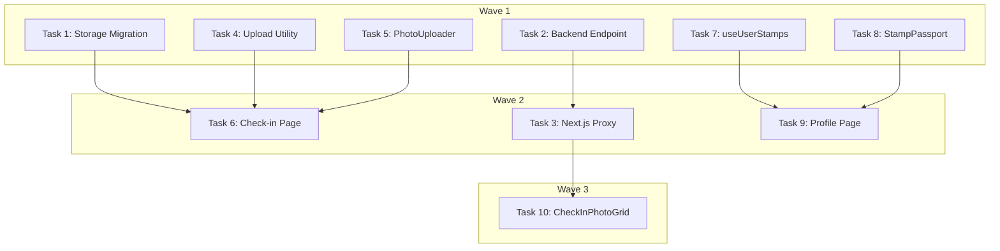

# Check-in & Stamps Implementation Plan

> **For Claude:** REQUIRED SUB-SKILL: Use executing-plans to implement this plan task-by-task.

**Design Doc:** [docs/designs/2026-03-04-checkin-stamps-design.md](../designs/2026-03-04-checkin-stamps-design.md)

**Spec References:** [SPEC.md#9-business-rules](../../SPEC.md) (check-in requires photo, check-in deduplication, stamps, PDPA, check-in page standalone, check-in social visibility)

**PRD References:** [PRD.md#7-core-features](../../PRD.md) (check-in system, stamp/collectible, private user profile)

**Goal:** Build the full check-in & stamps user journey — photo upload, stamp reveal, passport collection, and shop check-ins grid.

**Architecture:** Direct client-side upload to Supabase Storage (JWT + RLS), POST resulting URLs to existing FastAPI check-in endpoint. Stamp URL derived client-side from deterministic pattern (`/stamps/{shop_id}.svg`). New backend endpoint for shop-level check-in reads uses service-role to bypass user-scoped RLS. Profile shows passport-style stamp grid with swipeable pages.

**Tech Stack:** Supabase Storage (photo upload), SWR (data fetching), sonner (toast), CSS scroll-snap (passport pages), existing shadcn/ui components

**Acceptance Criteria:**
- [ ] A user can upload 1-3 photos and submit a check-in at a shop, seeing a stamp toast on success
- [ ] A user's stamp collection displays as a passport grid on their profile page
- [ ] Logged-in users see a photo grid of recent check-ins on a shop's detail section
- [ ] Unauthenticated users see only the check-in count and a preview photo
- [ ] Photo upload uses camera-first on mobile, file picker on desktop

---

## Task 1: Supabase Storage Migration

Create storage buckets for check-in photos and menu photos with RLS policies.

**Files:**
- Create: `supabase/migrations/20260304000001_create_storage_buckets.sql`

**Step 1: Write the migration**

```sql
-- Create storage buckets for check-in and menu photos
INSERT INTO storage.buckets (id, name, public)
VALUES
  ('checkin-photos', 'checkin-photos', false),
  ('menu-photos', 'menu-photos', false);

-- checkin-photos: authenticated users upload to their own path
CREATE POLICY "Users upload own checkin photos"
ON storage.objects FOR INSERT TO authenticated
WITH CHECK (
  bucket_id = 'checkin-photos'
  AND (storage.foldername(name))[1] = auth.uid()::text
);

-- checkin-photos: authenticated users can read all photos (for shop detail grid)
CREATE POLICY "Authenticated read checkin photos"
ON storage.objects FOR SELECT TO authenticated
USING (bucket_id = 'checkin-photos');

-- checkin-photos: users can delete their own photos (PDPA cascade)
CREATE POLICY "Users delete own checkin photos"
ON storage.objects FOR DELETE TO authenticated
USING (
  bucket_id = 'checkin-photos'
  AND (storage.foldername(name))[1] = auth.uid()::text
);

-- menu-photos: same policies
CREATE POLICY "Users upload own menu photos"
ON storage.objects FOR INSERT TO authenticated
WITH CHECK (
  bucket_id = 'menu-photos'
  AND (storage.foldername(name))[1] = auth.uid()::text
);

CREATE POLICY "Authenticated read menu photos"
ON storage.objects FOR SELECT TO authenticated
USING (bucket_id = 'menu-photos');

CREATE POLICY "Users delete own menu photos"
ON storage.objects FOR DELETE TO authenticated
USING (
  bucket_id = 'menu-photos'
  AND (storage.foldername(name))[1] = auth.uid()::text
);
```

No test needed — infrastructure migration. Verify manually with `supabase db push`.

**Step 2: Apply and verify**

Run: `supabase db push`
Expected: Migration applies without errors.

**Step 3: Commit**

```bash
git add supabase/migrations/20260304000001_create_storage_buckets.sql
git commit -m "feat: storage buckets for check-in and menu photos"
```

---

## Task 2: Backend — Shop Check-ins Endpoint

Add `GET /shops/{shop_id}/checkins` endpoint. Uses service-role client to read cross-user check-in data. Returns full check-in list for authenticated users, count + preview for unauthenticated.

**Files:**
- Modify: `backend/models/types.py` (add `ShopCheckInSummary`, `ShopCheckInPreview`)
- Modify: `backend/api/shops.py` (add endpoint)
- Create: `backend/tests/api/test_shop_checkins.py`

**API Contract:**
```yaml
endpoint: GET /shops/{shop_id}/checkins?limit=9
request:
  shop_id: string  # path param
  limit: int       # query param, default 9
response (authenticated):
  - id: string
    user_id: string
    display_name: string | null
    photo_url: string       # first photo only
    note: string | null
    created_at: string
response (unauthenticated):
  count: int
  preview_photo_url: string | null
errors:
  404: shop not found (only if no check-ins and shop doesn't exist)
```

**Step 1: Write Pydantic response models**

Add to `backend/models/types.py`:

```python
class ShopCheckInSummary(BaseModel):
    id: str
    user_id: str
    display_name: str | None = None
    photo_url: str
    note: str | None = None
    created_at: datetime


class ShopCheckInPreview(BaseModel):
    count: int
    preview_photo_url: str | None = None
```

**Step 2: Write failing tests**

Create `backend/tests/api/test_shop_checkins.py`:

```python
from unittest.mock import AsyncMock, MagicMock, patch

from fastapi.testclient import TestClient

from api.deps import get_current_user, get_optional_user
from main import app

client = TestClient(app)


class TestShopCheckinsAPI:
    def test_authenticated_user_sees_full_checkin_data(self):
        """Logged-in user gets list of check-in summaries with display names."""
        app.dependency_overrides[get_optional_user] = lambda: {"id": "user-1"}
        try:
            with patch("api.shops.get_admin_db") as mock_admin:
                mock_db = MagicMock()
                mock_admin.return_value = mock_db
                # Mock check_ins query with profiles join
                mock_db.table.return_value.select.return_value.eq.return_value.order.return_value.limit.return_value.execute.return_value = MagicMock(
                    data=[
                        {
                            "id": "ci-1",
                            "user_id": "user-2",
                            "photo_urls": ["https://example.com/p1.jpg", "https://example.com/p2.jpg"],
                            "note": "Great latte",
                            "created_at": "2026-03-01T10:00:00Z",
                            "profiles": {"display_name": "小明"},
                        }
                    ]
                )
                response = client.get("/shops/shop-1/checkins")
            assert response.status_code == 200
            data = response.json()
            assert isinstance(data, list)
            assert len(data) == 1
            assert data[0]["display_name"] == "小明"
            assert data[0]["photo_url"] == "https://example.com/p1.jpg"
            assert "photo_urls" not in data[0]  # Only first photo returned
        finally:
            app.dependency_overrides.clear()

    def test_unauthenticated_user_sees_count_and_preview(self):
        """Anonymous visitor gets count + one representative photo only."""
        app.dependency_overrides[get_optional_user] = lambda: None
        try:
            with patch("api.shops.get_admin_db") as mock_admin:
                mock_db = MagicMock()
                mock_admin.return_value = mock_db
                # Mock count query
                mock_db.table.return_value.select.return_value.eq.return_value.execute.return_value = MagicMock(
                    count=5,
                    data=[{"photo_urls": ["https://example.com/latest.jpg"]}],
                )
                response = client.get("/shops/shop-1/checkins")
            assert response.status_code == 200
            data = response.json()
            assert data["count"] == 5
            assert data["preview_photo_url"] == "https://example.com/latest.jpg"
        finally:
            app.dependency_overrides.clear()

    def test_unauthenticated_empty_shop_returns_zero(self):
        """Shop with no check-ins returns count 0 and null preview."""
        app.dependency_overrides[get_optional_user] = lambda: None
        try:
            with patch("api.shops.get_admin_db") as mock_admin:
                mock_db = MagicMock()
                mock_admin.return_value = mock_db
                mock_db.table.return_value.select.return_value.eq.return_value.execute.return_value = MagicMock(
                    count=0, data=[]
                )
                response = client.get("/shops/shop-1/checkins")
            assert response.status_code == 200
            assert response.json() == {"count": 0, "preview_photo_url": None}
        finally:
            app.dependency_overrides.clear()

    def test_limit_param_caps_results(self):
        """The limit query param restricts the number of returned check-ins."""
        app.dependency_overrides[get_optional_user] = lambda: {"id": "user-1"}
        try:
            with patch("api.shops.get_admin_db") as mock_admin:
                mock_db = MagicMock()
                mock_admin.return_value = mock_db
                mock_db.table.return_value.select.return_value.eq.return_value.order.return_value.limit.return_value.execute.return_value = MagicMock(
                    data=[]
                )
                client.get("/shops/shop-1/checkins?limit=3")
                # Verify limit was passed to query
                mock_db.table.return_value.select.return_value.eq.return_value.order.return_value.limit.assert_called_with(3)
        finally:
            app.dependency_overrides.clear()
```

**Step 3: Run tests to verify they fail**

Run: `cd backend && pytest tests/api/test_shop_checkins.py -v`
Expected: FAIL — endpoint does not exist yet.

**Step 4: Implement the endpoint**

Modify `backend/api/shops.py`:

```python
from typing import Any

from fastapi import APIRouter, Depends

from api.deps import get_admin_db, get_optional_user
from db.supabase_client import get_anon_client
from models.types import ShopCheckInPreview, ShopCheckInSummary

router = APIRouter(prefix="/shops", tags=["shops"])


@router.get("/")
async def list_shops(city: str | None = None) -> list[Any]:
    """List shops. Public — no auth required."""
    db = get_anon_client()
    query = db.table("shops").select("*")
    if city:
        query = query.eq("city", city)
    response = query.execute()
    return response.data


@router.get("/{shop_id}")
async def get_shop(shop_id: str) -> Any:
    """Get a single shop by ID. Public — no auth required."""
    db = get_anon_client()
    response = db.table("shops").select("*").eq("id", shop_id).single().execute()
    return response.data


@router.get("/{shop_id}/checkins")
async def get_shop_checkins(
    shop_id: str,
    limit: int = 9,
    user: dict[str, Any] | None = Depends(get_optional_user),  # noqa: B008
) -> list[dict[str, Any]] | dict[str, Any]:
    """Get check-ins for a shop. Auth-gated response shape.

    Authenticated: full check-in summaries with display names.
    Unauthenticated: count + one representative photo.
    """
    db = get_admin_db()

    if user:
        response = (
            db.table("check_ins")
            .select("id, user_id, photo_urls, note, created_at, profiles(display_name)")
            .eq("shop_id", shop_id)
            .order("created_at", desc=True)
            .limit(limit)
            .execute()
        )
        return [
            ShopCheckInSummary(
                id=row["id"],
                user_id=row["user_id"],
                display_name=row.get("profiles", {}).get("display_name") if row.get("profiles") else None,
                photo_url=row["photo_urls"][0],
                note=row.get("note"),
                created_at=row["created_at"],
            ).model_dump()
            for row in response.data
        ]
    else:
        response = (
            db.table("check_ins")
            .select("photo_urls", count="exact")
            .eq("shop_id", shop_id)
            .execute()
        )
        preview_url = response.data[0]["photo_urls"][0] if response.data else None
        return ShopCheckInPreview(
            count=response.count or 0,
            preview_photo_url=preview_url,
        ).model_dump()
```

**Step 5: Run tests to verify they pass**

Run: `cd backend && pytest tests/api/test_shop_checkins.py -v`
Expected: ALL PASS

**Step 6: Run linter**

Run: `cd backend && ruff check api/shops.py models/types.py && ruff format api/shops.py models/types.py`

**Step 7: Commit**

```bash
git add backend/models/types.py backend/api/shops.py backend/tests/api/test_shop_checkins.py
git commit -m "feat: GET /shops/{shop_id}/checkins endpoint with auth-gated response"
```

---

## Task 3: Next.js API Proxy for Shop Check-ins

Thin proxy route for the new backend endpoint.

**Files:**
- Create: `app/api/shops/[id]/checkins/route.ts`

No test needed — thin proxy following established pattern (`app/api/checkins/route.ts`).

**Step 1: Create the proxy route**

```typescript
import { NextRequest } from 'next/server';
import { proxyToBackend } from '@/lib/api/proxy';

export async function GET(
  request: NextRequest,
  { params }: { params: Promise<{ id: string }> }
) {
  const { id } = await params;
  return proxyToBackend(request, `/shops/${id}/checkins`);
}
```

**Step 2: Commit**

```bash
git add app/api/shops/\[id\]/checkins/route.ts
git commit -m "feat: proxy route for shop check-ins endpoint"
```

---

## Task 4: Photo Upload Utility

Client-side helper to upload files to Supabase Storage.

**Files:**
- Create: `lib/supabase/storage.ts`
- Create: `lib/supabase/storage.test.ts`

**Step 1: Write failing test**

```typescript
import { describe, it, expect, vi, beforeEach } from 'vitest';

vi.mock('@/lib/supabase/client', () => ({
  createClient: vi.fn(),
}));

import { createClient } from '@/lib/supabase/client';
import { uploadCheckInPhoto, uploadMenuPhoto } from './storage';

const mockUpload = vi.fn();
const mockGetPublicUrl = vi.fn();

beforeEach(() => {
  vi.mocked(createClient).mockReturnValue({
    storage: {
      from: vi.fn().mockReturnValue({
        upload: mockUpload,
        getPublicUrl: mockGetPublicUrl,
      }),
    },
    auth: {
      getSession: vi.fn().mockResolvedValue({
        data: { session: { user: { id: 'user-abc' } } },
      }),
    },
  } as any);
  mockUpload.mockReset();
  mockGetPublicUrl.mockReset();
});

describe('uploadCheckInPhoto', () => {
  it('uploads file to checkin-photos bucket under user path and returns public URL', async () => {
    mockUpload.mockResolvedValue({ data: { path: 'user-abc/test.webp' }, error: null });
    mockGetPublicUrl.mockReturnValue({
      data: { publicUrl: 'https://example.supabase.co/storage/v1/object/public/checkin-photos/user-abc/test.webp' },
    });

    const file = new File(['photo'], 'latte.jpg', { type: 'image/jpeg' });
    const url = await uploadCheckInPhoto(file);

    expect(mockUpload).toHaveBeenCalledWith(
      expect.stringMatching(/^user-abc\/[a-f0-9-]+\.webp$/),
      file,
      { contentType: 'image/jpeg' }
    );
    expect(url).toContain('checkin-photos');
  });

  it('throws when upload fails', async () => {
    mockUpload.mockResolvedValue({ data: null, error: { message: 'Bucket not found' } });

    const file = new File(['photo'], 'latte.jpg', { type: 'image/jpeg' });
    await expect(uploadCheckInPhoto(file)).rejects.toThrow('Bucket not found');
  });
});

describe('uploadMenuPhoto', () => {
  it('uploads to menu-photos bucket', async () => {
    mockUpload.mockResolvedValue({ data: { path: 'user-abc/menu.webp' }, error: null });
    mockGetPublicUrl.mockReturnValue({
      data: { publicUrl: 'https://example.supabase.co/storage/v1/object/public/menu-photos/user-abc/menu.webp' },
    });

    const file = new File(['photo'], 'menu.jpg', { type: 'image/jpeg' });
    const url = await uploadMenuPhoto(file);

    expect(url).toContain('menu-photos');
  });
});
```

**Step 2: Run test to verify it fails**

Run: `pnpm test -- lib/supabase/storage.test.ts`
Expected: FAIL — module not found.

**Step 3: Implement the upload utility**

```typescript
import { createClient } from '@/lib/supabase/client';

async function uploadToStorage(bucket: string, file: File): Promise<string> {
  const supabase = createClient();
  const { data: sessionData } = await supabase.auth.getSession();
  const userId = sessionData.session?.user?.id;
  if (!userId) throw new Error('Not authenticated');

  const ext = 'webp';
  const path = `${userId}/${crypto.randomUUID()}.${ext}`;

  const { error } = await supabase.storage.from(bucket).upload(path, file, {
    contentType: file.type,
  });
  if (error) throw new Error(error.message);

  const { data } = supabase.storage.from(bucket).getPublicUrl(path);
  return data.publicUrl;
}

export async function uploadCheckInPhoto(file: File): Promise<string> {
  return uploadToStorage('checkin-photos', file);
}

export async function uploadMenuPhoto(file: File): Promise<string> {
  return uploadToStorage('menu-photos', file);
}
```

**Step 4: Run test to verify it passes**

Run: `pnpm test -- lib/supabase/storage.test.ts`
Expected: ALL PASS

**Step 5: Commit**

```bash
git add lib/supabase/storage.ts lib/supabase/storage.test.ts
git commit -m "feat: photo upload utility for Supabase Storage"
```

---

## Task 5: PhotoUploader Component

Reusable photo selection component — camera-first on mobile, file picker on desktop. Handles validation (max 3 files, max 5 MB, image types only).

**Files:**
- Create: `components/checkins/photo-uploader.tsx`
- Create: `components/checkins/photo-uploader.test.tsx`

**Step 1: Write failing tests**

```typescript
import { render, screen, waitFor } from '@testing-library/react';
import userEvent from '@testing-library/user-event';
import { describe, it, expect, vi } from 'vitest';

import { PhotoUploader } from './photo-uploader';

function makeImageFile(name: string, sizeKB = 100): File {
  const content = new ArrayBuffer(sizeKB * 1024);
  return new File([content], name, { type: 'image/jpeg' });
}

describe('PhotoUploader', () => {
  it('shows an upload prompt when no photos are selected', () => {
    render(<PhotoUploader files={[]} onChange={vi.fn()} />);
    expect(screen.getByText(/take photo|add photo/i)).toBeInTheDocument();
  });

  it('displays thumbnails for selected files', () => {
    const files = [makeImageFile('latte.jpg'), makeImageFile('vibe.jpg')];
    render(<PhotoUploader files={files} onChange={vi.fn()} />);
    const images = screen.getAllByRole('img');
    expect(images).toHaveLength(2);
  });

  it('allows removing a selected photo', async () => {
    const onChange = vi.fn();
    const files = [makeImageFile('latte.jpg'), makeImageFile('vibe.jpg')];
    render(<PhotoUploader files={files} onChange={onChange} />);

    const removeButtons = screen.getAllByRole('button', { name: /remove/i });
    await userEvent.click(removeButtons[0]);

    expect(onChange).toHaveBeenCalledWith([files[1]]);
  });

  it('hides the add button when 3 photos are selected', () => {
    const files = [makeImageFile('a.jpg'), makeImageFile('b.jpg'), makeImageFile('c.jpg')];
    render(<PhotoUploader files={files} onChange={vi.fn()} maxPhotos={3} />);
    expect(screen.queryByText(/add another/i)).not.toBeInTheDocument();
  });

  it('rejects files larger than 5 MB', async () => {
    const onChange = vi.fn();
    render(<PhotoUploader files={[]} onChange={onChange} maxSizeMB={5} />);

    const file = makeImageFile('huge.jpg', 6 * 1024); // 6 MB
    const input = screen.getByTestId('photo-input');

    // Simulate file selection
    await userEvent.upload(input, file);

    // onChange should NOT be called with the oversized file
    expect(onChange).not.toHaveBeenCalled();
    expect(screen.getByText(/too large/i)).toBeInTheDocument();
  });
});
```

**Step 2: Run test to verify it fails**

Run: `pnpm test -- components/checkins/photo-uploader.test.tsx`
Expected: FAIL — module not found.

**Step 3: Implement PhotoUploader**

```tsx
'use client';

import { useCallback, useRef, useState } from 'react';
import { Button } from '@/components/ui/button';

const MAX_SIZE_DEFAULT = 5; // MB
const MAX_PHOTOS_DEFAULT = 3;

interface PhotoUploaderProps {
  files: File[];
  onChange: (files: File[]) => void;
  maxPhotos?: number;
  maxSizeMB?: number;
}

export function PhotoUploader({
  files,
  onChange,
  maxPhotos = MAX_PHOTOS_DEFAULT,
  maxSizeMB = MAX_SIZE_DEFAULT,
}: PhotoUploaderProps) {
  const inputRef = useRef<HTMLInputElement>(null);
  const [error, setError] = useState<string | null>(null);

  // Detect mobile via pointer: coarse media query
  const isMobile =
    typeof window !== 'undefined' &&
    window.matchMedia('(pointer: coarse)').matches;

  const handleFiles = useCallback(
    (newFiles: FileList | null) => {
      if (!newFiles) return;
      setError(null);

      const valid: File[] = [];
      for (const file of Array.from(newFiles)) {
        if (!file.type.startsWith('image/')) {
          setError('Only image files are accepted');
          return;
        }
        if (file.size > maxSizeMB * 1024 * 1024) {
          setError(`File too large (max ${maxSizeMB} MB)`);
          return;
        }
        valid.push(file);
      }

      const combined = [...files, ...valid].slice(0, maxPhotos);
      onChange(combined);
    },
    [files, onChange, maxPhotos, maxSizeMB]
  );

  const removeFile = useCallback(
    (index: number) => {
      onChange(files.filter((_, i) => i !== index));
    },
    [files, onChange]
  );

  return (
    <div className="space-y-3">
      {files.length === 0 ? (
        <button
          type="button"
          onClick={() => inputRef.current?.click()}
          className="flex h-32 w-full items-center justify-center rounded-lg border-2 border-dashed border-gray-300 text-sm text-gray-500 hover:border-gray-400"
        >
          {isMobile ? '📷 Take Photo' : '📷 Add Photo'}
        </button>
      ) : (
        <div className="flex gap-2">
          {files.map((file, i) => (
            <div key={i} className="relative h-24 w-24">
              
              <button
                type="button"
                aria-label="Remove photo"
                onClick={() => removeFile(i)}
                className="absolute -right-1 -top-1 flex h-5 w-5 items-center justify-center rounded-full bg-black/70 text-xs text-white"
              >
                ×
              </button>
            </div>
          ))}
          {files.length < maxPhotos && (
            <button
              type="button"
              onClick={() => inputRef.current?.click()}
              className="flex h-24 w-24 items-center justify-center rounded-lg border-2 border-dashed border-gray-300 text-xs text-gray-400"
            >
              + Add another
            </button>
          )}
        </div>
      )}

      <input
        ref={inputRef}
        data-testid="photo-input"
        type="file"
        accept="image/*"
        {...(isMobile ? { capture: 'environment' as const } : {})}
        multiple
        className="hidden"
        onChange={(e) => handleFiles(e.target.files)}
      />

      {isMobile && files.length > 0 && files.length < maxPhotos && (
        <button
          type="button"
          onClick={() => {
            // Remove capture to open gallery instead
            if (inputRef.current) {
              inputRef.current.removeAttribute('capture');
              inputRef.current.click();
              inputRef.current.setAttribute('capture', 'environment');
            }
          }}
          className="text-xs text-blue-600 underline"
        >
          Choose from gallery
        </button>
      )}

      {error && <p className="text-sm text-red-500">{error}</p>}
    </div>
  );
}
```

**Step 4: Run test to verify it passes**

Run: `pnpm test -- components/checkins/photo-uploader.test.tsx`
Expected: ALL PASS

**Step 5: Commit**

```bash
git add components/checkins/photo-uploader.tsx components/checkins/photo-uploader.test.tsx
git commit -m "feat: PhotoUploader component with mobile camera-first"
```

---

## Task 6: Check-in Page

The standalone check-in page at `/checkin/[shopId]`. Composes PhotoUploader, note input, optional menu photo, submit flow with Supabase Storage upload.

**Files:**
- Create: `app/(protected)/checkin/[shopId]/page.tsx`
- Create: `app/(protected)/checkin/[shopId]/page.test.tsx`

**Step 1: Write failing tests**

```typescript
import { render, screen, waitFor } from '@testing-library/react';
import userEvent from '@testing-library/user-event';
import { describe, it, expect, vi, beforeEach } from 'vitest';

// Mock next/navigation
const mockBack = vi.fn();
const mockPush = vi.fn();
vi.mock('next/navigation', () => ({
  useRouter: () => ({ back: mockBack, push: mockPush }),
  useParams: () => ({ shopId: 'shop-d4e5f6' }),
}));

// Mock Supabase client
vi.mock('@/lib/supabase/client', () => ({
  createClient: () => ({
    auth: {
      getSession: vi.fn().mockResolvedValue({
        data: { session: { access_token: 'test-token', user: { id: 'user-abc' } } },
      }),
    },
    storage: {
      from: () => ({
        upload: vi.fn().mockResolvedValue({ data: { path: 'user-abc/photo.webp' }, error: null }),
        getPublicUrl: () => ({
          data: { publicUrl: 'https://example.supabase.co/storage/v1/object/public/checkin-photos/user-abc/photo.webp' },
        }),
      }),
    },
  }),
}));

const mockFetch = vi.fn();
global.fetch = mockFetch;

import CheckInPage from './page';

describe('CheckInPage', () => {
  beforeEach(() => {
    mockFetch.mockReset();
    mockBack.mockReset();
    // Mock shop fetch
    mockFetch.mockResolvedValueOnce({
      ok: true,
      json: async () => ({ id: 'shop-d4e5f6', name: '山小孩咖啡' }),
    });
  });

  it('shows the shop name and a disabled submit button initially', async () => {
    render(<CheckInPage />);
    expect(await screen.findByText(/山小孩咖啡/)).toBeInTheDocument();
    const submitBtn = screen.getByRole('button', { name: /check in/i });
    expect(submitBtn).toBeDisabled();
  });

  it('enables submit button after selecting a photo', async () => {
    render(<CheckInPage />);
    await screen.findByText(/山小孩咖啡/);

    const input = screen.getByTestId('photo-input');
    const file = new File(['photo'], 'latte.jpg', { type: 'image/jpeg' });
    await userEvent.upload(input, file);

    const submitBtn = screen.getByRole('button', { name: /check in/i });
    expect(submitBtn).not.toBeDisabled();
  });

  it('on successful submit, calls the check-in API and navigates back', async () => {
    // Mock successful check-in POST
    mockFetch
      .mockResolvedValueOnce({
        ok: true,
        json: async () => ({
          id: 'ci-1',
          shop_id: 'shop-d4e5f6',
          photo_urls: ['https://example.supabase.co/storage/v1/object/public/checkin-photos/user-abc/photo.webp'],
          created_at: '2026-03-04T10:00:00Z',
        }),
      });

    render(<CheckInPage />);
    await screen.findByText(/山小孩咖啡/);

    const input = screen.getByTestId('photo-input');
    const file = new File(['photo'], 'latte.jpg', { type: 'image/jpeg' });
    await userEvent.upload(input, file);

    const submitBtn = screen.getByRole('button', { name: /check in/i });
    await userEvent.click(submitBtn);

    await waitFor(() => {
      const postCall = mockFetch.mock.calls.find(
        (c) => c[0] === '/api/checkins' && c[1]?.method === 'POST'
      );
      expect(postCall).toBeDefined();
    });
    await waitFor(() => expect(mockBack).toHaveBeenCalled());
  });

  it('shows PDPA disclosure in the menu photo section', async () => {
    render(<CheckInPage />);
    await screen.findByText(/山小孩咖啡/);
    expect(screen.getByText(/improve shop information/i)).toBeInTheDocument();
  });
});
```

**Step 2: Run test to verify it fails**

Run: `pnpm test -- app/\(protected\)/checkin/\[shopId\]/page.test.tsx`
Expected: FAIL — module not found.

**Step 3: Implement the check-in page**

```tsx
'use client';

import { useCallback, useState } from 'react';
import { useParams, useRouter } from 'next/navigation';
import useSWR from 'swr';
import { toast } from 'sonner';
import { Button } from '@/components/ui/button';
import { PhotoUploader } from '@/components/checkins/photo-uploader';
import { fetchWithAuth } from '@/lib/api/fetch';
import { uploadCheckInPhoto, uploadMenuPhoto } from '@/lib/supabase/storage';

type SubmitState = 'idle' | 'uploading' | 'submitting';

export default function CheckInPage() {
  const { shopId } = useParams<{ shopId: string }>();
  const router = useRouter();

  const { data: shop } = useSWR(
    shopId ? `/api/shops/${shopId}` : null,
    (url) => fetch(url).then((r) => r.json())
  );

  const [photos, setPhotos] = useState<File[]>([]);
  const [menuPhoto, setMenuPhoto] = useState<File | null>(null);
  const [note, setNote] = useState('');
  const [submitState, setSubmitState] = useState<SubmitState>('idle');
  const [menuOpen, setMenuOpen] = useState(false);

  const canSubmit = photos.length > 0 && submitState === 'idle';

  const handleSubmit = useCallback(async () => {
    if (!canSubmit) return;

    try {
      setSubmitState('uploading');

      const photoUrls = await Promise.all(photos.map(uploadCheckInPhoto));
      const menuPhotoUrl = menuPhoto ? await uploadMenuPhoto(menuPhoto) : undefined;

      setSubmitState('submitting');

      await fetchWithAuth('/api/checkins', {
        method: 'POST',
        body: JSON.stringify({
          shop_id: shopId,
          photo_urls: photoUrls,
          menu_photo_url: menuPhotoUrl ?? null,
          note: note.trim() || null,
        }),
      });

      toast('打卡成功！Stamp earned.', {
        description: shop?.name ?? 'Check-in recorded',
        action: {
          label: 'View Collection',
          onClick: () => router.push('/profile'),
        },
      });
      router.back();
    } catch (err) {
      toast.error(
        err instanceof Error ? err.message : 'Check-in failed. Try again.'
      );
    } finally {
      setSubmitState('idle');
    }
  }, [canSubmit, photos, menuPhoto, note, shopId, shop, router]);

  return (
    <main className="mx-auto max-w-lg px-4 py-6">
      <div className="mb-6">
        <button
          onClick={() => router.back()}
          className="mb-2 text-sm text-gray-500 hover:text-gray-700"
        >
          ← {shop?.name ?? 'Back'}
        </button>
        <h1 className="text-xl font-bold">Check In</h1>
      </div>

      <form
        onSubmit={(e) => {
          e.preventDefault();
          handleSubmit();
        }}
        className="space-y-6"
      >
        <PhotoUploader files={photos} onChange={setPhotos} />

        <div>
          <label htmlFor="note" className="mb-1 block text-sm font-medium text-gray-700">
            Note <span className="text-gray-400">(optional)</span>
          </label>
          <textarea
            id="note"
            value={note}
            onChange={(e) => setNote(e.target.value)}
            placeholder="What did you have? 今天點了什麼？"
            rows={3}
            className="w-full rounded-lg border border-gray-300 px-3 py-2 text-sm placeholder:text-gray-400 focus:border-blue-500 focus:outline-none"
          />
        </div>

        <div>
          <button
            type="button"
            onClick={() => setMenuOpen(!menuOpen)}
            className="flex items-center gap-1 text-sm text-gray-600"
          >
            <span className={`transition-transform ${menuOpen ? 'rotate-90' : ''}`}>
              ▸
            </span>
            Menu photo <span className="text-gray-400">(optional)</span>
          </button>
          {menuOpen && (
            <div className="mt-2 space-y-2">
              <input
                type="file"
                accept="image/*"
                onChange={(e) => setMenuPhoto(e.target.files?.[0] ?? null)}
                className="block w-full text-sm text-gray-500 file:mr-2 file:rounded file:border-0 file:bg-gray-100 file:px-3 file:py-1.5 file:text-sm"
              />
              {menuPhoto && (
                
              )}
              <p className="text-xs text-gray-400">
                Menu photos may be used to improve shop information on CafeRoam.
              </p>
            </div>
          )}
        </div>

        <Button
          type="submit"
          disabled={!canSubmit}
          className="w-full"
        >
          {submitState === 'uploading'
            ? 'Uploading photos...'
            : submitState === 'submitting'
              ? 'Saving...'
              : '打卡 Check In'}
        </Button>
      </form>
    </main>
  );
}
```

**Step 4: Run test to verify it passes**

Run: `pnpm test -- app/\(protected\)/checkin/\[shopId\]/page.test.tsx`
Expected: ALL PASS

**Step 5: Commit**

```bash
git add app/\(protected\)/checkin/\[shopId\]/page.tsx app/\(protected\)/checkin/\[shopId\]/page.test.tsx
git commit -m "feat: check-in page with photo upload and stamp toast"
```

---

## Task 7: useUserStamps Hook

SWR-based hook to fetch the authenticated user's stamps for the profile page.

**Files:**
- Create: `lib/hooks/use-user-stamps.ts`
- Create: `lib/hooks/use-user-stamps.test.ts`

**Step 1: Write failing test**

```typescript
import { renderHook, waitFor } from '@testing-library/react';
import { describe, it, expect, vi, beforeEach } from 'vitest';
import { SWRConfig } from 'swr';
import React from 'react';

vi.mock('@/lib/supabase/client', () => ({
  createClient: () => ({
    auth: {
      getSession: vi.fn().mockResolvedValue({
        data: { session: { access_token: 'test-token' } },
      }),
    },
  }),
}));

const mockFetch = vi.fn();
global.fetch = mockFetch;

import { useUserStamps } from './use-user-stamps';

const STAMPS = [
  {
    id: 'stamp-1',
    user_id: 'user-1',
    shop_id: 'shop-a',
    check_in_id: 'ci-1',
    design_url: '/stamps/shop-a.svg',
    earned_at: '2026-03-01T10:00:00Z',
  },
  {
    id: 'stamp-2',
    user_id: 'user-1',
    shop_id: 'shop-b',
    check_in_id: 'ci-2',
    design_url: '/stamps/shop-b.svg',
    earned_at: '2026-03-02T10:00:00Z',
  },
];

function wrapper({ children }: { children: React.ReactNode }) {
  return React.createElement(SWRConfig, { value: { provider: () => new Map() } }, children);
}

describe('useUserStamps', () => {
  beforeEach(() => {
    mockFetch.mockReset();
    mockFetch.mockResolvedValue({
      ok: true,
      json: async () => STAMPS,
    });
  });

  it('fetches stamps from /api/stamps', async () => {
    const { result } = renderHook(() => useUserStamps(), { wrapper });
    await waitFor(() => expect(result.current.stamps).toHaveLength(2));
    expect(result.current.stamps[0].design_url).toBe('/stamps/shop-a.svg');
  });

  it('reports loading state', () => {
    const { result } = renderHook(() => useUserStamps(), { wrapper });
    expect(result.current.isLoading).toBe(true);
  });
});
```

**Step 2: Run test to verify it fails**

Run: `pnpm test -- lib/hooks/use-user-stamps.test.ts`
Expected: FAIL — module not found.

**Step 3: Implement the hook**

```typescript
'use client';

import useSWR from 'swr';
import { fetchWithAuth } from '@/lib/api/fetch';
import type { Stamp } from '@/lib/types';

const fetcher = (url: string) => fetchWithAuth(url);

export function useUserStamps() {
  const { data, error, isLoading, mutate } = useSWR<Stamp[]>('/api/stamps', fetcher);

  return {
    stamps: data ?? [],
    isLoading,
    error,
    mutate,
  };
}
```

Note: The `Stamp` type in `lib/types/index.ts` uses camelCase (`userId`, `shopId`, etc.) but the backend returns snake_case. Check response shape and adjust. The factories in `lib/test-utils/factories.ts` use snake_case (`user_id`, `shop_id`). Match the actual API response format.

**Step 4: Run test to verify it passes**

Run: `pnpm test -- lib/hooks/use-user-stamps.test.ts`
Expected: ALL PASS

**Step 5: Commit**

```bash
git add lib/hooks/use-user-stamps.ts lib/hooks/use-user-stamps.test.ts
git commit -m "feat: useUserStamps SWR hook"
```

---

## Task 8: StampPassport Component

Passport-style stamp grid. 4×5 = 20 slots per page, swipeable with CSS scroll-snap.

**Files:**
- Create: `components/stamps/stamp-passport.tsx`
- Create: `components/stamps/stamp-passport.test.tsx`

**Step 1: Write failing tests**

```typescript
import { render, screen } from '@testing-library/react';
import { describe, it, expect } from 'vitest';
import { makeStamp } from '@/lib/test-utils/factories';

import { StampPassport } from './stamp-passport';

describe('StampPassport', () => {
  it('renders empty slots when no stamps exist', () => {
    render(<StampPassport stamps={[]} />);
    // Should show 20 empty slots (one page)
    const emptySlots = screen.getAllByTestId('stamp-slot-empty');
    expect(emptySlots).toHaveLength(20);
  });

  it('renders stamps in filled slots', () => {
    const stamps = [
      makeStamp({ id: 'stamp-1', shop_id: 'shop-a', design_url: '/stamps/shop-a.svg' }),
      makeStamp({ id: 'stamp-2', shop_id: 'shop-b', design_url: '/stamps/shop-b.svg' }),
    ];
    render(<StampPassport stamps={stamps} />);
    const filledSlots = screen.getAllByTestId('stamp-slot-filled');
    expect(filledSlots).toHaveLength(2);
    const emptySlots = screen.getAllByTestId('stamp-slot-empty');
    expect(emptySlots).toHaveLength(18);
  });

  it('shows page indicator dots for multiple pages', () => {
    const stamps = Array.from({ length: 22 }, (_, i) =>
      makeStamp({
        id: `stamp-${i}`,
        shop_id: `shop-${i}`,
        design_url: `/stamps/shop-${i}.svg`,
      })
    );
    render(<StampPassport stamps={stamps} />);
    const dots = screen.getAllByTestId('page-dot');
    expect(dots).toHaveLength(2); // 22 stamps = 2 pages
  });

  it('shows the total stamp count in the header', () => {
    const stamps = [makeStamp(), makeStamp({ id: 'stamp-2' })];
    render(<StampPassport stamps={stamps} />);
    expect(screen.getByText(/2 stamps/i)).toBeInTheDocument();
  });
});
```

**Step 2: Run test to verify it fails**

Run: `pnpm test -- components/stamps/stamp-passport.test.tsx`
Expected: FAIL — module not found.

**Step 3: Implement StampPassport**

```tsx
'use client';

import { useMemo, useState } from 'react';

const SLOTS_PER_PAGE = 20;
const COLS = 4;

interface StampData {
  id: string;
  shop_id: string;
  design_url: string;
  earned_at: string;
}

interface StampPassportProps {
  stamps: StampData[];
}

export function StampPassport({ stamps }: StampPassportProps) {
  const [currentPage, setCurrentPage] = useState(0);

  const pages = useMemo(() => {
    const totalPages = Math.max(1, Math.ceil(stamps.length / SLOTS_PER_PAGE));
    return Array.from({ length: totalPages }, (_, pageIdx) => {
      const pageStamps = stamps.slice(
        pageIdx * SLOTS_PER_PAGE,
        (pageIdx + 1) * SLOTS_PER_PAGE
      );
      const slots: (StampData | null)[] = [
        ...pageStamps,
        ...Array(SLOTS_PER_PAGE - pageStamps.length).fill(null),
      ];
      return slots;
    });
  }, [stamps]);

  return (
    <div>
      <div className="mb-4 flex items-center justify-between">
        <h2 className="text-lg font-semibold">My Passport</h2>
        <span className="text-sm text-gray-500">
          {stamps.length} stamp{stamps.length !== 1 ? 's' : ''}
        </span>
      </div>

      <div
        className="flex snap-x snap-mandatory gap-4 overflow-x-auto"
        style={{ scrollbarWidth: 'none' }}
      >
        {pages.map((slots, pageIdx) => (
          <div
            key={pageIdx}
            className="min-w-full snap-center"
            style={{
              display: 'grid',
              gridTemplateColumns: `repeat(${COLS}, 1fr)`,
              gap: '0.5rem',
            }}
          >
            {slots.map((stamp, slotIdx) =>
              stamp ? (
                <div
                  key={stamp.id}
                  data-testid="stamp-slot-filled"
                  className="flex aspect-square items-center justify-center rounded-lg bg-amber-50 p-1"
                >
                  
                </div>
              ) : (
                <div
                  key={`empty-${pageIdx}-${slotIdx}`}
                  data-testid="stamp-slot-empty"
                  className="flex aspect-square items-center justify-center rounded-lg border-2 border-dashed border-gray-200"
                >
                  <div className="h-8 w-8 rounded-full border-2 border-gray-200" />
                </div>
              )
            )}
          </div>
        ))}
      </div>

      {pages.length > 1 && (
        <div className="mt-3 flex justify-center gap-1.5">
          {pages.map((_, i) => (
            <button
              key={i}
              data-testid="page-dot"
              onClick={() => setCurrentPage(i)}
              className={`h-2 w-2 rounded-full ${
                i === currentPage ? 'bg-gray-800' : 'bg-gray-300'
              }`}
              aria-label={`Page ${i + 1}`}
            />
          ))}
        </div>
      )}
    </div>
  );
}
```

**Step 4: Run test to verify it passes**

Run: `pnpm test -- components/stamps/stamp-passport.test.tsx`
Expected: ALL PASS

**Step 5: Commit**

```bash
git add components/stamps/stamp-passport.tsx components/stamps/stamp-passport.test.tsx
git commit -m "feat: StampPassport component with 4x5 grid and pages"
```

---

## Task 9: Profile Page — Stamp Collection

Replace the "Coming soon" placeholder with real content: stamp passport and check-in history.

**Files:**
- Modify: `app/(protected)/profile/page.tsx`
- Create: `app/(protected)/profile/page.test.tsx`

**Step 1: Write failing test**

```typescript
import { render, screen, waitFor } from '@testing-library/react';
import { describe, it, expect, vi, beforeEach } from 'vitest';
import { SWRConfig } from 'swr';
import React from 'react';
import { makeStamp } from '@/lib/test-utils/factories';

vi.mock('@/lib/supabase/client', () => ({
  createClient: () => ({
    auth: {
      getSession: vi.fn().mockResolvedValue({
        data: { session: { access_token: 'test-token' } },
      }),
    },
  }),
}));

const mockFetch = vi.fn();
global.fetch = mockFetch;

import ProfilePage from './page';

function wrapper({ children }: { children: React.ReactNode }) {
  return React.createElement(
    SWRConfig,
    { value: { provider: () => new Map() } },
    children
  );
}

describe('ProfilePage', () => {
  beforeEach(() => {
    mockFetch.mockReset();
  });

  it('shows the stamp passport with earned stamps', async () => {
    const stamps = [
      makeStamp({ id: 'stamp-1' }),
      makeStamp({ id: 'stamp-2', shop_id: 'shop-b', design_url: '/stamps/shop-b.svg' }),
    ];
    mockFetch.mockResolvedValue({ ok: true, json: async () => stamps });

    render(<ProfilePage />, { wrapper });

    await waitFor(() => {
      expect(screen.getByText(/my passport/i)).toBeInTheDocument();
    });
    expect(screen.getByText(/2 stamps/i)).toBeInTheDocument();
  });

  it('shows empty passport when user has no stamps', async () => {
    mockFetch.mockResolvedValue({ ok: true, json: async () => [] });

    render(<ProfilePage />, { wrapper });

    await waitFor(() => {
      expect(screen.getByText(/0 stamps/i)).toBeInTheDocument();
    });
  });
});
```

**Step 2: Run test to verify it fails**

Run: `pnpm test -- app/\(protected\)/profile/page.test.tsx`
Expected: FAIL — current page doesn't render stamps.

**Step 3: Replace profile page placeholder**

```tsx
'use client';

import { useUserStamps } from '@/lib/hooks/use-user-stamps';
import { StampPassport } from '@/components/stamps/stamp-passport';

export default function ProfilePage() {
  const { stamps, isLoading } = useUserStamps();

  return (
    <main className="mx-auto max-w-lg px-4 py-6">
      <h1 className="mb-6 text-2xl font-bold">Profile</h1>

      {isLoading ? (
        <div className="flex justify-center py-12">
          <div className="h-8 w-8 animate-spin rounded-full border-2 border-gray-300 border-t-gray-600" />
        </div>
      ) : (
        <StampPassport stamps={stamps} />
      )}
    </main>
  );
}
```

**Step 4: Run test to verify it passes**

Run: `pnpm test -- app/\(protected\)/profile/page.test.tsx`
Expected: ALL PASS

**Step 5: Commit**

```bash
git add app/\(protected\)/profile/page.tsx app/\(protected\)/profile/page.test.tsx
git commit -m "feat: profile page with stamp passport collection"
```

---

## Task 10: CheckInPhotoGrid Component

Photo grid for Shop Detail page — shows recent check-in photos (logged-in) or preview (unauthenticated).

**Files:**
- Create: `components/checkins/checkin-photo-grid.tsx`
- Create: `components/checkins/checkin-photo-grid.test.tsx`

**Step 1: Write failing tests**

```typescript
import { render, screen, waitFor } from '@testing-library/react';
import { describe, it, expect, vi, beforeEach } from 'vitest';
import { SWRConfig } from 'swr';
import React from 'react';

vi.mock('@/lib/supabase/client', () => ({
  createClient: () => ({
    auth: {
      getSession: vi.fn().mockResolvedValue({
        data: { session: { access_token: 'test-token' } },
      }),
    },
  }),
}));

const mockFetch = vi.fn();
global.fetch = mockFetch;

import { CheckInPhotoGrid } from './checkin-photo-grid';

function wrapper({ children }: { children: React.ReactNode }) {
  return React.createElement(
    SWRConfig,
    { value: { provider: () => new Map() } },
    children
  );
}

const CHECKINS = [
  {
    id: 'ci-1',
    user_id: 'user-1',
    display_name: '小明',
    photo_url: 'https://example.com/p1.jpg',
    note: 'Great latte',
    created_at: '2026-03-01T10:00:00Z',
  },
  {
    id: 'ci-2',
    user_id: 'user-2',
    display_name: '小華',
    photo_url: 'https://example.com/p2.jpg',
    note: null,
    created_at: '2026-03-02T10:00:00Z',
  },
];

describe('CheckInPhotoGrid', () => {
  beforeEach(() => {
    mockFetch.mockReset();
  });

  it('shows photo grid and count badge for authenticated view', async () => {
    mockFetch.mockResolvedValue({
      ok: true,
      json: async () => CHECKINS,
    });

    render(<CheckInPhotoGrid shopId="shop-1" isAuthenticated={true} />, {
      wrapper,
    });

    await waitFor(() => {
      expect(screen.getAllByRole('img')).toHaveLength(2);
    });
  });

  it('shows count and login CTA for unauthenticated view', async () => {
    mockFetch.mockResolvedValue({
      ok: true,
      json: async () => ({ count: 47, preview_photo_url: 'https://example.com/p1.jpg' }),
    });

    render(<CheckInPhotoGrid shopId="shop-1" isAuthenticated={false} />, {
      wrapper,
    });

    await waitFor(() => {
      expect(screen.getByText(/47 visits/i)).toBeInTheDocument();
    });
    expect(screen.getByText(/log in/i)).toBeInTheDocument();
  });

  it('shows nothing when shop has zero check-ins', async () => {
    mockFetch.mockResolvedValue({
      ok: true,
      json: async () => ({ count: 0, preview_photo_url: null }),
    });

    const { container } = render(
      <CheckInPhotoGrid shopId="shop-1" isAuthenticated={false} />,
      { wrapper }
    );

    await waitFor(() => {
      expect(screen.queryByText(/visits/i)).not.toBeInTheDocument();
    });
  });
});
```

**Step 2: Run test to verify it fails**

Run: `pnpm test -- components/checkins/checkin-photo-grid.test.tsx`
Expected: FAIL — module not found.

**Step 3: Implement CheckInPhotoGrid**

```tsx
'use client';

import useSWR from 'swr';
import { fetchWithAuth } from '@/lib/api/fetch';

interface CheckInSummary {
  id: string;
  user_id: string;
  display_name: string | null;
  photo_url: string;
  note: string | null;
  created_at: string;
}

interface CheckInPreview {
  count: number;
  preview_photo_url: string | null;
}

interface CheckInPhotoGridProps {
  shopId: string;
  isAuthenticated: boolean;
}

export function CheckInPhotoGrid({ shopId, isAuthenticated }: CheckInPhotoGridProps) {
  const { data } = useSWR(
    `/api/shops/${shopId}/checkins`,
    isAuthenticated
      ? (url) => fetchWithAuth(url)
      : (url) => fetch(url).then((r) => r.json())
  );

  if (!data) return null;

  // Authenticated: data is CheckInSummary[]
  if (isAuthenticated && Array.isArray(data)) {
    if (data.length === 0) return null;

    return (
      <section>
        <div className="mb-3 flex items-center justify-between">
          <h3 className="font-semibold">Recent Check-ins</h3>
          <span className="text-sm text-gray-500">{data.length} visits</span>
        </div>
        <div className="grid grid-cols-3 gap-1">
          {data.slice(0, 9).map((checkin: CheckInSummary) => (
            
          ))}
        </div>
      </section>
    );
  }

  // Unauthenticated: data is CheckInPreview
  const preview = data as CheckInPreview;
  if (preview.count === 0) return null;

  return (
    <section>
      <div className="mb-3 flex items-center justify-between">
        <h3 className="font-semibold">Recent Check-ins</h3>
        <span className="text-sm text-gray-500">{preview.count} visits</span>
      </div>
      <div className="relative overflow-hidden rounded-lg">
        {preview.preview_photo_url && (
          
        )}
        <div className="absolute inset-0 flex items-center justify-center">
          <a
            href="/login"
            className="rounded-full bg-white/90 px-4 py-2 text-sm font-medium text-gray-800 shadow"
          >
            Log in to see all check-ins
          </a>
        </div>
      </div>
    </section>
  );
}
```

**Step 4: Run test to verify it passes**

Run: `pnpm test -- components/checkins/checkin-photo-grid.test.tsx`
Expected: ALL PASS

**Step 5: Commit**

```bash
git add components/checkins/checkin-photo-grid.tsx components/checkins/checkin-photo-grid.test.tsx
git commit -m "feat: CheckInPhotoGrid component with auth-gated rendering"
```

---

## Execution Waves



**Wave 1** (parallel — no dependencies):
- Task 1: Supabase Storage migration
- Task 2: Backend shop check-ins endpoint
- Task 4: Photo upload utility
- Task 5: PhotoUploader component
- Task 7: useUserStamps hook
- Task 8: StampPassport component

**Wave 2** (parallel — depends on Wave 1):
- Task 3: Next.js proxy ← Task 2
- Task 6: Check-in page ← Tasks 1, 4, 5
- Task 9: Profile page ← Tasks 7, 8

**Wave 3** (depends on Wave 2):
- Task 10: CheckInPhotoGrid ← Task 3

---

## Verification

After all tasks are complete, run:

```bash
# Backend tests
cd backend && pytest -v

# Frontend tests
pnpm test

# Type check
pnpm type-check

# Lint
pnpm lint && cd backend && ruff check .
```

Manual verification:
1. Start local Supabase (`supabase start`) — verify storage buckets exist
2. Navigate to `/checkin/[shopId]` — verify auth redirect works
3. Upload a photo, submit check-in — verify toast appears
4. Navigate to `/profile` — verify stamp passport shows the new stamp
