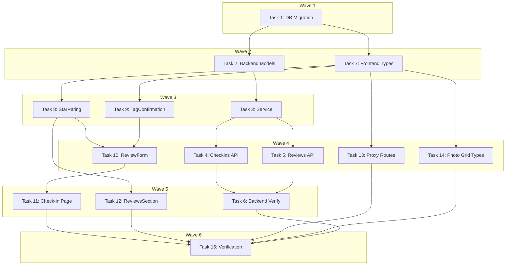

# Reviews Implementation Plan

> **For Claude:** REQUIRED SUB-SKILL: Use executing-plans to implement this plan task-by-task.

**Design Doc:** [docs/designs/2026-03-04-reviews-design.md](docs/designs/2026-03-04-reviews-design.md)

**Spec References:** [SPEC.md §9 Business Rules](SPEC.md) — reviews are check-in-gated, one per check-in, stars required, auth-gated visibility

**PRD References:** —

**Goal:** Add optional star rating, text review, and taxonomy tag confirmation to check-ins, with a reviews section on shop detail.

**Architecture:** Reviews are stored as nullable columns on the existing `check_ins` table (`stars`, `review_text`, `confirmed_tags`, `reviewed_at`). No new tables. The backend `CheckInService` gains review update capability. A new `GET /shops/{shop_id}/reviews` endpoint returns aggregated review data. Frontend adds review fields to the check-in form and a `ReviewsSection` component on shop detail.

**Tech Stack:** Supabase (migration), FastAPI (backend), Next.js + React (frontend), Vitest + pytest (tests)

**Acceptance Criteria:**

- [ ] A user can submit a check-in with a 1-5 star rating, optional text, and optional tag confirmations
- [ ] A user can add/edit a review on an existing check-in they own
- [ ] Logged-in users see a reviews section on shop detail with average rating and individual reviews
- [ ] Unauthenticated users do not see any review data on shop detail
- [ ] Deleting a user account cascades review data automatically (inherits from check-in cascade)

---

### Task 1: DB Migration — Add review columns to check_ins

**Files:**

- Create: `supabase/migrations/20260304000001_add_review_columns.sql`

**Step 1: Write the migration**

No test needed — DDL migration.

```sql
-- Add review columns to check_ins table
-- Reviews are optional metadata on check-ins (stars required for review, text optional)

ALTER TABLE check_ins
  ADD COLUMN stars SMALLINT CHECK (stars BETWEEN 1 AND 5),
  ADD COLUMN review_text TEXT,
  ADD COLUMN confirmed_tags TEXT[] DEFAULT '{}',
  ADD COLUMN reviewed_at TIMESTAMPTZ;

-- If review_text is present, stars must also be present
ALTER TABLE check_ins
  ADD CONSTRAINT check_review_requires_stars
  CHECK (stars IS NOT NULL OR review_text IS NULL);

-- Index for querying reviews by shop (GET /shops/{shop_id}/reviews)
CREATE INDEX idx_check_ins_shop_stars ON check_ins (shop_id, stars)
  WHERE stars IS NOT NULL;

COMMENT ON COLUMN check_ins.stars IS '1-5 star rating (required for review)';
COMMENT ON COLUMN check_ins.review_text IS 'Optional free-form review text';
COMMENT ON COLUMN check_ins.confirmed_tags IS 'Taxonomy tag IDs the user confirmed during review';
COMMENT ON COLUMN check_ins.reviewed_at IS 'When the review was added or last updated';
```

**Step 2: Verify migration syntax**

Run: `cd supabase && grep -c 'ALTER TABLE' migrations/20260304000001_add_review_columns.sql`
Expected: `2` (two ALTER TABLE statements)

**Step 3: Commit**

```bash
git add supabase/migrations/20260304000001_add_review_columns.sql
git commit -m "feat(db): add review columns to check_ins table"
```

---

### Task 2: Backend — Update CheckIn model with review fields

**Files:**

- Modify: `backend/models/types.py:87-101` (CheckIn model)
- Modify: `backend/models/types.py:113-119` (ShopCheckInSummary model)

**Step 1: No test needed** — model-only change, validated by existing tests + new tests in Task 3.

**Step 2: Add review fields to CheckIn model**

In `backend/models/types.py`, update the `CheckIn` class (line 87):

```python
class CheckIn(BaseModel):
    id: str
    user_id: str
    shop_id: str
    photo_urls: list[str]
    menu_photo_url: str | None = None
    note: str | None = None
    stars: int | None = None
    review_text: str | None = None
    confirmed_tags: list[str] | None = None
    reviewed_at: datetime | None = None
    created_at: datetime

    @field_validator("photo_urls")
    @classmethod
    def at_least_one_photo(cls, v: list[str]) -> list[str]:
        if len(v) < 1:
            raise ValueError("At least one photo is required for check-in")
        return v
```

**Step 3: Add review fields to ShopCheckInSummary model**

Update `ShopCheckInSummary` (line 113) to include review data for authenticated shop detail:

```python
class ShopCheckInSummary(BaseModel):
    id: str
    user_id: str
    display_name: str | None = None
    photo_url: str
    note: str | None = None
    stars: int | None = None
    review_text: str | None = None
    confirmed_tags: list[str] | None = None
    reviewed_at: datetime | None = None
    created_at: datetime
```

**Step 4: Add ShopReviewsResponse model**

Add after `ShopCheckInPreview` (line 124):

```python
class ShopReview(BaseModel):
    """A check-in with review data for the shop reviews section."""
    id: str
    user_id: str
    display_name: str | None = None
    stars: int
    review_text: str | None = None
    confirmed_tags: list[str] | None = None
    reviewed_at: datetime


class ShopReviewsResponse(BaseModel):
    reviews: list[ShopReview]
    total_count: int
    average_rating: float
```

**Step 5: Run existing tests to ensure no regressions**

Run: `cd backend && pytest tests/ -v --tb=short`
Expected: All existing tests PASS (new nullable fields don't break existing data)

**Step 6: Commit**

```bash
git add backend/models/types.py
git commit -m "feat(models): add review fields to CheckIn and ShopCheckInSummary"
```

---

### Task 3: Backend — Update CheckInService with review support

**Files:**

- Modify: `backend/services/checkin_service.py`
- Modify: `backend/tests/services/test_checkin_service.py`

**Step 1: Write the failing test — create check-in with review**

Add to `backend/tests/services/test_checkin_service.py`:

```python
async def test_create_with_review_includes_review_fields(
    self, checkin_service, mock_supabase
):
    """When stars provided, review fields are included in the insert."""
    mock_supabase.table = MagicMock(
        return_value=MagicMock(
            insert=MagicMock(
                return_value=MagicMock(
                    execute=MagicMock(
                        return_value=MagicMock(
                            data=[
                                {
                                    "id": "ci-1",
                                    "user_id": "user-1",
                                    "shop_id": "shop-1",
                                    "photo_urls": ["https://example.com/photo.jpg"],
                                    "menu_photo_url": None,
                                    "note": None,
                                    "stars": 4,
                                    "review_text": "Great latte!",
                                    "confirmed_tags": ["good_wifi", "quiet"],
                                    "reviewed_at": datetime.now().isoformat(),
                                    "created_at": datetime.now().isoformat(),
                                }
                            ]
                        )
                    )
                )
            )
        )
    )
    result = await checkin_service.create(
        user_id="user-1",
        shop_id="shop-1",
        photo_urls=["https://example.com/photo.jpg"],
        stars=4,
        review_text="Great latte!",
        confirmed_tags=["good_wifi", "quiet"],
    )
    assert result.stars == 4
    assert result.review_text == "Great latte!"
    # Verify inserted data includes review fields
    insert_data = mock_supabase.table.return_value.insert.call_args[0][0]
    assert insert_data["stars"] == 4
    assert insert_data["review_text"] == "Great latte!"
    assert insert_data["confirmed_tags"] == ["good_wifi", "quiet"]
    assert "reviewed_at" in insert_data
```

**Step 2: Write the failing test — update review on existing check-in**

```python
async def test_update_review_sets_review_fields(
    self, checkin_service, mock_supabase
):
    """update_review sets stars, review_text, confirmed_tags, reviewed_at."""
    mock_supabase.table = MagicMock(
        return_value=MagicMock(
            update=MagicMock(
                return_value=MagicMock(
                    eq=MagicMock(
                        return_value=MagicMock(
                            execute=MagicMock(
                                return_value=MagicMock(
                                    data=[
                                        {
                                            "id": "ci-1",
                                            "user_id": "user-1",
                                            "shop_id": "shop-1",
                                            "photo_urls": ["https://example.com/photo.jpg"],
                                            "menu_photo_url": None,
                                            "note": None,
                                            "stars": 5,
                                            "review_text": "Amazing!",
                                            "confirmed_tags": ["quiet"],
                                            "reviewed_at": datetime.now().isoformat(),
                                            "created_at": datetime.now().isoformat(),
                                        }
                                    ]
                                )
                            )
                        )
                    )
                )
            )
        )
    )
    result = await checkin_service.update_review(
        checkin_id="ci-1",
        stars=5,
        review_text="Amazing!",
        confirmed_tags=["quiet"],
    )
    assert result.stars == 5
    assert result.review_text == "Amazing!"

async def test_update_review_not_found_raises(
    self, checkin_service, mock_supabase
):
    """update_review raises ValueError if check-in not found (RLS blocks)."""
    mock_supabase.table = MagicMock(
        return_value=MagicMock(
            update=MagicMock(
                return_value=MagicMock(
                    eq=MagicMock(
                        return_value=MagicMock(
                            execute=MagicMock(
                                return_value=MagicMock(data=[])
                            )
                        )
                    )
                )
            )
        )
    )
    with pytest.raises(ValueError, match="not found"):
        await checkin_service.update_review(
            checkin_id="ci-nonexistent",
            stars=3,
        )

async def test_create_with_review_text_but_no_stars_raises(
    self, checkin_service
):
    """review_text without stars is invalid."""
    with pytest.raises(ValueError, match="Stars required"):
        await checkin_service.create(
            user_id="user-1",
            shop_id="shop-1",
            photo_urls=["https://example.com/photo.jpg"],
            review_text="text without stars",
        )

async def test_create_with_invalid_stars_raises(
    self, checkin_service
):
    """Stars outside 1-5 range are invalid."""
    with pytest.raises(ValueError, match="between 1 and 5"):
        await checkin_service.create(
            user_id="user-1",
            shop_id="shop-1",
            photo_urls=["https://example.com/photo.jpg"],
            stars=6,
        )
```

**Step 3: Run tests to verify they fail**

Run: `cd backend && pytest tests/services/test_checkin_service.py -v --tb=short`
Expected: FAIL — `create()` doesn't accept `stars` param, `update_review` method doesn't exist

**Step 4: Implement the service changes**

Update `backend/services/checkin_service.py`:

```python
from datetime import datetime, timezone
from typing import Any, cast

from supabase import Client

from core.db import first
from models.types import CheckIn


class CheckInService:
    def __init__(self, db: Client):
        self._db = db

    async def create(
        self,
        user_id: str,
        shop_id: str,
        photo_urls: list[str],
        menu_photo_url: str | None = None,
        note: str | None = None,
        stars: int | None = None,
        review_text: str | None = None,
        confirmed_tags: list[str] | None = None,
    ) -> CheckIn:
        """Create a check-in with optional review. DB trigger handles stamp creation."""
        if len(photo_urls) < 1:
            raise ValueError("At least one photo is required for check-in")
        if review_text and stars is None:
            raise ValueError("Stars required when review text is provided")
        if stars is not None and not (1 <= stars <= 5):
            raise ValueError("Stars must be between 1 and 5")

        checkin_data: dict[str, Any] = {
            "user_id": user_id,
            "shop_id": shop_id,
            "photo_urls": photo_urls,
            "menu_photo_url": menu_photo_url,
            "note": note,
        }
        if stars is not None:
            checkin_data["stars"] = stars
            checkin_data["review_text"] = review_text
            checkin_data["confirmed_tags"] = confirmed_tags or []
            checkin_data["reviewed_at"] = datetime.now(timezone.utc).isoformat()

        response = self._db.table("check_ins").insert(checkin_data).execute()
        rows = cast("list[dict[str, Any]]", response.data)
        return CheckIn(**first(rows, "create check-in"))

    async def update_review(
        self,
        checkin_id: str,
        stars: int,
        review_text: str | None = None,
        confirmed_tags: list[str] | None = None,
    ) -> CheckIn:
        """Add or update a review on an existing check-in. User must own the check-in (RLS enforced)."""
        if not (1 <= stars <= 5):
            raise ValueError("Stars must be between 1 and 5")

        update_data = {
            "stars": stars,
            "review_text": review_text,
            "confirmed_tags": confirmed_tags or [],
            "reviewed_at": datetime.now(timezone.utc).isoformat(),
        }
        response = (
            self._db.table("check_ins").update(update_data).eq("id", checkin_id).execute()
        )
        rows = cast("list[dict[str, Any]]", response.data)
        if not rows:
            raise ValueError("Check-in not found or access denied")
        return CheckIn(**first(rows, "update review"))

    async def get_by_user(self, user_id: str) -> list[CheckIn]:
        response = (
            self._db.table("check_ins")
            .select("*")
            .eq("user_id", user_id)
            .order("created_at", desc=True)
            .execute()
        )
        rows = cast("list[dict[str, Any]]", response.data)
        return [CheckIn(**row) for row in rows]

    async def get_by_shop(self, shop_id: str) -> list[CheckIn]:
        response = (
            self._db.table("check_ins")
            .select("*")
            .eq("shop_id", shop_id)
            .order("created_at", desc=True)
            .execute()
        )
        rows = cast("list[dict[str, Any]]", response.data)
        return [CheckIn(**row) for row in rows]
```

**Step 5: Run tests to verify they pass**

Run: `cd backend && pytest tests/services/test_checkin_service.py -v --tb=short`
Expected: All PASS

**Step 6: Commit**

```bash
git add backend/services/checkin_service.py backend/tests/services/test_checkin_service.py
git commit -m "feat(service): add review support to CheckInService"
```

---

### Task 4: Backend — Update checkins API route + add review endpoints

**Files:**

- Modify: `backend/api/checkins.py`
- Modify: `backend/tests/api/test_checkins.py`

**Step 1: Write failing tests for the new review endpoints**

Add to `backend/tests/api/test_checkins.py`:

```python
def test_create_checkin_with_review(self):
    """POST /checkins with review fields passes them to service."""
    mock_db = MagicMock()
    app.dependency_overrides[get_current_user] = lambda: {"id": "user-1"}
    app.dependency_overrides[get_user_db] = lambda: mock_db
    try:
        with patch("api.checkins.CheckInService") as mock_cls:
            mock_svc = AsyncMock()
            mock_svc.create.return_value = MagicMock(
                model_dump=lambda: {
                    "id": "ci-1",
                    "stars": 4,
                    "review_text": "Great!",
                    "confirmed_tags": ["quiet"],
                }
            )
            mock_cls.return_value = mock_svc
            response = client.post(
                "/checkins/",
                json={
                    "shop_id": "shop-1",
                    "photo_urls": ["https://example.com/photo.jpg"],
                    "stars": 4,
                    "review_text": "Great!",
                    "confirmed_tags": ["quiet"],
                },
            )
        assert response.status_code == 200
        mock_svc.create.assert_called_once()
        call_kwargs = mock_svc.create.call_args[1]
        assert call_kwargs["stars"] == 4
        assert call_kwargs["review_text"] == "Great!"
        assert call_kwargs["confirmed_tags"] == ["quiet"]
    finally:
        app.dependency_overrides.clear()

def test_update_review_requires_auth(self):
    """PATCH /checkins/{id}/review without auth returns 401."""
    response = client.patch(
        "/checkins/ci-1/review",
        json={"stars": 4},
    )
    assert response.status_code == 401

def test_update_review_success(self):
    """PATCH /checkins/{id}/review updates review on existing check-in."""
    mock_db = MagicMock()
    app.dependency_overrides[get_current_user] = lambda: {"id": "user-1"}
    app.dependency_overrides[get_user_db] = lambda: mock_db
    try:
        with patch("api.checkins.CheckInService") as mock_cls:
            mock_svc = AsyncMock()
            mock_svc.update_review.return_value = MagicMock(
                model_dump=lambda: {"id": "ci-1", "stars": 5}
            )
            mock_cls.return_value = mock_svc
            response = client.patch(
                "/checkins/ci-1/review",
                json={"stars": 5, "review_text": "Updated!"},
            )
        assert response.status_code == 200
        mock_svc.update_review.assert_called_once_with(
            checkin_id="ci-1",
            stars=5,
            review_text="Updated!",
            confirmed_tags=None,
        )
    finally:
        app.dependency_overrides.clear()

def test_update_review_not_found_returns_403(self):
    """PATCH /checkins/{id}/review for non-owned check-in returns 403."""
    mock_db = MagicMock()
    app.dependency_overrides[get_current_user] = lambda: {"id": "user-1"}
    app.dependency_overrides[get_user_db] = lambda: mock_db
    try:
        with patch("api.checkins.CheckInService") as mock_cls:
            mock_svc = AsyncMock()
            mock_svc.update_review.side_effect = ValueError(
                "Check-in not found or access denied"
            )
            mock_cls.return_value = mock_svc
            response = client.patch(
                "/checkins/ci-999/review",
                json={"stars": 3},
            )
        assert response.status_code == 403
    finally:
        app.dependency_overrides.clear()
```

**Step 2: Run tests to verify they fail**

Run: `cd backend && pytest tests/api/test_checkins.py -v --tb=short`
Expected: FAIL — new endpoints don't exist

**Step 3: Implement the route changes**

Update `backend/api/checkins.py`:

```python
from typing import Any

from fastapi import APIRouter, Depends, HTTPException
from pydantic import BaseModel
from supabase import Client

from api.deps import get_current_user, get_user_db
from services.checkin_service import CheckInService

router = APIRouter(prefix="/checkins", tags=["checkins"])


class CreateCheckInRequest(BaseModel):
    shop_id: str
    photo_urls: list[str]
    menu_photo_url: str | None = None
    note: str | None = None
    stars: int | None = None
    review_text: str | None = None
    confirmed_tags: list[str] | None = None


class UpdateReviewRequest(BaseModel):
    stars: int
    review_text: str | None = None
    confirmed_tags: list[str] | None = None


@router.post("/")
async def create_checkin(
    body: CreateCheckInRequest,
    user: dict[str, Any] = Depends(get_current_user),  # noqa: B008
    db: Client = Depends(get_user_db),  # noqa: B008
) -> dict[str, Any]:
    """Create a check-in with optional review. Auth required."""
    service = CheckInService(db=db)
    try:
        result = await service.create(
            user_id=user["id"],
            shop_id=body.shop_id,
            photo_urls=body.photo_urls,
            menu_photo_url=body.menu_photo_url,
            note=body.note,
            stars=body.stars,
            review_text=body.review_text,
            confirmed_tags=body.confirmed_tags,
        )
        return result.model_dump()
    except ValueError as e:
        raise HTTPException(status_code=400, detail=str(e)) from None


@router.patch("/{checkin_id}/review")
async def update_review(
    checkin_id: str,
    body: UpdateReviewRequest,
    user: dict[str, Any] = Depends(get_current_user),  # noqa: B008
    db: Client = Depends(get_user_db),  # noqa: B008
) -> dict[str, Any]:
    """Add or update a review on an existing check-in. Auth required, must own the check-in."""
    service = CheckInService(db=db)
    try:
        result = await service.update_review(
            checkin_id=checkin_id,
            stars=body.stars,
            review_text=body.review_text,
            confirmed_tags=body.confirmed_tags,
        )
        return result.model_dump()
    except ValueError as e:
        raise HTTPException(status_code=403, detail=str(e)) from None


@router.get("/")
async def get_my_checkins(
    user: dict[str, Any] = Depends(get_current_user),  # noqa: B008
    db: Client = Depends(get_user_db),  # noqa: B008
) -> list[dict[str, Any]]:
    """Get current user's check-ins. Auth required."""
    service = CheckInService(db=db)
    results = await service.get_by_user(user["id"])
    return [r.model_dump() for r in results]
```

**Step 4: Run tests to verify they pass**

Run: `cd backend && pytest tests/api/test_checkins.py -v --tb=short`
Expected: All PASS

**Step 5: Commit**

```bash
git add backend/api/checkins.py backend/tests/api/test_checkins.py
git commit -m "feat(api): add review fields to check-in creation + PATCH review endpoint"
```

---

### Task 5: Backend — Add GET /shops/{shop_id}/reviews endpoint

**Files:**

- Modify: `backend/api/shops.py`
- Create: `backend/tests/api/test_shop_reviews.py`

**Step 1: Write failing tests**

Create `backend/tests/api/test_shop_reviews.py`:

```python
from unittest.mock import MagicMock

from fastapi.testclient import TestClient

from api.deps import get_admin_db, get_current_user, get_optional_user
from main import app

client = TestClient(app)


class TestShopReviewsAPI:
    def test_get_reviews_requires_auth(self):
        """GET /shops/{id}/reviews without auth returns 401."""
        response = client.get("/shops/shop-1/reviews")
        assert response.status_code == 401

    def test_get_reviews_returns_aggregated_data(self):
        """GET /shops/{id}/reviews returns reviews, total_count, average_rating."""
        mock_db = MagicMock()
        # Mock the reviews query (check_ins with stars IS NOT NULL)
        reviews_response = MagicMock()
        reviews_response.data = [
            {
                "id": "ci-1",
                "user_id": "user-1",
                "stars": 4,
                "review_text": "Great coffee!",
                "confirmed_tags": ["quiet"],
                "reviewed_at": "2026-03-04T10:00:00Z",
                "profiles": {"display_name": "Alice"},
            },
            {
                "id": "ci-2",
                "user_id": "user-2",
                "stars": 5,
                "review_text": None,
                "confirmed_tags": [],
                "reviewed_at": "2026-03-04T11:00:00Z",
                "profiles": {"display_name": "Bob"},
            },
        ]
        reviews_response.count = 2

        # Chain the mock: table().select().eq().not_().order().limit().offset().execute()
        mock_db.table.return_value.select.return_value.eq.return_value.not_.return_value.order.return_value.limit.return_value.offset.return_value.execute.return_value = reviews_response

        app.dependency_overrides[get_current_user] = lambda: {"id": "user-1"}
        app.dependency_overrides[get_admin_db] = lambda: mock_db
        try:
            response = client.get("/shops/shop-1/reviews")
            assert response.status_code == 200
            data = response.json()
            assert data["total_count"] == 2
            assert data["average_rating"] == 4.5
            assert len(data["reviews"]) == 2
            assert data["reviews"][0]["stars"] == 4
            assert data["reviews"][0]["display_name"] == "Alice"
        finally:
            app.dependency_overrides.clear()

    def test_get_reviews_empty_shop(self):
        """GET /shops/{id}/reviews with no reviews returns empty list and 0 average."""
        mock_db = MagicMock()
        empty_response = MagicMock()
        empty_response.data = []
        empty_response.count = 0

        mock_db.table.return_value.select.return_value.eq.return_value.not_.return_value.order.return_value.limit.return_value.offset.return_value.execute.return_value = empty_response

        app.dependency_overrides[get_current_user] = lambda: {"id": "user-1"}
        app.dependency_overrides[get_admin_db] = lambda: mock_db
        try:
            response = client.get("/shops/shop-1/reviews")
            assert response.status_code == 200
            data = response.json()
            assert data["total_count"] == 0
            assert data["average_rating"] == 0
            assert data["reviews"] == []
        finally:
            app.dependency_overrides.clear()
```

**Step 2: Run tests to verify they fail**

Run: `cd backend && pytest tests/api/test_shop_reviews.py -v --tb=short`
Expected: FAIL — endpoint doesn't exist

**Step 3: Implement the endpoint**

Add to `backend/api/shops.py` (after the existing `get_shop_checkins` endpoint):

```python
from models.types import ShopCheckInPreview, ShopCheckInSummary, ShopReview, ShopReviewsResponse
```

(update import at top)

Then add the new endpoint:

```python
@router.get("/{shop_id}/reviews")
async def get_shop_reviews(
    shop_id: str,
    limit: int = Query(default=10, ge=1, le=50),
    offset: int = Query(default=0, ge=0),
    user: dict[str, Any] = Depends(get_current_user),  # noqa: B008
) -> dict[str, Any]:
    """Get reviews for a shop. Auth required — reviews are only visible to logged-in users."""
    db = get_admin_db()

    response = (
        db.table("check_ins")
        .select(
            "id, user_id, stars, review_text, confirmed_tags, reviewed_at, profiles(display_name)",
            count="exact",
        )
        .eq("shop_id", shop_id)
        .not_("stars", "is", "null")
        .order("reviewed_at", desc=True)
        .limit(limit)
        .offset(offset)
        .execute()
    )

    total_count = response.count or 0
    reviews = [
        ShopReview(
            id=row["id"],
            user_id=row["user_id"],
            display_name=(
                row.get("profiles", {}).get("display_name") if row.get("profiles") else None
            ),
            stars=row["stars"],
            review_text=row.get("review_text"),
            confirmed_tags=row.get("confirmed_tags"),
            reviewed_at=row["reviewed_at"],
        ).model_dump()
        for row in response.data
    ]

    avg = sum(r["stars"] for r in reviews) / len(reviews) if reviews else 0
    # For accurate average, compute from total count if paginated
    if total_count > len(reviews):
        # Use the page average as approximation; exact average would need a separate query
        avg = sum(r["stars"] for r in reviews) / len(reviews) if reviews else 0

    return ShopReviewsResponse(
        reviews=[ShopReview(**r) for r in reviews],
        total_count=total_count,
        average_rating=round(avg, 1),
    ).model_dump()
```

**Step 4: Run tests to verify they pass**

Run: `cd backend && pytest tests/api/test_shop_reviews.py -v --tb=short`
Expected: All PASS

**Step 5: Run full backend test suite**

Run: `cd backend && pytest tests/ -v --tb=short`
Expected: All PASS

**Step 6: Commit**

```bash
git add backend/api/shops.py backend/tests/api/test_shop_reviews.py
git commit -m "feat(api): add GET /shops/{shop_id}/reviews endpoint"
```

---

### Task 6: Backend verification

**Files:** None (verification only)

**Step 1: Run full test suite**

Run: `cd backend && pytest tests/ -v --tb=short`
Expected: All PASS

**Step 2: Run linters and type checker**

Run: `cd backend && ruff check . && ruff format --check . && mypy .`
Expected: All PASS (fix any issues before proceeding)

**Step 3: Commit any fixes**

```bash
git add -u backend/
git commit -m "fix: lint and type-check fixes for reviews backend"
```

(Only if fixes were needed — skip if clean)

---

### Task 7: Frontend — Update types with review fields

**Files:**

- Modify: `lib/types/index.ts:63-71` (CheckIn interface)

**Step 1: No test needed** — type-only change, validated by TypeScript compiler.

**Step 2: Add review fields to CheckIn interface**

Update `lib/types/index.ts`:

```typescript
export interface CheckIn {
  id: string;
  userId: string;
  shopId: string;
  photoUrls: [string, ...string[]];
  menuPhotoUrl: string | null;
  note: string | null;
  stars: number | null;
  reviewText: string | null;
  confirmedTags: string[] | null;
  reviewedAt: string | null;
  createdAt: string;
}

export interface ShopReview {
  id: string;
  userId: string;
  displayName: string | null;
  stars: number;
  reviewText: string | null;
  confirmedTags: string[] | null;
  reviewedAt: string;
}

export interface ShopReviewsResponse {
  reviews: ShopReview[];
  total_count: number;
  average_rating: number;
}
```

**Step 3: Run type-check**

Run: `pnpm type-check`
Expected: PASS

**Step 4: Commit**

```bash
git add lib/types/index.ts
git commit -m "feat(types): add review fields to CheckIn and ShopReview types"
```

---

### Task 8: Frontend — StarRating component

**Files:**

- Create: `components/reviews/star-rating.tsx`
- Create: `components/reviews/star-rating.test.tsx`

**Step 1: Write the failing test**

Create `components/reviews/star-rating.test.tsx`:

```tsx
import { render, screen } from '@testing-library/react';
import userEvent from '@testing-library/user-event';
import { describe, it, expect, vi } from 'vitest';
import { StarRating } from './star-rating';

describe('StarRating', () => {
  it('renders 5 stars in display mode', () => {
    render(<StarRating value={3} />);
    const stars = screen.getAllByRole('img', { hidden: true });
    expect(stars).toHaveLength(5);
  });

  it('highlights the correct number of stars in display mode', () => {
    const { container } = render(<StarRating value={4} />);
    const filled = container.querySelectorAll('[data-filled="true"]');
    expect(filled).toHaveLength(4);
  });

  it('calls onChange when a star is clicked in interactive mode', async () => {
    const onChange = vi.fn();
    render(<StarRating value={0} onChange={onChange} />);
    const stars = screen.getAllByRole('button');
    expect(stars).toHaveLength(5);
    await userEvent.click(stars[2]); // 3rd star
    expect(onChange).toHaveBeenCalledWith(3);
  });

  it('does not render buttons in display mode', () => {
    render(<StarRating value={3} />);
    const buttons = screen.queryAllByRole('button');
    expect(buttons).toHaveLength(0);
  });

  it('can clear selection by clicking the same star', async () => {
    const onChange = vi.fn();
    render(<StarRating value={3} onChange={onChange} />);
    const stars = screen.getAllByRole('button');
    await userEvent.click(stars[2]); // Click 3rd star again to deselect
    expect(onChange).toHaveBeenCalledWith(0);
  });
});
```

**Step 2: Run test to verify it fails**

Run: `pnpm vitest run components/reviews/star-rating.test.tsx`
Expected: FAIL — component doesn't exist

**Step 3: Implement the component**

Create `components/reviews/star-rating.tsx`:

```tsx
'use client';

interface StarRatingProps {
  value: number;
  onChange?: (value: number) => void;
  size?: 'sm' | 'md' | 'lg';
}

const SIZES = {
  sm: 'h-4 w-4',
  md: 'h-5 w-5',
  lg: 'h-6 w-6',
};

function Star({ filled, size }: { filled: boolean; size: string }) {
  return (
    <svg
      role="img"
      aria-hidden="true"
      data-filled={filled}
      viewBox="0 0 20 20"
      className={`${size} ${filled ? 'fill-amber-400 text-amber-400' : 'fill-gray-200 text-gray-200'}`}
    >
      <path d="M9.049 2.927c.3-.921 1.603-.921 1.902 0l1.07 3.292a1 1 0 00.95.69h3.462c.969 0 1.371 1.24.588 1.81l-2.8 2.034a1 1 0 00-.364 1.118l1.07 3.292c.3.921-.755 1.688-1.54 1.118l-2.8-2.034a1 1 0 00-1.175 0l-2.8 2.034c-.784.57-1.838-.197-1.539-1.118l1.07-3.292a1 1 0 00-.364-1.118L2.98 8.72c-.783-.57-.38-1.81.588-1.81h3.461a1 1 0 00.951-.69l1.07-3.292z" />
    </svg>
  );
}

export function StarRating({ value, onChange, size = 'md' }: StarRatingProps) {
  const sizeClass = SIZES[size];
  const interactive = !!onChange;

  return (
    <div className="flex gap-0.5">
      {[1, 2, 3, 4, 5].map((star) =>
        interactive ? (
          <button
            key={star}
            type="button"
            onClick={() => onChange(star === value ? 0 : star)}
            className="focus:outline-none"
            aria-label={`${star} star${star !== 1 ? 's' : ''}`}
          >
            <Star filled={star <= value} size={sizeClass} />
          </button>
        ) : (
          <Star key={star} filled={star <= value} size={sizeClass} />
        )
      )}
    </div>
  );
}
```

**Step 4: Run test to verify it passes**

Run: `pnpm vitest run components/reviews/star-rating.test.tsx`
Expected: All PASS

**Step 5: Commit**

```bash
git add components/reviews/star-rating.tsx components/reviews/star-rating.test.tsx
git commit -m "feat(ui): add StarRating component with interactive and display modes"
```

---

### Task 9: Frontend — TagConfirmation component

**Files:**

- Create: `components/reviews/tag-confirmation.tsx`
- Create: `components/reviews/tag-confirmation.test.tsx`

**Step 1: Write the failing test**

Create `components/reviews/tag-confirmation.test.tsx`:

```tsx
import { render, screen } from '@testing-library/react';
import userEvent from '@testing-library/user-event';
import { describe, it, expect, vi } from 'vitest';
import { TagConfirmation } from './tag-confirmation';
import type { TaxonomyTag } from '@/lib/types';

const mockTags: TaxonomyTag[] = [
  {
    id: 'good_wifi',
    dimension: 'functionality',
    label: 'Good WiFi',
    labelZh: '穩定WiFi',
  },
  { id: 'quiet', dimension: 'ambience', label: 'Quiet', labelZh: '安靜' },
  {
    id: 'laptop_friendly',
    dimension: 'functionality',
    label: 'Laptop Friendly',
    labelZh: '適合帶筆電',
  },
];

describe('TagConfirmation', () => {
  it('renders all shop tags as chips', () => {
    render(
      <TagConfirmation tags={mockTags} confirmedIds={[]} onChange={vi.fn()} />
    );
    expect(screen.getByText('穩定WiFi')).toBeInTheDocument();
    expect(screen.getByText('安靜')).toBeInTheDocument();
    expect(screen.getByText('適合帶筆電')).toBeInTheDocument();
  });

  it('highlights confirmed tags', () => {
    const { container } = render(
      <TagConfirmation
        tags={mockTags}
        confirmedIds={['good_wifi']}
        onChange={vi.fn()}
      />
    );
    const confirmed = container.querySelectorAll('[data-confirmed="true"]');
    expect(confirmed).toHaveLength(1);
  });

  it('toggles tag on click and calls onChange', async () => {
    const onChange = vi.fn();
    render(
      <TagConfirmation tags={mockTags} confirmedIds={[]} onChange={onChange} />
    );
    await userEvent.click(screen.getByText('安靜'));
    expect(onChange).toHaveBeenCalledWith(['quiet']);
  });

  it('removes tag on click when already confirmed', async () => {
    const onChange = vi.fn();
    render(
      <TagConfirmation
        tags={mockTags}
        confirmedIds={['quiet']}
        onChange={onChange}
      />
    );
    await userEvent.click(screen.getByText('安靜'));
    expect(onChange).toHaveBeenCalledWith([]);
  });
});
```

**Step 2: Run test to verify it fails**

Run: `pnpm vitest run components/reviews/tag-confirmation.test.tsx`
Expected: FAIL — component doesn't exist

**Step 3: Implement the component**

Create `components/reviews/tag-confirmation.tsx`:

```tsx
'use client';

import type { TaxonomyTag } from '@/lib/types';

interface TagConfirmationProps {
  tags: TaxonomyTag[];
  confirmedIds: string[];
  onChange: (ids: string[]) => void;
}

export function TagConfirmation({
  tags,
  confirmedIds,
  onChange,
}: TagConfirmationProps) {
  if (tags.length === 0) return null;

  const toggle = (tagId: string) => {
    const next = confirmedIds.includes(tagId)
      ? confirmedIds.filter((id) => id !== tagId)
      : [...confirmedIds, tagId];
    onChange(next);
  };

  return (
    <div>
      <p className="mb-2 text-sm text-gray-600">
        Confirm what you experienced:
      </p>
      <div className="flex flex-wrap gap-2">
        {tags.map((tag) => {
          const isConfirmed = confirmedIds.includes(tag.id);
          return (
            <button
              key={tag.id}
              type="button"
              data-confirmed={isConfirmed}
              onClick={() => toggle(tag.id)}
              className={`rounded-full border px-3 py-1.5 text-sm transition-colors ${
                isConfirmed
                  ? 'border-amber-400 bg-amber-50 text-amber-800'
                  : 'border-gray-200 bg-white text-gray-600 hover:border-gray-300'
              }`}
            >
              {tag.labelZh}
            </button>
          );
        })}
      </div>
    </div>
  );
}
```

**Step 4: Run test to verify it passes**

Run: `pnpm vitest run components/reviews/tag-confirmation.test.tsx`
Expected: All PASS

**Step 5: Commit**

```bash
git add components/reviews/tag-confirmation.tsx components/reviews/tag-confirmation.test.tsx
git commit -m "feat(ui): add TagConfirmation component for taxonomy tag voting"
```

---

### Task 10: Frontend — ReviewForm component

**Files:**

- Create: `components/reviews/review-form.tsx`
- Create: `components/reviews/review-form.test.tsx`

**Step 1: Write the failing test**

Create `components/reviews/review-form.test.tsx`:

```tsx
import { render, screen } from '@testing-library/react';
import userEvent from '@testing-library/user-event';
import { describe, it, expect, vi } from 'vitest';
import { ReviewForm } from './review-form';
import type { TaxonomyTag } from '@/lib/types';

const mockTags: TaxonomyTag[] = [
  {
    id: 'good_wifi',
    dimension: 'functionality',
    label: 'Good WiFi',
    labelZh: '穩定WiFi',
  },
  { id: 'quiet', dimension: 'ambience', label: 'Quiet', labelZh: '安靜' },
];

describe('ReviewForm', () => {
  it('shows star rating but hides tag confirmation and text until stars selected', () => {
    render(<ReviewForm shopTags={mockTags} onSubmit={vi.fn()} />);
    // Stars should be visible
    expect(screen.getAllByRole('button', { name: /star/i })).toHaveLength(5);
    // Tag confirmation and text area should NOT be visible yet
    expect(screen.queryByText(/confirm what you/i)).not.toBeInTheDocument();
    expect(screen.queryByPlaceholderText(/how was/i)).not.toBeInTheDocument();
  });

  it('reveals tag confirmation and text when stars are selected', async () => {
    render(<ReviewForm shopTags={mockTags} onSubmit={vi.fn()} />);
    const stars = screen.getAllByRole('button', { name: /star/i });
    await userEvent.click(stars[3]); // 4 stars
    expect(screen.getByText(/confirm what you/i)).toBeInTheDocument();
    expect(screen.getByPlaceholderText(/how was/i)).toBeInTheDocument();
  });

  it('calls onSubmit with review data', async () => {
    const onSubmit = vi.fn();
    render(<ReviewForm shopTags={mockTags} onSubmit={onSubmit} />);

    const stars = screen.getAllByRole('button', { name: /star/i });
    await userEvent.click(stars[3]); // 4 stars

    const textarea = screen.getByPlaceholderText(/how was/i);
    await userEvent.type(textarea, 'Great latte!');

    // Confirm a tag
    await userEvent.click(screen.getByText('安靜'));

    const submit = screen.getByRole('button', { name: /save review/i });
    await userEvent.click(submit);

    expect(onSubmit).toHaveBeenCalledWith({
      stars: 4,
      review_text: 'Great latte!',
      confirmed_tags: ['quiet'],
    });
  });

  it('hides review fields when stars are deselected', async () => {
    render(<ReviewForm shopTags={mockTags} onSubmit={vi.fn()} />);
    const stars = screen.getAllByRole('button', { name: /star/i });
    await userEvent.click(stars[3]); // select 4 stars
    expect(screen.getByPlaceholderText(/how was/i)).toBeInTheDocument();
    await userEvent.click(stars[3]); // deselect
    expect(screen.queryByPlaceholderText(/how was/i)).not.toBeInTheDocument();
  });
});
```

**Step 2: Run test to verify it fails**

Run: `pnpm vitest run components/reviews/review-form.test.tsx`
Expected: FAIL — component doesn't exist

**Step 3: Implement the component**

Create `components/reviews/review-form.tsx`:

```tsx
'use client';

import { useState } from 'react';
import { Button } from '@/components/ui/button';
import { StarRating } from '@/components/reviews/star-rating';
import { TagConfirmation } from '@/components/reviews/tag-confirmation';
import type { TaxonomyTag } from '@/lib/types';

interface ReviewData {
  stars: number;
  review_text: string | null;
  confirmed_tags: string[];
}

interface ReviewFormProps {
  shopTags: TaxonomyTag[];
  onSubmit: (data: ReviewData) => void;
  initialStars?: number;
  initialText?: string;
  initialTags?: string[];
  submitLabel?: string;
}

export function ReviewForm({
  shopTags,
  onSubmit,
  initialStars = 0,
  initialText = '',
  initialTags = [],
  submitLabel = 'Save Review',
}: ReviewFormProps) {
  const [stars, setStars] = useState(initialStars);
  const [reviewText, setReviewText] = useState(initialText);
  const [confirmedTags, setConfirmedTags] = useState<string[]>(initialTags);

  const showDetails = stars > 0;

  const handleSubmit = () => {
    if (stars === 0) return;
    onSubmit({
      stars,
      review_text: reviewText.trim() || null,
      confirmed_tags: confirmedTags,
    });
  };

  return (
    <div className="space-y-4">
      <div>
        <label className="mb-1 block text-sm font-medium text-gray-700">
          Rate your visit <span className="text-gray-400">(optional)</span>
        </label>
        <StarRating value={stars} onChange={setStars} size="lg" />
      </div>

      {showDetails && (
        <>
          {shopTags.length > 0 && (
            <TagConfirmation
              tags={shopTags}
              confirmedIds={confirmedTags}
              onChange={setConfirmedTags}
            />
          )}

          <div>
            <textarea
              value={reviewText}
              onChange={(e) => setReviewText(e.target.value)}
              placeholder="How was your visit? 這次體驗如何？"
              rows={3}
              className="w-full rounded-lg border border-gray-300 px-3 py-2 text-sm placeholder:text-gray-400 focus:border-blue-500 focus:outline-none"
            />
          </div>

          <Button
            type="button"
            onClick={handleSubmit}
            variant="secondary"
            className="w-full"
          >
            {submitLabel}
          </Button>
        </>
      )}
    </div>
  );
}
```

**Step 4: Run test to verify it passes**

Run: `pnpm vitest run components/reviews/review-form.test.tsx`
Expected: All PASS

**Step 5: Commit**

```bash
git add components/reviews/review-form.tsx components/reviews/review-form.test.tsx
git commit -m "feat(ui): add ReviewForm component with star rating, tags, and text"
```

---

### Task 11: Frontend — Integrate ReviewForm into check-in page

**Files:**

- Modify: `app/(protected)/checkin/[shopId]/page.tsx`
- Modify: `app/(protected)/checkin/[shopId]/page.test.tsx`

**Step 1: Write the failing test**

Add to `app/(protected)/checkin/[shopId]/page.test.tsx`:

```tsx
it('includes review data in check-in submission when stars are selected', async () => {
  // Mock successful check-in POST
  mockFetch.mockResolvedValueOnce({
    ok: true,
    json: async () => ({
      id: 'ci-1',
      shop_id: 'shop-d4e5f6',
      photo_urls: [
        'https://example.supabase.co/storage/v1/object/public/checkin-photos/user-abc/photo.webp',
      ],
      stars: 4,
      review_text: null,
      created_at: '2026-03-04T10:00:00Z',
    }),
  });

  render(<CheckInPage />);
  // Wait for shop data (includes taxonomyTags)
  await screen.findByText(/山小孩咖啡/);

  // Upload a photo
  const input = screen.getByTestId('photo-input');
  const file = new File(['photo'], 'latte.jpg', { type: 'image/jpeg' });
  await userEvent.upload(input, file);

  // Select stars
  const stars = screen.getAllByRole('button', { name: /star/i });
  await userEvent.click(stars[3]); // 4 stars

  // Submit
  const submitBtn = screen.getByRole('button', { name: /check in/i });
  await userEvent.click(submitBtn);

  await waitFor(() => {
    const postCall = mockFetch.mock.calls.find(
      (c) => c[0] === '/api/checkins' && c[1]?.method === 'POST'
    );
    expect(postCall).toBeDefined();
    const body = JSON.parse(postCall![1].body);
    expect(body.stars).toBe(4);
  });
});

it('submits without review data when stars are not selected', async () => {
  mockFetch.mockResolvedValueOnce({
    ok: true,
    json: async () => ({
      id: 'ci-1',
      shop_id: 'shop-d4e5f6',
      photo_urls: [
        'https://example.supabase.co/storage/v1/object/public/checkin-photos/user-abc/photo.webp',
      ],
      created_at: '2026-03-04T10:00:00Z',
    }),
  });

  render(<CheckInPage />);
  await screen.findByText(/山小孩咖啡/);

  const input = screen.getByTestId('photo-input');
  const file = new File(['photo'], 'latte.jpg', { type: 'image/jpeg' });
  await userEvent.upload(input, file);

  const submitBtn = screen.getByRole('button', { name: /check in/i });
  await userEvent.click(submitBtn);

  await waitFor(() => {
    const postCall = mockFetch.mock.calls.find(
      (c) => c[0] === '/api/checkins' && c[1]?.method === 'POST'
    );
    expect(postCall).toBeDefined();
    const body = JSON.parse(postCall![1].body);
    expect(body.stars).toBeUndefined();
  });
});
```

**Step 2: Run test to verify it fails**

Run: `pnpm vitest run app/\\(protected\\)/checkin/\\[shopId\\]/page.test.tsx`
Expected: FAIL — no star buttons rendered

**Step 3: Update the check-in page**

Modify `app/(protected)/checkin/[shopId]/page.tsx` to add review fields. The key changes:

1. Import `ReviewForm` (but inline the review state to keep form submission unified)
2. Add `stars`, `reviewText`, `confirmedTags` state
3. Add `StarRating`, `TagConfirmation`, and textarea below the existing form fields
4. Include review data in the check-in POST body

The updated page adds these state variables and form fields between the menu photo section and the submit button:

```tsx
// New state (add after line 35):
const [stars, setStars] = useState(0);
const [reviewText, setReviewText] = useState('');
const [confirmedTags, setConfirmedTags] = useState<string[]>([]);

// In handleSubmit body JSON (update around line 52-60):
body: (JSON.stringify({
  shop_id: shopId,
  photo_urls: photoUrls,
  menu_photo_url: menuPhotoUrl ?? null,
  note: note.trim() || null,
  ...(stars > 0 && {
    stars,
    review_text: reviewText.trim() || null,
    confirmed_tags: confirmedTags,
  }),
}),
  (
    // New JSX section (add between menu photo div and submit Button):
    <div className="border-t pt-4">
      <StarRating value={stars} onChange={setStars} size="lg" />
      {stars > 0 && (
        <div className="mt-4 space-y-4">
          {shop?.taxonomyTags?.length > 0 && (
            <TagConfirmation
              tags={shop.taxonomyTags}
              confirmedIds={confirmedTags}
              onChange={setConfirmedTags}
            />
          )}
          <textarea
            value={reviewText}
            onChange={(e) => setReviewText(e.target.value)}
            placeholder="How was your visit? 這次體驗如何？"
            rows={3}
            className="w-full rounded-lg border border-gray-300 px-3 py-2 text-sm placeholder:text-gray-400 focus:border-blue-500 focus:outline-none"
          />
        </div>
      )}
    </div>
  ));
```

Add imports at the top:

```tsx
import { StarRating } from '@/components/reviews/star-rating';
import { TagConfirmation } from '@/components/reviews/tag-confirmation';
```

**Step 4: Run test to verify it passes**

Run: `pnpm vitest run app/\\(protected\\)/checkin/\\[shopId\\]/page.test.tsx`
Expected: All PASS

**Step 5: Commit**

```bash
git add "app/(protected)/checkin/[shopId]/page.tsx" "app/(protected)/checkin/[shopId]/page.test.tsx"
git commit -m "feat(checkin): add optional review fields to check-in form"
```

---

### Task 12: Frontend — ReviewCard and ReviewsSection components

**Files:**

- Create: `components/reviews/review-card.tsx`
- Create: `components/reviews/reviews-section.tsx`
- Create: `components/reviews/reviews-section.test.tsx`

**Step 1: Write the failing test**

Create `components/reviews/reviews-section.test.tsx`:

```tsx
import { render, screen } from '@testing-library/react';
import { describe, it, expect, vi, beforeEach } from 'vitest';

// Mock fetchWithAuth
const mockFetchWithAuth = vi.fn();
vi.mock('@/lib/api/fetch', () => ({
  fetchWithAuth: (...args: unknown[]) => mockFetchWithAuth(...args),
}));

import { ReviewsSection } from './reviews-section';

describe('ReviewsSection', () => {
  beforeEach(() => {
    mockFetchWithAuth.mockReset();
  });

  it('renders average rating and review count', async () => {
    mockFetchWithAuth.mockResolvedValue({
      reviews: [
        {
          id: 'ci-1',
          user_id: 'u-1',
          display_name: 'Alice',
          stars: 4,
          review_text: 'Great latte!',
          confirmed_tags: ['quiet'],
          reviewed_at: '2026-03-04T10:00:00Z',
        },
      ],
      total_count: 1,
      average_rating: 4.0,
    });

    render(<ReviewsSection shopId="shop-1" isAuthenticated={true} />);
    expect(await screen.findByText(/4\.0/)).toBeInTheDocument();
    expect(screen.getByText(/1 review/i)).toBeInTheDocument();
    expect(screen.getByText(/Great latte!/)).toBeInTheDocument();
    expect(screen.getByText(/Alice/)).toBeInTheDocument();
  });

  it('does not render when not authenticated', () => {
    const { container } = render(
      <ReviewsSection shopId="shop-1" isAuthenticated={false} />
    );
    expect(container.firstChild).toBeNull();
  });

  it('does not render when there are no reviews', async () => {
    mockFetchWithAuth.mockResolvedValue({
      reviews: [],
      total_count: 0,
      average_rating: 0,
    });

    const { container } = render(
      <ReviewsSection shopId="shop-1" isAuthenticated={true} />
    );
    // Wait for SWR to settle
    await new Promise((r) => setTimeout(r, 50));
    // Section should be empty or show nothing
    expect(screen.queryByText(/review/i)).not.toBeInTheDocument();
  });
});
```

**Step 2: Run test to verify it fails**

Run: `pnpm vitest run components/reviews/reviews-section.test.tsx`
Expected: FAIL — component doesn't exist

**Step 3: Implement ReviewCard**

Create `components/reviews/review-card.tsx`:

```tsx
import { StarRating } from '@/components/reviews/star-rating';
import type { ShopReview } from '@/lib/types';

interface ReviewCardProps {
  review: ShopReview;
}

export function ReviewCard({ review }: ReviewCardProps) {
  const date = new Date(review.reviewedAt).toLocaleDateString('zh-TW', {
    year: 'numeric',
    month: 'short',
    day: 'numeric',
  });

  return (
    <div className="border-b border-gray-100 py-3 last:border-0">
      <div className="mb-1 flex items-center gap-2">
        <StarRating value={review.stars} size="sm" />
        <span className="text-sm text-gray-500">{date}</span>
      </div>
      <p className="text-sm font-medium text-gray-700">
        {review.displayName ?? 'Anonymous'}
      </p>
      {review.reviewText && (
        <p className="mt-1 text-sm text-gray-600">{review.reviewText}</p>
      )}
      {review.confirmedTags && review.confirmedTags.length > 0 && (
        <div className="mt-1.5 flex flex-wrap gap-1">
          {review.confirmedTags.map((tag) => (
            <span
              key={tag}
              className="rounded-full bg-amber-50 px-2 py-0.5 text-xs text-amber-700"
            >
              {tag}
            </span>
          ))}
        </div>
      )}
    </div>
  );
}
```

**Step 4: Implement ReviewsSection**

Create `components/reviews/reviews-section.tsx`:

```tsx
'use client';

import { useCallback } from 'react';
import useSWR from 'swr';
import { fetchWithAuth } from '@/lib/api/fetch';
import { StarRating } from '@/components/reviews/star-rating';
import { ReviewCard } from '@/components/reviews/review-card';
import type { ShopReviewsResponse } from '@/lib/types';

interface ReviewsSectionProps {
  shopId: string;
  isAuthenticated: boolean;
}

export function ReviewsSection({
  shopId,
  isAuthenticated,
}: ReviewsSectionProps) {
  const apiUrl = `/api/shops/${shopId}/reviews`;
  const fetcher = useCallback(() => fetchWithAuth(apiUrl), [apiUrl]);
  const { data } = useSWR<ShopReviewsResponse>(
    isAuthenticated ? apiUrl : null,
    fetcher
  );

  if (!isAuthenticated || !data || data.total_count === 0) return null;

  return (
    <section>
      <div className="mb-3 flex items-center gap-2">
        <h3 className="font-semibold">User Reviews</h3>
        <StarRating value={Math.round(data.average_rating)} size="sm" />
        <span className="text-sm text-gray-500">
          {data.average_rating} · {data.total_count}{' '}
          {data.total_count === 1 ? 'review' : 'reviews'}
        </span>
      </div>
      <div>
        {data.reviews.map((review) => (
          <ReviewCard key={review.id} review={review} />
        ))}
      </div>
    </section>
  );
}
```

**Step 5: Run test to verify it passes**

Run: `pnpm vitest run components/reviews/reviews-section.test.tsx`
Expected: All PASS

**Step 6: Commit**

```bash
git add components/reviews/review-card.tsx components/reviews/reviews-section.tsx components/reviews/reviews-section.test.tsx
git commit -m "feat(ui): add ReviewCard and ReviewsSection for shop detail"
```

---

### Task 13: Frontend — Add proxy routes

**Files:**

- Create: `app/api/shops/[id]/reviews/route.ts`
- Create: `app/api/checkins/[id]/review/route.ts`

**Step 1: No test needed** — thin proxy routes with no business logic.

**Step 2: Create shop reviews proxy**

Create `app/api/shops/[id]/reviews/route.ts`:

```typescript
import { NextRequest } from 'next/server';
import { proxyToBackend } from '@/lib/api/proxy';

export async function GET(
  request: NextRequest,
  { params }: { params: Promise<{ id: string }> }
) {
  const { id } = await params;
  return proxyToBackend(request, `/shops/${id}/reviews`);
}
```

**Step 3: Create checkin review proxy**

Create `app/api/checkins/[id]/review/route.ts`:

```typescript
import { NextRequest } from 'next/server';
import { proxyToBackend } from '@/lib/api/proxy';

export async function PATCH(
  request: NextRequest,
  { params }: { params: Promise<{ id: string }> }
) {
  const { id } = await params;
  return proxyToBackend(request, `/checkins/${id}/review`);
}
```

**Step 4: Commit**

```bash
git add app/api/shops/[id]/reviews/route.ts app/api/checkins/[id]/review/route.ts
git commit -m "feat(proxy): add review proxy routes"
```

---

### Task 14: Frontend — Update shop checkins response to include review fields

**Files:**

- Modify: `components/checkins/checkin-photo-grid.tsx:7-14` (CheckInSummary interface)

**Step 1: No test needed** — interface-only change; existing component renders the same.

**Step 2: Update the CheckInSummary interface**

In `components/checkins/checkin-photo-grid.tsx`, update `CheckInSummary` (line 7):

```typescript
interface CheckInSummary {
  id: string;
  user_id: string;
  display_name: string | null;
  photo_url: string;
  note: string | null;
  stars: number | null;
  review_text: string | null;
  confirmed_tags: string[] | null;
  reviewed_at: string | null;
  created_at: string;
}
```

**Step 3: Commit**

```bash
git add components/checkins/checkin-photo-grid.tsx
git commit -m "feat(types): update CheckInSummary with review fields"
```

---

### Task 15: Full verification

**Files:** None (verification only)

**Step 1: Run backend tests**

Run: `cd backend && pytest tests/ -v --tb=short`
Expected: All PASS

**Step 2: Run backend linters**

Run: `cd backend && ruff check . && ruff format --check . && mypy .`
Expected: All PASS

**Step 3: Run frontend tests**

Run: `pnpm test`
Expected: All PASS

**Step 4: Run frontend type-check and lint**

Run: `pnpm type-check && pnpm lint`
Expected: All PASS

**Step 5: Run production build**

Run: `pnpm build`
Expected: Build succeeds

**Step 6: Final commit (if any fixes)**

```bash
git add -u
git commit -m "fix: verification fixes for reviews feature"
```

---

## Execution Waves



**Wave 1** (no dependencies):

- Task 1: DB migration

**Wave 2** (parallel — depends on Wave 1):

- Task 2: Backend models ← Task 1
- Task 7: Frontend types (no backend dependency)

**Wave 3** (parallel — depends on Wave 2):

- Task 3: CheckInService ← Task 2
- Task 8: StarRating ← Task 7
- Task 9: TagConfirmation ← Task 7

**Wave 4** (parallel — depends on Wave 3):

- Task 4: Checkins API ← Task 3
- Task 5: Reviews API ← Task 3
- Task 10: ReviewForm ← Task 8, Task 9
- Task 13: Proxy routes ← Task 7
- Task 14: Photo grid types ← Task 7

**Wave 5** (parallel — depends on Wave 4):

- Task 6: Backend verification ← Task 4, Task 5
- Task 11: Check-in page integration ← Task 10
- Task 12: ReviewsSection ← Task 8

**Wave 6** (depends on all):

- Task 15: Full verification ← all tasks

---

## TODO.md Update

Add under Phase 2A:

```markdown
### Reviews

> **Design Doc:** [docs/designs/2026-03-04-reviews-design.md](docs/designs/2026-03-04-reviews-design.md)
> **Plan:** [docs/plans/2026-03-04-reviews-plan.md](docs/plans/2026-03-04-reviews-plan.md)

**Chunk 1 — DB + Backend Models (Wave 1-2):**

- [ ] DB migration: add review columns to check_ins (stars, review_text, confirmed_tags, reviewed_at)
- [ ] Backend models: add review fields to CheckIn, ShopCheckInSummary; add ShopReview, ShopReviewsResponse

**Chunk 2 — Backend Service + API (Wave 3-4):**

- [ ] CheckInService: create with review, update_review, validation with TDD
- [ ] Checkins API: review fields in POST, PATCH /checkins/{id}/review with TDD
- [ ] Shops API: GET /shops/{shop_id}/reviews endpoint with TDD
- [ ] Backend verification (pytest, ruff, mypy)

**Chunk 3 — Frontend Components (Wave 3-4):**

- [ ] StarRating component (interactive + display modes) with TDD
- [ ] TagConfirmation component (taxonomy tag chips) with TDD
- [ ] ReviewForm component (stars + tags + text) with TDD

**Chunk 4 — Frontend Integration (Wave 4-5):**

- [ ] Check-in page: add optional review fields with TDD
- [ ] ReviewCard + ReviewsSection for shop detail with TDD
- [ ] Proxy routes (shop reviews, checkin review update)
- [ ] Update CheckInSummary types

**Chunk 5 — Verification (Wave 6):**

- [ ] Full verification (pytest, vitest, ruff, mypy, pnpm build)
```
