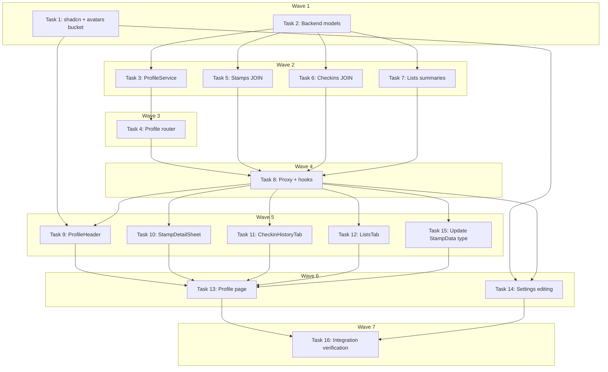

# User Profile Page Implementation Plan

> **For Claude:** REQUIRED SUB-SKILL: Use executing-plans to implement this plan task-by-task.

**Design Doc:** [docs/designs/2026-03-04-user-profile-design.md](../designs/2026-03-04-user-profile-design.md)

**Spec References:** [SPEC.md §2 System Modules — User Profile](../../SPEC.md), [SPEC.md §9 Business Rules — Profile is private](../../SPEC.md)

**PRD References:** [PRD.md §7 — Core Features V1](../../PRD.md)

**Goal:** Build the full private profile page with profile header, stamp passport (hero), and tabbed check-in history + lists sections, plus profile editing in settings.

**Architecture:** Profile page uses four parallel SWR hooks (`useUserProfile`, `useUserStamps`, `useUserCheckins`, `useUserLists`). Backend adds a new `GET/PATCH /profile` endpoint and extends existing stamps/checkins/lists endpoints with shop data JOINs. Profile editing (display name + avatar) lives on `/settings`.

**Tech Stack:** FastAPI, Supabase (PostgREST nested selects, Storage), Next.js App Router, SWR, shadcn/ui (Tabs, Avatar), Tailwind CSS

**Acceptance Criteria:**
- [ ] A user can see their display name, avatar, stamp count, and check-in count on the profile header
- [ ] A user can tap a stamp in their passport and see the shop name, earned date, and a link to the shop
- [ ] A user can view their check-in history with photo thumbnails, shop names, star ratings, and dates
- [ ] A user can see their lists with shop counts and preview thumbnails
- [ ] A user can edit their display name and upload an avatar from the settings page

---

## Codebase Reference

**Key patterns (read these before implementing):**
- Backend service pattern: `backend/services/checkin_service.py` — `__init__(self, db: Client)`, async methods, raises `ValueError`
- Backend router pattern: `backend/api/checkins.py` — local request `BaseModel`, `Depends(get_current_user)`, `Depends(get_user_db)`, `service = Service(db=db)`
- Frontend hook pattern: `lib/hooks/use-user-stamps.ts` — SWR + `fetchWithAuth`, exports interface, returns `data ?? []`
- Frontend proxy pattern: `app/api/stamps/route.ts` — `proxyToBackend(request, '/path')`
- Test factories: `lib/test-utils/factories.ts` — `makeStamp()`, `makeCheckIn()`, `makeList()`, `makeUser()`, `makeSession()`
- Test mocks: `lib/test-utils/mocks.ts` — `createMockSupabaseAuth()`, `createMockRouter()`

**DB column names:**
- `shops.name` (not `shop_name`), `shops.mrt` (nearest MRT station, acts as neighborhood)
- Cover photos: `shop_photos` table, ordered by `sort_order` — no column on `shops` itself
- `profiles.display_name`, `profiles.avatar_url` (both nullable)

**Missing shadcn components:** `tabs.tsx`, `avatar.tsx` — need to install. `sheet.tsx` not installed either; use existing `drawer.tsx` (Vaul) for the stamp detail bottom sheet instead.

---

### Task 1: Install shadcn UI components and create avatars storage bucket

**Files:**
- Create: `components/ui/tabs.tsx` (via shadcn CLI)
- Create: `components/ui/avatar.tsx` (via shadcn CLI)
- Create: `supabase/migrations/20260304000003_create_avatars_bucket.sql`

No test needed — CLI-generated components + DDL migration.

**Step 1: Install shadcn Tabs and Avatar**

```bash
npx shadcn@latest add tabs avatar
```

Verify both files exist:
```bash
ls components/ui/tabs.tsx components/ui/avatar.tsx
```

**Step 2: Create avatars storage bucket migration**

```sql
-- supabase/migrations/20260304000003_create_avatars_bucket.sql
INSERT INTO storage.buckets (id, name, public)
VALUES ('avatars', 'avatars', true)
ON CONFLICT (id) DO NOTHING;

-- Users can upload/update/delete their own avatar
CREATE POLICY "avatar_upload"
  ON storage.objects FOR INSERT
  WITH CHECK (bucket_id = 'avatars' AND (storage.foldername(name))[1] = auth.uid()::text);

CREATE POLICY "avatar_update"
  ON storage.objects FOR UPDATE
  USING (bucket_id = 'avatars' AND (storage.foldername(name))[1] = auth.uid()::text);

CREATE POLICY "avatar_delete"
  ON storage.objects FOR DELETE
  USING (bucket_id = 'avatars' AND (storage.foldername(name))[1] = auth.uid()::text);

-- Anyone can read avatars (public bucket)
CREATE POLICY "avatar_read"
  ON storage.objects FOR SELECT
  USING (bucket_id = 'avatars');
```

**Step 3: Apply migration locally**

```bash
supabase db push
```

**Step 4: Commit**

```bash
git add components/ui/tabs.tsx components/ui/avatar.tsx supabase/migrations/20260304000003_create_avatars_bucket.sql
git commit -m "chore: install shadcn tabs/avatar + create avatars storage bucket"
```

---

### Task 2: Backend models for profile

**Files:**
- Modify: `backend/models/types.py`

No test needed — pure type definitions.

**Step 1: Add profile models to `backend/models/types.py`**

Add after the existing `User` model:

```python
class ProfileResponse(BaseModel):
    display_name: str | None = None
    avatar_url: str | None = None
    stamp_count: int
    checkin_count: int


class ProfileUpdateRequest(BaseModel):
    display_name: str | None = None
    avatar_url: str | None = None

    @field_validator("display_name")
    @classmethod
    def validate_display_name(cls, v: str | None) -> str | None:
        if v is not None:
            v = v.strip()
            if len(v) == 0:
                raise ValueError("Display name cannot be empty")
            if len(v) > 30:
                raise ValueError("Display name must be 30 characters or less")
        return v


class StampWithShop(BaseModel):
    id: str
    user_id: str
    shop_id: str
    check_in_id: str
    design_url: str
    earned_at: datetime
    shop_name: str


class CheckInWithShop(BaseModel):
    id: str
    user_id: str
    shop_id: str
    shop_name: str
    shop_mrt: str | None = None
    photo_urls: list[str]
    menu_photo_url: str | None = None
    note: str | None = None
    stars: int | None = None
    review_text: str | None = None
    confirmed_tags: list[str] | None = None
    reviewed_at: datetime | None = None
    created_at: datetime


class ListSummary(BaseModel):
    id: str
    name: str
    shop_count: int
    preview_photos: list[str]
```

**Step 2: Commit**

```bash
cd backend && git add models/types.py
git commit -m "feat(models): add profile, stamp-with-shop, checkin-with-shop, list-summary types"
```

---

### Task 3: ProfileService with TDD

**Files:**
- Create: `backend/services/profile_service.py`
- Create: `backend/tests/test_profile_service.py`

**Step 1: Write the failing tests**

```python
# backend/tests/test_profile_service.py
from unittest.mock import AsyncMock, MagicMock, patch
from typing import Any, cast

import pytest

from services.profile_service import ProfileService
from models.types import ProfileResponse


@pytest.fixture
def mock_db():
    db = MagicMock()
    return db


class TestGetProfile:
    @pytest.mark.asyncio
    async def test_returns_profile_with_counts(self, mock_db: MagicMock):
        user_id = "user-123"
        # Mock profiles query
        mock_db.table.return_value.select.return_value.eq.return_value.single.return_value.execute.return_value.data = {
            "display_name": "Mei-Ling",
            "avatar_url": "https://example.com/avatar.jpg",
        }
        # Mock stamp count
        mock_db.table.return_value.select.return_value.eq.return_value.execute.return_value.count = 12
        # Mock checkin count
        mock_db.table.return_value.select.return_value.eq.return_value.execute.return_value.count = 8

        service = ProfileService(db=mock_db)
        result = await service.get_profile(user_id)

        assert isinstance(result, ProfileResponse)
        assert result.display_name == "Mei-Ling"
        assert result.stamp_count == 12
        assert result.checkin_count == 8

    @pytest.mark.asyncio
    async def test_returns_zero_counts_for_new_user(self, mock_db: MagicMock):
        user_id = "user-new"
        mock_db.table.return_value.select.return_value.eq.return_value.single.return_value.execute.return_value.data = {
            "display_name": None,
            "avatar_url": None,
        }
        mock_db.table.return_value.select.return_value.eq.return_value.execute.return_value.count = 0

        service = ProfileService(db=mock_db)
        result = await service.get_profile(user_id)

        assert result.display_name is None
        assert result.stamp_count == 0
        assert result.checkin_count == 0


class TestUpdateProfile:
    @pytest.mark.asyncio
    async def test_updates_display_name(self, mock_db: MagicMock):
        user_id = "user-123"
        mock_db.table.return_value.update.return_value.eq.return_value.execute.return_value.data = [
            {"display_name": "New Name", "avatar_url": None}
        ]

        service = ProfileService(db=mock_db)
        await service.update_profile(user_id, display_name="New Name")

        mock_db.table.return_value.update.assert_called()

    @pytest.mark.asyncio
    async def test_update_with_empty_data_raises(self, mock_db: MagicMock):
        service = ProfileService(db=mock_db)
        with pytest.raises(ValueError, match="No fields to update"):
            await service.update_profile("user-123")
```

**Step 2: Run tests to verify they fail**

```bash
cd backend && pytest tests/test_profile_service.py -v
```

Expected: FAIL — `ModuleNotFoundError: No module named 'services.profile_service'`

**Step 3: Implement ProfileService**

```python
# backend/services/profile_service.py
from typing import Any, cast

from supabase import Client

from models.types import ProfileResponse


class ProfileService:
    def __init__(self, db: Client):
        self._db = db

    async def get_profile(self, user_id: str) -> ProfileResponse:
        # Get profile data
        profile_resp = (
            self._db.table("profiles")
            .select("display_name, avatar_url")
            .eq("id", user_id)
            .single()
            .execute()
        )
        profile = cast("dict[str, Any]", profile_resp.data)

        # Get stamp count
        stamp_resp = (
            self._db.table("stamps")
            .select("id", count="exact")
            .eq("user_id", user_id)
            .execute()
        )
        stamp_count = stamp_resp.count or 0

        # Get check-in count
        checkin_resp = (
            self._db.table("check_ins")
            .select("id", count="exact")
            .eq("user_id", user_id)
            .execute()
        )
        checkin_count = checkin_resp.count or 0

        return ProfileResponse(
            display_name=profile.get("display_name"),
            avatar_url=profile.get("avatar_url"),
            stamp_count=stamp_count,
            checkin_count=checkin_count,
        )

    async def update_profile(
        self,
        user_id: str,
        display_name: str | None = None,
        avatar_url: str | None = None,
    ) -> None:
        update_data: dict[str, Any] = {}
        if display_name is not None:
            update_data["display_name"] = display_name
        if avatar_url is not None:
            update_data["avatar_url"] = avatar_url

        if not update_data:
            raise ValueError("No fields to update")

        self._db.table("profiles").update(update_data).eq("id", user_id).execute()
```

**Step 4: Run tests to verify they pass**

```bash
cd backend && pytest tests/test_profile_service.py -v
```

Expected: PASS

**Step 5: Commit**

```bash
cd backend && git add services/profile_service.py tests/test_profile_service.py
git commit -m "feat(profile): add ProfileService with TDD — get_profile + update_profile"
```

---

### Task 4: Profile API router with TDD

**Files:**
- Create: `backend/api/profile.py`
- Modify: `backend/main.py` (register router)
- Create: `backend/tests/test_profile_api.py`

**API Contract:**
```yaml
GET /profile:
  auth: required
  response:
    display_name: string | null
    avatar_url: string | null
    stamp_count: int
    checkin_count: int
  errors:
    401: unauthenticated

PATCH /profile:
  auth: required
  request:
    display_name: string | null  # max 30 chars
    avatar_url: string | null
  response:
    message: "Profile updated"
  errors:
    400: validation failure
    401: unauthenticated
```

**Step 1: Write the failing tests**

```python
# backend/tests/test_profile_api.py
from unittest.mock import AsyncMock, MagicMock, patch
import pytest
from fastapi.testclient import TestClient

from main import app


@pytest.fixture
def client():
    return TestClient(app)


@pytest.fixture
def auth_headers():
    return {"Authorization": "Bearer test-token"}


class TestGetProfile:
    @patch("api.profile.get_user_db")
    @patch("api.profile.get_current_user")
    def test_returns_profile_data(
        self, mock_user: MagicMock, mock_db: MagicMock, client: TestClient, auth_headers: dict
    ):
        mock_user.return_value = {"id": "user-123"}
        db = MagicMock()
        mock_db.return_value = db
        # Mock profile query
        db.table.return_value.select.return_value.eq.return_value.single.return_value.execute.return_value.data = {
            "display_name": "Mei-Ling",
            "avatar_url": None,
        }
        # Mock count queries
        db.table.return_value.select.return_value.eq.return_value.execute.return_value.count = 5

        resp = client.get("/profile", headers=auth_headers)
        assert resp.status_code == 200
        data = resp.json()
        assert data["display_name"] == "Mei-Ling"
        assert "stamp_count" in data

    def test_returns_401_without_auth(self, client: TestClient):
        resp = client.get("/profile")
        assert resp.status_code in (401, 422)


class TestPatchProfile:
    @patch("api.profile.get_user_db")
    @patch("api.profile.get_current_user")
    def test_updates_display_name(
        self, mock_user: MagicMock, mock_db: MagicMock, client: TestClient, auth_headers: dict
    ):
        mock_user.return_value = {"id": "user-123"}
        db = MagicMock()
        mock_db.return_value = db
        db.table.return_value.update.return_value.eq.return_value.execute.return_value.data = [
            {"display_name": "New Name"}
        ]

        resp = client.patch(
            "/profile",
            json={"display_name": "New Name"},
            headers=auth_headers,
        )
        assert resp.status_code == 200

    @patch("api.profile.get_user_db")
    @patch("api.profile.get_current_user")
    def test_rejects_long_display_name(
        self, mock_user: MagicMock, mock_db: MagicMock, client: TestClient, auth_headers: dict
    ):
        mock_user.return_value = {"id": "user-123"}
        mock_db.return_value = MagicMock()

        resp = client.patch(
            "/profile",
            json={"display_name": "x" * 31},
            headers=auth_headers,
        )
        assert resp.status_code == 422  # Pydantic validation
```

**Step 2: Run tests to verify they fail**

```bash
cd backend && pytest tests/test_profile_api.py -v
```

Expected: FAIL — import errors (router not registered)

**Step 3: Implement profile router**

```python
# backend/api/profile.py
from typing import Any

from fastapi import APIRouter, Depends, HTTPException
from supabase import Client

from api.deps import get_current_user, get_user_db
from models.types import ProfileUpdateRequest
from services.profile_service import ProfileService

router = APIRouter(prefix="/profile", tags=["profile"])


@router.get("/")
async def get_profile(
    user: dict[str, Any] = Depends(get_current_user),
    db: Client = Depends(get_user_db),
) -> dict[str, Any]:
    service = ProfileService(db=db)
    result = await service.get_profile(user["id"])
    return result.model_dump()


@router.patch("/")
async def update_profile(
    body: ProfileUpdateRequest,
    user: dict[str, Any] = Depends(get_current_user),
    db: Client = Depends(get_user_db),
) -> dict[str, str]:
    service = ProfileService(db=db)
    try:
        await service.update_profile(
            user["id"],
            display_name=body.display_name,
            avatar_url=body.avatar_url,
        )
    except ValueError as e:
        raise HTTPException(status_code=400, detail=str(e)) from None
    return {"message": "Profile updated"}
```

**Step 4: Register router in `backend/main.py`**

Add import and registration alongside existing routers:
```python
from api.profile import router as profile_router
# ...
app.include_router(profile_router)
```

**Step 5: Run tests to verify they pass**

```bash
cd backend && pytest tests/test_profile_api.py -v
```

Expected: PASS

**Step 6: Commit**

```bash
cd backend && git add api/profile.py tests/test_profile_api.py main.py
git commit -m "feat(api): add GET/PATCH /profile endpoint with TDD"
```

---

### Task 5: Extend GET /stamps to include shop_name

**Files:**
- Modify: `backend/api/stamps.py`

**Step 1: Write the failing test**

Add to `backend/tests/test_stamps_api.py` (create if it doesn't exist):

```python
# backend/tests/test_stamps_api.py
from unittest.mock import MagicMock, patch
import pytest
from fastapi.testclient import TestClient

from main import app


@pytest.fixture
def client():
    return TestClient(app)


@pytest.fixture
def auth_headers():
    return {"Authorization": "Bearer test-token"}


class TestGetStamps:
    @patch("api.stamps.get_user_db")
    @patch("api.stamps.get_current_user")
    def test_stamps_include_shop_name(
        self, mock_user: MagicMock, mock_db: MagicMock, client: TestClient, auth_headers: dict
    ):
        mock_user.return_value = {"id": "user-123"}
        db = MagicMock()
        mock_db.return_value = db
        db.table.return_value.select.return_value.eq.return_value.order.return_value.execute.return_value.data = [
            {
                "id": "stamp-1",
                "user_id": "user-123",
                "shop_id": "shop-a",
                "check_in_id": "ci-1",
                "design_url": "/stamps/shop-a.svg",
                "earned_at": "2026-03-01T00:00:00Z",
                "shops": {"name": "Fika Coffee"},
            }
        ]

        resp = client.get("/stamps", headers=auth_headers)
        assert resp.status_code == 200
        data = resp.json()
        assert data[0]["shop_name"] == "Fika Coffee"
```

**Step 2: Run test to verify it fails**

```bash
cd backend && pytest tests/test_stamps_api.py::TestGetStamps::test_stamps_include_shop_name -v
```

Expected: FAIL — `shop_name` not in response

**Step 3: Update stamps endpoint**

Replace the `select("*")` with a nested select that JOINs shops, and flatten the response:

```python
# backend/api/stamps.py
from typing import Any

from fastapi import APIRouter, Depends
from supabase import Client

from api.deps import get_current_user, get_user_db

router = APIRouter(prefix="/stamps", tags=["stamps"])


@router.get("/")
async def get_my_stamps(
    user: dict[str, Any] = Depends(get_current_user),
    db: Client = Depends(get_user_db),
) -> list[dict[str, Any]]:
    """Get current user's stamps with shop names. Auth required."""
    response = (
        db.table("stamps")
        .select("*, shops(name)")
        .eq("user_id", user["id"])
        .order("earned_at", desc=True)
        .execute()
    )
    # Flatten: move shops.name to top-level shop_name
    results = []
    for row in response.data:
        shop_data = row.pop("shops", {}) or {}
        row["shop_name"] = shop_data.get("name")
        results.append(row)
    return results
```

**Step 4: Run test to verify it passes**

```bash
cd backend && pytest tests/test_stamps_api.py -v
```

Expected: PASS

**Step 5: Commit**

```bash
cd backend && git add api/stamps.py tests/test_stamps_api.py
git commit -m "feat(stamps): include shop_name in GET /stamps via JOIN"
```

---

### Task 6: Extend GET /checkins to include shop data

**Files:**
- Modify: `backend/services/checkin_service.py`
- Modify: `backend/api/checkins.py`

**Step 1: Write the failing test**

Add to existing `backend/tests/test_checkins_api.py` or create:

```python
# In backend/tests/test_checkins_api.py
class TestGetMyCheckins:
    @patch("api.checkins.get_user_db")
    @patch("api.checkins.get_current_user")
    def test_checkins_include_shop_data(
        self, mock_user: MagicMock, mock_db: MagicMock, client: TestClient, auth_headers: dict
    ):
        mock_user.return_value = {"id": "user-123"}
        db = MagicMock()
        mock_db.return_value = db
        db.table.return_value.select.return_value.eq.return_value.order.return_value.execute.return_value.data = [
            {
                "id": "ci-1",
                "user_id": "user-123",
                "shop_id": "shop-a",
                "photo_urls": ["https://example.com/photo1.jpg"],
                "menu_photo_url": None,
                "note": None,
                "stars": 4,
                "review_text": None,
                "confirmed_tags": [],
                "reviewed_at": None,
                "created_at": "2026-03-01T00:00:00Z",
                "shops": {"name": "Fika Coffee", "mrt": "Daan"},
            }
        ]

        resp = client.get("/checkins", headers=auth_headers)
        assert resp.status_code == 200
        data = resp.json()
        assert data[0]["shop_name"] == "Fika Coffee"
        assert data[0]["shop_mrt"] == "Daan"
```

**Step 2: Run test to verify it fails**

```bash
cd backend && pytest tests/test_checkins_api.py::TestGetMyCheckins::test_checkins_include_shop_data -v
```

Expected: FAIL

**Step 3: Update CheckInService.get_by_user to JOIN shops**

In `backend/services/checkin_service.py`, update `get_by_user`:

```python
async def get_by_user(self, user_id: str) -> list[CheckInWithShop]:
    response = (
        self._db.table("check_ins")
        .select("*, shops(name, mrt)")
        .eq("user_id", user_id)
        .order("created_at", desc=True)
        .execute()
    )
    rows = cast("list[dict[str, Any]]", response.data)
    results = []
    for row in rows:
        shop_data = row.pop("shops", {}) or {}
        row["shop_name"] = shop_data.get("name")
        row["shop_mrt"] = shop_data.get("mrt")
        results.append(CheckInWithShop(**row))
    return results
```

Add import for `CheckInWithShop` from `models.types`.

Update the `get_my_checkins` handler in `backend/api/checkins.py` to use the updated return type.

**Step 4: Run test to verify it passes**

```bash
cd backend && pytest tests/test_checkins_api.py -v
```

Expected: PASS

**Step 5: Commit**

```bash
cd backend && git add services/checkin_service.py api/checkins.py tests/test_checkins_api.py
git commit -m "feat(checkins): include shop_name and shop_mrt in GET /checkins via JOIN"
```

---

### Task 7: Extend GET /lists to include shop_count and preview_photos

**Files:**
- Modify: `backend/services/lists_service.py`
- Modify: `backend/api/lists.py`

**Step 1: Write the failing test**

```python
# In backend/tests/test_lists_api.py (add to existing)
class TestGetMyListsSummary:
    @patch("api.lists.get_user_db")
    @patch("api.lists.get_current_user")
    def test_lists_include_shop_count_and_preview_photos(
        self, mock_user: MagicMock, mock_db: MagicMock, client: TestClient, auth_headers: dict
    ):
        mock_user.return_value = {"id": "user-123"}
        db = MagicMock()
        mock_db.return_value = db
        db.table.return_value.select.return_value.eq.return_value.order.return_value.execute.return_value.data = [
            {
                "id": "list-1",
                "user_id": "user-123",
                "name": "My Favourites",
                "created_at": "2026-03-01T00:00:00Z",
                "updated_at": "2026-03-01T00:00:00Z",
                "list_items": [
                    {
                        "shop_id": "shop-a",
                        "added_at": "2026-03-01T00:00:00Z",
                        "shops": {
                            "name": "Fika Coffee",
                            "shop_photos": [{"url": "https://example.com/fika.jpg"}],
                        },
                    },
                    {
                        "shop_id": "shop-b",
                        "added_at": "2026-03-01T00:00:00Z",
                        "shops": {
                            "name": "Rufous",
                            "shop_photos": [{"url": "https://example.com/rufous.jpg"}],
                        },
                    },
                ],
            }
        ]

        resp = client.get("/lists/summaries", headers=auth_headers)
        assert resp.status_code == 200
        data = resp.json()
        assert data[0]["shop_count"] == 2
        assert len(data[0]["preview_photos"]) == 2
```

**Step 2: Run test to verify it fails**

```bash
cd backend && pytest tests/test_lists_api.py::TestGetMyListsSummary -v
```

Expected: FAIL — `/lists/summaries` endpoint doesn't exist

**Step 3: Add `get_summaries` to ListsService and new endpoint**

In `backend/services/lists_service.py`, add:

```python
async def get_summaries(self, user_id: str) -> list[ListSummary]:
    """Get lightweight list summaries for profile display."""
    response = (
        self._db.table("lists")
        .select("id, name, list_items(shop_id, shops(shop_photos(url)))")
        .eq("user_id", user_id)
        .order("created_at", desc=True)
        .execute()
    )
    rows = cast("list[dict[str, Any]]", response.data)
    summaries = []
    for row in rows:
        items = row.get("list_items", [])
        shop_count = len(items)
        # Extract first photo from each shop, up to 3
        preview_photos = []
        for item in items[:3]:
            shop_data = item.get("shops", {}) or {}
            photos = shop_data.get("shop_photos", [])
            if photos:
                preview_photos.append(photos[0]["url"])
        summaries.append(
            ListSummary(
                id=row["id"],
                name=row["name"],
                shop_count=shop_count,
                preview_photos=preview_photos,
            )
        )
    return summaries
```

In `backend/api/lists.py`, add a new endpoint:

```python
@router.get("/summaries")
async def get_list_summaries(
    user: dict[str, Any] = Depends(get_current_user),
    db: Client = Depends(get_user_db),
) -> list[dict[str, Any]]:
    service = ListsService(db=db)
    results = await service.get_summaries(user["id"])
    return [r.model_dump() for r in results]
```

**Important:** Place this route **before** the `/{list_id}` route in the file to avoid path parameter conflict.

**Step 4: Run test to verify it passes**

```bash
cd backend && pytest tests/test_lists_api.py -v
```

Expected: PASS

**Step 5: Commit**

```bash
cd backend && git add services/lists_service.py api/lists.py tests/test_lists_api.py
git commit -m "feat(lists): add GET /lists/summaries for profile preview photos"
```

---

### Task 8: Frontend proxy routes and hooks

**Files:**
- Create: `app/api/profile/route.ts`
- Create: `lib/hooks/use-user-profile.ts`
- Create: `lib/hooks/use-user-checkins.ts`

No test needed for proxy routes (one-liners). Hooks are tested via component tests.

**Step 1: Create profile proxy route**

```typescript
// app/api/profile/route.ts
import { NextRequest } from 'next/server';
import { proxyToBackend } from '@/lib/api/proxy';

export async function GET(request: NextRequest) {
  return proxyToBackend(request, '/profile');
}

export async function PATCH(request: NextRequest) {
  return proxyToBackend(request, '/profile');
}
```

**Step 2: Create list summaries proxy route**

```typescript
// app/api/lists/summaries/route.ts
import { NextRequest } from 'next/server';
import { proxyToBackend } from '@/lib/api/proxy';

export async function GET(request: NextRequest) {
  return proxyToBackend(request, '/lists/summaries');
}
```

**Step 3: Create useUserProfile hook**

```typescript
// lib/hooks/use-user-profile.ts
'use client';

import useSWR from 'swr';
import { fetchWithAuth } from '@/lib/api/fetch';

export interface ProfileData {
  display_name: string | null;
  avatar_url: string | null;
  stamp_count: number;
  checkin_count: number;
}

const fetcher = (url: string) => fetchWithAuth(url);

export function useUserProfile() {
  const { data, error, isLoading, mutate } = useSWR<ProfileData>(
    '/api/profile',
    fetcher
  );

  return {
    profile: data ?? null,
    isLoading,
    error,
    mutate,
  };
}
```

**Step 4: Create useUserCheckins hook**

```typescript
// lib/hooks/use-user-checkins.ts
'use client';

import useSWR from 'swr';
import { fetchWithAuth } from '@/lib/api/fetch';

export interface CheckInData {
  id: string;
  user_id: string;
  shop_id: string;
  shop_name: string;
  shop_mrt: string | null;
  photo_urls: string[];
  stars: number | null;
  review_text: string | null;
  created_at: string;
}

const fetcher = (url: string) => fetchWithAuth(url);

export function useUserCheckins() {
  const { data, error, isLoading, mutate } = useSWR<CheckInData[]>(
    '/api/checkins',
    fetcher
  );

  return {
    checkins: data ?? [],
    isLoading,
    error,
    mutate,
  };
}
```

**Step 5: Create useListSummaries hook**

```typescript
// lib/hooks/use-list-summaries.ts
'use client';

import useSWR from 'swr';
import { fetchWithAuth } from '@/lib/api/fetch';

export interface ListSummaryData {
  id: string;
  name: string;
  shop_count: number;
  preview_photos: string[];
}

const fetcher = (url: string) => fetchWithAuth(url);

export function useListSummaries() {
  const { data, error, isLoading } = useSWR<ListSummaryData[]>(
    '/api/lists/summaries',
    fetcher
  );

  return {
    lists: data ?? [],
    isLoading,
    error,
  };
}
```

**Step 6: Commit**

```bash
git add app/api/profile/route.ts app/api/lists/summaries/route.ts lib/hooks/use-user-profile.ts lib/hooks/use-user-checkins.ts lib/hooks/use-list-summaries.ts
git commit -m "feat: add profile/checkins/list-summaries proxy routes and SWR hooks"
```

---

### Task 9: ProfileHeader component with TDD

**Files:**
- Create: `components/profile/profile-header.tsx`
- Create: `components/profile/profile-header.test.tsx`

**Step 1: Write the failing test**

```tsx
// components/profile/profile-header.test.tsx
import { render, screen } from '@testing-library/react';
import { describe, it, expect } from 'vitest';
import { ProfileHeader } from './profile-header';

describe('ProfileHeader', () => {
  const defaultProps = {
    displayName: 'Mei-Ling',
    avatarUrl: null as string | null,
    stampCount: 12,
    checkinCount: 8,
  };

  it('renders display name and stats', () => {
    render(<ProfileHeader {...defaultProps} />);
    expect(screen.getByText('Mei-Ling')).toBeInTheDocument();
    expect(screen.getByText(/12 stamps/)).toBeInTheDocument();
    expect(screen.getByText(/8 check-ins/)).toBeInTheDocument();
  });

  it('shows initials when no avatar URL', () => {
    render(<ProfileHeader {...defaultProps} />);
    expect(screen.getByText('M')).toBeInTheDocument(); // First char of display name
  });

  it('shows avatar image when URL provided', () => {
    render(<ProfileHeader {...defaultProps} avatarUrl="https://example.com/avatar.jpg" />);
    const img = screen.getByRole('img');
    expect(img).toHaveAttribute('src', expect.stringContaining('avatar.jpg'));
  });

  it('falls back to "User" when no display name', () => {
    render(<ProfileHeader {...defaultProps} displayName={null} />);
    expect(screen.getByText('U')).toBeInTheDocument(); // First char of "User"
  });

  it('renders an Edit Profile link to /settings', () => {
    render(<ProfileHeader {...defaultProps} />);
    const link = screen.getByRole('link', { name: /edit profile/i });
    expect(link).toHaveAttribute('href', '/settings');
  });
});
```

**Step 2: Run test to verify it fails**

```bash
pnpm test -- components/profile/profile-header.test.tsx
```

Expected: FAIL — module not found

**Step 3: Implement ProfileHeader**

```tsx
// components/profile/profile-header.tsx
import Link from 'next/link';
import { Avatar, AvatarFallback, AvatarImage } from '@/components/ui/avatar';

interface ProfileHeaderProps {
  displayName: string | null;
  avatarUrl: string | null;
  stampCount: number;
  checkinCount: number;
}

export function ProfileHeader({
  displayName,
  avatarUrl,
  stampCount,
  checkinCount,
}: ProfileHeaderProps) {
  const name = displayName || 'User';
  const initial = name.charAt(0).toUpperCase();

  return (
    <div className="flex items-center gap-4 pb-6">
      <Avatar className="h-16 w-16">
        {avatarUrl && <AvatarImage src={avatarUrl} alt={name} />}
        <AvatarFallback className="text-lg font-medium">{initial}</AvatarFallback>
      </Avatar>
      <div className="flex-1">
        <h1 className="text-xl font-bold">{name}</h1>
        <p className="text-sm text-muted-foreground">
          {stampCount} stamps &middot; {checkinCount} check-ins
        </p>
        <Link
          href="/settings"
          className="text-sm text-primary hover:underline"
        >
          Edit Profile →
        </Link>
      </div>
    </div>
  );
}
```

**Step 4: Run test to verify it passes**

```bash
pnpm test -- components/profile/profile-header.test.tsx
```

Expected: PASS

**Step 5: Commit**

```bash
git add components/profile/profile-header.tsx components/profile/profile-header.test.tsx
git commit -m "feat(profile): add ProfileHeader component with TDD"
```

---

### Task 10: StampDetailSheet component with TDD

**Files:**
- Create: `components/stamps/stamp-detail-sheet.tsx`
- Create: `components/stamps/stamp-detail-sheet.test.tsx`
- Modify: `components/stamps/stamp-passport.tsx` (add tap handler)

**Step 1: Write the failing test**

```tsx
// components/stamps/stamp-detail-sheet.test.tsx
import { render, screen } from '@testing-library/react';
import { describe, it, expect, vi } from 'vitest';
import { StampDetailSheet } from './stamp-detail-sheet';

describe('StampDetailSheet', () => {
  const stamp = {
    id: 'stamp-1',
    user_id: 'user-123',
    shop_id: 'shop-a',
    check_in_id: 'ci-1',
    design_url: '/stamps/shop-a.svg',
    earned_at: '2026-03-01T10:30:00Z',
    shop_name: 'Fika Coffee',
  };

  it('renders shop name and earned date when open', () => {
    render(<StampDetailSheet stamp={stamp} open={true} onClose={vi.fn()} />);
    expect(screen.getByText('Fika Coffee')).toBeInTheDocument();
    expect(screen.getByText(/2026/)).toBeInTheDocument(); // Date appears
  });

  it('renders a link to the shop page', () => {
    render(<StampDetailSheet stamp={stamp} open={true} onClose={vi.fn()} />);
    const link = screen.getByRole('link', { name: /visit again/i });
    expect(link).toHaveAttribute('href', '/shop/shop-a');
  });

  it('does not render content when closed', () => {
    render(<StampDetailSheet stamp={stamp} open={false} onClose={vi.fn()} />);
    expect(screen.queryByText('Fika Coffee')).not.toBeInTheDocument();
  });
});
```

**Step 2: Run test to verify it fails**

```bash
pnpm test -- components/stamps/stamp-detail-sheet.test.tsx
```

Expected: FAIL — module not found

**Step 3: Implement StampDetailSheet**

Use the existing `Drawer` component (Vaul-based) since `Sheet` is not installed:

```tsx
// components/stamps/stamp-detail-sheet.tsx
import Link from 'next/link';
import {
  Drawer,
  DrawerContent,
  DrawerHeader,
  DrawerTitle,
  DrawerClose,
} from '@/components/ui/drawer';
import { Button } from '@/components/ui/button';

interface StampDetailSheetProps {
  stamp: {
    id: string;
    shop_id: string;
    shop_name: string;
    design_url: string;
    earned_at: string;
  };
  open: boolean;
  onClose: () => void;
}

export function StampDetailSheet({ stamp, open, onClose }: StampDetailSheetProps) {
  const earnedDate = new Date(stamp.earned_at).toLocaleDateString('en-US', {
    year: 'numeric',
    month: 'long',
    day: 'numeric',
  });

  return (
    <Drawer open={open} onOpenChange={(isOpen) => !isOpen && onClose()}>
      <DrawerContent>
        <DrawerHeader className="flex flex-col items-center gap-3 pb-6">
          
          <DrawerTitle>{stamp.shop_name}</DrawerTitle>
          <p className="text-sm text-muted-foreground">Earned {earnedDate}</p>
          <Link href={`/shop/${stamp.shop_id}`}>
            <Button variant="outline" size="sm">
              Visit Again →
            </Button>
          </Link>
        </DrawerHeader>
      </DrawerContent>
    </Drawer>
  );
}
```

**Step 4: Run test to verify it passes**

```bash
pnpm test -- components/stamps/stamp-detail-sheet.test.tsx
```

Expected: PASS

**Step 5: Update StampPassport to support tap-to-open**

In `components/stamps/stamp-passport.tsx`, add:
- Accept an `onStampClick?: (stamp: StampData) => void` prop
- On each filled slot, attach `onClick={() => onStampClick?.(stamp)}`
- Add `cursor-pointer` to filled slots

This is a small change to existing component — no separate test needed (tested via integration in profile page).

**Step 6: Commit**

```bash
git add components/stamps/stamp-detail-sheet.tsx components/stamps/stamp-detail-sheet.test.tsx components/stamps/stamp-passport.tsx
git commit -m "feat(stamps): add StampDetailSheet + tap-to-open on passport stamps"
```

---

### Task 11: CheckinHistoryTab component with TDD

**Files:**
- Create: `components/profile/checkin-history-tab.tsx`
- Create: `components/profile/checkin-history-tab.test.tsx`

**Step 1: Write the failing test**

```tsx
// components/profile/checkin-history-tab.test.tsx
import { render, screen } from '@testing-library/react';
import { describe, it, expect } from 'vitest';
import { CheckinHistoryTab } from './checkin-history-tab';
import type { CheckInData } from '@/lib/hooks/use-user-checkins';

describe('CheckinHistoryTab', () => {
  const checkins: CheckInData[] = [
    {
      id: 'ci-1',
      user_id: 'user-123',
      shop_id: 'shop-a',
      shop_name: 'Fika Coffee',
      shop_mrt: 'Daan',
      photo_urls: ['https://example.com/photo1.jpg'],
      stars: 4,
      review_text: null,
      created_at: '2026-02-15T10:00:00Z',
    },
    {
      id: 'ci-2',
      user_id: 'user-123',
      shop_id: 'shop-b',
      shop_name: 'Rufous Coffee',
      shop_mrt: null,
      photo_urls: ['https://example.com/photo2.jpg'],
      stars: null,
      review_text: null,
      created_at: '2026-01-20T10:00:00Z',
    },
  ];

  it('renders check-in cards with shop names', () => {
    render(<CheckinHistoryTab checkins={checkins} isLoading={false} />);
    expect(screen.getByText('Fika Coffee')).toBeInTheDocument();
    expect(screen.getByText('Rufous Coffee')).toBeInTheDocument();
  });

  it('shows star rating when present', () => {
    render(<CheckinHistoryTab checkins={checkins} isLoading={false} />);
    // Fika has 4 stars
    const stars = screen.getAllByTestId('star-filled');
    expect(stars.length).toBeGreaterThanOrEqual(4);
  });

  it('shows MRT station as neighborhood', () => {
    render(<CheckinHistoryTab checkins={checkins} isLoading={false} />);
    expect(screen.getByText('Daan')).toBeInTheDocument();
  });

  it('renders empty state when no check-ins', () => {
    render(<CheckinHistoryTab checkins={[]} isLoading={false} />);
    expect(screen.getByText(/no check-ins yet/i)).toBeInTheDocument();
  });

  it('shows loading spinner', () => {
    render(<CheckinHistoryTab checkins={[]} isLoading={true} />);
    expect(screen.getByTestId('loading-spinner')).toBeInTheDocument();
  });

  it('links shop names to shop pages', () => {
    render(<CheckinHistoryTab checkins={checkins} isLoading={false} />);
    const link = screen.getByRole('link', { name: 'Fika Coffee' });
    expect(link).toHaveAttribute('href', '/shop/shop-a');
  });
});
```

**Step 2: Run test to verify it fails**

```bash
pnpm test -- components/profile/checkin-history-tab.test.tsx
```

Expected: FAIL — module not found

**Step 3: Implement CheckinHistoryTab**

```tsx
// components/profile/checkin-history-tab.tsx
import Link from 'next/link';
import { formatDistanceToNow } from 'date-fns';
import type { CheckInData } from '@/lib/hooks/use-user-checkins';

interface CheckinHistoryTabProps {
  checkins: CheckInData[];
  isLoading: boolean;
}

export function CheckinHistoryTab({ checkins, isLoading }: CheckinHistoryTabProps) {
  if (isLoading) {
    return (
      <div className="flex justify-center py-12" data-testid="loading-spinner">
        <div className="h-8 w-8 animate-spin rounded-full border-2 border-gray-300 border-t-gray-600" />
      </div>
    );
  }

  if (checkins.length === 0) {
    return (
      <div className="py-12 text-center text-muted-foreground">
        <p>No check-ins yet — find a shop to visit</p>
      </div>
    );
  }

  return (
    <div className="space-y-3">
      {checkins.map((checkin) => (
        <CheckinCard key={checkin.id} checkin={checkin} />
      ))}
    </div>
  );
}

function CheckinCard({ checkin }: { checkin: CheckInData }) {
  const timeAgo = formatDistanceToNow(new Date(checkin.created_at), {
    addSuffix: true,
  });

  return (
    <div className="flex gap-3 rounded-lg border p-3">
      
      <div className="flex-1 min-w-0">
        <Link
          href={`/shop/${checkin.shop_id}`}
          className="font-medium hover:underline"
        >
          {checkin.shop_name}
        </Link>
        <div className="flex items-center gap-2 text-sm text-muted-foreground">
          {checkin.stars && <StarDisplay count={checkin.stars} />}
          <span>{timeAgo}</span>
        </div>
        {checkin.shop_mrt && (
          <p className="text-xs text-muted-foreground">{checkin.shop_mrt}</p>
        )}
      </div>
    </div>
  );
}

function StarDisplay({ count }: { count: number }) {
  return (
    <span className="flex">
      {Array.from({ length: 5 }, (_, i) => (
        <span
          key={i}
          data-testid={i < count ? 'star-filled' : 'star-empty'}
          className={i < count ? 'text-yellow-500' : 'text-gray-300'}
        >
          ★
        </span>
      ))}
    </span>
  );
}
```

**Step 4: Run test to verify it passes**

```bash
pnpm test -- components/profile/checkin-history-tab.test.tsx
```

Expected: PASS

**Step 5: Commit**

```bash
git add components/profile/checkin-history-tab.tsx components/profile/checkin-history-tab.test.tsx
git commit -m "feat(profile): add CheckinHistoryTab component with TDD"
```

---

### Task 12: ListsTab component with TDD

**Files:**
- Create: `components/profile/lists-tab.tsx`
- Create: `components/profile/lists-tab.test.tsx`

**Step 1: Write the failing test**

```tsx
// components/profile/lists-tab.test.tsx
import { render, screen } from '@testing-library/react';
import { describe, it, expect } from 'vitest';
import { ListsTab } from './lists-tab';
import type { ListSummaryData } from '@/lib/hooks/use-list-summaries';

describe('ListsTab', () => {
  const lists: ListSummaryData[] = [
    {
      id: 'list-1',
      name: 'My Favourites',
      shop_count: 8,
      preview_photos: [
        'https://example.com/photo1.jpg',
        'https://example.com/photo2.jpg',
        'https://example.com/photo3.jpg',
      ],
    },
    {
      id: 'list-2',
      name: 'Specialty Only',
      shop_count: 3,
      preview_photos: ['https://example.com/photo4.jpg'],
    },
  ];

  it('renders list cards with names and shop counts', () => {
    render(<ListsTab lists={lists} isLoading={false} />);
    expect(screen.getByText('My Favourites')).toBeInTheDocument();
    expect(screen.getByText(/8 shops/)).toBeInTheDocument();
    expect(screen.getByText('Specialty Only')).toBeInTheDocument();
    expect(screen.getByText(/3 shops/)).toBeInTheDocument();
  });

  it('renders preview photo thumbnails', () => {
    render(<ListsTab lists={lists} isLoading={false} />);
    const images = screen.getAllByRole('img');
    expect(images.length).toBe(4); // 3 from list-1, 1 from list-2
  });

  it('shows +N badge when more than 3 shops', () => {
    render(<ListsTab lists={lists} isLoading={false} />);
    expect(screen.getByText('+5')).toBeInTheDocument(); // 8 - 3 = 5
  });

  it('links cards to list pages', () => {
    render(<ListsTab lists={lists} isLoading={false} />);
    const links = screen.getAllByRole('link');
    expect(links[0]).toHaveAttribute('href', '/lists/list-1');
  });

  it('renders empty state when no lists', () => {
    render(<ListsTab lists={[]} isLoading={false} />);
    expect(screen.getByText(/no lists yet/i)).toBeInTheDocument();
  });

  it('shows loading spinner', () => {
    render(<ListsTab lists={[]} isLoading={true} />);
    expect(screen.getByTestId('loading-spinner')).toBeInTheDocument();
  });
});
```

**Step 2: Run test to verify it fails**

```bash
pnpm test -- components/profile/lists-tab.test.tsx
```

Expected: FAIL — module not found

**Step 3: Implement ListsTab**

```tsx
// components/profile/lists-tab.tsx
import Link from 'next/link';
import type { ListSummaryData } from '@/lib/hooks/use-list-summaries';

interface ListsTabProps {
  lists: ListSummaryData[];
  isLoading: boolean;
}

export function ListsTab({ lists, isLoading }: ListsTabProps) {
  if (isLoading) {
    return (
      <div className="flex justify-center py-12" data-testid="loading-spinner">
        <div className="h-8 w-8 animate-spin rounded-full border-2 border-gray-300 border-t-gray-600" />
      </div>
    );
  }

  if (lists.length === 0) {
    return (
      <div className="py-12 text-center text-muted-foreground">
        <p>No lists yet — save shops to organise your favourites</p>
        <Link href="/lists" className="mt-2 inline-block text-sm text-primary hover:underline">
          Create a list →
        </Link>
      </div>
    );
  }

  return (
    <div className="space-y-3">
      {lists.map((list) => (
        <ListCard key={list.id} list={list} />
      ))}
    </div>
  );
}

function ListCard({ list }: { list: ListSummaryData }) {
  const extraCount = list.shop_count - list.preview_photos.length;

  return (
    <Link
      href={`/lists/${list.id}`}
      className="flex items-center justify-between rounded-lg border p-3 hover:bg-accent/50 transition-colors"
    >
      <div>
        <p className="font-medium">{list.name}</p>
        <p className="text-sm text-muted-foreground">{list.shop_count} shops</p>
      </div>
      <div className="flex items-center">
        <div className="flex -space-x-2">
          {list.preview_photos.map((url, i) => (
            
          ))}
        </div>
        {extraCount > 0 && (
          <span className="ml-1 text-xs text-muted-foreground">+{extraCount}</span>
        )}
      </div>
    </Link>
  );
}
```

**Step 4: Run test to verify it passes**

```bash
pnpm test -- components/profile/lists-tab.test.tsx
```

Expected: PASS

**Step 5: Commit**

```bash
git add components/profile/lists-tab.tsx components/profile/lists-tab.test.tsx
git commit -m "feat(profile): add ListsTab component with TDD"
```

---

### Task 13: Rebuild profile page with all sections

**Files:**
- Modify: `app/(protected)/profile/page.tsx`
- Modify: `app/(protected)/profile/page.test.tsx`

**Step 1: Write the failing tests**

Replace `app/(protected)/profile/page.test.tsx`:

```tsx
// app/(protected)/profile/page.test.tsx
import { render, screen, waitFor } from '@testing-library/react';
import userEvent from '@testing-library/user-event';
import { describe, it, expect, vi, beforeEach } from 'vitest';
import { SWRConfig } from 'swr';
import React from 'react';
import { makeStamp } from '@/lib/test-utils/factories';

vi.mock('@/lib/supabase/client', () => ({
  createClient: () => ({
    auth: {
      getSession: vi.fn().mockResolvedValue({
        data: { session: { access_token: 'test-token' } },
      }),
    },
  }),
}));

const mockFetch = vi.fn();
global.fetch = mockFetch;

import ProfilePage from './page';

function wrapper({ children }: { children: React.ReactNode }) {
  return React.createElement(
    SWRConfig,
    { value: { provider: () => new Map() } },
    children
  );
}

describe('ProfilePage', () => {
  beforeEach(() => {
    mockFetch.mockReset();
  });

  function mockAllEndpoints(overrides: {
    profile?: Record<string, unknown>;
    stamps?: unknown[];
    checkins?: unknown[];
    listSummaries?: unknown[];
  } = {}) {
    mockFetch.mockImplementation((url: string) => {
      if (url.includes('/api/profile')) {
        return Promise.resolve({
          ok: true,
          json: async () =>
            overrides.profile ?? {
              display_name: 'Mei-Ling',
              avatar_url: null,
              stamp_count: 2,
              checkin_count: 1,
            },
        });
      }
      if (url.includes('/api/stamps')) {
        return Promise.resolve({
          ok: true,
          json: async () =>
            overrides.stamps ?? [
              { ...makeStamp({ id: 'stamp-1' }), shop_name: 'Fika Coffee' },
            ],
        });
      }
      if (url.includes('/api/checkins')) {
        return Promise.resolve({
          ok: true,
          json: async () =>
            overrides.checkins ?? [
              {
                id: 'ci-1',
                user_id: 'user-1',
                shop_id: 'shop-a',
                shop_name: 'Fika Coffee',
                shop_mrt: 'Daan',
                photo_urls: ['https://example.com/p.jpg'],
                stars: 4,
                review_text: null,
                created_at: '2026-03-01T00:00:00Z',
              },
            ],
        });
      }
      if (url.includes('/api/lists/summaries')) {
        return Promise.resolve({
          ok: true,
          json: async () =>
            overrides.listSummaries ?? [
              { id: 'list-1', name: 'Favourites', shop_count: 3, preview_photos: [] },
            ],
        });
      }
      return Promise.resolve({ ok: true, json: async () => ({}) });
    });
  }

  it('renders profile header with display name and stats', async () => {
    mockAllEndpoints();
    render(<ProfilePage />, { wrapper });

    await waitFor(() => {
      expect(screen.getByText('Mei-Ling')).toBeInTheDocument();
    });
    expect(screen.getByText(/2 stamps/)).toBeInTheDocument();
    expect(screen.getByText(/1 check-in/)).toBeInTheDocument();
  });

  it('renders the stamp passport section', async () => {
    mockAllEndpoints();
    render(<ProfilePage />, { wrapper });

    await waitFor(() => {
      expect(screen.getByText(/my passport/i)).toBeInTheDocument();
    });
  });

  it('shows check-ins tab content', async () => {
    mockAllEndpoints();
    const user = userEvent.setup();
    render(<ProfilePage />, { wrapper });

    await waitFor(() => {
      expect(screen.getByRole('tab', { name: /check-ins/i })).toBeInTheDocument();
    });

    await user.click(screen.getByRole('tab', { name: /check-ins/i }));

    await waitFor(() => {
      expect(screen.getByText('Fika Coffee')).toBeInTheDocument();
    });
  });

  it('shows lists tab content', async () => {
    mockAllEndpoints();
    const user = userEvent.setup();
    render(<ProfilePage />, { wrapper });

    await waitFor(() => {
      expect(screen.getByRole('tab', { name: /lists/i })).toBeInTheDocument();
    });

    await user.click(screen.getByRole('tab', { name: /lists/i }));

    await waitFor(() => {
      expect(screen.getByText('Favourites')).toBeInTheDocument();
    });
  });
});
```

**Step 2: Run tests to verify they fail**

```bash
pnpm test -- app/\(protected\)/profile/page.test.tsx
```

Expected: FAIL — current page doesn't have tabs or profile header

**Step 3: Rebuild profile page**

```tsx
// app/(protected)/profile/page.tsx
'use client';

import { useState } from 'react';
import { useUserStamps } from '@/lib/hooks/use-user-stamps';
import { useUserProfile } from '@/lib/hooks/use-user-profile';
import { useUserCheckins } from '@/lib/hooks/use-user-checkins';
import { useListSummaries } from '@/lib/hooks/use-list-summaries';
import { StampPassport } from '@/components/stamps/stamp-passport';
import { StampDetailSheet } from '@/components/stamps/stamp-detail-sheet';
import { ProfileHeader } from '@/components/profile/profile-header';
import { CheckinHistoryTab } from '@/components/profile/checkin-history-tab';
import { ListsTab } from '@/components/profile/lists-tab';
import { Tabs, TabsContent, TabsList, TabsTrigger } from '@/components/ui/tabs';

export default function ProfilePage() {
  const { profile, isLoading: profileLoading } = useUserProfile();
  const { stamps, isLoading: stampsLoading } = useUserStamps();
  const { checkins, isLoading: checkinsLoading } = useUserCheckins();
  const { lists, isLoading: listsLoading } = useListSummaries();
  const [selectedStamp, setSelectedStamp] = useState<(typeof stamps)[number] | null>(null);

  return (
    <main className="mx-auto max-w-lg px-4 py-6">
      {profileLoading ? (
        <div className="flex justify-center py-6">
          <div className="h-8 w-8 animate-spin rounded-full border-2 border-gray-300 border-t-gray-600" />
        </div>
      ) : (
        <ProfileHeader
          displayName={profile?.display_name ?? null}
          avatarUrl={profile?.avatar_url ?? null}
          stampCount={profile?.stamp_count ?? 0}
          checkinCount={profile?.checkin_count ?? 0}
        />
      )}

      <section className="mb-6">
        {stampsLoading ? (
          <div className="flex justify-center py-12">
            <div className="h-8 w-8 animate-spin rounded-full border-2 border-gray-300 border-t-gray-600" />
          </div>
        ) : (
          <StampPassport
            stamps={stamps}
            onStampClick={(stamp) => setSelectedStamp(stamp)}
          />
        )}
      </section>

      <Tabs defaultValue="checkins">
        <TabsList className="w-full">
          <TabsTrigger value="checkins" className="flex-1">
            Check-ins
          </TabsTrigger>
          <TabsTrigger value="lists" className="flex-1">
            Lists
          </TabsTrigger>
        </TabsList>
        <TabsContent value="checkins">
          <CheckinHistoryTab checkins={checkins} isLoading={checkinsLoading} />
        </TabsContent>
        <TabsContent value="lists">
          <ListsTab lists={lists} isLoading={listsLoading} />
        </TabsContent>
      </Tabs>

      {selectedStamp && (
        <StampDetailSheet
          stamp={selectedStamp}
          open={!!selectedStamp}
          onClose={() => setSelectedStamp(null)}
        />
      )}
    </main>
  );
}
```

**Step 4: Run tests to verify they pass**

```bash
pnpm test -- app/\(protected\)/profile/page.test.tsx
```

Expected: PASS

**Step 5: Commit**

```bash
git add app/\(protected\)/profile/page.tsx app/\(protected\)/profile/page.test.tsx
git commit -m "feat(profile): rebuild profile page with header, passport, checkins tab, lists tab"
```

---

### Task 14: Add profile editing to Settings page

**Files:**
- Modify: `app/(protected)/settings/page.tsx`
- Modify: `app/(protected)/settings/page.test.tsx`

**Step 1: Write the failing tests**

Add to `app/(protected)/settings/page.test.tsx`:

```tsx
// Add these tests to the existing describe block
describe('Profile editing', () => {
  beforeEach(() => {
    mockFetch.mockReset();
    // Mock GET /api/profile for the initial load
    mockFetch.mockImplementation((url: string, init?: RequestInit) => {
      if (typeof url === 'string' && url.includes('/api/profile') && (!init || init.method !== 'PATCH')) {
        return Promise.resolve({
          ok: true,
          json: async () => ({
            display_name: 'Mei-Ling',
            avatar_url: null,
            stamp_count: 0,
            checkin_count: 0,
          }),
        });
      }
      if (typeof url === 'string' && url.includes('/api/profile') && init?.method === 'PATCH') {
        return Promise.resolve({ ok: true, json: async () => ({ message: 'Profile updated' }) });
      }
      return Promise.resolve({ ok: true, json: async () => ({}) });
    });
  });

  it('renders display name input with current value', async () => {
    render(<SettingsPage />, { wrapper });
    await waitFor(() => {
      const input = screen.getByLabelText(/display name/i);
      expect(input).toHaveValue('Mei-Ling');
    });
  });

  it('saves updated display name on submit', async () => {
    const user = userEvent.setup();
    render(<SettingsPage />, { wrapper });

    await waitFor(() => {
      expect(screen.getByLabelText(/display name/i)).toBeInTheDocument();
    });

    const input = screen.getByLabelText(/display name/i);
    await user.clear(input);
    await user.type(input, 'New Name');
    await user.click(screen.getByRole('button', { name: /save changes/i }));

    await waitFor(() => {
      expect(mockFetch).toHaveBeenCalledWith(
        expect.stringContaining('/api/profile'),
        expect.objectContaining({ method: 'PATCH' })
      );
    });
  });
});
```

**Step 2: Run tests to verify they fail**

```bash
pnpm test -- app/\(protected\)/settings/page.test.tsx
```

Expected: FAIL — no display name input exists

**Step 3: Add profile editing section to Settings page**

Add above the Logout section in `app/(protected)/settings/page.tsx`:

1. Import `useUserProfile` hook
2. Add profile state (display name, avatar URL)
3. Add a "Profile" section with:
   - Display name label + input (max 30 chars)
   - Avatar section: circular preview + "Upload photo" button (file input, accepts image/*)
   - On file select: upload to Supabase Storage `avatars/{user_id}/{timestamp}.{ext}`, get URL
   - "Save changes" button → `PATCH /api/profile` via `fetchWithAuth`
   - Loading + success/error states

```tsx
// New section to add at the top of the settings form
<section className="space-y-4 rounded-lg border p-6">
  <h2 className="text-lg font-semibold">Profile</h2>
  <div>
    <label htmlFor="display-name" className="block text-sm font-medium mb-1">
      Display name
    </label>
    <input
      id="display-name"
      type="text"
      maxLength={30}
      value={displayName}
      onChange={(e) => setDisplayName(e.target.value)}
      className="w-full rounded-md border px-3 py-2 text-sm"
      placeholder="Enter your display name"
    />
    <p className="mt-1 text-xs text-muted-foreground">{displayName.length}/30</p>
  </div>
  <div>
    <p className="block text-sm font-medium mb-2">Avatar</p>
    <div className="flex items-center gap-4">
      {/* Avatar preview + upload button */}
    </div>
  </div>
  <button
    onClick={handleSaveProfile}
    disabled={saving}
    className="rounded-md bg-primary px-4 py-2 text-sm text-primary-foreground hover:bg-primary/90 disabled:opacity-50"
  >
    {saving ? 'Saving...' : 'Save changes'}
  </button>
  {profileError && <p className="text-sm text-red-600">{profileError}</p>}
  {profileSuccess && <p className="text-sm text-green-600">Profile updated!</p>}
</section>
```

Avatar upload handler:
```tsx
async function handleAvatarUpload(file: File) {
  if (file.size > 1024 * 1024) {
    setProfileError('Image must be under 1MB');
    return;
  }
  const supabase = createClient();
  const { data: { session } } = await supabase.auth.getSession();
  if (!session) return;

  const ext = file.name.split('.').pop();
  const path = `${session.user.id}/${Date.now()}.${ext}`;
  const { error } = await supabase.storage.from('avatars').upload(path, file, { upsert: true });
  if (error) {
    setProfileError('Failed to upload avatar');
    return;
  }
  const { data: { publicUrl } } = supabase.storage.from('avatars').getPublicUrl(path);
  setAvatarUrl(publicUrl);
}
```

**Step 4: Run tests to verify they pass**

```bash
pnpm test -- app/\(protected\)/settings/page.test.tsx
```

Expected: PASS

**Step 5: Commit**

```bash
git add app/\(protected\)/settings/page.tsx app/\(protected\)/settings/page.test.tsx
git commit -m "feat(settings): add profile editing — display name + avatar upload"
```

---

### Task 15: Update StampData type and useUserStamps hook

**Files:**
- Modify: `lib/hooks/use-user-stamps.ts`

The `StampData` interface needs `shop_name` since the backend now returns it.

**Step 1: Update StampData**

```typescript
export interface StampData {
  id: string;
  user_id: string;
  shop_id: string;
  check_in_id: string;
  design_url: string;
  earned_at: string;
  shop_name: string; // NEW — from JOIN
}
```

No test needed — type-only change. Existing stamp tests use `makeStamp()` factory which needs updating too.

**Step 2: Update makeStamp factory**

In `lib/test-utils/factories.ts`, add `shop_name` to the `makeStamp` factory:

```typescript
export function makeStamp(overrides: Partial<StampData> = {}): StampData {
  return {
    // ... existing fields ...
    shop_name: '咖啡廳 Coffee Lab',
    ...overrides,
  };
}
```

**Step 3: Run existing stamp tests to verify nothing broke**

```bash
pnpm test -- components/stamps/
```

Expected: PASS

**Step 4: Commit**

```bash
git add lib/hooks/use-user-stamps.ts lib/test-utils/factories.ts
git commit -m "feat(types): add shop_name to StampData + update factory"
```

---

### Task 16: Full integration verification

**Files:** None (verification only)

**Step 1: Run all frontend tests**

```bash
pnpm test
```

Expected: ALL PASS

**Step 2: Run all backend tests**

```bash
cd backend && pytest -v
```

Expected: ALL PASS

**Step 3: Run type check**

```bash
pnpm type-check
```

Expected: No errors

**Step 4: Run lint**

```bash
pnpm lint
cd backend && ruff check .
```

Expected: No errors (or only pre-existing ones)

**Step 5: Final commit (if any lint fixes needed)**

```bash
git add -A
git commit -m "chore: lint fixes for user profile feature"
```

---

## Execution Waves



**Wave 1** (parallel — no dependencies):
- Task 1: Install shadcn components + avatars storage bucket
- Task 2: Backend Pydantic models

**Wave 2** (parallel — depends on Wave 1):
- Task 3: ProfileService with TDD ← Task 2
- Task 5: Extend GET /stamps with shop_name ← Task 2
- Task 6: Extend GET /checkins with shop data ← Task 2
- Task 7: Add GET /lists/summaries ← Task 2

**Wave 3** (depends on Wave 2):
- Task 4: Profile API router ← Task 3

**Wave 4** (depends on Waves 2-3):
- Task 8: Frontend proxy routes + SWR hooks ← Tasks 4, 5, 6, 7

**Wave 5** (parallel — depends on Wave 4):
- Task 9: ProfileHeader component ← Tasks 1, 8
- Task 10: StampDetailSheet component ← Task 8
- Task 11: CheckinHistoryTab component ← Task 8
- Task 12: ListsTab component ← Task 8
- Task 15: Update StampData type + factory ← Task 8

**Wave 6** (parallel — depends on Wave 5):
- Task 13: Rebuild profile page ← Tasks 9, 10, 11, 12, 15
- Task 14: Add profile editing to settings ← Tasks 1, 8

**Wave 7** (depends on Wave 6):
- Task 16: Full integration verification ← Tasks 13, 14
