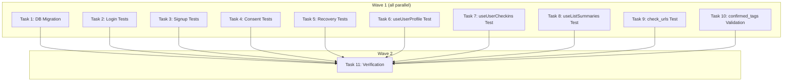

# Pre-Phase 2B Quality Gate Implementation Plan

> **For Claude:** REQUIRED SUB-SKILL: Use executing-plans to implement this plan task-by-task.

**Design Doc:** [docs/designs/2026-03-05-pre-phase2b-quality-gate-design.md](docs/designs/2026-03-05-pre-phase2b-quality-gate-design.md)

**Spec References:** [SPEC.md#9-business-rules](SPEC.md#9-business-rules) (confirmed_tags, auth wall, check-in requirements)

**PRD References:** —

**Goal:** Close all test coverage gaps and performance issues found in the pre-Phase 2B progress review.

**Architecture:** No new architecture — this is targeted gap-filling: 1 DB migration (4 indexes), 7 frontend test files, 1 backend test file, and 1 service-level validation fix for confirmed_tags.

**Tech Stack:** Supabase migrations (SQL), Vitest + Testing Library (frontend tests), pytest (backend test), Python (validation fix)

**Acceptance Criteria:**

- [ ] All 4 auth-related pages (login, signup, consent, recovery) have regression tests covering success and error paths
- [ ] All 3 profile SWR hooks have tests covering fetch, loading, and error states
- [ ] check_urls handler has a dedicated test covering valid URLs, dead URLs, and batch processing
- [ ] confirmed_tags are validated against taxonomy before writing to DB — unknown tags return 400
- [ ] DB indexes for shop_reviews, shops.processing_status, profiles.deletion_requested_at, shops.source are applied

---

### Task 1: DB Migration — Missing Indexes

**Files:**

- Create: `supabase/migrations/20260305000002_add_missing_indexes.sql`

No test needed — additive indexes, no app code changes.

**Step 1: Write the migration**

```sql
-- Performance indexes identified in pre-Phase 2B progress review (2026-03-05)

-- Prevents full-table scan when loading reviews on shop detail page
CREATE INDEX IF NOT EXISTS idx_shop_reviews_shop
  ON shop_reviews(shop_id);

-- Speeds pipeline state queries (find pending/failed shops)
CREATE INDEX IF NOT EXISTS idx_shops_processing_status
  ON shops(processing_status);

-- Speeds daily PDPA hard-delete scheduler (only scans marked profiles)
CREATE INDEX IF NOT EXISTS idx_profiles_deletion_requested
  ON profiles(deletion_requested_at)
  WHERE deletion_requested_at IS NOT NULL;

-- Speeds admin filtering and analytics by source
CREATE INDEX IF NOT EXISTS idx_shops_source
  ON shops(source);
```

**Step 2: Verify migration applies cleanly**

Run: `supabase db push` (if local Supabase is running) or verify file is syntactically valid.

**Step 3: Commit**

```bash
git add supabase/migrations/20260305000002_add_missing_indexes.sql
git commit -m "perf: add missing DB indexes for shop_reviews, shops, profiles"
```

---

### Task 2: Login Page Tests

**Files:**

- Create: `app/(auth)/login/page.test.tsx`
- Reference: `app/(auth)/login/page.tsx` (the page under test)
- Reference: `lib/test-utils/mocks.ts` (createMockSupabaseAuth, createMockRouter)
- Reference: `lib/test-utils/factories.ts` (makeSession)

**Step 1: Write the tests**

```tsx
import { render, screen, waitFor } from '@testing-library/react';
import userEvent from '@testing-library/user-event';
import { describe, it, expect, vi, beforeEach } from 'vitest';
import {
  createMockSupabaseAuth,
  createMockRouter,
} from '@/lib/test-utils/mocks';

const mockAuth = createMockSupabaseAuth();
vi.mock('@/lib/supabase/client', () => ({
  createClient: () => ({ auth: mockAuth }),
}));

const mockRouter = createMockRouter();
vi.mock('next/navigation', () => ({
  useRouter: () => mockRouter,
  useSearchParams: () => new URLSearchParams(),
}));

import LoginPage from './page';

describe('/login page', () => {
  beforeEach(() => {
    vi.clearAllMocks();
  });

  it('renders email and password inputs with a submit button', () => {
    render(<LoginPage />);
    expect(screen.getByLabelText(/email/i)).toBeInTheDocument();
    expect(screen.getByLabelText(/password/i)).toBeInTheDocument();
    expect(
      screen.getByRole('button', { name: /sign in/i })
    ).toBeInTheDocument();
  });

  it('user can log in with email and password and is redirected to home', async () => {
    mockAuth.signInWithPassword.mockResolvedValue({ error: null });
    const user = userEvent.setup();
    render(<LoginPage />);

    await user.type(screen.getByLabelText(/email/i), 'lin.mei@gmail.com');
    await user.type(screen.getByLabelText(/password/i), 'secure-pass-123');
    await user.click(screen.getByRole('button', { name: /sign in/i }));

    await waitFor(() => {
      expect(mockAuth.signInWithPassword).toHaveBeenCalledWith({
        email: 'lin.mei@gmail.com',
        password: 'secure-pass-123',
      });
      expect(mockRouter.push).toHaveBeenCalledWith('/');
    });
  });

  it('shows error message when login fails', async () => {
    mockAuth.signInWithPassword.mockResolvedValue({
      error: { message: 'Invalid login credentials' },
    });
    const user = userEvent.setup();
    render(<LoginPage />);

    await user.type(screen.getByLabelText(/email/i), 'wrong@email.com');
    await user.type(screen.getByLabelText(/password/i), 'bad-password');
    await user.click(screen.getByRole('button', { name: /sign in/i }));

    await waitFor(() => {
      expect(screen.getByRole('alert')).toHaveTextContent(
        'Invalid login credentials'
      );
    });
    expect(mockRouter.push).not.toHaveBeenCalled();
  });

  it('Google OAuth button calls signInWithOAuth with google provider', async () => {
    mockAuth.signInWithOAuth.mockResolvedValue({ error: null });
    const user = userEvent.setup();
    render(<LoginPage />);

    await user.click(
      screen.getByRole('button', { name: /continue with google/i })
    );

    expect(mockAuth.signInWithOAuth).toHaveBeenCalledWith(
      expect.objectContaining({
        provider: 'google',
      })
    );
  });

  it('LINE OAuth button calls signInWithOAuth with line_oidc provider', async () => {
    mockAuth.signInWithOAuth.mockResolvedValue({ error: null });
    const user = userEvent.setup();
    render(<LoginPage />);

    await user.click(
      screen.getByRole('button', { name: /continue with line/i })
    );

    expect(mockAuth.signInWithOAuth).toHaveBeenCalledWith(
      expect.objectContaining({
        provider: 'line_oidc',
      })
    );
  });
});
```

**Step 2: Run tests to verify they pass**

Run: `pnpm test app/(auth)/login/page.test.tsx`

**Step 3: Commit**

```bash
git add app/(auth)/login/page.test.tsx
git commit -m "test: add login page tests — email/password, OAuth buttons, error display"
```

---

### Task 3: Signup Page Tests

**Files:**

- Create: `app/(auth)/signup/page.test.tsx`
- Reference: `app/(auth)/signup/page.tsx`
- Reference: `lib/test-utils/mocks.ts`

**Step 1: Write the tests**

```tsx
import { render, screen, waitFor } from '@testing-library/react';
import userEvent from '@testing-library/user-event';
import { describe, it, expect, vi, beforeEach } from 'vitest';
import { createMockSupabaseAuth } from '@/lib/test-utils/mocks';

const mockAuth = createMockSupabaseAuth();
vi.mock('@/lib/supabase/client', () => ({
  createClient: () => ({ auth: mockAuth }),
}));

vi.mock('next/navigation', () => ({
  useSearchParams: () => new URLSearchParams(),
}));

import SignupPage from './page';

describe('/signup page', () => {
  beforeEach(() => {
    vi.clearAllMocks();
  });

  it('renders email, password, and PDPA consent checkbox', () => {
    render(<SignupPage />);
    expect(screen.getByLabelText(/email/i)).toBeInTheDocument();
    expect(screen.getByLabelText(/password/i)).toBeInTheDocument();
    expect(screen.getByLabelText(/privacy policy/i)).toBeInTheDocument();
  });

  it('submit button is disabled until PDPA checkbox is checked', () => {
    render(<SignupPage />);
    expect(screen.getByRole('button', { name: /sign up/i })).toBeDisabled();
  });

  it('user can sign up after checking PDPA consent and sees email confirmation', async () => {
    mockAuth.signUp.mockResolvedValue({ error: null });
    const user = userEvent.setup();
    render(<SignupPage />);

    await user.type(screen.getByLabelText(/email/i), 'new.user@gmail.com');
    await user.type(screen.getByLabelText(/password/i), 'strong-pass-456');
    await user.click(screen.getByLabelText(/privacy policy/i));
    await user.click(screen.getByRole('button', { name: /sign up/i }));

    await waitFor(() => {
      expect(screen.getByText(/check your email/i)).toBeInTheDocument();
      expect(screen.getByText('new.user@gmail.com')).toBeInTheDocument();
    });

    expect(mockAuth.signUp).toHaveBeenCalledWith(
      expect.objectContaining({
        email: 'new.user@gmail.com',
        password: 'strong-pass-456',
        options: expect.objectContaining({
          data: expect.objectContaining({
            pdpa_consented: true,
          }),
        }),
      })
    );
  });

  it('shows error message when signup fails', async () => {
    mockAuth.signUp.mockResolvedValue({
      error: { message: 'User already registered' },
    });
    const user = userEvent.setup();
    render(<SignupPage />);

    await user.type(screen.getByLabelText(/email/i), 'existing@gmail.com');
    await user.type(screen.getByLabelText(/password/i), 'any-password');
    await user.click(screen.getByLabelText(/privacy policy/i));
    await user.click(screen.getByRole('button', { name: /sign up/i }));

    await waitFor(() => {
      expect(screen.getByRole('alert')).toHaveTextContent(
        'User already registered'
      );
    });
  });
});
```

**Step 2: Run tests**

Run: `pnpm test app/(auth)/signup/page.test.tsx`

**Step 3: Commit**

```bash
git add app/(auth)/signup/page.test.tsx
git commit -m "test: add signup page tests — PDPA checkbox, form submit, error display"
```

---

### Task 4: PDPA Consent Page Tests

**Files:**

- Create: `app/onboarding/consent/page.test.tsx`
- Reference: `app/onboarding/consent/page.tsx`
- Reference: `lib/test-utils/mocks.ts`
- Reference: `lib/test-utils/factories.ts` (makeSession)

**Step 1: Write the tests**

```tsx
import { render, screen, waitFor } from '@testing-library/react';
import userEvent from '@testing-library/user-event';
import { describe, it, expect, vi, beforeEach } from 'vitest';
import {
  createMockSupabaseAuth,
  createMockRouter,
} from '@/lib/test-utils/mocks';
import { makeSession } from '@/lib/test-utils/factories';

const mockAuth = createMockSupabaseAuth();
vi.mock('@/lib/supabase/client', () => ({
  createClient: () => ({ auth: mockAuth }),
}));

const mockRouter = createMockRouter();
vi.mock('next/navigation', () => ({
  useRouter: () => mockRouter,
  useSearchParams: () => new URLSearchParams(),
}));

const mockFetch = vi.fn();
global.fetch = mockFetch;

const testSession = makeSession();

import ConsentPage from './page';

describe('/onboarding/consent page', () => {
  beforeEach(() => {
    vi.clearAllMocks();
    mockAuth.getSession.mockResolvedValue({ data: { session: testSession } });
    mockAuth.refreshSession.mockResolvedValue({
      data: { session: {} },
      error: null,
    });
  });

  it('renders PDPA disclosure with data collection, purpose, and rights sections', () => {
    render(<ConsentPage />);
    expect(screen.getByText(/我們收集的資料/)).toBeInTheDocument();
    expect(screen.getByText(/使用目的/)).toBeInTheDocument();
    expect(screen.getByText(/您的權利/)).toBeInTheDocument();
  });

  it('confirm button is disabled until checkbox is checked', () => {
    render(<ConsentPage />);
    expect(screen.getByRole('button', { name: /確認並繼續/ })).toBeDisabled();
  });

  it('user can agree and submit consent, then is redirected to home', async () => {
    mockFetch.mockResolvedValue({ ok: true });
    const user = userEvent.setup();
    render(<ConsentPage />);

    await user.click(screen.getByLabelText(/我已閱讀並同意/));
    await user.click(screen.getByRole('button', { name: /確認並繼續/ }));

    await waitFor(() => {
      expect(mockFetch).toHaveBeenCalledWith(
        '/api/auth/consent',
        expect.objectContaining({
          method: 'POST',
          headers: expect.objectContaining({
            Authorization: `Bearer ${testSession.access_token}`,
          }),
        })
      );
      expect(mockAuth.refreshSession).toHaveBeenCalled();
      expect(mockRouter.push).toHaveBeenCalledWith('/');
    });
  });

  it('shows error message when consent API fails', async () => {
    mockFetch.mockResolvedValue({
      ok: false,
      json: async () => ({ detail: 'Consent recording failed' }),
    });
    const user = userEvent.setup();
    render(<ConsentPage />);

    await user.click(screen.getByLabelText(/我已閱讀並同意/));
    await user.click(screen.getByRole('button', { name: /確認並繼續/ }));

    await waitFor(() => {
      expect(screen.getByRole('alert')).toHaveTextContent(
        'Consent recording failed'
      );
    });
    expect(mockRouter.push).not.toHaveBeenCalled();
  });

  it('redirects to /login when no session exists', async () => {
    mockAuth.getSession.mockResolvedValue({ data: { session: null } });
    const user = userEvent.setup();
    render(<ConsentPage />);

    await user.click(screen.getByLabelText(/我已閱讀並同意/));
    await user.click(screen.getByRole('button', { name: /確認並繼續/ }));

    await waitFor(() => {
      expect(mockRouter.push).toHaveBeenCalledWith('/login');
    });
    expect(mockFetch).not.toHaveBeenCalled();
  });
});
```

**Step 2: Run tests**

Run: `pnpm test app/onboarding/consent/page.test.tsx`

**Step 3: Commit**

```bash
git add app/onboarding/consent/page.test.tsx
git commit -m "test: add PDPA consent page tests — disclosure, checkbox, API call, error"
```

---

### Task 5: Account Recovery Page Tests

**Files:**

- Create: `app/account/recover/page.test.tsx`
- Reference: `app/account/recover/page.tsx`
- Reference: `lib/test-utils/mocks.ts`
- Reference: `lib/test-utils/factories.ts` (makeSession)

**Step 1: Write the tests**

```tsx
import { render, screen, waitFor } from '@testing-library/react';
import userEvent from '@testing-library/user-event';
import { describe, it, expect, vi, beforeEach } from 'vitest';
import {
  createMockSupabaseAuth,
  createMockRouter,
} from '@/lib/test-utils/mocks';
import { makeSession } from '@/lib/test-utils/factories';

const mockAuth = createMockSupabaseAuth();
vi.mock('@/lib/supabase/client', () => ({
  createClient: () => ({ auth: mockAuth }),
}));

const mockRouter = createMockRouter();
vi.mock('next/navigation', () => ({
  useRouter: () => mockRouter,
}));

const mockFetch = vi.fn();
global.fetch = mockFetch;

const testSession = makeSession();

import RecoverPage from './page';

describe('/account/recover page', () => {
  beforeEach(() => {
    vi.clearAllMocks();
    mockAuth.getSession.mockResolvedValue({ data: { session: testSession } });
    mockAuth.refreshSession.mockResolvedValue({
      data: { session: {} },
      error: null,
    });
  });

  it('renders account recovery info and cancel deletion button', () => {
    render(<RecoverPage />);
    expect(screen.getByText(/account recovery/i)).toBeInTheDocument();
    expect(screen.getByText(/30 days/i)).toBeInTheDocument();
    expect(
      screen.getByRole('button', { name: /cancel deletion/i })
    ).toBeInTheDocument();
  });

  it('user can cancel deletion and is redirected to home', async () => {
    mockFetch.mockResolvedValue({ ok: true });
    const user = userEvent.setup();
    render(<RecoverPage />);

    await user.click(screen.getByRole('button', { name: /cancel deletion/i }));

    await waitFor(() => {
      expect(mockFetch).toHaveBeenCalledWith(
        '/api/auth/cancel-deletion',
        expect.objectContaining({
          method: 'POST',
          headers: expect.objectContaining({
            Authorization: `Bearer ${testSession.access_token}`,
          }),
        })
      );
      expect(mockAuth.refreshSession).toHaveBeenCalled();
      expect(mockRouter.push).toHaveBeenCalledWith('/');
    });
  });

  it('shows error message when cancel-deletion API fails', async () => {
    mockFetch.mockResolvedValue({
      ok: false,
      json: async () => ({ detail: 'No deletion request found' }),
    });
    const user = userEvent.setup();
    render(<RecoverPage />);

    await user.click(screen.getByRole('button', { name: /cancel deletion/i }));

    await waitFor(() => {
      expect(screen.getByRole('alert')).toHaveTextContent(
        'No deletion request found'
      );
    });
    expect(mockRouter.push).not.toHaveBeenCalled();
  });

  it('redirects to /login when no session exists', async () => {
    mockAuth.getSession.mockResolvedValue({ data: { session: null } });
    const user = userEvent.setup();
    render(<RecoverPage />);

    await user.click(screen.getByRole('button', { name: /cancel deletion/i }));

    await waitFor(() => {
      expect(mockRouter.push).toHaveBeenCalledWith('/login');
    });
    expect(mockFetch).not.toHaveBeenCalled();
  });
});
```

**Step 2: Run tests**

Run: `pnpm test app/account/recover/page.test.tsx`

**Step 3: Commit**

```bash
git add app/account/recover/page.test.tsx
git commit -m "test: add account recovery page tests — cancel deletion, error, no session"
```

---

### Task 6: useUserProfile Hook Test

**Files:**

- Create: `lib/hooks/use-user-profile.test.ts`
- Reference: `lib/hooks/use-user-profile.ts`
- Reference: `lib/hooks/use-user-stamps.test.ts` (pattern to follow)

**Step 1: Write the tests**

```ts
import { renderHook, waitFor } from '@testing-library/react';
import { describe, it, expect, vi, beforeEach } from 'vitest';
import { SWRConfig } from 'swr';
import React from 'react';

vi.mock('@/lib/supabase/client', () => ({
  createClient: () => ({
    auth: {
      getSession: vi.fn().mockResolvedValue({
        data: { session: { access_token: 'test-token' } },
      }),
    },
  }),
}));

const mockFetch = vi.fn();
global.fetch = mockFetch;

import { useUserProfile } from './use-user-profile';

const PROFILE = {
  display_name: 'Mei-Ling',
  avatar_url: null,
  stamp_count: 5,
  checkin_count: 12,
};

function wrapper({ children }: { children: React.ReactNode }) {
  return React.createElement(
    SWRConfig,
    { value: { provider: () => new Map() } },
    children
  );
}

describe('useUserProfile', () => {
  beforeEach(() => {
    mockFetch.mockReset();
    mockFetch.mockResolvedValue({
      ok: true,
      json: async () => PROFILE,
    });
  });

  it('fetches profile data from /api/profile', async () => {
    const { result } = renderHook(() => useUserProfile(), { wrapper });
    await waitFor(() =>
      expect(result.current.profile?.display_name).toBe('Mei-Ling')
    );
    expect(result.current.profile?.stamp_count).toBe(5);
    expect(result.current.profile?.checkin_count).toBe(12);
  });

  it('returns null profile while loading', () => {
    const { result } = renderHook(() => useUserProfile(), { wrapper });
    expect(result.current.profile).toBeNull();
    expect(result.current.isLoading).toBe(true);
  });

  it('handles fetch error gracefully', async () => {
    mockFetch.mockResolvedValue({
      ok: false,
      status: 500,
      json: async () => ({ detail: 'Server error' }),
    });
    const { result } = renderHook(() => useUserProfile(), { wrapper });
    await waitFor(() => expect(result.current.isLoading).toBe(false));
    expect(result.current.error).toBeDefined();
  });
});
```

**Step 2: Run tests**

Run: `pnpm test lib/hooks/use-user-profile.test.ts`

**Step 3: Commit**

```bash
git add lib/hooks/use-user-profile.test.ts
git commit -m "test: add useUserProfile hook tests — fetch, loading, error"
```

---

### Task 7: useUserCheckins Hook Test

**Files:**

- Create: `lib/hooks/use-user-checkins.test.ts`
- Reference: `lib/hooks/use-user-checkins.ts`

**Step 1: Write the tests**

```ts
import { renderHook, waitFor } from '@testing-library/react';
import { describe, it, expect, vi, beforeEach } from 'vitest';
import { SWRConfig } from 'swr';
import React from 'react';

vi.mock('@/lib/supabase/client', () => ({
  createClient: () => ({
    auth: {
      getSession: vi.fn().mockResolvedValue({
        data: { session: { access_token: 'test-token' } },
      }),
    },
  }),
}));

const mockFetch = vi.fn();
global.fetch = mockFetch;

import { useUserCheckins } from './use-user-checkins';

const CHECKINS = [
  {
    id: 'ci-1',
    user_id: 'user-a1b2c3',
    shop_id: 'shop-d4e5f6',
    shop_name: '山小孩咖啡',
    shop_mrt: '台電大樓',
    photo_urls: ['https://example.com/photo1.jpg'],
    stars: 4,
    review_text: '很棒的工作環境',
    created_at: '2026-03-01T10:00:00Z',
  },
];

function wrapper({ children }: { children: React.ReactNode }) {
  return React.createElement(
    SWRConfig,
    { value: { provider: () => new Map() } },
    children
  );
}

describe('useUserCheckins', () => {
  beforeEach(() => {
    mockFetch.mockReset();
    mockFetch.mockResolvedValue({
      ok: true,
      json: async () => CHECKINS,
    });
  });

  it('fetches check-ins from /api/checkins', async () => {
    const { result } = renderHook(() => useUserCheckins(), { wrapper });
    await waitFor(() => expect(result.current.checkins).toHaveLength(1));
    expect(result.current.checkins[0].shop_name).toBe('山小孩咖啡');
  });

  it('returns empty array while loading', () => {
    const { result } = renderHook(() => useUserCheckins(), { wrapper });
    expect(result.current.checkins).toEqual([]);
    expect(result.current.isLoading).toBe(true);
  });

  it('returns empty array when no check-ins exist', async () => {
    mockFetch.mockResolvedValue({ ok: true, json: async () => [] });
    const { result } = renderHook(() => useUserCheckins(), { wrapper });
    await waitFor(() => expect(result.current.isLoading).toBe(false));
    expect(result.current.checkins).toEqual([]);
  });
});
```

**Step 2: Run tests**

Run: `pnpm test lib/hooks/use-user-checkins.test.ts`

**Step 3: Commit**

```bash
git add lib/hooks/use-user-checkins.test.ts
git commit -m "test: add useUserCheckins hook tests — fetch, loading, empty state"
```

---

### Task 8: useListSummaries Hook Test

**Files:**

- Create: `lib/hooks/use-list-summaries.test.ts`
- Reference: `lib/hooks/use-list-summaries.ts`

**Step 1: Write the tests**

```ts
import { renderHook, waitFor } from '@testing-library/react';
import { describe, it, expect, vi, beforeEach } from 'vitest';
import { SWRConfig } from 'swr';
import React from 'react';

vi.mock('@/lib/supabase/client', () => ({
  createClient: () => ({
    auth: {
      getSession: vi.fn().mockResolvedValue({
        data: { session: { access_token: 'test-token' } },
      }),
    },
  }),
}));

const mockFetch = vi.fn();
global.fetch = mockFetch;

import { useListSummaries } from './use-list-summaries';

const SUMMARIES = [
  {
    id: 'list-1',
    name: '適合工作的咖啡店',
    shop_count: 3,
    preview_photos: ['https://example.com/photo1.jpg'],
  },
  {
    id: 'list-2',
    name: '約會好去處',
    shop_count: 1,
    preview_photos: [],
  },
];

function wrapper({ children }: { children: React.ReactNode }) {
  return React.createElement(
    SWRConfig,
    { value: { provider: () => new Map() } },
    children
  );
}

describe('useListSummaries', () => {
  beforeEach(() => {
    mockFetch.mockReset();
    mockFetch.mockResolvedValue({
      ok: true,
      json: async () => SUMMARIES,
    });
  });

  it('fetches list summaries from /api/lists/summaries', async () => {
    const { result } = renderHook(() => useListSummaries(), { wrapper });
    await waitFor(() => expect(result.current.lists).toHaveLength(2));
    expect(result.current.lists[0].name).toBe('適合工作的咖啡店');
    expect(result.current.lists[0].shop_count).toBe(3);
  });

  it('returns empty array while loading', () => {
    const { result } = renderHook(() => useListSummaries(), { wrapper });
    expect(result.current.lists).toEqual([]);
    expect(result.current.isLoading).toBe(true);
  });

  it('returns empty array when user has no lists', async () => {
    mockFetch.mockResolvedValue({ ok: true, json: async () => [] });
    const { result } = renderHook(() => useListSummaries(), { wrapper });
    await waitFor(() => expect(result.current.isLoading).toBe(false));
    expect(result.current.lists).toEqual([]);
  });
});
```

**Step 2: Run tests**

Run: `pnpm test lib/hooks/use-list-summaries.test.ts`

**Step 3: Commit**

```bash
git add lib/hooks/use-list-summaries.test.ts
git commit -m "test: add useListSummaries hook tests — fetch, loading, empty state"
```

---

### Task 9: check_urls Handler Test

**Files:**

- Create: `backend/tests/workers/test_check_urls.py`
- Reference: `backend/workers/handlers/check_urls.py`
- Reference: `backend/tests/workers/test_handlers.py` (pattern)

**Step 1: Write the tests**

```python
"""Tests for the check_urls background URL validation handler."""

import pytest
from unittest.mock import MagicMock, AsyncMock, patch

from workers.handlers.check_urls import check_urls_for_region


@pytest.fixture
def mock_db():
    db = MagicMock()
    return db


class TestCheckUrlsForRegion:
    """Given shops in pending_url_check status, validate their URLs."""

    @pytest.mark.asyncio
    async def test_returns_zero_counts_when_no_pending_shops(self, mock_db):
        """When there are no shops to check, returns all-zero stats."""
        select_chain = MagicMock()
        select_chain.execute.return_value = MagicMock(data=[])
        mock_db.table.return_value.select.return_value.eq.return_value = select_chain

        result = await check_urls_for_region(mock_db)

        assert result == {"checked": 0, "passed": 0, "failed": 0}

    @pytest.mark.asyncio
    async def test_marks_valid_urls_as_pending_review(self, mock_db):
        """When a shop's URL returns 200, transition to pending_review."""
        shops = [
            {"id": "shop-1", "google_maps_url": "https://maps.google.com/place/123"},
        ]
        select_chain = MagicMock()
        select_chain.execute.return_value = MagicMock(data=shops)
        mock_db.table.return_value.select.return_value.eq.return_value = select_chain

        update_chain = MagicMock()
        update_chain.in_.return_value.execute.return_value = MagicMock()
        mock_db.table.return_value.update.return_value = update_chain

        mock_response = AsyncMock()
        mock_response.status_code = 200

        with patch("workers.handlers.check_urls.httpx.AsyncClient") as MockClient:
            client_instance = AsyncMock()
            client_instance.head = AsyncMock(return_value=mock_response)
            MockClient.return_value.__aenter__ = AsyncMock(return_value=client_instance)
            MockClient.return_value.__aexit__ = AsyncMock(return_value=False)

            result = await check_urls_for_region(mock_db)

        assert result["passed"] == 1
        assert result["failed"] == 0
        # Verify update was called with pending_review status
        mock_db.table.return_value.update.assert_any_call(
            {"processing_status": "pending_review"}
        )

    @pytest.mark.asyncio
    async def test_marks_dead_urls_as_filtered(self, mock_db):
        """When a shop's URL returns 404, transition to filtered_dead_url."""
        shops = [
            {"id": "shop-dead", "google_maps_url": "https://maps.google.com/place/gone"},
        ]
        select_chain = MagicMock()
        select_chain.execute.return_value = MagicMock(data=shops)
        mock_db.table.return_value.select.return_value.eq.return_value = select_chain

        update_chain = MagicMock()
        update_chain.in_.return_value.execute.return_value = MagicMock()
        mock_db.table.return_value.update.return_value = update_chain

        mock_response = AsyncMock()
        mock_response.status_code = 404

        with patch("workers.handlers.check_urls.httpx.AsyncClient") as MockClient:
            client_instance = AsyncMock()
            client_instance.head = AsyncMock(return_value=mock_response)
            MockClient.return_value.__aenter__ = AsyncMock(return_value=client_instance)
            MockClient.return_value.__aexit__ = AsyncMock(return_value=False)

            result = await check_urls_for_region(mock_db)

        assert result["failed"] == 1
        assert result["passed"] == 0
        mock_db.table.return_value.update.assert_any_call(
            {"processing_status": "filtered_dead_url"}
        )

    @pytest.mark.asyncio
    async def test_handles_timeout_as_dead_url(self, mock_db):
        """When a URL times out, treat it as a dead URL."""
        shops = [
            {"id": "shop-timeout", "google_maps_url": "https://maps.google.com/place/slow"},
        ]
        select_chain = MagicMock()
        select_chain.execute.return_value = MagicMock(data=shops)
        mock_db.table.return_value.select.return_value.eq.return_value = select_chain

        update_chain = MagicMock()
        update_chain.in_.return_value.execute.return_value = MagicMock()
        mock_db.table.return_value.update.return_value = update_chain

        import httpx

        with patch("workers.handlers.check_urls.httpx.AsyncClient") as MockClient:
            client_instance = AsyncMock()
            client_instance.head = AsyncMock(side_effect=httpx.TimeoutException("timeout"))
            MockClient.return_value.__aenter__ = AsyncMock(return_value=client_instance)
            MockClient.return_value.__aexit__ = AsyncMock(return_value=False)

            result = await check_urls_for_region(mock_db)

        assert result["failed"] == 1

    @pytest.mark.asyncio
    async def test_processes_multiple_shops_in_batch(self, mock_db):
        """Batch of shops: some pass, some fail."""
        shops = [
            {"id": "shop-ok", "google_maps_url": "https://maps.google.com/place/ok"},
            {"id": "shop-bad", "google_maps_url": "https://maps.google.com/place/bad"},
        ]
        select_chain = MagicMock()
        select_chain.execute.return_value = MagicMock(data=shops)
        mock_db.table.return_value.select.return_value.eq.return_value = select_chain

        update_chain = MagicMock()
        update_chain.in_.return_value.execute.return_value = MagicMock()
        mock_db.table.return_value.update.return_value = update_chain

        ok_response = AsyncMock()
        ok_response.status_code = 200
        bad_response = AsyncMock()
        bad_response.status_code = 404

        async def mock_head(url, **kwargs):
            if "ok" in url:
                return ok_response
            return bad_response

        with patch("workers.handlers.check_urls.httpx.AsyncClient") as MockClient:
            client_instance = AsyncMock()
            client_instance.head = AsyncMock(side_effect=mock_head)
            MockClient.return_value.__aenter__ = AsyncMock(return_value=client_instance)
            MockClient.return_value.__aexit__ = AsyncMock(return_value=False)

            result = await check_urls_for_region(mock_db)

        assert result == {"checked": 2, "passed": 1, "failed": 1}
```

**Step 2: Run tests**

Run: `cd backend && pytest tests/workers/test_check_urls.py -v`

**Step 3: Commit**

```bash
git add backend/tests/workers/test_check_urls.py
git commit -m "test: add check_urls handler tests — valid, dead, timeout, batch"
```

---

### Task 10: Validate confirmed_tags Against Taxonomy

**Files:**

- Modify: `backend/services/checkin_service.py` (add validation method + call it)
- Modify: `backend/tests/services/test_checkin_service.py` (add test cases)

**Step 1: Write failing tests**

Add these test cases to `backend/tests/services/test_checkin_service.py`:

```python
class TestConfirmedTagsValidation:
    """Confirmed tags must exist in taxonomy_tags table."""

    @pytest.mark.asyncio
    async def test_create_rejects_unknown_tags(self, mock_supabase, checkin_service):
        """When a user submits tag IDs not in taxonomy, return ValueError."""
        # Mock taxonomy lookup — only "quiet" and "wifi" exist
        taxonomy_table = MagicMock()
        taxonomy_table.select.return_value.in_.return_value.execute.return_value = (
            MagicMock(data=[{"id": "quiet"}, {"id": "wifi"}])
        )

        count_table = MagicMock()
        count_table.select.return_value.eq.return_value.eq.return_value.execute.return_value = (
            MagicMock(count=0)
        )

        mock_supabase.table.side_effect = lambda name: {
            "taxonomy_tags": taxonomy_table,
            "check_ins": count_table,
        }[name]

        with pytest.raises(ValueError, match="Unknown tag IDs"):
            await checkin_service.create(
                user_id="user-1",
                shop_id="shop-1",
                photo_urls=["https://example.com/photo.jpg"],
                stars=4,
                confirmed_tags=["quiet", "wifi", "fake_tag"],
            )

    @pytest.mark.asyncio
    async def test_create_accepts_valid_tags(self, mock_supabase, checkin_service):
        """When all tag IDs exist in taxonomy, check-in succeeds."""
        taxonomy_table = MagicMock()
        taxonomy_table.select.return_value.in_.return_value.execute.return_value = (
            MagicMock(data=[{"id": "quiet"}, {"id": "wifi"}])
        )

        count_table = MagicMock()
        count_table.select.return_value.eq.return_value.eq.return_value.execute.return_value = (
            MagicMock(count=0)
        )

        insert_table = MagicMock()
        insert_table.insert.return_value.execute.return_value = MagicMock(
            data=[{
                "id": "ci-new",
                "user_id": "user-1",
                "shop_id": "shop-1",
                "photo_urls": ["https://example.com/photo.jpg"],
                "menu_photo_url": None,
                "note": None,
                "stars": 4,
                "review_text": None,
                "confirmed_tags": ["quiet", "wifi"],
                "reviewed_at": "2026-03-05T00:00:00Z",
                "created_at": "2026-03-05T00:00:00Z",
            }]
        )

        call_count = 0
        def table_router(name):
            nonlocal call_count
            if name == "taxonomy_tags":
                return taxonomy_table
            # check_ins called twice: first for count, then for insert
            call_count += 1
            if call_count == 1:
                return count_table
            return insert_table

        mock_supabase.table.side_effect = table_router

        result = await checkin_service.create(
            user_id="user-1",
            shop_id="shop-1",
            photo_urls=["https://example.com/photo.jpg"],
            stars=4,
            confirmed_tags=["quiet", "wifi"],
        )
        assert result.id == "ci-new"

    @pytest.mark.asyncio
    async def test_create_skips_validation_when_no_tags(self, mock_supabase, checkin_service):
        """When confirmed_tags is None, skip taxonomy validation entirely."""
        count_table = MagicMock()
        count_table.select.return_value.eq.return_value.eq.return_value.execute.return_value = (
            MagicMock(count=0)
        )

        insert_table = MagicMock()
        insert_table.insert.return_value.execute.return_value = MagicMock(
            data=[{
                "id": "ci-no-tags",
                "user_id": "user-1",
                "shop_id": "shop-1",
                "photo_urls": ["https://example.com/photo.jpg"],
                "menu_photo_url": None,
                "note": None,
                "stars": None,
                "review_text": None,
                "confirmed_tags": None,
                "reviewed_at": None,
                "created_at": "2026-03-05T00:00:00Z",
            }]
        )

        mock_supabase.table.side_effect = [count_table, insert_table]

        result = await checkin_service.create(
            user_id="user-1",
            shop_id="shop-1",
            photo_urls=["https://example.com/photo.jpg"],
            confirmed_tags=None,
        )
        assert result.id == "ci-no-tags"
        # taxonomy_tags table should NOT have been queried
        table_calls = [c[0][0] for c in mock_supabase.table.call_args_list]
        assert "taxonomy_tags" not in table_calls
```

**Step 2: Run tests to verify they fail**

Run: `cd backend && pytest tests/services/test_checkin_service.py::TestConfirmedTagsValidation -v`
Expected: FAIL — no validation exists yet.

**Step 3: Implement the validation**

Add to `backend/services/checkin_service.py`:

```python
# Add this method to the CheckInService class, before the create method:

async def _validate_confirmed_tags(self, tags: list[str]) -> None:
    """Validate that all confirmed_tags exist in taxonomy_tags table."""
    if not tags:
        return
    response = await asyncio.to_thread(
        lambda: (
            self._db.table("taxonomy_tags")
            .select("id")
            .in_("id", tags)
            .execute()
        )
    )
    found_ids = {row["id"] for row in (response.data or [])}
    unknown = set(tags) - found_ids
    if unknown:
        raise ValueError(f"Unknown tag IDs: {sorted(unknown)}")
```

Then add calls in `create()` (after the existing validation block, before the count query):

```python
if confirmed_tags:
    await self._validate_confirmed_tags(confirmed_tags)
```

And in `update_review()` (after `_validate_stars`, before the update query):

```python
if confirmed_tags:
    await self._validate_confirmed_tags(confirmed_tags)
```

**Step 4: Run tests to verify they pass**

Run: `cd backend && pytest tests/services/test_checkin_service.py -v`
Expected: ALL PASS (existing + new tests).

**Step 5: Run ruff + mypy**

Run: `cd backend && ruff check services/checkin_service.py && mypy services/checkin_service.py`

**Step 6: Commit**

```bash
git add backend/services/checkin_service.py backend/tests/services/test_checkin_service.py
git commit -m "feat: validate confirmed_tags against taxonomy — reject unknown tag IDs with 400"
```

---

### Task 11: Full Verification

**Step 1: Run all backend tests**

Run: `cd backend && pytest -v`
Expected: ALL PASS

**Step 2: Run backend linters**

Run: `cd backend && ruff check . && mypy .`
Expected: No errors

**Step 3: Run all frontend tests**

Run: `pnpm test`
Expected: ALL PASS

**Step 4: Run frontend build**

Run: `pnpm build`
Expected: Build succeeds

**Step 5: Final commit (if any formatting changes)**

```bash
git add -A && git commit -m "chore: verification — all tests, lint, type-check, build pass"
```

---

## Execution Waves



**Wave 1** (all parallel — no file dependencies between any tasks):

- Task 1: DB Migration
- Task 2: Login page tests
- Task 3: Signup page tests
- Task 4: Consent page tests
- Task 5: Recovery page tests
- Task 6: useUserProfile hook test
- Task 7: useUserCheckins hook test
- Task 8: useListSummaries hook test
- Task 9: check_urls handler test
- Task 10: confirmed_tags validation (touches `checkin_service.py` + its test)

**Wave 2** (depends on all Wave 1 tasks):

- Task 11: Full verification

---

## TODO.md Mapping

The tasks in this plan correspond to the "Quality Gate: Pre-Phase 2B" section already in TODO.md. No additional TODO updates needed.
