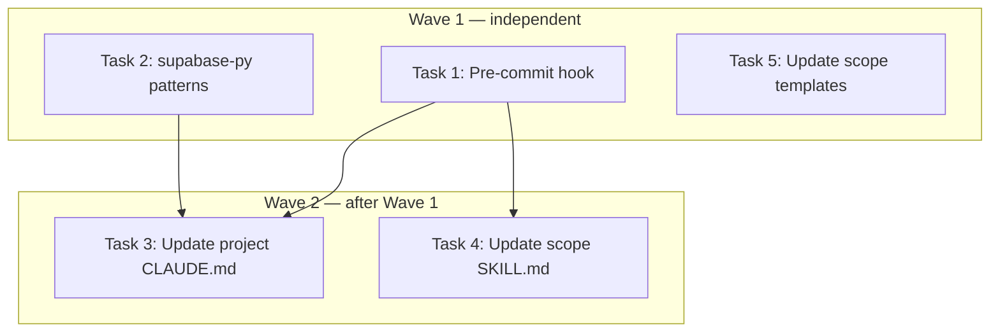

# Layered Defense Against Incorrect First Attempts — Implementation Plan

> **For Claude:** REQUIRED SUB-SKILL: Use executing-plans to implement this plan task-by-task.

**Design Doc:** [docs/designs/2026-03-12-incorrect-first-attempts-prevention-design.md](docs/designs/2026-03-12-incorrect-first-attempts-prevention-design.md)

**Spec References:** —

**PRD References:** —

**Goal:** Add automated enforcement (pre-commit hooks, pattern docs, /scope scaffolding) to catch incorrect-first-attempt mistakes before they reach the user.

**Architecture:** Three-layer system: (1) per-project pre-commit hooks block bad commits in real-time, (2) a supabase-py pattern doc prevents API misuse before it happens, (3) /scope skill updates ensure every new project gets these guardrails automatically.

**Tech Stack:** Bash (pre-commit hooks), Markdown (pattern docs), /scope skill templates

**Acceptance Criteria:**

- [ ] A commit attempted from `main` branch is blocked with a clear error and worktree instructions
- [ ] A commit containing `.data[0]` anywhere in staged Python or TypeScript diffs is blocked
- [ ] A commit containing supabase/DB calls inside `app/api/` routes is blocked with a clear error
- [ ] `docs/patterns/supabase-py.md` exists with correct API usage examples matching actual codebase patterns
- [ ] Project CLAUDE.md has a pre-flight checklist and file ownership table that Claude can reference
- [ ] New projects scaffolded by `/scope` automatically get the pre-commit hook and `docs/patterns/README.md`

---

> **Context for executor:** The following tasks have already been completed in a prior session:
>
> - `~/.claude/CLAUDE.md` — pre-flight checks + file ownership sections added
> - `~/.claude/projects/.../memory/feedback_branch_discipline.md` — created
> - `~/.claude/projects/.../memory/feedback_supabase_patterns.md` — created
> - Design doc committed to `docs/designs/`
>
> The remaining work is Tasks 1–5 below.

---

### Task 1: Upgrade the pre-commit hook

**Files:**

- Modify: `.git/hooks/pre-commit` (currently: `cd "$(git rev-parse --show-toplevel)" && pnpm exec lint-staged`)

**No test file needed** — the hook IS the implementation. We test it by running the hook against known-bad staged content, then cleaning up.

**Step 1: Read the current hook**

```bash
cat .git/hooks/pre-commit
```

Expected output:

```sh
#!/bin/sh
cd "$(git rev-parse --show-toplevel)" && pnpm exec lint-staged
```

**Step 2: Write the updated hook**

Replace the entire file:

```sh
#!/bin/sh
set -e

root="$(git rev-parse --show-toplevel)"
cd "$root"

# ── Guard 1: Block commits directly to main ──────────────────────────────────
branch=$(git branch --show-current)
if [ "$branch" = "main" ] || [ "$branch" = "master" ]; then
  echo ""
  echo "ERROR: Direct commits to main are not allowed."
  echo ""
  echo "Create a worktree:"
  echo "  git worktree add .worktrees/<branch-name> -b <branch-name>"
  echo "  ln -s \$(pwd)/.env.local .worktrees/<branch-name>/.env.local"
  echo "  ln -s \$(pwd)/backend/.env .worktrees/<branch-name>/backend/.env"
  echo ""
  exit 1
fi

# ── Guard 2: Block unsafe .data[0] access ─────────────────────────────────────
if git diff --cached | grep -E '^\+.*\.data\[0\]' > /dev/null 2>&1; then
  echo ""
  echo "ERROR: Unsafe .data[0] access detected in staged changes."
  echo ""
  echo "Use the first() helper instead:"
  echo "  from core.db import first"
  echo "  result = first(response.data, \"<context>\")"
  echo ""
  echo "See: CLAUDE.md → Code Quality"
  echo ""
  exit 1
fi

# ── Guard 3: Block business logic in HTTP proxy layer ─────────────────────────
proxy_files=$(git diff --cached --name-only | grep '^app/api/' || true)
if [ -n "$proxy_files" ]; then
  if git diff --cached -- 'app/api/' | grep -E '^\+.*(\.from\(|supabase\.|createClient|SELECT|INSERT|UPDATE|DELETE)' > /dev/null 2>&1; then
    echo ""
    echo "ERROR: Possible business logic detected in API proxy layer."
    echo ""
    echo "Files changed: $proxy_files"
    echo ""
    echo "app/api/ routes are thin HTTP proxies only."
    echo "Move DB queries and business logic to backend/services/."
    echo ""
    echo "See: CLAUDE.md → File Ownership"
    echo ""
    exit 1
  fi
fi

# ── Run lint-staged ───────────────────────────────────────────────────────────
pnpm exec lint-staged
```

**Step 3: Verify the hook is executable**

```bash
ls -la .git/hooks/pre-commit
```

Expected: file should have `-rwxr-xr-x` permissions. If not:

```bash
chmod +x .git/hooks/pre-commit
```

**Step 4: Test — branch guard blocks commit on main**

Only run this if you are currently on the `main` branch. Check first:

```bash
git branch --show-current
```

If on `main`:

```bash
# Create a harmless temp file and stage it
echo "test" > /tmp/hook-test-branch.txt
cp /tmp/hook-test-branch.txt /tmp/hook-test-branch.copy.txt
# Run the hook directly (safer than full git commit)
sh .git/hooks/pre-commit
```

Expected: exits with non-zero and prints "ERROR: Direct commits to main are not allowed."

**Step 5: Test — .data[0] guard blocks bad Python**

```bash
# Create a temp python file with the anti-pattern
echo 'result = response.data[0]' > /tmp/hook-test-data.py
cp /tmp/hook-test-data.py docs/hook-test-temp.py
git add docs/hook-test-temp.py
sh .git/hooks/pre-commit
```

Expected: exits with non-zero and prints "ERROR: Unsafe .data[0] access detected"

Clean up:

```bash
git restore --staged docs/hook-test-temp.py
rm docs/hook-test-temp.py
```

**Step 6: Test — clean commit passes all guards**

Run on a feature branch (not main) with a clean, valid staged file:

```bash
# Stage a harmless file change
echo "" >> docs/designs/2026-03-12-incorrect-first-attempts-prevention-design.md
git add docs/designs/2026-03-12-incorrect-first-attempts-prevention-design.md
sh .git/hooks/pre-commit
```

Expected: lint-staged runs (may pass or report no changes) — no guard errors.

Clean up:

```bash
git restore docs/designs/2026-03-12-incorrect-first-attempts-prevention-design.md
git restore --staged docs/designs/2026-03-12-incorrect-first-attempts-prevention-design.md
```

**Step 7: Commit the hook** — note: `.git/hooks/` is not tracked by git by default. Instead, create a tracked copy:

```bash
mkdir -p scripts/hooks
cp .git/hooks/pre-commit scripts/hooks/pre-commit
git add scripts/hooks/pre-commit
git commit -m "feat: add pre-commit guards for branch, .data[0], and proxy layer"
```

Add a note in the README or CLAUDE.md that `scripts/hooks/pre-commit` should be installed on fresh clones:

```bash
# Install hooks on fresh clone
cp scripts/hooks/pre-commit .git/hooks/pre-commit && chmod +x .git/hooks/pre-commit
```

---

### Task 2: Create supabase-py pattern doc

**Files:**

- Create: `docs/patterns/supabase-py.md`
- Create: `docs/patterns/README.md`

**No test needed** — documentation only. Verify visually that examples match real codebase usage.

**Step 1: Confirm existing patterns in codebase**

Before writing the doc, read a few real usages to ensure accuracy:

```bash
grep -n "\.table\|\.select\|\.insert\|\.update\|\.upsert\|\.delete\|first(" \
  backend/api/auth.py backend/importers/cafe_nomad.py \
  backend/importers/google_takeout.py | head -40
```

**Step 2: Create `docs/patterns/README.md`**

```markdown
# API Patterns

Project-specific usage patterns for external libraries and SDKs.
Claude should check this directory before writing any code that uses these libraries.

## Index

| Library              | Pattern doc                      | Last updated |
| -------------------- | -------------------------------- | ------------ |
| supabase-py (Python) | [supabase-py.md](supabase-py.md) | 2026-03-12   |
```

**Step 3: Create `docs/patterns/supabase-py.md`**

````markdown
# supabase-py Patterns — CafeRoam

**Read this before writing any supabase-py code.**

supabase-py's API is non-obvious. Method chaining order matters.
These are the correct patterns for this codebase.

---

## Imports

```python
from supabase import AsyncClient  # async client used via FastAPI Depends
from core.db import first          # ALWAYS use this — never .data[0]
```
````

---

## Querying rows

### Select multiple rows

```python
response = await db.table("shops").select("id, name, city").execute()
rows: list[dict] = response.data or []   # safe — .data can be empty list
```

### Select with filters

```python
response = (
    await db.table("shops")
    .select("id, name")
    .eq("city", "Taipei")
    .limit(50)
    .execute()
)
rows = response.data or []
```

### Select with negation filter

```python
response = (
    await db.table("shops")
    .select("cafenomad_id")
    .not_.is_("cafenomad_id", "null")
    .execute()
)
```

### Get exactly one row (raises if 0 or >1)

```python
# Correct — use first() from core.db
response = await db.table("shops").select("*").eq("id", shop_id).execute()
shop = first(response.data, "fetch shop by id")   # raises RuntimeError if empty
```

### NEVER do this

```python
# WRONG — crashes on empty result with opaque IndexError
shop = response.data[0]

# WRONG — single() raises PostgREST error on 0 or >1 rows
response = await db.table("shops").select("*").eq("id", shop_id).single().execute()
```

---

## Inserting rows

### Insert one row and return it

```python
response = (
    await db.table("shops")
    .insert({"name": "Café X", "city": "Taipei"})
    .execute()
)
new_shop = first(response.data, "insert shop")
```

### Bulk insert (upsert)

```python
response = (
    await db.table("shops")
    .upsert(rows, on_conflict="external_id")
    .execute()
)
inserted = response.data or []
```

---

## Updating rows

### Update and return updated row

```python
response = (
    await db.table("shops")
    .update({"verified": True})
    .eq("id", shop_id)
    .execute()
)
updated = first(response.data, "update shop verification")
```

### Update without needing return value

```python
await db.table("shops").update({"synced_at": now}).eq("id", shop_id).execute()
# response.data may be empty — that's fine if you don't need the row back
```

---

## Checking existence (not fetching)

```python
response = await db.table("shops").select("id").eq("external_id", ext_id).execute()
exists = bool(response.data)   # True if any rows, False if empty
```

---

## Chaining order rules

supabase-py chains are **builder pattern** — order follows this sequence:

```
.table(name)
  → .select() / .insert() / .update() / .upsert() / .delete()
  → filter methods: .eq(), .neq(), .in_(), .not_.is_(), .ilike(), .limit(), .order()
  → .execute()
```

Filters come AFTER the operation. `.select("*").eq(...)` — not `.eq(...).select("*")`.

---

## Error handling

```python
response = await db.table("shops").select("*").eq("id", shop_id).execute()

# Check .data existence before accessing
if not response.data:
    raise HTTPException(status_code=404, detail="Shop not found")

shop = first(response.data, "fetch shop")
```

---

## first() helper

Defined in `backend/core/db.py`. Import it everywhere:

```python
from core.db import first

# Signature:
def first(rows: list[T], context: str = "query") -> T:
    # Raises RuntimeError with context string if list is empty
    # Use context to make error messages debuggable
```

When NOT to use `first()`: when empty results are expected (use `response.data or []` instead).

````

**Step 4: Commit**

```bash
git add docs/patterns/
git commit -m "docs: add supabase-py pattern reference for correct API usage"
````

---

### Task 3: Update project CLAUDE.md

**Files:**

- Modify: `CLAUDE.md`

**No test needed** — documentation only.

**Step 1: Add pre-flight checks section after Commands**

Insert after the `## Commands` section (after the `ERROR-PREVENTION.md` reference line):

````markdown
## Pre-Flight Checks (Before Writing Code)

1. **Branch check**: Run `git branch --show-current`. If on `main`, create a worktree first:
   ```bash
   git worktree add .worktrees/<branch-name> -b <branch-name>
   ln -s $(pwd)/.env.local .worktrees/<branch-name>/.env.local
   ln -s $(pwd)/backend/.env .worktrees/<branch-name>/backend/.env
   ```
````

2. **API patterns**: For supabase-py code, read [`docs/patterns/supabase-py.md`](docs/patterns/supabase-py.md) first.
3. **Environment**: For DB/env-dependent work, run `make doctor` first.

````

**Step 2: Add file ownership table to Coding Standards**

Insert at the end of the `## Coding Standards` section (after the Performance Standards block, before `---`):

```markdown
### File Ownership

| Path | Allowed | Not allowed |
|------|---------|-------------|
| `app/api/**` | HTTP proxy only — forward request to `backend/` | Business logic, DB queries, validation |
| `backend/services/` | All business logic | Direct provider SDK calls |
| `backend/providers/` | External SDK adapters | Business logic |
| `src/components/` | Rendering, event handlers | Direct API calls (use hooks in `src/hooks/`) |
| `src/hooks/` | Data fetching, state management | UI rendering logic |
````

**Step 3: Commit**

```bash
git add CLAUDE.md
git commit -m "docs: add pre-flight checklist and file ownership table to CLAUDE.md"
```

---

### Task 4: Update /scope SKILL.md to scaffold pre-commit hook + pattern docs

**Files:**

- Modify: `~/.claude/skills/scope/SKILL.md`

**No test needed** — skill file update. Verify visually that the new steps are present.

**Step 1: Read Step 5 (Project Initialization) of SKILL.md**

```bash
grep -n "Step 5\|Project Initialization\|git init\|gitignore\|chmod\|hooks" \
  ~/.claude/skills/scope/SKILL.md
```

**Step 2: Add hook scaffolding to Step 5**

In the `## Step 5: Project Initialization` section, after step 4 (Create README.md), add a new step 4.5:

````markdown
4.5. **Install pre-commit hook** — create `scripts/hooks/pre-commit` with the standard guards, then install it:

```bash
mkdir -p scripts/hooks
```
````

Write `scripts/hooks/pre-commit`:

```sh
#!/bin/sh
set -e

root="$(git rev-parse --show-toplevel)"
cd "$root"

# Guard 1: Block commits directly to main
branch=$(git branch --show-current)
if [ "$branch" = "main" ] || [ "$branch" = "master" ]; then
  echo ""
  echo "ERROR: Direct commits to main are not allowed."
  echo "Create a worktree: git worktree add .worktrees/<branch> -b <branch>"
  echo ""
  exit 1
fi

# Guard 2: Block unsafe .data[0] access
if git diff --cached | grep -E '^\+.*\.data\[0\]' > /dev/null 2>&1; then
  echo ""
  echo "ERROR: Unsafe .data[0] access in staged changes."
  echo "Use the project's first() helper instead of .data[0]."
  echo ""
  exit 1
fi

# Guard 3: Block business logic in HTTP proxy layer (adapt path to project)
proxy_files=$(git diff --cached --name-only | grep '^app/api/' || true)
if [ -n "$proxy_files" ]; then
  if git diff --cached -- 'app/api/' | grep -E '^\+.*(\.from\(|supabase\.|createClient|SELECT|INSERT|UPDATE|DELETE)' > /dev/null 2>&1; then
    echo ""
    echo "ERROR: Business logic detected in HTTP proxy layer (app/api/)."
    echo "Move DB/service logic to the service layer."
    echo ""
    exit 1
  fi
fi

# Run lint-staged (adapt to project's package manager: npm/pnpm/yarn)
# pnpm exec lint-staged
# npm exec lint-staged
```

Then install and make executable:

```bash
cp scripts/hooks/pre-commit .git/hooks/pre-commit
chmod +x .git/hooks/pre-commit
```

Add a hook install note to README.md or CLAUDE.md Commands section:

```bash
# After cloning, install git hooks:
cp scripts/hooks/pre-commit .git/hooks/pre-commit && chmod +x .git/hooks/pre-commit
```

**Note for executor:** The Guard 3 proxy path (`app/api/`) and the lint-staged runner line must be adapted to the actual project structure. Uncomment the right package manager line.

4.6. **Create docs/patterns/ directory** — create `docs/patterns/README.md`:

```markdown
# API Patterns

Project-specific usage patterns for external libraries and SDKs.
Check this directory before writing code that uses these libraries.

## Index

_(Add entries here as incidents occur — one doc per library/SDK)_
```

````

**Step 3: Verify the added content reads naturally**

```bash
grep -A5 "4.5\|4.6\|pre-commit\|patterns" ~/.claude/skills/scope/SKILL.md | head -30
````

**Step 4: No commit needed** — skill files are in `~/.claude/` which is not a git repo tracked here.

---

### Task 5: Update /scope CLAUDE.md templates with pre-flight + file ownership

**Files:**

- Modify: `~/.claude/skills/scope/templates/CLAUDE-business.md`
- Modify: `~/.claude/skills/scope/templates/CLAUDE-quicktool.md`

**No test needed** — template updates. These take effect when the next project is scaffolded.

**Step 1: Add pre-flight + file ownership to CLAUDE-business.md**

Append to the end of `~/.claude/skills/scope/templates/CLAUDE-business.md`:

```markdown
---

## Pre-Flight Checks (Before Writing Code)

1. **Branch check**: Run `git branch --show-current`. If on `main`, create a worktree first.
2. **API patterns**: For external SDK code, check `docs/patterns/` for project-specific usage patterns.
3. **Environment**: For DB/env-dependent work, run the project's doctor/health-check script first.

## File Ownership (Before Editing Any File)

| Path                     | Allowed                         | Not allowed                            |
| ------------------------ | ------------------------------- | -------------------------------------- |
| HTTP proxy/gateway layer | HTTP wiring, request forwarding | Business logic, DB queries, validation |
| Service layer            | All business logic              | Direct external SDK calls              |
| Provider/adapter layer   | External SDK adapters           | Business logic                         |
| UI components            | Rendering, event handlers       | Direct API calls (use hooks/services)  |

> Populate this table with the actual paths for this project during /scope.
```

**Step 2: Add the same sections to CLAUDE-quicktool.md**

Append to the end of `~/.claude/skills/scope/templates/CLAUDE-quicktool.md`:

```markdown
---

## Pre-Flight Checks (Before Writing Code)

1. **Branch check**: Verify you're NOT on `main` before committing.
2. **API patterns**: Check `docs/patterns/` before writing SDK/library code.

## File Ownership

> Add project-specific file ownership rules here during /scope.
```

**Step 3: No commit needed** — skill files live in `~/.claude/`.

---

## Execution Waves



**Wave 1** (parallel — no dependencies):

- Task 1: Pre-commit hook
- Task 2: supabase-py patterns doc
- Task 5: Update /scope templates

**Wave 2** (parallel — informed by Wave 1):

- Task 3: Update project CLAUDE.md (links to supabase-py.md from Task 2)
- Task 4: Update /scope SKILL.md (knows what hook to scaffold from Task 1)

---

## TODO.md

After completing all tasks, update `TODO.md` with the following under a new section:

```markdown
### Incorrect-First-Attempts Prevention

> **Design:** [docs/designs/2026-03-12-incorrect-first-attempts-prevention-design.md](docs/designs/2026-03-12-incorrect-first-attempts-prevention-design.md)
> **Plan:** [docs/plans/2026-03-12-incorrect-first-attempts-prevention-plan.md](docs/plans/2026-03-12-incorrect-first-attempts-prevention-plan.md)

- [x] Global CLAUDE.md — pre-flight checks + file ownership (done in brainstorming session)
- [x] Feedback memories — branch discipline + supabase patterns (done in brainstorming session)
- [ ] Pre-commit hook — branch guard + .data[0] + proxy layer checks (Task 1)
- [ ] docs/patterns/supabase-py.md (Task 2)
- [ ] Project CLAUDE.md — pre-flight + file ownership table (Task 3)
- [ ] /scope SKILL.md — scaffold pre-commit + docs/patterns/ (Task 4)
- [ ] /scope templates — pre-flight + ownership sections (Task 5)
```
