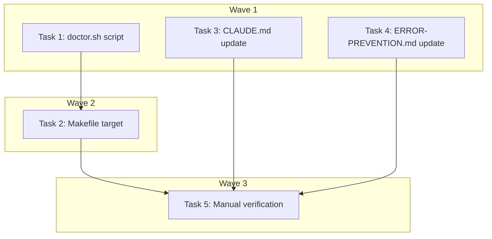

# Preflight Doctor Implementation Plan

> **For Claude:** REQUIRED SUB-SKILL: Use executing-plans to implement this plan task-by-task.

**Design Doc:** [docs/designs/2026-03-12-preflight-doctor-design.md](../designs/2026-03-12-preflight-doctor-design.md)

**Spec References:** —

**PRD References:** —

**Goal:** Create a `make doctor` preflight check that validates the full local dev environment in ~5 seconds, preventing Claude from wasting cycles debugging env issues.

**Architecture:** A single Bash script (`scripts/doctor.sh`) runs 12 diagnostic checks across infrastructure, env files, dependencies, and data state. A `check` helper function standardizes pass/fail output. The Makefile gets a `doctor` target. CLAUDE.md and ERROR-PREVENTION.md get updated with preflight rules.

**Tech Stack:** Bash, curl, grep, Make

**Acceptance Criteria:**
- [ ] Running `make doctor` on a healthy environment shows all 12 checks passing with exit code 0
- [ ] Running `make doctor` with Supabase stopped shows a clear failure with the exact fix command
- [ ] Running `make doctor` with `.env.local` pointing to a remote URL shows a clear "points to remote" warning
- [ ] CLAUDE.md contains the preflight rule so future Claude sessions know to run it

---

### Task 1: Create `scripts/doctor.sh` — Infrastructure Checks

**Files:**
- Create: `scripts/doctor.sh`

**No test needed** — this is a shell diagnostic script, not application code. Verified manually via acceptance criteria.

**Step 1: Create the script with infrastructure checks (Docker, Supabase DB, Supabase Auth)**

```bash
#!/usr/bin/env bash
# CafeRoam Doctor — Local environment preflight check
#
# Usage: make doctor (or bash scripts/doctor.sh)
#
# HOW TO ADD A NEW CHECK:
#   1. Call the `check` function with three arguments:
#      check "Description" "command_that_returns_0_on_success" "Fix: what to run"
#   2. The command runs silently — only exit code matters (0 = pass, non-zero = fail)
#   3. Add checks in the appropriate group (Infrastructure / Env Files / Dependencies / Data)
#   4. Update the CLAUDE.md extensibility note if the check covers a new service category

set -euo pipefail

PASS=0
FAIL=0
TOTAL=0

# Colors (disabled if not a terminal)
if [ -t 1 ]; then
  GREEN='\033[0;32m'
  RED='\033[0;31m'
  YELLOW='\033[0;33m'
  BOLD='\033[1m'
  NC='\033[0m'
else
  GREEN=''
  RED=''
  YELLOW=''
  BOLD=''
  NC=''
fi

check() {
  local description="$1"
  local command="$2"
  local fix_hint="$3"
  TOTAL=$((TOTAL + 1))

  if eval "$command" > /dev/null 2>&1; then
    printf "${GREEN}[PASS]${NC} %s\n" "$description"
    PASS=$((PASS + 1))
  else
    printf "${RED}[FAIL]${NC} %s\n" "$description"
    printf "       ${YELLOW}Fix: %s${NC}\n" "$fix_hint"
    FAIL=$((FAIL + 1))
  fi
}

check_env_var_localhost() {
  local file="$1"
  local var_name="$2"
  local description="$3"
  TOTAL=$((TOTAL + 1))

  if [ ! -f "$file" ]; then
    printf "${RED}[FAIL]${NC} %s\n" "$description"
    printf "       ${YELLOW}Fix: File %s does not exist${NC}\n" "$file"
    FAIL=$((FAIL + 1))
    return
  fi

  local value
  value=$(grep "^${var_name}=" "$file" 2>/dev/null | head -1 | cut -d'=' -f2-)

  if echo "$value" | grep -qE '(127\.0\.0\.1|localhost)'; then
    printf "${GREEN}[PASS]${NC} %s\n" "$description"
    PASS=$((PASS + 1))
  else
    printf "${RED}[FAIL]${NC} %s\n" "$description"
    printf "       ${YELLOW}Fix: Update %s in %s to http://127.0.0.1:54321${NC}\n" "$var_name" "$file"
    FAIL=$((FAIL + 1))
  fi
}

# ─── Find project root (where Makefile lives) ────────────────────────────────
PROJECT_ROOT="$(cd "$(dirname "${BASH_SOURCE[0]}")/.." && pwd)"

printf "\n${BOLD}CafeRoam Doctor${NC}\n"
printf "────────────────────────────────\n\n"

# ─── Infrastructure ───────────────────────────────────────────────────────────
printf "${BOLD}Infrastructure${NC}\n"
check "Docker running" \
  "docker info" \
  "Start Docker Desktop"

check "Supabase DB healthy (127.0.0.1:54321)" \
  "curl -sf http://127.0.0.1:54321/rest/v1/ -H 'apikey: placeholder' -o /dev/null -w '%{http_code}' | grep -q '.' " \
  "Run: supabase start"

check "Supabase Auth healthy" \
  "curl -sf http://127.0.0.1:54321/auth/v1/health" \
  "Run: supabase stop && supabase start"

printf "\n"

# ─── Env Files ────────────────────────────────────────────────────────────────
printf "${BOLD}Env Files${NC}\n"
check ".env.local exists" \
  "test -f ${PROJECT_ROOT}/.env.local" \
  "Copy from .env.example: cp .env.example .env.local"

check_env_var_localhost "${PROJECT_ROOT}/.env.local" "NEXT_PUBLIC_SUPABASE_URL" \
  ".env.local SUPABASE_URL points to localhost"

check "backend/.env exists" \
  "test -f ${PROJECT_ROOT}/backend/.env" \
  "Create backend/.env with SUPABASE_URL=http://127.0.0.1:54321"

check_env_var_localhost "${PROJECT_ROOT}/backend/.env" "SUPABASE_URL" \
  "backend/.env SUPABASE_URL points to localhost"

printf "\n"

# ─── Dependencies ─────────────────────────────────────────────────────────────
printf "${BOLD}Dependencies${NC}\n"
check "Python 3.12+" \
  "python3 -c 'import sys; exit(0 if sys.version_info >= (3, 12) else 1)'" \
  "Install Python 3.12+: brew install python@3.12 (or pyenv install 3.12)"

check "uv installed" \
  "command -v uv" \
  "Install uv: curl -LsSf https://astral.sh/uv/install.sh | sh"

check "Backend deps synced" \
  "cd ${PROJECT_ROOT}/backend && uv sync --frozen 2>&1 | grep -qv 'error'" \
  "Run: cd backend && uv sync"

check "pnpm deps installed" \
  "cd ${PROJECT_ROOT} && pnpm ls --depth 0" \
  "Run: pnpm install"

printf "\n"

# ─── Data ─────────────────────────────────────────────────────────────────────
printf "${BOLD}Data${NC}\n"
check "Migrations in sync" \
  "cd ${PROJECT_ROOT} && test -z \"\$(supabase db diff 2>/dev/null)\"" \
  "Run: supabase db push"

# ─── Summary ──────────────────────────────────────────────────────────────────
printf "\n────────────────────────────────\n"
if [ "$FAIL" -eq 0 ]; then
  printf "${GREEN}${BOLD}Result: All %d checks passed${NC}\n\n" "$TOTAL"
  exit 0
else
  printf "${RED}${BOLD}Result: %d/%d checks passed (%d failed)${NC}\n" "$PASS" "$TOTAL" "$FAIL"
  printf "Fix the issues above before proceeding.\n\n"
  exit 1
fi
```

**Step 2: Make it executable**

Run: `chmod +x scripts/doctor.sh`

**Step 3: Verify it runs**

Run: `bash scripts/doctor.sh`
Expected: Output showing pass/fail for each check (some may fail depending on current env state — that's fine, the script itself should run without errors).

**Step 4: Commit**

```bash
git add scripts/doctor.sh
git commit -m "feat: add scripts/doctor.sh — local environment preflight check"
```

---

### Task 2: Add `doctor` Target to Makefile

**Files:**
- Modify: `Makefile:1-2` (add to .PHONY list and add target)

**No test needed** — Makefile target, verified by running it.

**Step 1: Add `doctor` to .PHONY and add the target**

Add `doctor` to the `.PHONY` line:
```makefile
.PHONY: help setup dev migrate seed reset-db workers-enrich workers-embed test lint doctor
```

Add `doctor` to the `help` output:
```
@echo "  make doctor         Run environment preflight check (run before starting work)"
```

Add the target after the `help` target:
```makefile
doctor:
	@bash scripts/doctor.sh
```

**Step 2: Verify**

Run: `make doctor`
Expected: Same output as `bash scripts/doctor.sh`.

**Step 3: Commit**

```bash
git add Makefile
git commit -m "feat: add make doctor target for environment preflight check"
```

---

### Task 3: Update CLAUDE.md with Preflight Rules

**Files:**
- Modify: `CLAUDE.md` (add new section after "Commands" section, before "Critical Business Logic")

**No test needed** — documentation change.

**Step 1: Add the Environment Preflight section**

Insert after the `---` below the Commands section (after line 66), before the Critical Business Logic section:

```markdown
## Environment Preflight

- **Before any environment-dependent work** (DB queries, migrations, running dev servers), run `make doctor` and fix all failures before proceeding.
- Never assume Supabase is running or `.env.local` is correct — verify with `make doctor`.
- **When adding a new service, external dependency, or env var**, update `scripts/doctor.sh` with a corresponding health check. The doctor script must grow with the project.
```

**Step 2: Commit**

```bash
git add CLAUDE.md
git commit -m "docs: add environment preflight rules to CLAUDE.md"
```

---

### Task 4: Update ERROR-PREVENTION.md

**Files:**
- Modify: `ERROR-PREVENTION.md` (add new entry before the closing line)

**No test needed** — documentation change.

**Step 1: Add the Environment Debugging Loops entry**

Insert before the `_Add entries here as you discover them._` line at the bottom:

```markdown
## Environment Debugging Loops

**Symptom:** Repeated trial-and-error debugging of env vars, Supabase connectivity, migration state, or service availability. Multiple fix-retry cycles before landing on the right configuration.

**Root cause:** Starting environment-dependent work without verifying environment health first. Common triggers: Supabase not running, `.env.local` pointing to remote instance instead of `127.0.0.1:54321`, `.env` vs `.env.local` confusion, migrations out of sync.

**Fix:**

```bash
make doctor    # Run preflight check — shows exactly what's wrong and how to fix it
```

**Prevention:** Run `make doctor` at the start of every session before doing any environment-dependent work. The script checks Docker, Supabase, env files, dependencies, and migration state in ~5 seconds.

---
```

**Step 2: Commit**

```bash
git add ERROR-PREVENTION.md
git commit -m "docs: add environment debugging loops entry to ERROR-PREVENTION.md"
```

---

### Task 5: Manual Verification (Acceptance Criteria)

**No files changed** — verification only.

**Step 1: Verify healthy environment (all green)**

Run: `make doctor`
Expected: All 12 checks pass, exit code 0. (Start Supabase first if needed: `supabase start`)

**Step 2: Verify Supabase-down detection**

Run: `supabase stop && make doctor`
Expected: Docker check passes, Supabase DB and Auth checks FAIL with fix hints. Exit code 1.

**Step 3: Verify remote URL detection**

Temporarily edit `.env.local` to set `NEXT_PUBLIC_SUPABASE_URL=https://some-remote.supabase.co`, then:
Run: `make doctor`
Expected: The `.env.local SUPABASE_URL points to localhost` check FAILS with fix hint.
Restore the original value after testing.

**Step 4: Verify CLAUDE.md contains the rule**

Run: `grep -c "make doctor" CLAUDE.md`
Expected: At least 1 match.

**Step 5: Restart Supabase for normal dev**

Run: `supabase start`

---

## Execution Waves



**Wave 1** (parallel — no dependencies):
- Task 1: Create `scripts/doctor.sh`
- Task 3: Update CLAUDE.md
- Task 4: Update ERROR-PREVENTION.md

**Wave 2** (depends on Task 1):
- Task 2: Add Makefile `doctor` target ← Task 1

**Wave 3** (depends on all):
- Task 5: Manual verification ← Task 2, Task 3, Task 4
