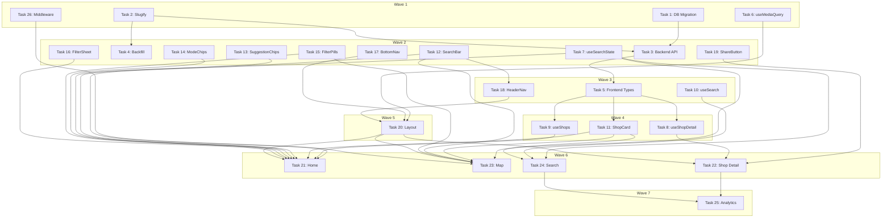

# Phase 2B: Discovery & Search UI — Implementation Plan

> **For Claude:** REQUIRED SUB-SKILL: Use executing-plans to implement this plan task-by-task.

**Design Doc:** [docs/designs/2026-03-13-phase2b-discovery-search-ui-design.md](docs/designs/2026-03-13-phase2b-discovery-search-ui-design.md)

**Spec References:** [SPEC.md#9-shop-discovery](SPEC.md#9-shop-discovery), [SPEC.md#6-search](SPEC.md#6-search)

**PRD References:** [PRD.md#core-features](PRD.md#core-features)

**Goal:** Build the core discovery UI — home, map, shop detail, and semantic search — so users can find, browse, and share coffee shops.

**Architecture:** URL-driven search state shared across tabs. SSR for shop detail (SEO + social previews), CSR for map and search (interactive). Mobile bottom nav + desktop header nav as two distinct layout systems at 1024px breakpoint.

**Tech Stack:** Next.js 16 App Router, react-map-gl, Mapbox GL JS, SWR, vaul Drawer, Tailwind CSS, shadcn/ui, PostHog

**Acceptance Criteria:**

- [ ] A user can visit the home page, see featured shops, and submit a search query
- [ ] A user can view the map with shop pins and tap a pin to see shop details
- [ ] A shared shop detail link on Threads shows a rich social preview (og:image, og:title)
- [ ] An authenticated user can search by natural language and see ranked results
- [ ] Search state (query, mode, filters) persists when navigating between Home, Map, and Search tabs

---

## Task 1: DB Migration — Add slug column to shops

**Files:**

- Create: `supabase/migrations/20260313000001_add_shop_slug.sql`

**No test needed** — DB migration.

**Step 1: Write migration**

```sql
-- Add slug column for SEO-friendly URLs
ALTER TABLE shops ADD COLUMN slug TEXT;

-- Unique index (only on non-null slugs, so existing rows don't conflict)
CREATE UNIQUE INDEX idx_shops_slug ON shops(slug) WHERE slug IS NOT NULL;
```

**Step 2: Commit**

```bash
git add supabase/migrations/20260313000001_add_shop_slug.sql
git commit -m "feat: add slug column to shops table"
```

---

## Task 2: Backend — Slug generation utility

**Files:**

- Create: `backend/core/slugify.py`
- Test: `backend/tests/core/test_slugify.py`
- Modify: `backend/pyproject.toml` (add `pypinyin` dependency)

**Step 1: Add pypinyin dependency**

```bash
cd backend && uv add pypinyin
```

**Step 2: Write failing tests**

```python
# backend/tests/core/test_slugify.py
import pytest
from core.slugify import generate_slug


class TestGenerateSlug:
    def test_chinese_shop_name_becomes_pinyin(self):
        assert generate_slug("山小孩咖啡") == "shan-xiao-hai-ka-fei"

    def test_english_name_lowercased_and_hyphenated(self):
        assert generate_slug("Café Nomad") == "cafe-nomad"

    def test_mixed_chinese_english(self):
        result = generate_slug("好咖啡 Good Coffee")
        assert result == "hao-ka-fei-good-coffee"

    def test_strips_special_characters(self):
        result = generate_slug("咖啡廳 (大安店)")
        assert "(" not in result
        assert ")" not in result

    def test_truncates_at_60_chars(self):
        long_name = "這是一個非常非常非常非常非常非常非常非常非常長的咖啡廳名字"
        result = generate_slug(long_name)
        assert len(result) <= 60

    def test_empty_string_returns_empty(self):
        assert generate_slug("") == ""

    def test_no_leading_or_trailing_hyphens(self):
        result = generate_slug(" 咖啡 ")
        assert not result.startswith("-")
        assert not result.endswith("-")

    def test_collapses_consecutive_hyphens(self):
        result = generate_slug("咖啡  &  茶")
        assert "--" not in result
```

**Step 3: Run tests — expect FAIL**

```bash
cd backend && uv run pytest tests/core/test_slugify.py -v
```

**Step 4: Implement**

```python
# backend/core/slugify.py
import re
import unicodedata

from pypinyin import lazy_pinyin

_NONALNUM = re.compile(r"[^a-z0-9]+")
_MAX_LEN = 60


def generate_slug(name: str) -> str:
    """Convert a shop name (Chinese/English/mixed) to a URL-safe slug."""
    if not name.strip():
        return ""

    # Convert Chinese characters to pinyin, keep non-Chinese as-is
    parts = lazy_pinyin(name)
    joined = " ".join(parts)

    # Normalize unicode (é → e), lowercase
    normalized = unicodedata.normalize("NFKD", joined)
    ascii_only = normalized.encode("ascii", "ignore").decode("ascii").lower()

    # Replace non-alphanumeric with hyphens, collapse multiples
    slug = _NONALNUM.sub("-", ascii_only).strip("-")

    # Truncate to max length without splitting mid-word
    if len(slug) > _MAX_LEN:
        slug = slug[:_MAX_LEN].rsplit("-", 1)[0]

    return slug
```

**Step 5: Run tests — expect PASS**

```bash
cd backend && uv run pytest tests/core/test_slugify.py -v
```

**Step 6: Commit**

```bash
git add backend/core/slugify.py backend/tests/core/test_slugify.py backend/pyproject.toml backend/uv.lock
git commit -m "feat: add slug generation utility with pinyin support"
```

---

## Task 3: Backend — Enhance GET /shops/{id} with photos, tags, slug

**Files:**

- Modify: `backend/api/shops.py`
- Test: `backend/tests/api/test_shops.py`

Currently `GET /shops/{id}` returns raw DB row (no photos, no tags, no slug). Enhance to JOIN `shop_photos` and `shop_tags + taxonomy_tags`, and generate slug on-the-fly if missing.

**API Contract:**

```yaml
endpoint: GET /shops/{shop_id}
response:
  id: string (UUID)
  name: string
  slug: string # NEW — generated from name if not stored
  address: string
  latitude: float
  longitude: float
  rating: float | null
  description: string | null
  photo_urls: string[] # NEW — from shop_photos table
  taxonomy_tags: # NEW — from shop_tags + taxonomy_tags
    - id: string
      dimension: string
      label: string
      label_zh: string
  mode_scores: # NEW — assembled from mode_work/rest/social columns
    work: float
    rest: float
    social: float
  # ... all other existing fields preserved
```

Also add `featured` query param to `GET /shops`:

```yaml
endpoint: GET /shops?featured=true&limit=12
# Returns random selection of live shops when featured=true
```

**Step 1: Write failing tests**

Add tests to `backend/tests/api/test_shops.py`:

- `test_get_shop_detail_includes_photo_urls` — mock shop row + shop_photos query → response has `photo_urls` array
- `test_get_shop_detail_includes_taxonomy_tags` — mock shop row + tag JOIN → response has `taxonomy_tags` array with id/dimension/label/label_zh
- `test_get_shop_detail_includes_slug` — mock shop with name "山小孩咖啡" → response has `slug: "shan-xiao-hai-ka-fei"`
- `test_get_shop_detail_includes_mode_scores` — mock shop with mode_work/rest/social → response has `mode_scores` object
- `test_list_shops_featured_returns_live_shops` — mock query with `featured=true` → returns only `processing_status='live'` shops

**Step 2: Run tests — expect FAIL**

```bash
cd backend && uv run pytest tests/api/test_shops.py -v -k "photo_urls or taxonomy_tags or slug or mode_scores or featured"
```

**Step 3: Implement**

In `backend/api/shops.py`:

1. In `get_shop(shop_id)`:
   - After fetching shop row, query `shop_photos` for `photo_urls`
   - Query `shop_tags` JOIN `taxonomy_tags` for tags
   - Assemble `mode_scores` from `mode_work/rest/social` columns
   - Generate `slug` using `generate_slug(shop["name"])` if `shop["slug"]` is null
2. In `list_shops()`:
   - Add `featured: bool = False` and `limit: int = 50` query params
   - When `featured=true`, filter by `processing_status = 'live'` and limit results

**Step 4: Run tests — expect PASS**

```bash
cd backend && uv run pytest tests/api/test_shops.py -v
```

**Step 5: Commit**

```bash
git add backend/api/shops.py backend/tests/api/test_shops.py
git commit -m "feat: enhance shops API with photos, tags, slug, and featured filter"
```

---

## Task 4: Backend — Slug backfill script

**Files:**

- Create: `backend/scripts/backfill_slugs.py`

**No test needed** — one-time admin script.

**Step 1: Write script**

```python
# backend/scripts/backfill_slugs.py
"""One-time script: generate slugs for all shops missing them."""
import asyncio

from core.config import settings
from core.slugify import generate_slug
from supabase import create_client


async def main() -> None:
    db = create_client(settings.supabase_url, settings.supabase_service_role_key)
    result = db.table("shops").select("id, name").is_("slug", "null").execute()
    shops = result.data or []
    print(f"Found {len(shops)} shops without slugs")

    seen_slugs: set[str] = set()
    for shop in shops:
        slug = generate_slug(shop["name"])
        # Handle collisions by appending short ID prefix
        if slug in seen_slugs:
            slug = f"{slug}-{shop['id'][:8]}"
        seen_slugs.add(slug)

        db.table("shops").update({"slug": slug}).eq("id", shop["id"]).execute()
        print(f"  {shop['name']} → {slug}")

    print(f"Updated {len(shops)} slugs")


if __name__ == "__main__":
    asyncio.run(main())
```

**Step 2: Commit**

```bash
git add backend/scripts/backfill_slugs.py
git commit -m "feat: add slug backfill script for existing shops"
```

---

## Task 5: Frontend Types — Add slug and ShopDetail

**Files:**

- Modify: `lib/types/index.ts`

**No test needed** — type definitions only.

**Step 1: Add types**

Add to `lib/types/index.ts`:

```typescript
// Add slug to Shop interface
slug?: string;

// New: enriched shop detail (from GET /shops/{id} enhanced response)
export interface ShopDetail extends Shop {
  photoUrls: string[];
  taxonomyTags: TaxonomyTag[];
  modeScores?: {
    work: number;
    rest: number;
    social: number;
  };
}
```

Also update `makeShop` factory in `lib/test-utils/factories.ts` to include `slug: 'shan-xiao-hai-ka-fei'`.

**Step 2: Commit**

```bash
git add lib/types/index.ts lib/test-utils/factories.ts
git commit -m "feat: add ShopDetail type and slug field"
```

---

## Task 6: Frontend — useMediaQuery hook

**Files:**

- Create: `lib/hooks/use-media-query.ts`
- Test: `lib/hooks/use-media-query.test.ts`

**Step 1: Write failing tests**

```typescript
// lib/hooks/use-media-query.test.ts
import { renderHook, act } from '@testing-library/react';
import { useMediaQuery, useIsDesktop } from './use-media-query';

describe('useMediaQuery', () => {
  const listeners: Array<(e: { matches: boolean }) => void> = [];

  beforeEach(() => {
    listeners.length = 0;
    Object.defineProperty(window, 'matchMedia', {
      writable: true,
      value: vi.fn((query: string) => ({
        matches: false,
        media: query,
        addEventListener: (
          _: string,
          cb: (e: { matches: boolean }) => void
        ) => {
          listeners.push(cb);
        },
        removeEventListener: vi.fn(),
      })),
    });
  });

  it('returns false initially (SSR safe default)', () => {
    const { result } = renderHook(() => useMediaQuery('(min-width: 1024px)'));
    expect(result.current).toBe(false);
  });

  it('updates when media query match changes', () => {
    const { result } = renderHook(() => useMediaQuery('(min-width: 1024px)'));
    act(() => {
      listeners.forEach((cb) => cb({ matches: true }));
    });
    expect(result.current).toBe(true);
  });
});

describe('useIsDesktop', () => {
  it('is a convenience wrapper for 1024px breakpoint', () => {
    Object.defineProperty(window, 'matchMedia', {
      writable: true,
      value: vi.fn(() => ({
        matches: true,
        addEventListener: vi.fn(),
        removeEventListener: vi.fn(),
      })),
    });
    const { result } = renderHook(() => useIsDesktop());
    expect(result.current).toBe(true);
  });
});
```

**Step 2: Run — expect FAIL**

```bash
pnpm test -- lib/hooks/use-media-query.test.ts
```

**Step 3: Implement**

```typescript
// lib/hooks/use-media-query.ts
'use client';
import { useEffect, useState } from 'react';

export function useMediaQuery(query: string): boolean {
  const [matches, setMatches] = useState(false);

  useEffect(() => {
    const mql = window.matchMedia(query);
    setMatches(mql.matches);
    const handler = (e: MediaQueryListEvent | { matches: boolean }) => {
      setMatches(e.matches);
    };
    mql.addEventListener('change', handler);
    return () => mql.removeEventListener('change', handler);
  }, [query]);

  return matches;
}

export function useIsDesktop(): boolean {
  return useMediaQuery('(min-width: 1024px)');
}
```

**Step 4: Run — expect PASS**

```bash
pnpm test -- lib/hooks/use-media-query.test.ts
```

**Step 5: Commit**

```bash
git add lib/hooks/use-media-query.ts lib/hooks/use-media-query.test.ts
git commit -m "feat: add useMediaQuery and useIsDesktop hooks"
```

---

## Task 7: Frontend — useSearchState hook

**Files:**

- Create: `lib/hooks/use-search-state.ts`
- Test: `lib/hooks/use-search-state.test.ts`

**Step 1: Write failing tests**

Test that the hook reads `q`, `mode`, `filters` from URL search params and provides setters that update them. Mock `useSearchParams` and `useRouter` from `next/navigation`.

Key tests:

- `reads query from ?q= URL param`
- `reads mode from ?mode= URL param`
- `reads filters from ?filters= URL param as array`
- `setQuery updates q param and navigates`
- `clearAll removes all search params`

**Step 2: Run — expect FAIL**

```bash
pnpm test -- lib/hooks/use-search-state.test.ts
```

**Step 3: Implement**

Hook wraps `useSearchParams()` and `useRouter()`. Reads `q`, `mode`, `filters` (comma-separated). Setters build new URLSearchParams and call `router.push`.

**Step 4: Run — expect PASS, then commit**

---

## Task 8: Frontend — useShopDetail hook

**Files:**

- Create: `lib/hooks/use-shop-detail.ts`
- Test: `lib/hooks/use-shop-detail.test.ts`

**Step 1: Write failing tests**

```typescript
// Pattern: mock global.fetch, render hook with createSWRWrapper
const SHOP_DETAIL = {
  id: 'shop-001',
  name: '山小孩咖啡',
  slug: 'shan-xiao-hai-ka-fei',
  address: '台北市大安區...',
  latitude: 25.033,
  longitude: 121.543,
  rating: 4.6,
  review_count: 287,
  photo_urls: ['https://example.com/photo1.jpg'],
  taxonomy_tags: [
    { id: 'quiet', dimension: 'ambience', label: 'Quiet', label_zh: '安靜' },
  ],
  mode_scores: { work: 0.8, rest: 0.6, social: 0.3 },
};
```

Key tests:

- `fetches shop detail and returns data` — verify shop.name, photo_urls, taxonomy_tags available
- `returns null while loading`
- `handles fetch error gracefully`

Uses `createSWRWrapper()` and mocks `global.fetch`. Does NOT use `fetchWithAuth` — shop detail is public.

**Step 2-5: Standard TDD cycle, commit**

---

## Task 9: Frontend — useShops hook

**Files:**

- Create: `lib/hooks/use-shops.ts`
- Test: `lib/hooks/use-shops.test.ts`

Same pattern as Task 8 but fetches from `/api/shops?featured=true&limit=12`. Returns `{ shops: Shop[], isLoading, error }`. Public endpoint, no auth.

Key tests:

- `fetches featured shops`
- `returns empty array while loading`
- `handles error state`

---

## Task 10: Frontend — useSearch hook

**Files:**

- Create: `lib/hooks/use-search.ts`
- Test: `lib/hooks/use-search.test.ts`

Fetches from `/api/search?text=...&mode=...` using `fetchWithAuth` (auth required). Conditional SWR key — only fetches when query is non-null.

Key tests:

- `fetches search results when query provided`
- `does not fetch when query is null`
- `passes mode parameter when set`
- `handles auth error (not authenticated)`

---

## Task 11: Frontend — ShopCard component

**Files:**

- Create: `components/shops/shop-card.tsx`
- Test: `components/shops/shop-card.test.tsx`

**Step 1: Write failing tests**

```typescript
import { render, screen } from '@testing-library/react';
import userEvent from '@testing-library/user-event';
import { ShopCard } from './shop-card';
import { makeShop } from '@/lib/test-utils/factories';

// Mock next/navigation
const mockPush = vi.fn();
vi.mock('next/navigation', () => ({
  useRouter: () => ({ push: mockPush }),
}));

// Mock next/image
vi.mock('next/image', () => ({
  default: (props: any) => ,
}));

describe('ShopCard', () => {
  const shop = makeShop({ slug: 'shan-xiao-hai-ka-fei' });

  it('renders shop name and rating', () => {
    render(<ShopCard shop={shop} />);
    expect(screen.getByText(shop.name)).toBeInTheDocument();
    expect(screen.getByText(/4\.6/)).toBeInTheDocument();
  });

  it('renders neighborhood from MRT station', () => {
    render(<ShopCard shop={shop} />);
    expect(screen.getByText(/大安/)).toBeInTheDocument();
  });

  it('navigates to shop detail on click', async () => {
    render(<ShopCard shop={shop} />);
    await userEvent.click(screen.getByRole('article'));
    expect(mockPush).toHaveBeenCalledWith(
      `/shops/${shop.id}/${shop.slug}`
    );
  });
});
```

**Step 2: Run — expect FAIL**

```bash
pnpm test -- components/shops/shop-card.test.tsx
```

**Step 3: Implement**

Card component with: `next/image` photo (16:9, 400x225), shop name (font-semibold), star rating, MRT/neighborhood, 2-3 AttributeChip pills. Wrapped in `<article>` with `onClick` → `router.push`.

**Step 4: Run — expect PASS, then commit**

---

## Task 12: Frontend — SearchBar component

**Files:**

- Create: `components/discovery/search-bar.tsx`
- Test: `components/discovery/search-bar.test.tsx`

Key tests:

- `renders input with sparkle icon and placeholder`
- `submitting form fires onSubmit with query text`
- `empty submission is prevented`
- `defaultQuery pre-fills the input`

Implementation: `<form>` with `<input>` (>=48px height, placeholder "找間有巴斯克蛋糕的咖啡廳…"), sparkle SVG icon, submit button. Controlled input with `useState`.

---

## Task 13: Frontend — SuggestionChips component

**Files:**

- Create: `components/discovery/suggestion-chips.tsx`
- Test: `components/discovery/suggestion-chips.test.tsx`

Key tests:

- `renders four suggestion chips` — 巴斯克蛋糕, 適合工作, 安靜一點, 我附近
- `tapping a chip fires onSelect with the chip text`

Implementation: horizontal scroll container with 4 button chips. Each fires `onSelect(chipText)`.

---

## Task 14: Frontend — ModeChips component

**Files:**

- Create: `components/discovery/mode-chips.tsx`
- Test: `components/discovery/mode-chips.test.tsx`

Key tests:

- `renders four mode chips` — 工作, 放鬆, 社交, 精品
- `tapping a chip selects it (fires onModeChange with mode key)`
- `tapping the active chip deselects it (fires onModeChange with null)`
- `only one chip is visually active at a time`

Implementation: 4 toggle buttons. Active chip gets filled terracotta style, inactive gets outline. Mode keys: `work`, `rest`, `social`, `specialty`.

---

## Task 15: Frontend — FilterPills component

**Files:**

- Create: `components/discovery/filter-pills.tsx`
- Test: `components/discovery/filter-pills.test.tsx`

Key tests:

- `renders filter pills including 篩選 button`
- `tapping a pill fires onToggle with filter key`
- `tapping 篩選 fires onOpenSheet`
- `active filters show filled style`

Implementation: horizontal scroll of button pills. Quick filters: 距離/現正營業/有插座/評分. Last pill "篩選" calls `onOpenSheet()`.

---

## Task 16: Frontend — FilterSheet component

**Files:**

- Create: `components/discovery/filter-sheet.tsx`
- Test: `components/discovery/filter-sheet.test.tsx`

Key tests:

- `renders taxonomy dimension sections with checkboxes`
- `checking a tag and clicking apply fires onApply with selected tag IDs`
- `clicking clear resets all selections`

Implementation: vaul `<Drawer>` with sections per dimension (functionality/time/ambience/mode/coffee). Hardcoded tag lists for now (populated from taxonomy when data pipeline runs). Each tag is a checkbox. Apply button calls `onApply(selectedIds)`.

---

## Task 17: Frontend — BottomNav component

**Files:**

- Create: `components/navigation/bottom-nav.tsx`
- Test: `components/navigation/bottom-nav.test.tsx`

Key tests:

- `renders four navigation tabs`
- `highlights the active tab based on current pathname`
- `tab links navigate to correct routes`

Implementation: fixed bottom bar with 4 `<Link>` tabs (Home `/`, Map `/map`, Lists `/lists`, Profile `/profile`). Active tab has terracotta indicator. Uses `usePathname()` from `next/navigation`.

---

## Task 18: Frontend — HeaderNav component

**Files:**

- Create: `components/navigation/header-nav.tsx`
- Test: `components/navigation/header-nav.test.tsx`

Key tests:

- `renders logo and navigation links`
- `renders search bar with onSearch callback`

Implementation: desktop header with logo (left), `<SearchBar>` (center), Map/Lists links (right), login/avatar (far right). Accepts `onSearch` prop.

---

## Task 19: Frontend — ShareButton component

**Files:**

- Create: `components/shops/share-button.tsx`
- Test: `components/shops/share-button.test.tsx`

Key tests:

- `copies shop URL to clipboard when navigator.share is unavailable`
- `fires shop_url_copied analytics event`

Implementation: button that tries `navigator.share({ url, title })` first, falls back to `navigator.clipboard.writeText(url)`. Uses `useAnalytics()` hook to fire PostHog event.

---

## Task 20: Frontend — Navigation layout integration

**Files:**

- Modify: `app/layout.tsx`
- Create: `components/navigation/app-shell.tsx`

**No separate test needed** — BottomNav and HeaderNav are individually tested. This task wires them into the root layout.

**Step 1: Create AppShell component**

```typescript
// components/navigation/app-shell.tsx
'use client';
import { useIsDesktop } from '@/lib/hooks/use-media-query';
import { BottomNav } from './bottom-nav';
import { HeaderNav } from './header-nav';
import { useRouter } from 'next/navigation';

export function AppShell({ children }: { children: React.ReactNode }) {
  const isDesktop = useIsDesktop();
  const router = useRouter();

  const handleSearch = (query: string) => {
    router.push(`/map?q=${encodeURIComponent(query)}`);
  };

  return (
    <>
      {isDesktop && <HeaderNav onSearch={handleSearch} />}
      <main className={isDesktop ? 'pt-16' : 'pb-16'}>{children}</main>
      {!isDesktop && <BottomNav />}
    </>
  );
}
```

**Step 2: Wire into layout.tsx** — wrap `{children}` with `<AppShell>`.

**Step 3: Commit**

---

## Task 21: Home page

**Files:**

- Modify: `app/page.tsx`
- Test: `app/page.test.tsx`

**Step 1: Write failing tests**

Key tests:

- `renders search bar and suggestion chips`
- `renders featured shop cards` — mock fetch to return shop data
- `search submission navigates to /map with query param`

**Step 2: Implement**

SSR server component fetches featured shops (`GET /api/shops?featured=true&limit=12`). Renders:

- Mobile: terracotta hero section with SearchBar, SuggestionChips below, ModeChips, FilterPills, then FeaturedGrid (vertical ShopCards)
- Desktop: centered hero with SearchBar, SuggestionChips, then 3-column grid of ShopCards

Client wrapper component handles search submission → `router.push('/map?q=...')` (or `/login?returnTo=...` for unauth).

**Step 3: Run, verify, commit**

---

## Task 22: Shop Detail page

**Files:**

- Create: `app/shops/[shopId]/[slug]/page.tsx`
- Create: `app/shops/[shopId]/[slug]/layout.tsx` (for metadata generation)
- Create: `components/shops/shop-hero.tsx`
- Create: `components/shops/shop-identity.tsx`
- Create: `components/shops/attribute-chips.tsx`
- Create: `components/shops/shop-description.tsx`
- Create: `components/shops/menu-highlights.tsx`
- Create: `components/shops/recent-checkins-strip.tsx`
- Create: `components/shops/shop-map-thumbnail.tsx`
- Create: `components/shops/sticky-checkin-bar.tsx`
- Test: `app/shops/[shopId]/[slug]/page.test.tsx`

**Step 1: Write failing tests**

Key tests:

- `renders shop name and rating for any visitor`
- `renders attribute chips from taxonomy tags`
- `renders description text`
- `generates og:title and og:image meta tags` (test the `generateMetadata` export)
- `shows check-in count for unauthenticated visitors`
- `shows full check-in photos for authenticated visitors`

**Step 2: Implement**

SSR server component:

1. `generateMetadata()` fetches shop → returns `{ title, description, openGraph: { images } }`
2. Page fetches shop detail from backend server-side
3. Slug mismatch → `redirect()` to canonical URL
4. Mobile layout: single-column scroll of sub-components
5. Desktop layout: 2-column with sticky right column
6. Client islands: BookmarkButton, ShareButton, ReviewsSection, RecentCheckinsStrip

Sub-components are small, focused components. Each receives shop data as props.

**Step 3: Run, verify, commit**

---

## Task 23: Map page

**Files:**

- Create: `app/map/page.tsx`
- Create: `components/map/map-view.tsx`
- Create: `components/map/map-mini-card.tsx`
- Create: `components/map/map-desktop-card.tsx`
- Test: `app/map/page.test.tsx`

**Step 1: Write failing tests**

Key tests:

- `renders search overlay on the map page`
- `shows shop mini card when a pin is selected` (mock MapView to expose onPinClick)

Note: Heavy Mapbox testing deferred to post-data-gate. Focus on UI chrome around the map.

**Step 2: Implement**

Page: lazy-loads MapView via `dynamic(() => import(...), { ssr: false })`. Overlays SearchBar + FilterPills. Selected pin state drives MapMiniCard/MapDesktopCard visibility.

MapView: react-map-gl `<Map>` with warm style, `<Marker>` for each shop with terracotta pin. `onPinClick` callback. Viewport-only rendering via `onMove` → filter shops by bounds.

MapMiniCard: floating bottom card with shop name, rating, "Open" badge. Tap navigates to shop detail.

MapDesktopCard: bottom-left floating card (~340px) with photo, identity, "View Details" button.

**Step 3: Run, verify, commit**

---

## Task 24: Search results page

**Files:**

- Modify: `app/(protected)/search/page.tsx`
- Test: `app/(protected)/search/page.test.tsx`

**Step 1: Write failing tests**

Key tests:

- `renders search results as shop cards when query present`
- `shows empty state with suggestions when no results`
- `shows loading state while searching`

**Step 2: Implement**

CSR page: reads query from `useSearchState()`. Uses `useSearch(query, mode)` to fetch results. Renders list of `<ShopCard>` components. Empty state shows SuggestionChips.

**Step 3: Run, verify, commit**

---

## Task 25: Analytics instrumentation

**Files:**

- Modify: `app/shops/[shopId]/[slug]/page.tsx` (or client wrapper)
- Modify: `components/discovery/search-bar.tsx`
- Modify: `components/discovery/filter-pills.tsx`
- Modify: `components/discovery/filter-sheet.tsx`

**No separate test needed** — analytics calls tested within component tests.

Add:

- `shop_detail_viewed` — on ShopDetail page mount (client component wrapper)
- `search_submitted` — in SearchBar onSubmit (after results return, include `result_count`)
- `filter_applied` — in FilterPills/FilterSheet on toggle/apply

Uses existing `useAnalytics()` hook from `lib/posthog/use-analytics.ts`.

**Step 1: Add analytics calls, commit**

---

## Task 26: Add /map to middleware public routes

**Files:**

- Modify: `middleware.ts`

**No test needed** — config change.

**Step 1: Add `/map` to `PUBLIC_ROUTES` array in `middleware.ts`**

**Step 2: Commit**

```bash
git add middleware.ts
git commit -m "feat: add /map to public routes"
```

---

## Execution Waves



**Wave 1** (parallel — no dependencies):

- Task 1: DB Migration (slug column)
- Task 2: Backend slugify utility
- Task 6: useMediaQuery hook
- Task 26: Middleware update (/map public)

**Wave 2** (parallel — depends on Wave 1):

- Task 3: Backend shops API enhancement ← T1, T2
- Task 4: Slug backfill script ← T2
- Task 7: useSearchState hook
- Task 12: SearchBar component
- Task 13: SuggestionChips component
- Task 14: ModeChips component
- Task 15: FilterPills component
- Task 16: FilterSheet component
- Task 17: BottomNav component
- Task 19: ShareButton component

**Wave 3** (parallel — depends on Wave 2):

- Task 5: Frontend types ← T3
- Task 10: useSearch hook
- Task 18: HeaderNav ← T12

**Wave 4** (parallel — depends on Wave 3):

- Task 8: useShopDetail hook ← T5
- Task 9: useShops hook ← T5
- Task 11: ShopCard ← T5

**Wave 5** (depends on Waves 2-4):

- Task 20: Layout integration ← T6, T17, T18

**Wave 6** (parallel — depends on Waves 4-5):

- Task 21: Home page ← T7, T9, T11, T12, T13, T14, T15, T16, T20
- Task 22: Shop Detail page ← T8, T19, T20
- Task 23: Map page ← T7, T11, T12, T15, T20, T26
- Task 24: Search page ← T7, T10, T11

**Wave 7** (depends on Wave 6):

- Task 25: Analytics instrumentation ← T22, T24
