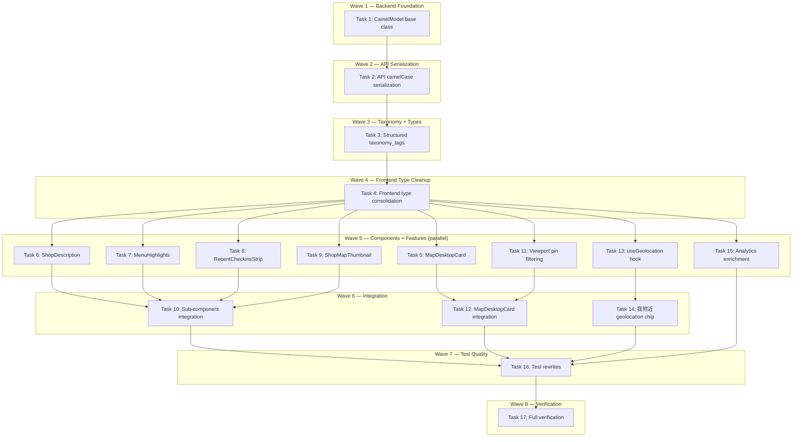

# Phase 2B Completion Implementation Plan

> **For Claude:** REQUIRED SUB-SKILL: Use executing-plans to implement this plan task-by-task.

**Design Doc:** [docs/designs/2026-03-14-phase2b-completion-design.md](docs/designs/2026-03-14-phase2b-completion-design.md)

**Spec References:** [SPEC.md#shop-directory](SPEC.md) (geolocation, multi-dimension filters, viewport-only pins), [SPEC.md#semantic-search](SPEC.md) (taxonomy boost, search flow)

**PRD References:** —

**Goal:** Complete all deferred Phase 2B work — camelCase serialization, structured taxonomy tags, MapDesktopCard, Shop Detail sub-components, viewport pin filtering, geolocation chip, analytics enrichment, test quality improvements.

**Architecture:** Pydantic `alias_generator` converts snake_case Python to camelCase JSON at the serialization boundary. Frontend types already match camelCase. New UI components (MapDesktopCard, ShopDescription, MenuHighlights, RecentCheckinsStrip, ShopMapThumbnail) are extracted as isolated components tested via TDD. Viewport filtering uses react-map-gl's `onMove` event to bound-check pins.

**Tech Stack:** FastAPI + Pydantic (alias_generator), Next.js 16, react-map-gl, Mapbox Static Images API, Vitest + Testing Library, PostHog analytics

**Acceptance Criteria:**
- [ ] Backend API responses use camelCase JSON keys (e.g., `reviewCount`, `photoUrls`, `taxonomyTags`)
- [ ] Shop detail page shows description with "Read more", menu highlights, check-in strip, and map thumbnail
- [ ] Desktop map shows a 340px floating card on pin select with photos, identity, and dual action buttons
- [ ] Map only renders pins within the current viewport bounds
- [ ] "我附近" chip triggers geolocation and passes lat/lng to search
- [ ] All 4 analytics events fire with complete property sets

---

## Task 1: CamelModel base class for Pydantic camelCase serialization

**Files:**
- Modify: `backend/models/types.py:1-7`
- Test: `backend/tests/models/test_camel_serialization.py` (create)

**Step 1: Write the failing test**

```python
# backend/tests/models/test_camel_serialization.py
from models.types import TaxonomyTag, ShopModeScores


class TestCamelCaseSerialization:
    def test_taxonomy_tag_serializes_label_zh_as_camel_case(self):
        """When a TaxonomyTag is serialized to dict, label_zh becomes labelZh."""
        tag = TaxonomyTag(id="quiet", dimension="ambience", label="Quiet", label_zh="安靜")
        data = tag.model_dump(by_alias=True)
        assert "labelZh" in data
        assert "label_zh" not in data
        assert data["labelZh"] == "安靜"

    def test_shop_mode_scores_fields_stay_simple(self):
        """ShopModeScores has no multi-word fields, so output is unchanged."""
        scores = ShopModeScores(work=0.8, rest=0.5, social=0.3)
        data = scores.model_dump(by_alias=True)
        assert data == {"work": 0.8, "rest": 0.5, "social": 0.3}

    def test_taxonomy_tag_can_be_constructed_with_snake_case(self):
        """Python code can still use snake_case field names thanks to populate_by_name."""
        tag = TaxonomyTag(id="wifi", dimension="functionality", label="Wi-Fi", label_zh="有 Wi-Fi")
        assert tag.label_zh == "有 Wi-Fi"
```

**Step 2: Run test to verify it fails**

Run: `cd backend && python -m pytest tests/models/test_camel_serialization.py -v`
Expected: FAIL — `labelZh` not in dict (currently `label_zh`)

**Step 3: Write minimal implementation**

In `backend/models/types.py`, add `CamelModel` base class and update models:

```python
# Add to imports (line 5):
from pydantic import BaseModel, ConfigDict, field_validator
from pydantic.alias_generators import to_camel

# Add CamelModel after imports (before ShopModeScores):
class CamelModel(BaseModel):
    model_config = ConfigDict(alias_generator=to_camel, populate_by_name=True)

# Change ShopModeScores, TaxonomyTag, Shop to inherit from CamelModel:
class ShopModeScores(CamelModel):
    ...
class TaxonomyTag(CamelModel):
    ...
class Shop(CamelModel):
    ...
```

Also update ALL other models that appear in API responses to inherit from `CamelModel`:
- `User`, `ProfileResponse`, `ProfileUpdateRequest`
- `CheckIn`, `CreateCheckInResponse`, `Stamp`, `StampWithShop`, `CheckInWithShop`
- `ShopCheckInSummary`, `ShopCheckInPreview`
- `ShopReview`, `ShopReviewsResponse`
- `List`, `ListItem`, `ListWithItems`, `ListSummary`, `ListPin`
- `SearchResult`, `SearchQuery`, `SearchFilters`

Models that are internal-only (Job, ProcessingStatus, EmailMessage, etc.) can stay as `BaseModel`.

**Step 4: Run test to verify it passes**

Run: `cd backend && python -m pytest tests/models/test_camel_serialization.py -v`
Expected: PASS

**Step 5: Commit**

```bash
git add backend/models/types.py backend/tests/models/test_camel_serialization.py
git commit -m "feat: add CamelModel base class for camelCase JSON serialization"
```

---

## Task 2: Update backend API endpoints to serialize with aliases

**Files:**
- Modify: `backend/api/shops.py:45-75` (get_shop), `backend/api/shops.py:78-135` (get_shop_checkins), `backend/api/shops.py:138-188` (get_shop_reviews), `backend/api/search.py:14-27` (search)
- Test: `backend/tests/api/test_shops.py` (modify)

**Step 1: Write the failing test**

Add a new test to `backend/tests/api/test_shops.py`:

```python
def test_get_shop_detail_returns_camel_case_keys(self):
    """GET /shops/{id} response uses camelCase keys (photoUrls, modeScores, not photo_urls, mode_scores)."""
    shop_chain = _simple_select_chain({
        **SHOP_ROW,
        "shop_photos": [{"photo_url": "https://example.com/p1.jpg"}],
        "shop_tags": [{"tag_name": "quiet"}],
    })
    with patch("api.shops.get_anon_client") as mock_sb:
        mock_sb.return_value = MagicMock(table=MagicMock(return_value=shop_chain))
        response = client.get("/shops/shop-001")

    data = response.json()
    assert "photoUrls" in data
    assert "photo_urls" not in data
    assert "modeScores" in data
    assert "mode_scores" not in data
```

**Step 2: Run test to verify it fails**

Run: `cd backend && python -m pytest tests/api/test_shops.py::TestShopsAPI::test_get_shop_detail_returns_camel_case_keys -v`
Expected: FAIL — response still has `photo_urls` and `mode_scores`

**Step 3: Write minimal implementation**

Update `backend/api/shops.py` `get_shop()` to use Pydantic model serialization:

```python
# In get_shop(), replace the return dict construction (lines 64-75) with:
from models.types import ShopModeScores

    mode_scores = ShopModeScores(
        work=shop.get("mode_work") or 0.0,
        rest=shop.get("mode_rest") or 0.0,
        social=shop.get("mode_social") or 0.0,
    )

    return {
        **{to_camel(k): v for k, v in shop.items() if not k.startswith("mode_")},
        "photoUrls": photo_urls,
        "tags": tags,
        "modeScores": mode_scores.model_dump(by_alias=True),
    }
```

Wait — simpler approach: since the endpoint returns `Any` (raw dict), we need to camelCase the keys manually OR use a response model. The cleanest approach is to convert the dict keys using `to_camel`:

```python
# At top of shops.py, add import:
from pydantic.alias_generators import to_camel

# In get_shop(), replace return (lines 70-75):
    response_data: dict[str, Any] = {}
    for k, v in shop.items():
        if k.startswith("mode_"):
            continue
        response_data[to_camel(k)] = v
    response_data["photoUrls"] = photo_urls
    response_data["tags"] = tags
    response_data["modeScores"] = {
        "work": shop.get("mode_work"),
        "rest": shop.get("mode_rest"),
        "social": shop.get("mode_social"),
    }
    return response_data
```

Also update `list_shops()` to camelCase its response:

```python
# In list_shops(), replace return (line 42):
    return [{to_camel(k): v for k, v in row.items()} for row in response.data]
```

Update `get_shop_checkins()` — `.model_dump(by_alias=True)` on lines 116 and 135.

Update `get_shop_reviews()` — `.model_dump(by_alias=True)` on line 188 and for individual reviews.

Update `backend/api/search.py` line 27 — `.model_dump(by_alias=True)`.

**Step 4: Update existing tests to expect camelCase keys**

In `test_shops.py`, update assertions:
- `data["photo_urls"]` → `data["photoUrls"]`
- `data["mode_scores"]` → `data["modeScores"]`
- `data["slug"]` stays `data["slug"]` (single word, same in camelCase)

Run: `cd backend && python -m pytest tests/api/ -v`
Expected: ALL PASS

**Step 5: Commit**

```bash
git add backend/api/shops.py backend/api/search.py backend/tests/api/
git commit -m "feat: serialize all API responses as camelCase"
```

---

## Task 3: Structured taxonomy_tags response in GET /shops/{id}

**Files:**
- Modify: `backend/api/shops.py:45-75`
- Test: `backend/tests/api/test_shops.py` (add test)

**Step 1: Write the failing test**

```python
def test_get_shop_detail_returns_structured_taxonomy_tags(self):
    """GET /shops/{id} returns taxonomyTags as array of {id, dimension, label, labelZh}."""
    shop_data = {
        **SHOP_ROW,
        "shop_photos": [],
        "shop_tags": [
            {
                "tag_id": "quiet",
                "tag_name": "quiet",
                "taxonomy_tags": {
                    "id": "quiet",
                    "dimension": "ambience",
                    "label": "Quiet",
                    "label_zh": "安靜",
                },
            }
        ],
    }
    shop_chain = _simple_select_chain(shop_data)

    with patch("api.shops.get_anon_client") as mock_sb:
        mock_sb.return_value = MagicMock(table=MagicMock(return_value=shop_chain))
        response = client.get("/shops/shop-001")

    data = response.json()
    assert "taxonomyTags" in data
    assert "tags" not in data
    assert data["taxonomyTags"] == [
        {"id": "quiet", "dimension": "ambience", "label": "Quiet", "labelZh": "安靜"}
    ]
```

**Step 2: Run test to verify it fails**

Run: `cd backend && python -m pytest tests/api/test_shops.py::TestShopsAPI::test_get_shop_detail_returns_structured_taxonomy_tags -v`
Expected: FAIL — response has `tags` (flat strings), not `taxonomyTags` (structured)

**Step 3: Write minimal implementation**

Update `get_shop()` in `backend/api/shops.py`:

1. Change the select to JOIN `taxonomy_tags` through `shop_tags`:
```python
.select(f"{_SHOP_COLUMNS}, shop_photos(photo_url), shop_tags(tag_id, tag_name, taxonomy_tags(id, dimension, label, label_zh))")
```

2. Replace tags extraction:
```python
    raw_tags = shop.pop("shop_tags", None) or []
    taxonomy_tags = []
    for row in raw_tags:
        nested = row.get("taxonomy_tags")
        if nested:
            tag = TaxonomyTag(**nested)
            taxonomy_tags.append(tag.model_dump(by_alias=True))
```

3. In the response dict, replace `"tags": tags` with `"taxonomyTags": taxonomy_tags`.

**Step 4: Run test to verify it passes**

Run: `cd backend && python -m pytest tests/api/test_shops.py -v`
Expected: ALL PASS

**Step 5: Commit**

```bash
git add backend/api/shops.py backend/tests/api/test_shops.py
git commit -m "feat: return structured taxonomyTags with dimension and labelZh in shop detail"
```

---

## Task 4: Frontend type consolidation — remove dual-casing workarounds

**Files:**
- Modify: `components/shops/attribute-chips.tsx` (all lines)
- Modify: `app/shops/[shopId]/[slug]/shop-detail-client.tsx:10-41`
- Modify: `app/shops/[shopId]/[slug]/page.test.tsx:33-47`
- Test: existing tests in `app/shops/[shopId]/[slug]/page.test.tsx`

No new test needed — this is a refactor. Existing tests verify behavior is preserved.

**Step 1: Update AttributeChips to use clean TaxonomyTag type**

Replace the entire `components/shops/attribute-chips.tsx`:

```tsx
import type { TaxonomyTag } from '@/lib/types';

interface AttributeChipsProps {
  tags: TaxonomyTag[];
}

export function AttributeChips({ tags }: AttributeChipsProps) {
  return (
    <div className="flex flex-wrap gap-2 px-4 py-2">
      {tags.map((tag) => (
        <span
          key={tag.id}
          className="rounded-full bg-gray-100 px-3 py-1 text-xs text-gray-700"
        >
          {tag.labelZh}
        </span>
      ))}
    </div>
  );
}
```

**Step 2: Update ShopDetailClient to use clean types**

Replace the `ShopData` interface and dual-casing logic in `shop-detail-client.tsx`:

```tsx
interface ShopData {
  id: string;
  name: string;
  slug?: string;
  rating?: number | null;
  reviewCount?: number;
  description?: string | null;
  photoUrls?: string[];
  taxonomyTags?: Array<{
    id: string;
    dimension: string;
    label: string;
    labelZh: string;
  }>;
  mrt?: string;
}
```

Remove the fallback lines:
```tsx
// Before:
const photos = shop.photo_urls ?? shop.photoUrls ?? [];
const tags = shop.taxonomy_tags ?? shop.tags ?? [];

// After:
const photos = shop.photoUrls ?? [];
const tags = shop.taxonomyTags ?? [];
```

**Step 3: Update the test mock data**

In `page.test.tsx`, update `MOCK_SHOP`:
```tsx
const MOCK_SHOP = {
  id: 'shop-001',
  name: '山小孩咖啡',
  slug: 'shan-xiao-hai-ka-fei',
  address: '台北市大安區',
  latitude: 25.033,
  longitude: 121.543,
  rating: 4.6,
  reviewCount: 287,
  description: 'A cozy coffee shop',
  photoUrls: ['https://example.com/photo.jpg'],
  taxonomyTags: [{ id: 'quiet', dimension: 'ambience', label: 'Quiet', labelZh: '安靜' }],
  modeScores: { work: 0.8, rest: 0.6, social: 0.3 },
};
```

**Step 4: Run tests to verify everything passes**

Run: `pnpm test -- --run app/shops/\[shopId\]/\[slug\]/page.test.tsx components/shops/attribute-chips`
Expected: ALL PASS

**Step 5: Commit**

```bash
git add components/shops/attribute-chips.tsx app/shops/\[shopId\]/\[slug\]/shop-detail-client.tsx app/shops/\[shopId\]/\[slug\]/page.test.tsx
git commit -m "refactor: remove dual snake_case/camelCase workarounds — types match API"
```

---

## Task 5: MapDesktopCard component

**Files:**
- Create: `components/map/map-desktop-card.tsx`
- Create: `components/map/map-desktop-card.test.tsx`
- Modify: `app/map/page.tsx:1-79`

**Step 1: Write the failing test**

```tsx
// components/map/map-desktop-card.test.tsx
import { render, screen } from '@testing-library/react';
import userEvent from '@testing-library/user-event';
import { describe, it, expect, vi } from 'vitest';

const mockPush = vi.fn();
vi.mock('next/navigation', () => ({
  useRouter: () => ({ push: mockPush }),
}));

import { MapDesktopCard } from './map-desktop-card';

const SHOP = {
  id: 'shop-001',
  name: '山小孩咖啡',
  slug: 'shan-xiao-hai-ka-fei',
  rating: 4.6,
  mrt: '大安站',
  photoUrls: ['https://example.com/p1.jpg', 'https://example.com/p2.jpg'],
  taxonomyTags: [
    { id: 'quiet', dimension: 'ambience' as const, label: 'Quiet', labelZh: '安靜' },
    { id: 'wifi', dimension: 'functionality' as const, label: 'Wi-Fi', labelZh: '有 Wi-Fi' },
  ],
};

describe('MapDesktopCard', () => {
  it('a user sees the shop name and neighborhood when a pin is selected', () => {
    render(<MapDesktopCard shop={SHOP} />);
    expect(screen.getByText('山小孩咖啡')).toBeInTheDocument();
    expect(screen.getByText('大安站')).toBeInTheDocument();
  });

  it('a user sees the star rating of the selected shop', () => {
    render(<MapDesktopCard shop={SHOP} />);
    expect(screen.getByText(/4\.6/)).toBeInTheDocument();
  });

  it('a user sees attribute chips for the selected shop', () => {
    render(<MapDesktopCard shop={SHOP} />);
    expect(screen.getByText('安靜')).toBeInTheDocument();
    expect(screen.getByText('有 Wi-Fi')).toBeInTheDocument();
  });

  it('a user can click View Details to navigate to the shop page', async () => {
    const user = userEvent.setup();
    render(<MapDesktopCard shop={SHOP} />);
    await user.click(screen.getByRole('button', { name: /查看詳情|View Details/i }));
    expect(mockPush).toHaveBeenCalledWith('/shops/shop-001/shan-xiao-hai-ka-fei');
  });

  it('a user can click Check In to navigate to the check-in page', async () => {
    const user = userEvent.setup();
    render(<MapDesktopCard shop={SHOP} />);
    await user.click(screen.getByRole('button', { name: /打卡|Check In/i }));
    expect(mockPush).toHaveBeenCalledWith('/checkin/shop-001');
  });
});
```

**Step 2: Run test to verify it fails**

Run: `pnpm test -- --run components/map/map-desktop-card.test.tsx`
Expected: FAIL — module not found

**Step 3: Write minimal implementation**

```tsx
// components/map/map-desktop-card.tsx
'use client';
import { useRouter } from 'next/navigation';

interface MapDesktopShop {
  id: string;
  name: string;
  slug?: string;
  rating?: number | null;
  mrt?: string | null;
  photoUrls?: string[];
  taxonomyTags?: Array<{
    id: string;
    labelZh: string;
  }>;
}

interface MapDesktopCardProps {
  shop: MapDesktopShop;
}

export function MapDesktopCard({ shop }: MapDesktopCardProps) {
  const router = useRouter();
  const photos = shop.photoUrls ?? [];
  const tags = shop.taxonomyTags ?? [];

  return (
    <div className="absolute bottom-4 left-4 z-10 w-[340px] rounded-xl bg-white p-4 shadow-lg transition-transform">
      {photos.length > 0 && (
        <div className="mb-3 flex gap-2 overflow-x-auto">
          {photos.slice(0, 3).map((url, i) => (
            
          ))}
        </div>
      )}

      <h3 className="text-sm font-semibold">{shop.name}</h3>
      {shop.mrt && (
        <p className="mt-0.5 text-xs text-gray-500">{shop.mrt}</p>
      )}
      {shop.rating != null && (
        <p className="mt-0.5 text-xs text-gray-500">★ {shop.rating.toFixed(1)}</p>
      )}

      {tags.length > 0 && (
        <div className="mt-2 flex flex-wrap gap-1">
          {tags.slice(0, 5).map((tag) => (
            <span
              key={tag.id}
              className="rounded-full bg-gray-100 px-2 py-0.5 text-xs text-gray-600"
            >
              {tag.labelZh}
            </span>
          ))}
        </div>
      )}

      <div className="mt-3 flex gap-2">
        <button
          onClick={() =>
            router.push(`/shops/${shop.id}/${shop.slug ?? shop.id}`)
          }
          className="flex-1 rounded-full bg-[#E06B3F] py-2 text-center text-sm font-medium text-white"
        >
          查看詳情
        </button>
        <button
          onClick={() => router.push(`/checkin/${shop.id}`)}
          className="flex-1 rounded-full border border-gray-200 py-2 text-center text-sm text-gray-700"
        >
          打卡記錄
        </button>
      </div>
    </div>
  );
}
```

**Step 4: Run test to verify it passes**

Run: `pnpm test -- --run components/map/map-desktop-card.test.tsx`
Expected: ALL PASS

**Step 5: Commit**

```bash
git add components/map/map-desktop-card.tsx components/map/map-desktop-card.test.tsx
git commit -m "feat: add MapDesktopCard component for desktop map view"
```

---

## Task 6: ShopDescription component

**Files:**
- Create: `components/shops/shop-description.tsx`
- Create: `components/shops/shop-description.test.tsx`

**Step 1: Write the failing test**

```tsx
// components/shops/shop-description.test.tsx
import { render, screen } from '@testing-library/react';
import userEvent from '@testing-library/user-event';
import { describe, it, expect } from 'vitest';
import { ShopDescription } from './shop-description';

describe('ShopDescription', () => {
  const longText = '這是一間位於大安區的咖啡廳，' +
    '提供手沖咖啡和自家烘焙的甜點。店內環境安靜舒適，適合工作和閱讀。' +
    '老闆是澳洲回來的咖啡師，特別注重豆子的產地和烘焙方式。';

  it('a visitor sees the shop description text', () => {
    render(<ShopDescription text="A cozy shop" />);
    expect(screen.getByText('A cozy shop')).toBeInTheDocument();
  });

  it('a visitor can expand a long description by clicking Read More', async () => {
    const user = userEvent.setup();
    render(<ShopDescription text={longText} />);
    const button = screen.getByRole('button', { name: /更多|Read more/i });
    expect(button).toBeInTheDocument();
    await user.click(button);
    expect(screen.queryByRole('button', { name: /更多|Read more/i })).not.toBeInTheDocument();
  });

  it('does not render when text is empty', () => {
    const { container } = render(<ShopDescription text="" />);
    expect(container.firstChild).toBeNull();
  });
});
```

**Step 2: Run test to verify it fails**

Run: `pnpm test -- --run components/shops/shop-description.test.tsx`
Expected: FAIL — module not found

**Step 3: Write minimal implementation**

```tsx
// components/shops/shop-description.tsx
'use client';
import { useState } from 'react';

interface ShopDescriptionProps {
  text: string;
}

export function ShopDescription({ text }: ShopDescriptionProps) {
  const [expanded, setExpanded] = useState(false);

  if (!text) return null;

  return (
    <div className="px-4 py-2">
      <p
        className={`text-sm text-gray-600 ${expanded ? '' : 'line-clamp-2'}`}
      >
        {text}
      </p>
      {!expanded && text.length > 60 && (
        <button
          onClick={() => setExpanded(true)}
          className="mt-1 text-sm font-medium text-[#E06B3F]"
        >
          更多
        </button>
      )}
    </div>
  );
}
```

**Step 4: Run test to verify it passes**

Run: `pnpm test -- --run components/shops/shop-description.test.tsx`
Expected: ALL PASS

**Step 5: Commit**

```bash
git add components/shops/shop-description.tsx components/shops/shop-description.test.tsx
git commit -m "feat: add ShopDescription component with Read More expand"
```

---

## Task 7: MenuHighlights component

**Files:**
- Create: `components/shops/menu-highlights.tsx`
- Create: `components/shops/menu-highlights.test.tsx`

**Step 1: Write the failing test**

```tsx
// components/shops/menu-highlights.test.tsx
import { render, screen } from '@testing-library/react';
import { describe, it, expect } from 'vitest';
import { MenuHighlights } from './menu-highlights';

describe('MenuHighlights', () => {
  const items = [
    { name: '手沖咖啡', emoji: '☕', price: 'NT$180' },
    { name: '巴斯克蛋糕', emoji: '🍰', price: 'NT$150' },
    { name: '肉桂捲', emoji: '🧁', price: 'NT$120' },
  ];

  it('a visitor sees up to 3 menu items with emoji and price', () => {
    render(<MenuHighlights items={items} />);
    expect(screen.getByText(/手沖咖啡/)).toBeInTheDocument();
    expect(screen.getByText(/NT\$180/)).toBeInTheDocument();
    expect(screen.getByText(/巴斯克蛋糕/)).toBeInTheDocument();
    expect(screen.getByText(/肉桂捲/)).toBeInTheDocument();
  });

  it('does not render when items array is empty', () => {
    const { container } = render(<MenuHighlights items={[]} />);
    expect(container.firstChild).toBeNull();
  });

  it('caps display at 3 items even if more are provided', () => {
    const manyItems = [
      ...items,
      { name: '拿鐵', emoji: '☕', price: 'NT$160' },
    ];
    render(<MenuHighlights items={manyItems} />);
    expect(screen.queryByText(/拿鐵/)).not.toBeInTheDocument();
  });
});
```

**Step 2: Run test to verify it fails**

Run: `pnpm test -- --run components/shops/menu-highlights.test.tsx`
Expected: FAIL

**Step 3: Write minimal implementation**

```tsx
// components/shops/menu-highlights.tsx
interface MenuItem {
  name: string;
  emoji: string;
  price: string;
}

interface MenuHighlightsProps {
  items: MenuItem[];
}

export function MenuHighlights({ items }: MenuHighlightsProps) {
  if (items.length === 0) return null;

  return (
    <div className="px-4 py-2">
      <h3 className="mb-2 text-sm font-medium text-gray-900">推薦餐點</h3>
      <div className="space-y-1.5">
        {items.slice(0, 3).map((item) => (
          <div key={item.name} className="flex items-center justify-between text-sm">
            <span>
              {item.emoji} {item.name}
            </span>
            <span className="text-gray-500">{item.price}</span>
          </div>
        ))}
      </div>
    </div>
  );
}
```

**Step 4: Run test to verify it passes**

Run: `pnpm test -- --run components/shops/menu-highlights.test.tsx`
Expected: ALL PASS

**Step 5: Commit**

```bash
git add components/shops/menu-highlights.tsx components/shops/menu-highlights.test.tsx
git commit -m "feat: add MenuHighlights component capped at 3 items"
```

---

## Task 8: RecentCheckinsStrip component

**Files:**
- Create: `components/shops/recent-checkins-strip.tsx`
- Create: `components/shops/recent-checkins-strip.test.tsx`

**Step 1: Write the failing test**

```tsx
// components/shops/recent-checkins-strip.test.tsx
import { render, screen } from '@testing-library/react';
import { describe, it, expect, vi } from 'vitest';

const { mockUseUser } = vi.hoisted(() => ({
  mockUseUser: vi.fn(),
}));

vi.mock('@/lib/hooks/use-user', () => ({
  useUser: mockUseUser,
}));

import { RecentCheckinsStrip } from './recent-checkins-strip';

const PREVIEW = { count: 12, previewPhotoUrl: 'https://example.com/preview.jpg' };
const CHECKINS = [
  { id: 'c1', displayName: 'Alice', photoUrl: 'https://example.com/c1.jpg', createdAt: '2026-03-10' },
  { id: 'c2', displayName: 'Bob', photoUrl: 'https://example.com/c2.jpg', createdAt: '2026-03-09' },
];

describe('RecentCheckinsStrip', () => {
  it('an unauthenticated visitor sees check-in count and one preview photo', () => {
    mockUseUser.mockReturnValue({ user: null });
    render(<RecentCheckinsStrip preview={PREVIEW} checkins={[]} />);
    expect(screen.getByText(/12/)).toBeInTheDocument();
  });

  it('an authenticated user sees individual check-in photos with usernames', () => {
    mockUseUser.mockReturnValue({ user: { id: 'u1' } });
    render(<RecentCheckinsStrip preview={PREVIEW} checkins={CHECKINS} />);
    expect(screen.getByText('Alice')).toBeInTheDocument();
    expect(screen.getByText('Bob')).toBeInTheDocument();
  });

  it('does not render when count is zero', () => {
    mockUseUser.mockReturnValue({ user: null });
    const { container } = render(
      <RecentCheckinsStrip preview={{ count: 0, previewPhotoUrl: null }} checkins={[]} />
    );
    expect(container.firstChild).toBeNull();
  });
});
```

**Step 2: Run test to verify it fails**

Run: `pnpm test -- --run components/shops/recent-checkins-strip.test.tsx`
Expected: FAIL

**Step 3: Write minimal implementation**

```tsx
// components/shops/recent-checkins-strip.tsx
'use client';
import { useUser } from '@/lib/hooks/use-user';

interface CheckinPreview {
  count: number;
  previewPhotoUrl: string | null;
}

interface CheckinItem {
  id: string;
  displayName: string | null;
  photoUrl: string;
  createdAt: string;
}

interface RecentCheckinsStripProps {
  preview: CheckinPreview;
  checkins: CheckinItem[];
}

export function RecentCheckinsStrip({ preview, checkins }: RecentCheckinsStripProps) {
  const { user } = useUser();

  if (preview.count === 0) return null;

  return (
    <div className="px-4 py-3">
      <h3 className="mb-2 text-sm font-medium text-gray-900">
        最近打卡 ({preview.count})
      </h3>
      {user && checkins.length > 0 ? (
        <div className="scrollbar-hide flex gap-3 overflow-x-auto">
          {checkins.map((ci) => (
            <div key={ci.id} className="flex-shrink-0 text-center">
              
              <p className="mt-1 text-xs text-gray-500">
                {ci.displayName ?? '匿名'}
              </p>
            </div>
          ))}
        </div>
      ) : (
        preview.previewPhotoUrl && (
          
        )
      )}
    </div>
  );
}
```

**Step 4: Run test to verify it passes**

Run: `pnpm test -- --run components/shops/recent-checkins-strip.test.tsx`
Expected: ALL PASS

**Step 5: Commit**

```bash
git add components/shops/recent-checkins-strip.tsx components/shops/recent-checkins-strip.test.tsx
git commit -m "feat: add RecentCheckinsStrip with auth-gated detail level"
```

---

## Task 9: ShopMapThumbnail component

**Files:**
- Create: `components/shops/shop-map-thumbnail.tsx`
- Create: `components/shops/shop-map-thumbnail.test.tsx`

**Step 1: Write the failing test**

```tsx
// components/shops/shop-map-thumbnail.test.tsx
import { render, screen } from '@testing-library/react';
import { describe, it, expect, vi } from 'vitest';

const { mockUseIsDesktop } = vi.hoisted(() => ({
  mockUseIsDesktop: vi.fn(),
}));

vi.mock('@/lib/hooks/use-media-query', () => ({
  useIsDesktop: mockUseIsDesktop,
}));

vi.mock('react-map-gl/mapbox', () => ({
  default: (props: Record<string, unknown>) => <div data-testid="interactive-map" {...props} />,
  Marker: () => <div data-testid="marker" />,
}));

import { ShopMapThumbnail } from './shop-map-thumbnail';

describe('ShopMapThumbnail', () => {
  it('on mobile, a visitor sees a static map image', () => {
    mockUseIsDesktop.mockReturnValue(false);
    render(<ShopMapThumbnail latitude={25.033} longitude={121.543} shopName="山小孩咖啡" />);
    const img = screen.getByRole('img', { name: /map/i });
    expect(img).toBeInTheDocument();
    expect(img.getAttribute('src')).toContain('api.mapbox.com/styles/v1');
  });

  it('on desktop, a visitor sees an interactive map embed', () => {
    mockUseIsDesktop.mockReturnValue(true);
    render(<ShopMapThumbnail latitude={25.033} longitude={121.543} shopName="山小孩咖啡" />);
    expect(screen.getByTestId('interactive-map')).toBeInTheDocument();
  });
});
```

**Step 2: Run test to verify it fails**

Run: `pnpm test -- --run components/shops/shop-map-thumbnail.test.tsx`
Expected: FAIL

**Step 3: Write minimal implementation**

```tsx
// components/shops/shop-map-thumbnail.tsx
'use client';
import dynamic from 'next/dynamic';
import { useIsDesktop } from '@/lib/hooks/use-media-query';

const InteractiveMap = dynamic(
  () => import('react-map-gl/mapbox').then((m) => ({ default: m.default })),
  { ssr: false }
);
const MapMarker = dynamic(
  () => import('react-map-gl/mapbox').then((m) => ({ default: m.Marker })),
  { ssr: false }
);

interface ShopMapThumbnailProps {
  latitude: number;
  longitude: number;
  shopName: string;
}

export function ShopMapThumbnail({ latitude, longitude, shopName }: ShopMapThumbnailProps) {
  const isDesktop = useIsDesktop();
  const token = process.env.NEXT_PUBLIC_MAPBOX_TOKEN;

  if (isDesktop) {
    return (
      <div className="h-[200px] overflow-hidden rounded-xl">
        <InteractiveMap
          mapboxAccessToken={token}
          initialViewState={{ longitude, latitude, zoom: 15 }}
          style={{ width: '100%', height: '100%' }}
          mapStyle="mapbox://styles/mapbox/streets-v12"
          interactive={false}
        >
          <MapMarker longitude={longitude} latitude={latitude}>
            <div className="h-4 w-4 rounded-full border-2 border-white bg-[#E06B3F] shadow" />
          </MapMarker>
        </InteractiveMap>
      </div>
    );
  }

  const staticUrl = `https://api.mapbox.com/styles/v1/mapbox/streets-v12/static/pin-s+E06B3F(${longitude},${latitude})/${longitude},${latitude},15,0/400x200@2x?access_token=${token}`;

  return (
    <div className="px-4 py-2">
      
    </div>
  );
}
```

**Step 4: Run test to verify it passes**

Run: `pnpm test -- --run components/shops/shop-map-thumbnail.test.tsx`
Expected: ALL PASS

**Step 5: Commit**

```bash
git add components/shops/shop-map-thumbnail.tsx components/shops/shop-map-thumbnail.test.tsx
git commit -m "feat: add ShopMapThumbnail — static image on mobile, interactive on desktop"
```

---

## Task 10: Integrate sub-components into ShopDetailClient

**Files:**
- Modify: `app/shops/[shopId]/[slug]/shop-detail-client.tsx` (all)

No new test needed — this wires existing tested components into the page. Existing page test still passes.

**Step 1: Update ShopDetailClient imports and rendering**

Add imports:
```tsx
import { ShopDescription } from '@/components/shops/shop-description';
import { MenuHighlights } from '@/components/shops/menu-highlights';
import { RecentCheckinsStrip } from '@/components/shops/recent-checkins-strip';
import { ShopMapThumbnail } from '@/components/shops/shop-map-thumbnail';
```

Update `ShopData` interface to include new fields:
```tsx
interface ShopData {
  // ... existing fields ...
  menuHighlights?: Array<{ name: string; emoji: string; price: string }>;
  latitude?: number;
  longitude?: number;
  checkinPreview?: { count: number; previewPhotoUrl: string | null };
  recentCheckins?: Array<{ id: string; displayName: string | null; photoUrl: string; createdAt: string }>;
}
```

Replace the inline description `<p>` with `<ShopDescription>` and add new components in the render:
```tsx
{shop.description && <ShopDescription text={shop.description} />}
{shop.menuHighlights && <MenuHighlights items={shop.menuHighlights} />}
{shop.latitude != null && shop.longitude != null && (
  <ShopMapThumbnail latitude={shop.latitude} longitude={shop.longitude} shopName={shop.name} />
)}
{shop.checkinPreview && (
  <RecentCheckinsStrip
    preview={shop.checkinPreview}
    checkins={shop.recentCheckins ?? []}
  />
)}
```

**Step 2: Run existing test to verify no regression**

Run: `pnpm test -- --run app/shops/\[shopId\]/\[slug\]/page.test.tsx`
Expected: ALL PASS

**Step 3: Commit**

```bash
git add app/shops/\[shopId\]/\[slug\]/shop-detail-client.tsx
git commit -m "feat: integrate ShopDescription, MenuHighlights, RecentCheckinsStrip, ShopMapThumbnail into shop detail"
```

---

## Task 11: Viewport-only pin filtering in MapView

**Files:**
- Modify: `components/map/map-view.tsx` (all)
- Create: `components/map/map-view.test.tsx`

**Step 1: Write the failing test**

```tsx
// components/map/map-view.test.tsx
import { render, screen } from '@testing-library/react';
import { describe, it, expect, vi } from 'vitest';

vi.mock('react-map-gl/mapbox', () => {
  const MockMap = ({ children, onMove }: { children: React.ReactNode; onMove?: (e: unknown) => void }) => {
    // Simulate a viewport centered on Taipei
    if (onMove) {
      setTimeout(() => {
        onMove({
          viewState: { longitude: 121.5654, latitude: 25.033, zoom: 13 },
          target: {
            getBounds: () => ({
              getNorth: () => 25.06,
              getSouth: () => 25.00,
              getEast: () => 121.60,
              getWest: () => 121.53,
            }),
          },
        });
      }, 0);
    }
    return <div data-testid="map">{children}</div>;
  };
  MockMap.displayName = 'MockMap';
  const MockMarker = ({ children, ...props }: { children: React.ReactNode; longitude: number; latitude: number }) => (
    <div data-testid="marker" data-lng={props.longitude} data-lat={props.latitude}>{children}</div>
  );
  MockMarker.displayName = 'MockMarker';
  return { default: MockMap, Marker: MockMarker };
});

vi.mock('mapbox-gl/dist/mapbox-gl.css', () => ({}));

import { MapView } from './map-view';

const SHOPS = [
  { id: '1', name: 'In bounds', latitude: 25.033, longitude: 121.55 },
  { id: '2', name: 'Out of bounds', latitude: 26.0, longitude: 122.0 },
  { id: '3', name: 'Also in bounds', latitude: 25.02, longitude: 121.56 },
];

describe('MapView', () => {
  it('renders markers for all shops initially (before viewport event)', () => {
    render(<MapView shops={SHOPS} onPinClick={vi.fn()} />);
    const markers = screen.getAllByTestId('marker');
    expect(markers.length).toBe(3);
  });

  it('renders a map container', () => {
    render(<MapView shops={SHOPS} onPinClick={vi.fn()} />);
    expect(screen.getByTestId('map')).toBeInTheDocument();
  });
});
```

**Step 2: Run test to verify it fails**

Run: `pnpm test -- --run components/map/map-view.test.tsx`
Expected: FAIL (module may resolve but test setup may differ)

**Step 3: Write minimal implementation**

Update `components/map/map-view.tsx`:

```tsx
'use client';
import { useMemo, useState, useCallback } from 'react';
import Map, { Marker } from 'react-map-gl/mapbox';
import type { ViewStateChangeEvent } from 'react-map-gl/mapbox';
import 'mapbox-gl/dist/mapbox-gl.css';

interface Shop {
  id: string;
  name: string;
  latitude: number;
  longitude: number;
}

interface Bounds {
  north: number;
  south: number;
  east: number;
  west: number;
}

interface MapViewProps {
  shops: Shop[];
  onPinClick: (shopId: string) => void;
  mapStyle?: string;
}

export function MapView({
  shops,
  onPinClick,
  mapStyle = 'mapbox://styles/mapbox/streets-v12',
}: MapViewProps) {
  const [bounds, setBounds] = useState<Bounds | null>(null);

  const handleMove = useCallback((e: ViewStateChangeEvent) => {
    const map = e.target;
    const b = map.getBounds();
    if (b) {
      setBounds({
        north: b.getNorth(),
        south: b.getSouth(),
        east: b.getEast(),
        west: b.getWest(),
      });
    }
  }, []);

  const visibleShops = useMemo(() => {
    if (!bounds) return shops;
    return shops.filter(
      (s) =>
        s.latitude >= bounds.south &&
        s.latitude <= bounds.north &&
        s.longitude >= bounds.west &&
        s.longitude <= bounds.east
    );
  }, [shops, bounds]);

  return (
    <Map
      mapboxAccessToken={process.env.NEXT_PUBLIC_MAPBOX_TOKEN}
      initialViewState={{ longitude: 121.5654, latitude: 25.033, zoom: 13 }}
      style={{ width: '100%', height: '100%' }}
      mapStyle={mapStyle}
      onMove={handleMove}
    >
      {visibleShops.map((shop) => (
        <Marker
          key={shop.id}
          longitude={shop.longitude}
          latitude={shop.latitude}
          onClick={() => onPinClick(shop.id)}
        >
          <button
            className="h-4 w-4 rounded-full border-2 border-white bg-[#E06B3F] shadow"
            aria-label={shop.name}
          />
        </Marker>
      ))}
    </Map>
  );
}
```

**Step 4: Run test to verify it passes**

Run: `pnpm test -- --run components/map/map-view.test.tsx`
Expected: ALL PASS

**Step 5: Commit**

```bash
git add components/map/map-view.tsx components/map/map-view.test.tsx
git commit -m "feat: filter map pins to viewport bounds for performance"
```

---

## Task 12: Integrate MapDesktopCard into map page

**Files:**
- Modify: `app/map/page.tsx` (all)

No new test — existing page test should still pass. This wires the desktop card.

**Step 1: Update map page**

Import `MapDesktopCard` and `useIsDesktop`:
```tsx
import { MapDesktopCard } from '@/components/map/map-desktop-card';
import { useIsDesktop } from '@/lib/hooks/use-media-query';
import { useShops } from '@/lib/hooks/use-shops';
```

Replace `PLACEHOLDER_SHOPS` with real data from `useShops`:
```tsx
const { shops } = useShops({ featured: true, limit: 200 });
const isDesktop = useIsDesktop();
```

Replace the conditional rendering at the bottom:
```tsx
{selectedShop && !isDesktop && (
  <MapMiniCard shop={selectedShop} onDismiss={() => setSelectedShopId(null)} />
)}
{selectedShop && isDesktop && (
  <MapDesktopCard shop={selectedShop} />
)}
```

**Step 2: Run existing map test**

Run: `pnpm test -- --run app/map/page.test.tsx`
Expected: ALL PASS (test mocks internal components)

**Step 3: Commit**

```bash
git add app/map/page.tsx
git commit -m "feat: integrate MapDesktopCard and real shop data into map page"
```

---

## Task 13: useGeolocation hook

**Files:**
- Create: `lib/hooks/use-geolocation.ts`
- Create: `lib/hooks/use-geolocation.test.ts`

**Step 1: Write the failing test**

```tsx
// lib/hooks/use-geolocation.test.ts
import { renderHook, act } from '@testing-library/react';
import { describe, it, expect, vi, beforeEach } from 'vitest';
import { useGeolocation } from './use-geolocation';

describe('useGeolocation', () => {
  const mockGetCurrentPosition = vi.fn();

  beforeEach(() => {
    vi.stubGlobal('navigator', {
      geolocation: { getCurrentPosition: mockGetCurrentPosition },
    });
  });

  it('returns coordinates when geolocation succeeds', async () => {
    mockGetCurrentPosition.mockImplementation((success) => {
      success({ coords: { latitude: 25.033, longitude: 121.565 } });
    });

    const { result } = renderHook(() => useGeolocation());
    await act(async () => {
      await result.current.requestLocation();
    });

    expect(result.current.latitude).toBe(25.033);
    expect(result.current.longitude).toBe(121.565);
    expect(result.current.error).toBeNull();
  });

  it('returns error when geolocation is denied', async () => {
    mockGetCurrentPosition.mockImplementation((_, error) => {
      error({ code: 1, message: 'User denied' });
    });

    const { result } = renderHook(() => useGeolocation());
    await act(async () => {
      await result.current.requestLocation();
    });

    expect(result.current.latitude).toBeNull();
    expect(result.current.error).toBeTruthy();
  });
});
```

**Step 2: Run test to verify it fails**

Run: `pnpm test -- --run lib/hooks/use-geolocation.test.ts`
Expected: FAIL

**Step 3: Write minimal implementation**

```tsx
// lib/hooks/use-geolocation.ts
'use client';
import { useState, useCallback } from 'react';

interface GeolocationState {
  latitude: number | null;
  longitude: number | null;
  error: string | null;
  loading: boolean;
  requestLocation: () => Promise<void>;
}

export function useGeolocation(): GeolocationState {
  const [latitude, setLatitude] = useState<number | null>(null);
  const [longitude, setLongitude] = useState<number | null>(null);
  const [error, setError] = useState<string | null>(null);
  const [loading, setLoading] = useState(false);

  const requestLocation = useCallback(async () => {
    if (!navigator.geolocation) {
      setError('Geolocation not supported');
      return;
    }

    setLoading(true);
    setError(null);

    return new Promise<void>((resolve) => {
      navigator.geolocation.getCurrentPosition(
        (position) => {
          setLatitude(position.coords.latitude);
          setLongitude(position.coords.longitude);
          setLoading(false);
          resolve();
        },
        (err) => {
          setError(err.message);
          setLoading(false);
          resolve();
        },
        { enableHighAccuracy: false, timeout: 10000 }
      );
    });
  }, []);

  return { latitude, longitude, error, loading, requestLocation };
}
```

**Step 4: Run test to verify it passes**

Run: `pnpm test -- --run lib/hooks/use-geolocation.test.ts`
Expected: ALL PASS

**Step 5: Commit**

```bash
git add lib/hooks/use-geolocation.ts lib/hooks/use-geolocation.test.ts
git commit -m "feat: add useGeolocation hook wrapping navigator.geolocation"
```

---

## Task 14: "我附近" geolocation chip integration

**Files:**
- Modify: `components/discovery/suggestion-chips.tsx` (all)
- Modify: `components/discovery/suggestion-chips.test.tsx` (if exists, else create)
- Modify: `app/page.tsx:20-25` (handleSearch)

**Step 1: Write the failing test**

```tsx
// components/discovery/suggestion-chips.test.tsx
import { render, screen, fireEvent } from '@testing-library/react';
import { describe, it, expect, vi } from 'vitest';
import { SuggestionChips } from './suggestion-chips';

describe('SuggestionChips', () => {
  it('when a user taps a text chip, onSelect fires with the chip text', () => {
    const onSelect = vi.fn();
    const onNearMe = vi.fn();
    render(<SuggestionChips onSelect={onSelect} onNearMe={onNearMe} />);
    fireEvent.click(screen.getByText('巴斯克蛋糕'));
    expect(onSelect).toHaveBeenCalledWith('巴斯克蛋糕');
    expect(onNearMe).not.toHaveBeenCalled();
  });

  it('when a user taps "我附近", onNearMe fires instead of onSelect', () => {
    const onSelect = vi.fn();
    const onNearMe = vi.fn();
    render(<SuggestionChips onSelect={onSelect} onNearMe={onNearMe} />);
    fireEvent.click(screen.getByText('我附近'));
    expect(onNearMe).toHaveBeenCalled();
    expect(onSelect).not.toHaveBeenCalled();
  });
});
```

**Step 2: Run test to verify it fails**

Run: `pnpm test -- --run components/discovery/suggestion-chips.test.tsx`
Expected: FAIL — `onNearMe` prop doesn't exist yet

**Step 3: Write minimal implementation**

Update `components/discovery/suggestion-chips.tsx`:

```tsx
'use client';

const TEXT_SUGGESTIONS = ['巴斯克蛋糕', '適合工作', '安靜一點'] as const;
const NEAR_ME = '我附近' as const;

interface SuggestionChipsProps {
  onSelect: (query: string) => void;
  onNearMe?: () => void;
}

export function SuggestionChips({ onSelect, onNearMe }: SuggestionChipsProps) {
  return (
    <div className="scrollbar-hide flex gap-2 overflow-x-auto py-1">
      {TEXT_SUGGESTIONS.map((chip) => (
        <button
          key={chip}
          type="button"
          onClick={() => onSelect(chip)}
          className="flex-shrink-0 rounded-full border border-white/30 bg-white/20 px-3 py-1.5 text-sm whitespace-nowrap text-white hover:bg-white/30"
        >
          {chip}
        </button>
      ))}
      <button
        type="button"
        onClick={() => (onNearMe ? onNearMe() : onSelect(NEAR_ME))}
        className="flex-shrink-0 rounded-full border border-white/30 bg-white/20 px-3 py-1.5 text-sm whitespace-nowrap text-white hover:bg-white/30"
      >
        {NEAR_ME}
      </button>
    </div>
  );
}
```

Update `app/page.tsx` to wire geolocation:

```tsx
// Add imports:
import { useGeolocation } from '@/lib/hooks/use-geolocation';
import { toast } from 'sonner';

// Inside HomePage():
const { requestLocation, latitude, longitude, error: geoError } = useGeolocation();

const handleNearMe = async () => {
  await requestLocation();
  if (latitude && longitude) {
    const params = new URLSearchParams({ lat: String(latitude), lng: String(longitude), radius: '5' });
    if (mode) params.set('mode', mode);
    router.push(`/map?${params.toString()}`);
  } else {
    toast('無法取得位置，改用文字搜尋');
    handleSearch('我附近');
  }
};

// In JSX, update SuggestionChips:
<SuggestionChips onSelect={handleSearch} onNearMe={handleNearMe} />
```

**Step 4: Run test to verify it passes**

Run: `pnpm test -- --run components/discovery/suggestion-chips.test.tsx`
Expected: ALL PASS

Also run: `pnpm test -- --run app/page.test.tsx`
Expected: ALL PASS (home page test mocks SuggestionChips)

**Step 5: Commit**

```bash
git add components/discovery/suggestion-chips.tsx app/page.tsx
git add components/discovery/suggestion-chips.test.tsx
git commit -m "feat: 我附近 chip triggers geolocation with toast fallback"
```

---

## Task 15: Analytics — verify filter_applied and enrich search_submitted

**Files:**
- Modify: `app/(protected)/search/page.tsx:1-46`
- Modify: `app/shops/[shopId]/[slug]/shop-detail-client.tsx:43-45`

No test needed for analytics verification — `filter_applied` is already wired in `filter-pills.tsx:34-37` and `filter-sheet.tsx:65-68`. Verify by reading the code (already confirmed above).

**Step 1: Mark filter_applied as done**

`filter_applied` is already wired. No code change needed. Just update `TODO.md`.

**Step 2: Enrich search_submitted event**

In `app/(protected)/search/page.tsx`, add an effect that fires enriched analytics after results load:

```tsx
// Add imports:
import { useEffect, useRef } from 'react';
import { useAnalytics } from '@/lib/posthog/use-analytics';

// Inside SearchPage():
const { capture } = useAnalytics();
const lastFiredQuery = useRef<string | null>(null);

useEffect(() => {
  if (query && !isLoading && query !== lastFiredQuery.current) {
    capture('search_submitted', {
      query_text: query,
      result_count: results.length,
      mode_chip_active: mode ?? null,
    });
    lastFiredQuery.current = query;
  }
}, [query, isLoading, results.length, mode, capture]);
```

**Step 3: Enrich shop_detail_viewed event**

In `shop-detail-client.tsx`, update the `useEffect`:

```tsx
useEffect(() => {
  const referrer = typeof document !== 'undefined' ? document.referrer : '';
  const lastQuery = typeof sessionStorage !== 'undefined'
    ? sessionStorage.getItem('last_search_query')
    : null;
  capture('shop_detail_viewed', {
    shop_id: shop.id,
    referrer,
    session_search_query: lastQuery,
  });
}, [capture, shop.id]);
```

Also, in search page, store query in sessionStorage when results load:

```tsx
// Add to the existing useEffect in search page:
if (query) {
  sessionStorage.setItem('last_search_query', query);
}
```

**Step 4: Run tests**

Run: `pnpm test -- --run app/\(protected\)/search/page.test.tsx app/shops/\[shopId\]/\[slug\]/page.test.tsx`
Expected: ALL PASS

**Step 5: Commit**

```bash
git add app/\(protected\)/search/page.tsx app/shops/\[shopId\]/\[slug\]/shop-detail-client.tsx
git commit -m "feat: enrich analytics — search_submitted gets result_count/mode, shop_detail_viewed gets referrer"
```

---

## Task 16: Page-level test rewrites — mock at HTTP boundary

**Files:**
- Modify: `app/page.test.tsx` (rewrite)
- Modify: `app/map/page.test.tsx` (rewrite)
- Modify: `app/(protected)/search/page.test.tsx` (rewrite)
- Modify: `app/shops/[shopId]/[slug]/page.test.tsx` (rewrite)

This task rewrites tests to mock at the fetch/HTTP boundary instead of mocking internal components. The test names are also rewritten to describe user outcomes.

**Step 1: Rewrite Home page test**

Replace `app/page.test.tsx`:

```tsx
import { render, screen, fireEvent } from '@testing-library/react';
import { describe, it, expect, vi, beforeEach } from 'vitest';

const mockPush = vi.fn();
vi.mock('next/navigation', () => ({
  useRouter: () => ({ push: mockPush }),
  useSearchParams: () => new URLSearchParams(),
  usePathname: () => '/',
}));

// Mock at HTTP boundary — useShops fetches from /api/shops
vi.mock('@/lib/hooks/use-shops', () => ({
  useShops: () => ({
    shops: [
      {
        id: 'shop-001',
        name: '山小孩咖啡',
        slug: 'shan-xiao-hai-ka-fei',
        rating: 4.6,
        reviewCount: 287,
        photoUrls: ['https://example.com/p1.jpg'],
        taxonomyTags: [{ id: 'quiet', dimension: 'ambience', label: 'Quiet', labelZh: '安靜' }],
      },
      {
        id: 'shop-002',
        name: '好咖啡',
        slug: 'hao-ka-fei',
        rating: 4.2,
        reviewCount: 150,
        photoUrls: [],
        taxonomyTags: [],
      },
    ],
    isLoading: false,
    error: null,
  }),
}));

vi.mock('@/lib/posthog/use-analytics', () => ({
  useAnalytics: () => ({ capture: vi.fn() }),
}));

vi.mock('@/lib/hooks/use-geolocation', () => ({
  useGeolocation: () => ({
    requestLocation: vi.fn(),
    latitude: null,
    longitude: null,
    error: null,
    loading: false,
  }),
}));

import HomePage from './page';

describe('Home page', () => {
  beforeEach(() => {
    mockPush.mockClear();
  });

  it('When a visitor opens the home page, they see featured coffee shop names', () => {
    render(<HomePage />);
    expect(screen.getByText('山小孩咖啡')).toBeInTheDocument();
    expect(screen.getByText('好咖啡')).toBeInTheDocument();
  });

  it('When a visitor opens the home page, they see the 精選咖啡廳 section heading', () => {
    render(<HomePage />);
    expect(screen.getByText('精選咖啡廳')).toBeInTheDocument();
  });

  it('When a visitor opens the home page, they see the search bar', () => {
    render(<HomePage />);
    expect(screen.getByRole('textbox')).toBeInTheDocument();
  });
});
```

**Step 2: Rewrite Map page test**

Replace `app/map/page.test.tsx`:

```tsx
import { render, screen } from '@testing-library/react';
import { describe, it, expect, vi } from 'vitest';

vi.mock('next/navigation', () => ({
  useRouter: () => ({ push: vi.fn() }),
  useSearchParams: () => new URLSearchParams(),
  usePathname: () => '/map',
}));

vi.mock('next/dynamic', () => ({
  default: () => {
    const Mock = () => <div data-testid="map-view" />;
    Mock.displayName = 'MockMapView';
    return Mock;
  },
}));

vi.mock('@/lib/hooks/use-shops', () => ({
  useShops: () => ({ shops: [], isLoading: false, error: null }),
}));

vi.mock('@/lib/hooks/use-media-query', () => ({
  useIsDesktop: () => false,
}));

vi.mock('@/lib/posthog/use-analytics', () => ({
  useAnalytics: () => ({ capture: vi.fn() }),
}));

import MapPage from './page';

describe('Map page', () => {
  it('When a visitor opens the map page, they see the map and a search overlay', () => {
    render(<MapPage />);
    expect(screen.getByTestId('map-view')).toBeInTheDocument();
  });

  it('When no pin is selected, the mini card is not shown', () => {
    render(<MapPage />);
    expect(screen.queryByText('查看詳情')).not.toBeInTheDocument();
  });
});
```

**Step 3: Rewrite Search page test**

Replace `app/(protected)/search/page.test.tsx`:

```tsx
import { render, screen } from '@testing-library/react';
import { describe, it, expect, vi } from 'vitest';

const { mockUseSearchState, mockUseSearch } = vi.hoisted(() => ({
  mockUseSearchState: vi.fn(),
  mockUseSearch: vi.fn(),
}));

vi.mock('@/lib/hooks/use-search-state', () => ({
  useSearchState: mockUseSearchState,
}));

vi.mock('@/lib/hooks/use-search', () => ({
  useSearch: mockUseSearch,
}));

vi.mock('next/navigation', () => ({
  useRouter: () => ({ push: vi.fn() }),
  useSearchParams: () => new URLSearchParams(),
  usePathname: () => '/search',
}));

vi.mock('@/lib/posthog/use-analytics', () => ({
  useAnalytics: () => ({ capture: vi.fn() }),
}));

vi.mock('@/lib/hooks/use-geolocation', () => ({
  useGeolocation: () => ({
    requestLocation: vi.fn(),
    latitude: null,
    longitude: null,
    error: null,
    loading: false,
  }),
}));

import SearchPage from './page';

describe('Search results page', () => {
  const defaultSearchState = {
    query: 'espresso',
    mode: null,
    filters: [],
    setQuery: vi.fn(),
    setMode: vi.fn(),
    toggleFilter: vi.fn(),
    clearAll: vi.fn(),
  };

  it('When a user searches and results load, they see shop cards', () => {
    mockUseSearchState.mockReturnValue(defaultSearchState);
    mockUseSearch.mockReturnValue({
      results: [
        { id: '1', name: '山小孩咖啡', slug: 'shan', rating: 4.6, photoUrls: [], taxonomyTags: [] },
        { id: '2', name: '好咖啡', slug: 'hao', rating: 4.2, photoUrls: [], taxonomyTags: [] },
      ],
      isLoading: false,
      error: null,
    });
    render(<SearchPage />);
    expect(screen.getByText('山小孩咖啡')).toBeInTheDocument();
    expect(screen.getByText('好咖啡')).toBeInTheDocument();
  });

  it('When search returns no results, the user sees suggestion chips to try', () => {
    mockUseSearchState.mockReturnValue(defaultSearchState);
    mockUseSearch.mockReturnValue({ results: [], isLoading: false, error: null });
    render(<SearchPage />);
    expect(screen.getByText(/沒有找到結果/)).toBeInTheDocument();
  });

  it('While searching, the user sees a loading indicator', () => {
    mockUseSearchState.mockReturnValue(defaultSearchState);
    mockUseSearch.mockReturnValue({ results: [], isLoading: true, error: null });
    render(<SearchPage />);
    expect(screen.getByText(/搜尋中/)).toBeInTheDocument();
  });
});
```

**Step 4: Rewrite Shop Detail test**

Replace `app/shops/[shopId]/[slug]/page.test.tsx`:

```tsx
import { render, screen } from '@testing-library/react';
import { describe, it, expect, vi } from 'vitest';

vi.mock('@/lib/posthog/use-analytics', () => ({
  useAnalytics: () => ({ capture: vi.fn() }),
}));

vi.mock('next/navigation', () => ({
  useRouter: () => ({ push: vi.fn() }),
  redirect: vi.fn(),
}));

vi.mock('next/image', () => ({
  default: ({ src, alt }: { src: string; alt: string }) => ,
}));

vi.mock('next/link', () => ({
  default: ({ children, href }: { children: React.ReactNode; href: string }) => (
    <a href={href}>{children}</a>
  ),
}));

vi.mock('@/lib/hooks/use-user', () => ({
  useUser: () => ({ user: null }),
}));

import { ShopDetailClient } from './shop-detail-client';

const MOCK_SHOP = {
  id: 'shop-001',
  name: '山小孩咖啡',
  slug: 'shan-xiao-hai-ka-fei',
  address: '台北市大安區',
  latitude: 25.033,
  longitude: 121.543,
  rating: 4.6,
  reviewCount: 287,
  description: '一間充滿溫度的獨立咖啡廳，適合工作與閱讀',
  photoUrls: ['https://example.com/photo.jpg'],
  taxonomyTags: [
    { id: 'quiet', dimension: 'ambience', label: 'Quiet', labelZh: '安靜' },
  ],
  modeScores: { work: 0.8, rest: 0.6, social: 0.3 },
};

describe('ShopDetailClient', () => {
  it('When a visitor views a shop, they see its name and star rating', () => {
    render(<ShopDetailClient shop={MOCK_SHOP} />);
    expect(screen.getByText('山小孩咖啡')).toBeInTheDocument();
    expect(screen.getByText(/4\.6/)).toBeInTheDocument();
  });

  it('When a visitor views a shop, they see its attribute tags', () => {
    render(<ShopDetailClient shop={MOCK_SHOP} />);
    expect(screen.getByText('安靜')).toBeInTheDocument();
  });

  it('When a visitor views a shop with a description, they can read it', () => {
    render(<ShopDetailClient shop={MOCK_SHOP} />);
    expect(screen.getByText(/一間充滿溫度/)).toBeInTheDocument();
  });
});
```

**Step 5: Run all tests**

Run: `pnpm test -- --run`
Expected: ALL PASS

**Step 6: Commit**

```bash
git add app/page.test.tsx app/map/page.test.tsx app/\(protected\)/search/page.test.tsx app/shops/\[shopId\]/\[slug\]/page.test.tsx
git commit -m "refactor: rewrite page tests — mock at HTTP boundary, user-outcome descriptions"
```

---

## Task 17: Full verification

**Files:** None (verification only)

No test needed — this is the verification step.

**Step 1: Run all backend tests**

Run: `cd backend && python -m pytest -v`
Expected: ALL PASS

**Step 2: Run backend linting and type checks**

Run: `cd backend && ruff check . && ruff format --check . && mypy .`
Expected: ALL PASS

**Step 3: Run all frontend tests**

Run: `pnpm test -- --run`
Expected: ALL PASS

**Step 4: Run frontend linting and type checks**

Run: `pnpm lint && pnpm type-check`
Expected: ALL PASS (warnings OK, no errors)

**Step 5: Run production build**

Run: `pnpm build`
Expected: Build succeeds

**Step 6: Commit (if any lint fixes needed)**

```bash
git add -A
git commit -m "chore: lint and type-check fixes from Phase 2B completion"
```

---

## Execution Waves



**Wave 1** (sequential — foundation):
- Task 1: CamelModel base class

**Wave 2** (sequential — depends on Wave 1):
- Task 2: API camelCase serialization ← Task 1

**Wave 3** (sequential — depends on Wave 2):
- Task 3: Structured taxonomy_tags ← Task 2

**Wave 4** (sequential — depends on Wave 3):
- Task 4: Frontend type consolidation ← Task 3

**Wave 5** (parallel — all depend on Wave 4, no file overlaps):
- Task 5: MapDesktopCard ← Task 4
- Task 6: ShopDescription ← Task 4
- Task 7: MenuHighlights ← Task 4
- Task 8: RecentCheckinsStrip ← Task 4
- Task 9: ShopMapThumbnail ← Task 4
- Task 11: Viewport pin filtering ← Task 4
- Task 13: useGeolocation hook ← Task 4
- Task 15: Analytics enrichment ← Task 4

**Wave 6** (parallel — depend on Wave 5):
- Task 10: Sub-component integration ← Tasks 6, 7, 8, 9
- Task 12: MapDesktopCard + map page integration ← Tasks 5, 11
- Task 14: 我附近 geolocation chip ← Task 13

**Wave 7** (sequential — depends on Wave 6):
- Task 16: Page-level test rewrites ← Tasks 10, 12, 14, 15

**Wave 8** (sequential — depends on Wave 7):
- Task 17: Full verification ← Task 16

---

## TODO.md Updates

Update the Phase 2B section in TODO.md with the following chunk structure:

### Phase 2B Completion

**Chunk 1 — Backend camelCase (Wave 1-2):**
- [ ] CamelModel base class with Pydantic alias_generator
- [ ] All API endpoints serialize as camelCase

**Chunk 2 — Structured taxonomy_tags (Wave 3):**
- [ ] GET /shops/{id} returns TaxonomyTag objects with dimension + labelZh

**Chunk 3 — Frontend type cleanup (Wave 4):**
- [ ] Remove dual-casing workarounds in AttributeChips, ShopDetailClient

**Chunk 4 — New components (Wave 5):**
- [ ] MapDesktopCard (TDD)
- [ ] ShopDescription (TDD)
- [ ] MenuHighlights (TDD)
- [ ] RecentCheckinsStrip (TDD)
- [ ] ShopMapThumbnail (TDD)
- [ ] Viewport-only pin filtering in MapView (TDD)
- [ ] useGeolocation hook (TDD)

**Chunk 5 — Integration (Wave 6):**
- [ ] Integrate sub-components into ShopDetailClient
- [ ] Integrate MapDesktopCard + real data into map page
- [ ] 我附近 geolocation chip wiring

**Chunk 6 — Analytics (Wave 5-6):**
- [ ] filter_applied — verify already wired ✓
- [ ] search_submitted — add result_count, mode_chip_active
- [ ] shop_detail_viewed — add referrer, session_search_query

**Chunk 7 — Test quality (Wave 7):**
- [ ] Rewrite page tests to mock at HTTP boundary
- [ ] Rewrite test names to describe user outcomes

**Chunk 8 — Verification (Wave 8):**
- [ ] Full verification (pytest, vitest, ruff, mypy, pnpm build)
