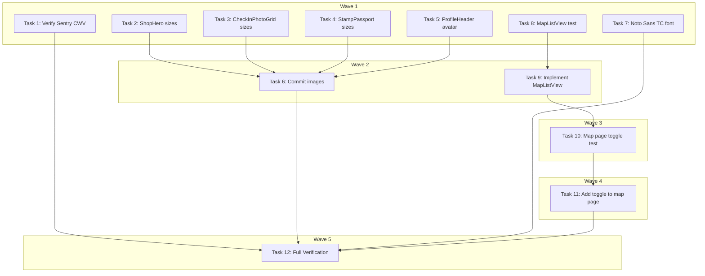

# Phase 2B Performance Audit & Fixes — Implementation Plan

> **For Claude:** REQUIRED SUB-SKILL: Use executing-plans to implement this plan task-by-task.

**Design Doc:** [docs/designs/2026-03-14-phase2b-performance-design.md](docs/designs/2026-03-14-phase2b-performance-design.md)

**Spec References:** —

**PRD References:** —

**Goal:** Close out the 5 Phase 2B performance TODO items — CWV measurement, image optimization, map list-view toggle, and Noto Sans TC font.

**Architecture:** Most items are already done (mobile-first CSS, desktop breakpoint, map lazy-load, backdrop-filter fallback). Remaining work: verify Sentry CWV is reporting, add `sizes` to `next/image` components, add a map/list toggle on the map page, and load Noto Sans TC via `next/font/google`.

**Tech Stack:** Next.js 16, Tailwind CSS v4, @sentry/nextjs, next/font/google, Vitest + Testing Library

**Acceptance Criteria:**
- [ ] A user on the map page can toggle between map view and list view
- [ ] All `next/image` fill-mode components have `sizes` attributes for optimal image loading
- [ ] Noto Sans TC renders consistently across iOS and Android for Traditional Chinese text
- [ ] Sentry Performance dashboard shows LCP, CLS, and INP metrics when DSN is configured

---

### Task 1: Verify Sentry CWV — No Code Change

**Files:**
- Read: `sentry.client.config.ts`

`tracesSampleRate: 0.1` is already set at `sentry.client.config.ts:6`. Sentry's `@sentry/nextjs` SDK automatically captures LCP, CLS, FID, INP, and TTFB when tracing is active. No code change needed.

**Step 1: Verify config**

Read `sentry.client.config.ts` and confirm `tracesSampleRate` is set to a non-zero value.

**Step 2: Document target thresholds**

No test needed — config-only verification. Target thresholds (for reference, not runtime-enforced):
- LCP < 2.5s
- CLS < 0.1
- INP < 200ms

---

### Task 2: Add `sizes` to ShopHero Image

**Files:**
- Modify: `components/shops/shop-hero.tsx:13-19`

No test needed — static attribute addition.

**Step 1: Add `sizes="100vw"` to the hero Image**

The hero image is full-width on all viewports. Add `sizes="100vw"` so the browser picks the correct srcset image.

```tsx
// components/shops/shop-hero.tsx:13-19
<Image
  src={primary}
  alt={shopName}
  fill
  className="object-cover"
  priority
  sizes="100vw"
/>
```

**Step 2: Run build to verify no errors**

Run: `pnpm build`
Expected: Build succeeds with no warnings about missing sizes.

---

### Task 3: Add `sizes` to CheckInPhotoGrid Images

**Files:**
- Modify: `components/checkins/checkin-photo-grid.tsx:67-72` (authenticated grid)
- Modify: `components/checkins/checkin-photo-grid.tsx:89-94` (preview image)

No test needed — static attribute addition.

**Step 1: Add `sizes` to the authenticated grid images**

The grid is 3-column on all viewports. Each image occupies ~33vw.

```tsx
// components/checkins/checkin-photo-grid.tsx:67-72
<Image
  src={checkin.photo_url}
  alt={`Check-in by ${checkin.display_name ?? 'user'}`}
  fill
  className="rounded object-cover"
  sizes="33vw"
/>
```

**Step 2: Add `sizes` to the preview image**

The preview blurred image is full-width within a container (`max-w-lg` = 512px on profile, or full page on shop detail).

```tsx
// components/checkins/checkin-photo-grid.tsx:89-94
<Image
  src={preview.preview_photo_url}
  alt="Recent check-in"
  fill
  className="object-cover blur-sm brightness-75"
  sizes="(min-width: 1024px) 512px, 100vw"
/>
```

---

### Task 4: Add `sizes` to StampPassport Images

**Files:**
- Modify: `components/stamps/stamp-passport.tsx:67-70`

No test needed — static attribute addition.

**Step 1: Add `sizes="80px"` to stamp images**

Stamp slots are fixed-size squares in a 4-column grid. Each stamp image is roughly 80px wide.

```tsx
// components/stamps/stamp-passport.tsx:67-70
<Image
  src={stamp.design_url}
  alt="Stamp"
  fill
  className="object-contain"
  sizes="80px"
/>
```

---

### Task 5: Convert ProfileHeader Avatar to next/image

**Files:**
- Modify: `components/profile/profile-header.tsx:23-29`

No test needed — static attribute swap.

**Step 1: Replace raw `` with `next/image`**

The current avatar uses a raw `` tag with an eslint-disable comment. Convert to `next/image` with proper `sizes` for the fixed 64px (h-16 w-16) avatar.

```tsx
// components/profile/profile-header.tsx — add import
import Image from 'next/image';

// Replace lines 23-29:
// Old:
// eslint-disable-next-line @next/next/no-img-element
// 
// New:
<Image
  src={avatarUrl}
  alt={name}
  fill
  className="object-cover"
  sizes="64px"
/>
```

Remove the `// eslint-disable-next-line @next/next/no-img-element` comment since it's no longer needed.

---

### Task 6: Commit Image Optimization Changes

**Step 1: Commit all image `sizes` changes**

```bash
git add components/shops/shop-hero.tsx \
      components/checkins/checkin-photo-grid.tsx \
      components/stamps/stamp-passport.tsx \
      components/profile/profile-header.tsx
git commit -m "perf: add sizes attributes to next/image components

Adds responsive sizes hints to all fill-mode Image components
so the browser downloads optimally-sized images. Converts
profile avatar from raw  to next/image."
```

---

### Task 7: Add Noto Sans TC Font

**Files:**
- Modify: `app/layout.tsx:2,8-16,30-32`
- Modify: `app/globals.css:10`

No test needed — visual/layout change.

**Step 1: Import and configure Noto Sans TC**

Add `Noto_Sans_TC` alongside existing Geist fonts in `app/layout.tsx`:

```tsx
// app/layout.tsx:2 — add to imports
import { Geist, Geist_Mono } from 'next/font/google';
import { Noto_Sans_TC } from 'next/font/google';

// After existing font declarations (line 16), add:
const notoSansTC = Noto_Sans_TC({
  variable: '--font-noto-sans-tc',
  subsets: ['latin'],
  weight: ['400', '700'],
  display: 'swap',
});
```

**Step 2: Add CSS variable to body className**

```tsx
// app/layout.tsx:32 — add notoSansTC.variable
<body
  className={`${geistSans.variable} ${geistMono.variable} ${notoSansTC.variable} antialiased`}
>
```

**Step 3: Update Tailwind font-sans in globals.css**

```css
/* app/globals.css:10 — update --font-sans */
--font-sans: var(--font-geist-sans), var(--font-noto-sans-tc), system-ui, sans-serif;
```

**Step 4: Commit**

```bash
git add app/layout.tsx app/globals.css
git commit -m "perf: add Noto Sans TC for consistent CJK rendering

Loads Noto Sans TC (weights 400+700) via next/font/google with
display: swap. Font stack: Geist Sans → Noto Sans TC → system-ui."
```

---

### Task 8: Write MapListView Test

**Files:**
- Create: `components/map/map-list-view.test.tsx`

**Step 1: Write the failing test**

```tsx
// components/map/map-list-view.test.tsx
import { render, screen } from '@testing-library/react';
import { describe, it, expect, vi } from 'vitest';
import { MapListView } from './map-list-view';

// Mock next/navigation (required by ShopCard)
vi.mock('next/navigation', () => ({
  useRouter: () => ({ push: vi.fn() }),
}));

const shops = [
  { id: '1', name: 'Alpha Cafe', latitude: 25.03, longitude: 121.56, rating: 4.5, slug: 'alpha-cafe', photoUrls: [], mrt: 'Zhongxiao', address: '', phone: null, website: null, openingHours: null, reviewCount: 0, priceRange: null, description: null, menuUrl: null, taxonomyTags: [], cafenomadId: null, googlePlaceId: null, createdAt: '', updatedAt: '' },
  { id: '2', name: 'Beta Brew', latitude: 25.04, longitude: 121.57, rating: 4.2, slug: 'beta-brew', photoUrls: [], mrt: 'Daan', address: '', phone: null, website: null, openingHours: null, reviewCount: 0, priceRange: null, description: null, menuUrl: null, taxonomyTags: [], cafenomadId: null, googlePlaceId: null, createdAt: '', updatedAt: '' },
];

describe('MapListView', () => {
  it('renders all shops as cards sorted alphabetically when no location', () => {
    render(<MapListView shops={shops} userLat={null} userLng={null} />);
    const cards = screen.getAllByRole('article');
    expect(cards).toHaveLength(2);
    expect(cards[0]).toHaveTextContent('Alpha Cafe');
    expect(cards[1]).toHaveTextContent('Beta Brew');
  });

  it('sorts shops by distance when user location is provided', () => {
    // User is closer to Beta Brew (25.04, 121.57)
    render(<MapListView shops={shops} userLat={25.041} userLng={121.571} />);
    const cards = screen.getAllByRole('article');
    expect(cards[0]).toHaveTextContent('Beta Brew');
    expect(cards[1]).toHaveTextContent('Alpha Cafe');
  });

  it('shows empty state when no shops', () => {
    render(<MapListView shops={[]} userLat={null} userLng={null} />);
    expect(screen.getByText(/no shops/i)).toBeInTheDocument();
  });
});
```

**Step 2: Run test to verify it fails**

Run: `pnpm vitest run components/map/map-list-view.test.tsx`
Expected: FAIL — `MapListView` module not found.

---

### Task 9: Implement MapListView

**Files:**
- Create: `components/map/map-list-view.tsx`

**Step 1: Implement MapListView component**

```tsx
// components/map/map-list-view.tsx
import { useMemo } from 'react';
import { ShopCard } from '@/components/shops/shop-card';
import type { Shop } from '@/lib/types';

interface MapListViewProps {
  shops: Shop[];
  userLat: number | null;
  userLng: number | null;
}

function haversineDistance(
  lat1: number, lng1: number,
  lat2: number, lng2: number,
): number {
  const R = 6371;
  const dLat = ((lat2 - lat1) * Math.PI) / 180;
  const dLng = ((lng2 - lng1) * Math.PI) / 180;
  const a =
    Math.sin(dLat / 2) ** 2 +
    Math.cos((lat1 * Math.PI) / 180) *
    Math.cos((lat2 * Math.PI) / 180) *
    Math.sin(dLng / 2) ** 2;
  return R * 2 * Math.atan2(Math.sqrt(a), Math.sqrt(1 - a));
}

export function MapListView({ shops, userLat, userLng }: MapListViewProps) {
  const sorted = useMemo(() => {
    if (userLat != null && userLng != null) {
      return [...shops].sort(
        (a, b) =>
          haversineDistance(userLat, userLng, a.latitude, a.longitude) -
          haversineDistance(userLat, userLng, b.latitude, b.longitude),
      );
    }
    return [...shops].sort((a, b) => a.name.localeCompare(b.name));
  }, [shops, userLat, userLng]);

  if (sorted.length === 0) {
    return (
      <div className="flex h-full items-center justify-center text-gray-400">
        No shops found
      </div>
    );
  }

  return (
    <div className="h-full overflow-y-auto px-4 py-4">
      <div className="grid grid-cols-1 gap-4 sm:grid-cols-2 lg:grid-cols-3">
        {sorted.map((shop) => (
          <ShopCard key={shop.id} shop={shop} />
        ))}
      </div>
    </div>
  );
}
```

**Step 2: Run test to verify it passes**

Run: `pnpm vitest run components/map/map-list-view.test.tsx`
Expected: PASS — all 3 tests green.

**Step 3: Commit**

```bash
git add components/map/map-list-view.tsx components/map/map-list-view.test.tsx
git commit -m "feat: add MapListView component with distance sorting (TDD)"
```

---

### Task 10: Write Map Page Toggle Test

**Files:**
- Create: `app/map/page.test.tsx`

**Step 1: Write the failing test**

```tsx
// app/map/page.test.tsx
import { render, screen } from '@testing-library/react';
import userEvent from '@testing-library/user-event';
import { describe, it, expect, vi } from 'vitest';

// Mock heavy dependencies at the boundary
vi.mock('next/navigation', () => ({
  useRouter: () => ({ push: vi.fn() }),
}));

vi.mock('@/lib/hooks/use-shops', () => ({
  useShops: () => ({
    shops: [
      { id: '1', name: 'Test Cafe', latitude: 25.03, longitude: 121.56, rating: 4.5, slug: 'test-cafe', photoUrls: [], mrt: null, address: '', phone: null, website: null, openingHours: null, reviewCount: 0, priceRange: null, description: null, menuUrl: null, taxonomyTags: [], cafenomadId: null, googlePlaceId: null, createdAt: '', updatedAt: '' },
    ],
    isLoading: false,
    error: null,
  }),
}));

vi.mock('@/lib/hooks/use-media-query', () => ({
  useIsDesktop: () => false,
}));

vi.mock('@/lib/hooks/use-geolocation', () => ({
  useGeolocation: () => ({ latitude: null, longitude: null, error: null, loading: false, requestLocation: vi.fn() }),
}));

// Mock MapView since it requires Mapbox GL (browser-only)
vi.mock('@/components/map/map-view', () => ({
  MapView: ({ shops }: { shops: unknown[] }) => (
    <div data-testid="map-view">Map with {shops.length} pins</div>
  ),
}));

// Must use dynamic import mock to handle next/dynamic
vi.mock('next/dynamic', () => ({
  __esModule: true,
  default: (importFn: () => Promise<{ default: React.ComponentType }>) => {
    // Eagerly resolve the dynamic import for testing
    const LazyComponent = (props: Record<string, unknown>) => {
      const { MapView } = require('@/components/map/map-view');
      return <MapView {...props} />;
    };
    return LazyComponent;
  },
}));

import MapPage from './page';

describe('Map page', () => {
  it('shows map view by default', () => {
    render(<MapPage />);
    expect(screen.getByTestId('map-view')).toBeInTheDocument();
  });

  it('toggles to list view when user clicks the list toggle', async () => {
    const user = userEvent.setup();
    render(<MapPage />);

    const toggle = screen.getByRole('button', { name: /list/i });
    await user.click(toggle);

    expect(screen.queryByTestId('map-view')).not.toBeInTheDocument();
    expect(screen.getByRole('article')).toBeInTheDocument(); // ShopCard renders <article>
  });

  it('toggles back to map view', async () => {
    const user = userEvent.setup();
    render(<MapPage />);

    const listToggle = screen.getByRole('button', { name: /list/i });
    await user.click(listToggle);

    const mapToggle = screen.getByRole('button', { name: /map/i });
    await user.click(mapToggle);

    expect(screen.getByTestId('map-view')).toBeInTheDocument();
  });
});
```

**Step 2: Run test to verify it fails**

Run: `pnpm vitest run app/map/page.test.tsx`
Expected: FAIL — no button with name "list" found (toggle doesn't exist yet).

---

### Task 11: Add Toggle to Map Page

**Files:**
- Modify: `app/map/page.tsx`

**Step 1: Add view toggle and MapListView to map page**

Update `app/map/page.tsx` to add a `useState<'map' | 'list'>('map')` and render the toggle button + `MapListView` when in list mode.

```tsx
// app/map/page.tsx — full updated file
'use client';
import dynamic from 'next/dynamic';
import { useMemo, useState, Suspense } from 'react';
import { useRouter } from 'next/navigation';
import { List, MapIcon } from 'lucide-react';
import { SearchBar } from '@/components/discovery/search-bar';
import { FilterPills } from '@/components/discovery/filter-pills';
import { MapMiniCard } from '@/components/map/map-mini-card';
import { MapDesktopCard } from '@/components/map/map-desktop-card';
import { MapListView } from '@/components/map/map-list-view';
import { useIsDesktop } from '@/lib/hooks/use-media-query';
import { useShops } from '@/lib/hooks/use-shops';
import { useGeolocation } from '@/lib/hooks/use-geolocation';

const MapView = dynamic(
  () =>
    import('@/components/map/map-view').then((m) => ({ default: m.MapView })),
  { ssr: false }
);

export default function MapPage() {
  const router = useRouter();
  const [selectedShopId, setSelectedShopId] = useState<string | null>(null);
  const [activeFilters, setActiveFilters] = useState<string[]>([]);
  const [viewMode, setViewMode] = useState<'map' | 'list'>('map');

  const { shops } = useShops({ featured: true, limit: 200 });
  const isDesktop = useIsDesktop();
  const { latitude, longitude } = useGeolocation();

  const shopById = useMemo(() => new Map(shops.map((s) => [s.id, s])), [shops]);
  const selectedShop = selectedShopId
    ? (shopById.get(selectedShopId) ?? null)
    : null;

  function handleSearch(query: string) {
    router.push(`/map?q=${encodeURIComponent(query)}`);
  }

  return (
    <div className="relative h-screen w-full overflow-hidden">
      {viewMode === 'map' ? (
        <div className="absolute inset-0">
          <Suspense
            fallback={
              <div className="flex h-full w-full items-center justify-center bg-gray-100 text-gray-400">
                地圖載入中…
              </div>
            }
          >
            <MapView shops={shops} onPinClick={setSelectedShopId} />
          </Suspense>
        </div>
      ) : (
        <div className="h-full pt-20">
          <MapListView shops={shops} userLat={latitude} userLng={longitude} />
        </div>
      )}

      <div className="absolute top-4 right-4 left-4 z-20">
        <div className="space-y-2 rounded-2xl bg-white/90 p-3 shadow backdrop-blur-md supports-[not(backdrop-filter)]:bg-white">
          <div className="flex items-center gap-2">
            <div className="flex-1">
              <SearchBar onSubmit={handleSearch} />
            </div>
            <button
              onClick={() => setViewMode(viewMode === 'map' ? 'list' : 'map')}
              className="flex h-10 w-10 shrink-0 items-center justify-center rounded-lg border border-gray-200 bg-white"
              aria-label={viewMode === 'map' ? 'Switch to list view' : 'Switch to map view'}
            >
              {viewMode === 'map' ? (
                <List className="h-5 w-5 text-gray-600" />
              ) : (
                <MapIcon className="h-5 w-5 text-gray-600" />
              )}
            </button>
          </div>
          <FilterPills
            activeFilters={activeFilters}
            onToggle={(f) =>
              setActiveFilters((prev) =>
                prev.includes(f) ? prev.filter((x) => x !== f) : [...prev, f]
              )
            }
            onOpenSheet={() => {}}
          />
        </div>
      </div>

      {viewMode === 'map' && selectedShop && !isDesktop && (
        <MapMiniCard
          shop={selectedShop}
          onDismiss={() => setSelectedShopId(null)}
        />
      )}
      {viewMode === 'map' && selectedShop && isDesktop && (
        <MapDesktopCard shop={selectedShop} />
      )}
    </div>
  );
}
```

**Step 2: Run map page test to verify it passes**

Run: `pnpm vitest run app/map/page.test.tsx`
Expected: PASS — all 3 tests green.

**Step 3: Commit**

```bash
git add app/map/page.tsx app/map/page.test.tsx
git commit -m "feat: add map/list view toggle on map page (TDD)

Adds a toggle button next to the search bar. List view renders
ShopCards sorted by distance (if geolocation) or alphabetically."
```

---

### Task 12: Full Verification

**Files:** None — verification only.

**Step 1: Run all frontend tests**

Run: `pnpm test`
Expected: All tests pass.

**Step 2: Run type-check and lint**

Run: `pnpm type-check && pnpm lint`
Expected: No errors.

**Step 3: Run production build**

Run: `pnpm build`
Expected: Build succeeds.

**Step 4: Commit any fixes if needed, then final commit message**

If all passes, no commit needed. If fixes were required, commit them.

---

## Execution Waves



**Wave 1** (parallel — no dependencies):
- Task 1: Verify Sentry CWV
- Task 2: ShopHero sizes
- Task 3: CheckInPhotoGrid sizes
- Task 4: StampPassport sizes
- Task 5: ProfileHeader avatar
- Task 7: Noto Sans TC font
- Task 8: MapListView test (write failing test)

**Wave 2** (parallel — depends on Wave 1):
- Task 6: Commit image changes ← Tasks 2-5
- Task 9: Implement MapListView ← Task 8

**Wave 3** (depends on Wave 2):
- Task 10: Map page toggle test ← Task 9

**Wave 4** (depends on Wave 3):
- Task 11: Add toggle to map page ← Task 10

**Wave 5** (depends on all):
- Task 12: Full verification ← all tasks

---

## TODO.md Updates

Add under Phase 2B → Performance:

```markdown
### Performance Audit & Fixes

> **Design Doc:** [docs/designs/2026-03-14-phase2b-performance-design.md](docs/designs/2026-03-14-phase2b-performance-design.md)
> **Plan:** [docs/plans/2026-03-14-phase2b-performance-plan.md](docs/plans/2026-03-14-phase2b-performance-plan.md)

**Chunk 1 — Image + Font + CWV (Wave 1-2):**

- [ ] Verify Sentry CWV already active (tracesSampleRate: 0.1)
- [ ] Add `sizes` to ShopHero, CheckInPhotoGrid, StampPassport images
- [ ] Convert ProfileHeader avatar to next/image with sizes
- [ ] Add Noto Sans TC font via next/font/google

**Chunk 2 — Map List-View Toggle (Wave 1-4):**

- [ ] MapListView component with distance sorting (TDD)
- [ ] Map page toggle button (TDD)

**Chunk 3 — Verification (Wave 5):**

- [ ] Full verification (vitest, type-check, lint, build)
```
